# Connecting OAC to ADW 

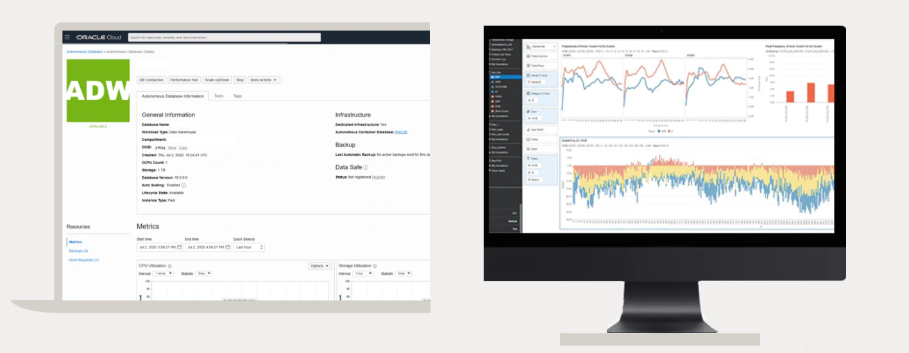

## Introduction

**Oracle Analytics Cloud** provides the industry's most comprehensive cloud analytics in a single unified platform, including everything from self-service visualization and powerful inline data preparation to enterprise reporting, advanced analytics, and self-learning analytics that deliver proactive insights.

You are going to use an **Oracle Analytics Cloud** instance to give your end users a self-service approach to analyzing the data.

### Objectives

- **Create a connection** from Oracle Analytics Cloud to Autonomous Database
- **Create a Data Set**

Estimated Lab Time: 15 minutes

## **STEP 1**: Create the connection from Oracle Analytics Cloud to Autonomous Database

**Oracle Autonomous Database** only accepts secure connections to the database. This requires a *'wallet'* file that contains the SQL\*NET
configuration files and the secure connection information. Wallets are used by client utilities such as SQL Developer, SQL\*Plus etc. For this
workshop, you will use this same wallet mechanism to make a connection from OAC to the **Autonomous Database**.

> **Note**: This section assumes you have already created your Oracle Analytics Cloud instance as part of the 'Lab 2 - Provisioning your Oracle Analytics Cloud (OAC)' instance section. If not, please return to the beginning of Lab2 and go through the instance creation.

1. ### Download your Autonomous Database wallet

    You need first to download the wallet file containing your credentials. There are two types of wallet:

    - **Instance Wallet**: Wallet for a single database only; this provides a database-specific wallet

    - **Regional Wallet**: Wallet for all Autonomous Databases for a given tenant and region (this includes all service instances that a cloud account owns)

    > **Note**: Oracle recommends you provide a database-specific wallet, using Instance Wallet, to end users and for application use whenever possible. Regional wallets should only be used for administrative purposes that require potential access to all Autonomous Databases within a region.

2. In the **Oracle Console Home** Page, click on the hamburger **MENU** link at the upper left corner of the page and go to the ****Autonomous Data
Warehouse**** section.

    

    You can see all the **ADW** instances that you have **created**.
    **Select** the instance that we created before.

    

3. On the "***Autonomous Database Details***" page for your Autonomous Database, click the **DB Connection** button.

    You can access to the '***Autonomous Database Details***' page using the cloud console page.

    

    This will open a pop-up window. Select Wallet Type **Instance Wallet** and then **Download Wallet**.

    

   You will be asked to provide a **password** for the wallet. The password must meet the rules for the **Oracle Cloud password** complexity. This password is a password that you need to remember for your **wallet**. You can use the **admin password** that you created before.

4. Select **Download** and save the wallet to your **local machine**.

    

5. You can now **Close** the **Database Connection** pop up window.

    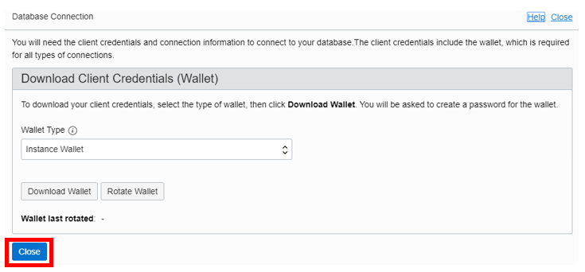

6. ### Use the Wallet in Oracle Analytics Cloud

    **Return** to the **Oracle Cloud Infrastructure console** and click on the menu icon on the left.
    **Navigate** to **Analytics** and then **Analytics Cloud**.

    

7. **Open** the Cloud Analytics **URL** associated with your instance (the one that we created in Lab 2) by using the dots menu button on the right-hand side of your instance information and selecting **Open URL**.

    

    The **Oracle Analytic**s page will open in a new browser **window/tab**.

8. On the top right-hand side of the screen, click **Create**, and then **Connection**.

    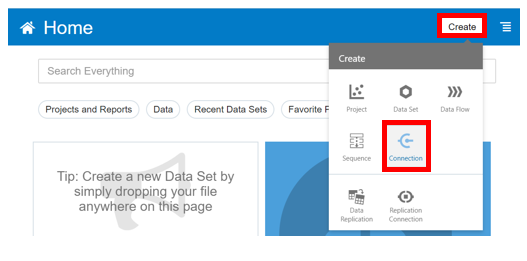

9. Choose **Oracle Autonomous Data Warehouse**.

    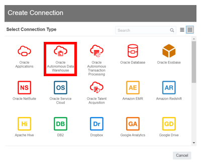

    Use the following information to configure your **connection**.

    I recommend selecting first the autonomous database wallet zip file you just downloaded in ***Client Credentials*** field. It will automatically extract the required *cwallet.sso* and then **autocomplete** several of the fields for you. Later on you just have to review and modify them if need it.

    > **Connection Name**: WORKSHOPADWOAC
    >
    > **Service Name**: Choose the name of your database followed by the \_high suffix.
    >
    > **Client Credentials**: Use the Browse button to upload the wallet zip > file that you downloaded. It will automatically extract the cwallet.sso file from this zip bundle.
    >
    > **Username**: ADMIN -- We have created this user on the ADW instance creation.
    >
    > **Password**: The password that you created on the ADW instance creation at the beginning of the workshop. ADWwelcome-1234

    

10. Select **Save** to save your new connection **information**.

## **STEP 2**: Prepare the dataset

When you create a project, you add one or more **data sets** containing the data that you want to **visualize and explore**. Data sets contain data
from subject areas, Oracle Applications, databases, or uploaded data files such as spreadsheets. You can also add multiple data sets to your
existing projects.

1. On the top right-hand side of the ***Oracle Analytics*** Home Page, click **Create**, and then **Data Set**.

    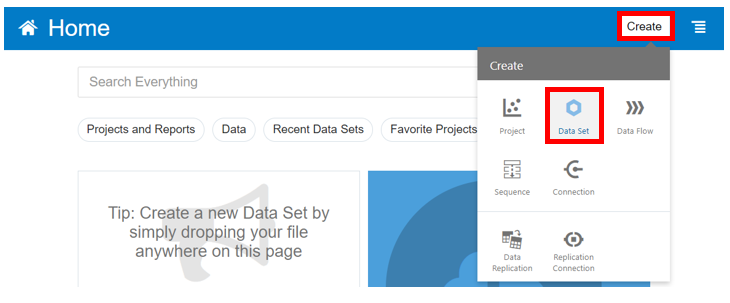

2. Select **WORKSHOPADWOAC**, the connection you **created** in the previous step.

    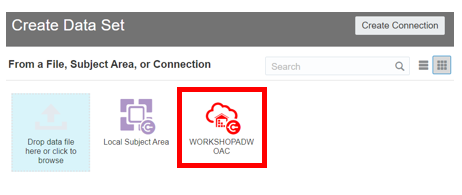

3. In the next window, click on the **SH** (Sales History) **schema**.

    The **SH schema** provides a small data set you can use to run the sample queries in the [Oracle Database Data Warehousing Guide](https://docs.oracle.com/en/database/oracle/oracle-database/19/dwhsg/sql-analysis-reporting-data-warehouses.html#GUID-1D8E3429-735B-409C-BD16-54004964D89B).

    For more information on the SH schema see *Sample Schemas* and [*Schema Diagrams*](https://docs.oracle.com/en/database/oracle/oracle-database/19/comsc/schema-diagrams.html#GUID-D268A4DE-BA8D-428E-B47F-80519DC6EE6E). 

    

    We are ready to start with the **visualizations**.

    

    Let start by analyzing the **Sales History** fact table.

4. Select **SALES** table from the *SH schema*.

    

    This will display the columns available in the **SALES** table.

5. Select **Add All** to select all columns in the **table**.

    

    After you clicked **Add** to create the Data Set, select **SALES** at the top of the page (figure 1) or at the right side of the selection panel (figure 2) depend the version of OAC that you are using to modify the Data Set that we are currently creating.

    **Figure 1**.

    

    **Figure 2**.

    

6. Use the following **information** to configure your **Data Set**:

    > **Data Access**: Live
    >
    > **Name**: SH&#95;SALES

7. Then **Add** to create the **Data Set**.

    

8. The **Data Set** was successfully **added**.

## **STEP 3**: Create Visualizations using your data sets

1. Create a new project by clicking **Create Project**.

    

    A new screen with a **white canvas** is opened using the **SH&#95;SALES Data Set** you created.

    

    Before drowning into details, let us give you a quick **explanation** of the different parts of this screen. This will help you to easily follow the next steps.

    An **Oracle Analytics Project** consist of **three main parts** (you can see them at the top right part of the screen):

    

    - **Prepare**: Here is where you configure your data. You get a preview of each dataset on the project. You enrich it by adding columns, hiding or renaming the available ones. You can also define joins between datasets here

    - **Visualize**: Here is where you explore and Analyze the data. You can create several canvases to hold the different visualizations you define

    - **Narrate**: Here is where you create a more presentation-oriented view of the analysis you created. This tab allows you to choose which insights to show and add comments and descriptions. It helps to understand your analysis journey and focus on showing the results

    During this workshop, you will use the **Prepare** and **Visualize** tabs mainly.

    You have already seen the **Prepare** screen on previous steps. The **Visualize** screen is this one:

    

    Main areas to note here are:

    - **Explorer**: Contains all fields from your datasets to be used in the project

    - **Properties box**: Allows you to define the properties and parameters of the selected object. If it is a column it will be highlighted in blue (in the screen PROD_ID in the Explorer menu is selected), if it is a graphic from the canvas it will have a thin blue borderline around it

    - **Graph Definition**: Contains definition of the selected Visualization, which fields to use and where (Axis, Filters, Trellis Groups...)

    - **Canvas**: Your play area. You can place your visuals here. You can also create more Canvases and copy/move visuals around

2. Now that you know a bit your way around in the **Project**, you can continue with the workshop.

    **Remember** that you just added the new dataset from the **SH&#95;SALES** table.

    All the number-type columns from this table are treated as **NUMBER** by default. You can check the information on the **Properties** section of each table column under the Data Type section.

    

3. Select **AMOUNT&#95;SOLD** column from the TABLE panel and add **Aggregation** rule **SUM** from the COLUMNS detail panel from the bottom. By default **Aggregation** value, will be **SUM**, just confirm that it is the case, otherwise change it.

    

4. We will **add Month** to your selection: **Hold the Control Button on your Keyboard** and expand **TIME_ID** and select **Month**, after right click of your mouse and select **Create Best Visualization**.

    

5. Verify that the **information** that is showing in the canvas is the following:

    **Line, Values (Y-Axis) &#45;&#45; AMOUNT&#95;SOLD, Category (X-Axis) &#45;&#45; TIME&#95;ID (Month)**.

    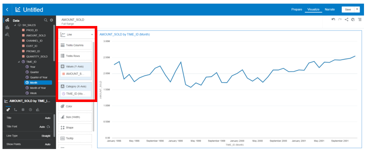

6. Right click on the chart, select **Add Statistics** and **Trend Line**.

    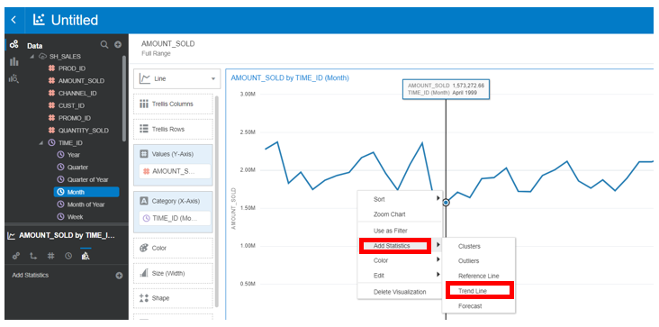

7. In the **Properties** panel at the very bottom of the page in the **Trend** section change 95% to **Off**.

    
    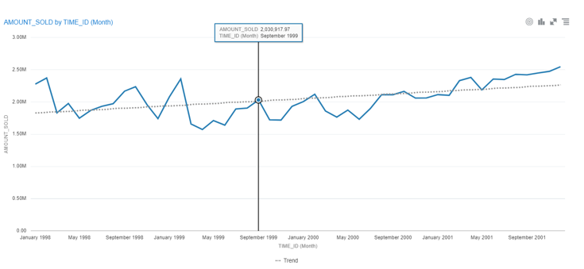

    Although we had some ups and downs in the **totals**, you see that in the overall the total amount sold has been trending up, meaning our **sales are in good shape**.

    We will compare this information (**AMOUNT&#95;SOLD by TIME&#95;ID (Month)**) to our active customer base over time. To find the number of active customers, we will "**count distinct**" on **CUST&#95;ID on a Monthly basis**.

9. Select **CUST_ID** column from the TABLE panel and add **Aggregation** rule **Count Distinct** from the **COLUMNS** Properties panel from the bottom.

    

10. Be sure you drag **CUST&#95;ID** column to the Values (**Y-Axis**) section with your mouse in the canvas. Be sure it is added AMOUNT&#95;SOLD and not replace it. Right click on **CUST&#95;ID** and select **Y2 Axis** as part of the **CUST&#95;ID** details.

    

    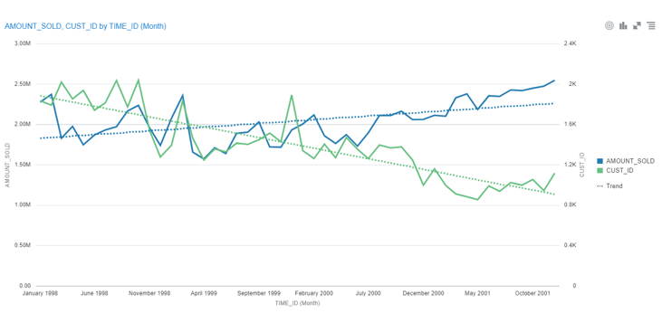

    This **results** shows you that the number of customers is going down but the amount sold is going up, so we are **selling more to less customers**.

    We will create a **new Data Set** of data to enrich the **canvas**.

11. Click the **+** bottom in the left top corner of the Analytics Cloud Page and **Add Data Set**.

    

12. Select **Create Data Set**.

    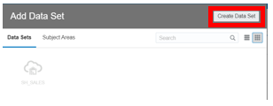

13. Select **WORKSHOPADWOAC**.

    

14. Click on the **SH** (Sales History) schema.

    

15. Select **PRODUCTS** table from the *SH schema*.

    

    This will display the columns available in the **PRODUCTS** table.

16. Select **Add All** to select all columns in the table.

    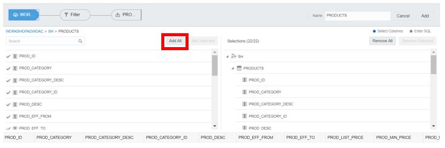

17. Then, to create the Data Set, select **PRODUCTS** at the top of the page or at the right side of the selection panel depend the version of OAC that you are using to **modify the Data Set** that we are creating right now.

    

    Use the following information to configure your **Data Set**:

    > **Data Access**: Live
    >
    > **Name**: SH&#95;PRODUCTS

18. Then **Add** to create the **Data Set**.

    

    The **Data Set** was successfully **saved**.

    

    Now we have to join the new Data Set, **SH&#95;PRODUCT**, to the data set that we created a few steps before **SH&#95;SALES**.

    You will notice that we have been redirected to the **Prepare** section of the project.

    At the **bottom of the screen**, you can see three tabs, one per each dataset and another one called **Data Diagram**. **Click** on **Data Diagram**.

    

    In this tab, you can view a representation of the **different datasets** included in the project and their **relationships**. Currently, there is no relationship defined, so you see both as isolated boxes.

    Hover over the imaginary line **between** them and click on the **0 number** that will appear:

    

19. A **pop-up window** appears allowing you to define a **new relation** between the datasets (join). Click on **Add Another Match**.

    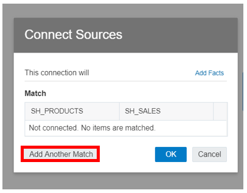

20. Select **PROD_ID** under each Data Set, **SH&#95;PRODUCTS** and **SH&#95;SALES** in the **Select Data** Section.

    

    > **NOTE**: You might see a balloon warning about using **PROD_ID** as a **Measure**. Do not worry about it. It is just a kind reminder that you are using a column that looks like a number only as a join column, but that is exactly what we want to do.

    

21. We will add the new dataset as a **Dimension** to this section. Click **Add Facts** and select **Extend a Dimension**.

    

22. Select **OK**.

    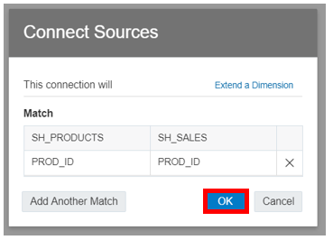

    The **connection** between the two sources has been **created**.

    

23. Now that the **preparation** of the data is done, you can navigate again to **Visualize** page in the right top corner of the **Analytics Cloud Home Page**.

    

24. In the canvas go to **TIME_ID** section, **Show by** and select **Quarter** instead Month.

    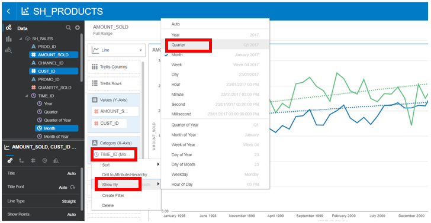

25. Apply the **Quarter** filter and the graph will **change dynamically**.

    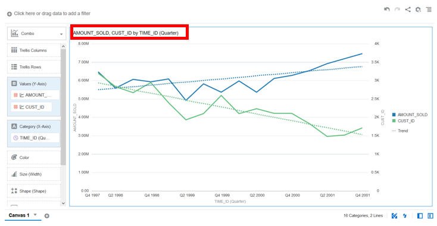

    We will eliminate the **Linear Trend Line** that we have in the graph.

26. Click in the **graph** and in the **Properties section** of the bottom of the page, select the **Analytics** icon and click in the **Trend** section to remove the **Linear** section.

    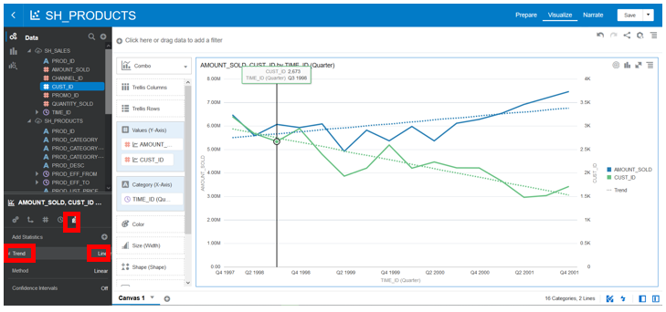

27. We can see the **graph without the Trend Linear line**.

    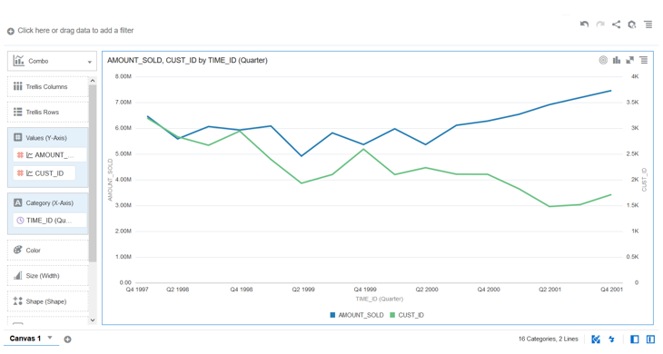

28. Select **PRODUCT_CATEGORY** from **SH&#95;PRODUCTS** and add it in **the Trellis Columns** section of the canvas.

    

    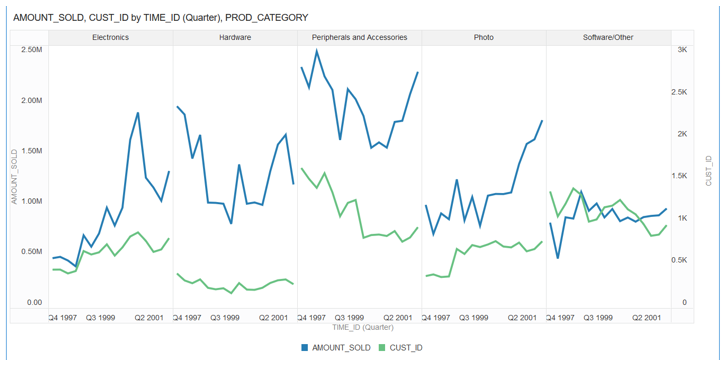

    You can see now a **trend** on the **amount sold** and the number of distinct customers by product category. This allows you to compare the performance of each product. However, using just lines can be a bit messy. You will try now to make this graphic more appealing.

29. Select **AMOUNT&#95;SOLD** from the canvas and select **Bar** graph.

    

30. Select **Project Properties** from the Burger Menu in the right top corner.

    
    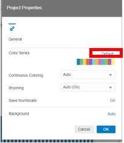

31. Select in the **Colour Series** and select another **colour** that you prefer.

    

32. Select **OK** after being applied the **colour changes**.

    

    

33. We will save the **Project** in the **Save** section.

    

    I saved the project with the name **ADW&#95;OAC&#95;SH&#95;SCHEMA**.

    

34. You can share your project by **email or social media**. Have a look at the **possibilities**.

    Select the Share icon and select **File or Print.**

    

35. You can choose to **Save** your project in a wide variety of standard formats such as **PowerPoint (pptx), Acrobat (pdf), Image (png), Data (csv), Package (dva)**.  You can choose which parts of your project to include, such as **All Canvas, only the Active Canvas or the Active Visual**.

    

    The file will be **downloaded** locally on your machine.

    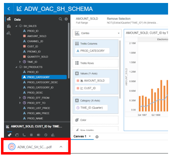

36. When you select **Print**, you can choose which parts of your project to include in the **printed output, such as All Canvas, only the Active Canvas or the Active Visual**. Etc.

    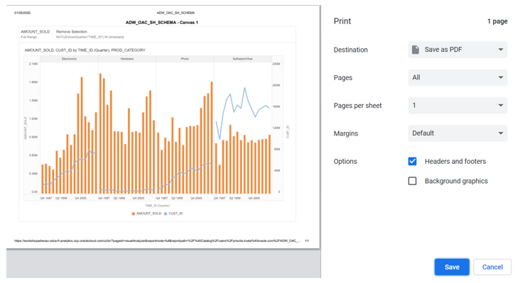

Watch our short recap video that includes an outlook of other functionalities of **Oracle Autonomous Database (ADB)** and **Oracle Analytics Cloud (OAC)**:

*Congratulations! Well done!*

## **Acknowledgements**

- **Author** - Priscila Iruela - Database Business Development | Juan Antonio Martin Pedro - Analytics Business Development
- **Contributors** - Victor Martin, Melanie Ashworth-March, Andrea Zengin
- **Last Updated By/Date** - Kamryn Vinson, October 2020

## Need Help?
Please submit feedback or ask for help using our [LiveLabs Support Forum](https://community.oracle.com/tech/developers/categories/livelabsdiscussions). Please click the **Log In** button and login using your Oracle Account. Click the **Ask A Question** button to the left to start a *New Discussion* or *Ask a Question*.  Please include your workshop name and lab name.  You can also include screenshots and attach files.  Engage directly with the author of the workshop.

If you do not have an Oracle Account, click [here](https://profile.oracle.com/myprofile/account/create-account.jspx) to create one.