# Connecting OAC to ADW and adjusting Data Set properties

## Introduction

**Oracle Analytics Cloud** provides the industry's most comprehensive cloud analytics in a single unified platform, including everything from self-service visualization and powerful inline data preparation to enterprise reporting, advanced analytics, and self-learning analytics that deliver proactive insights.

You are going to use an **Oracle Analytics Cloud** instance to give your end users a self-service approach to analyzing the data.

_Estimated Lab Time:_ 20 minutes

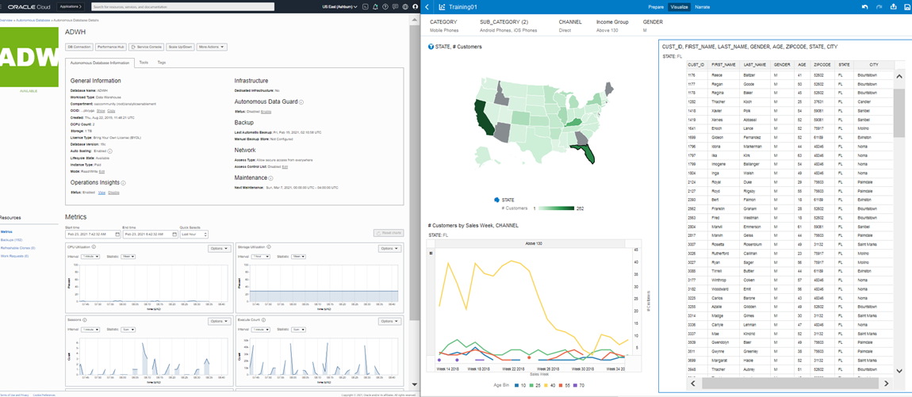

### Objectives  

- **Load data** to your ADW instance
- **Create a connection** from Oracle Analytics Cloud to Autonomous Database
- **Create** a **Data Set**

### Prerequisites  

* An Oracle Cloud Free Tier or Paid account
* You should have completed  
    * Lab 1: Provisioning your Autonomous Database instance  
    * Lab 2: Provisioning your Oracle Analytics Cloud instance

## **STEP 1**: Load data to your Autonomous Database

Connect to your **Autonomous Database**.  
In the ADWH console, lets navigate to the Development tab and open the SQL Developer Web  

1. In the **Oracle Console Home** Page, click on the hamburger **MENU** link at the upper left corner of the page and go to the ****Autonomous Data Warehouse**** section.  
    
    
    You can see all the **ADW** instances that you have **created**.  
    **Select** the instance that we created before.  
    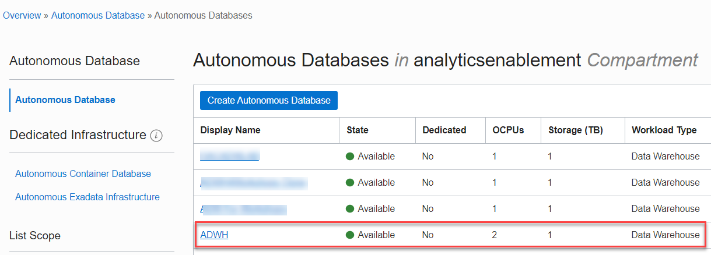

2. On the "***Autonomous Database Details***" page for your Autonomous Database, click the **Tools** region.  
You can access to the '***Autonomous Database Details***' page using the cloud console page.  

    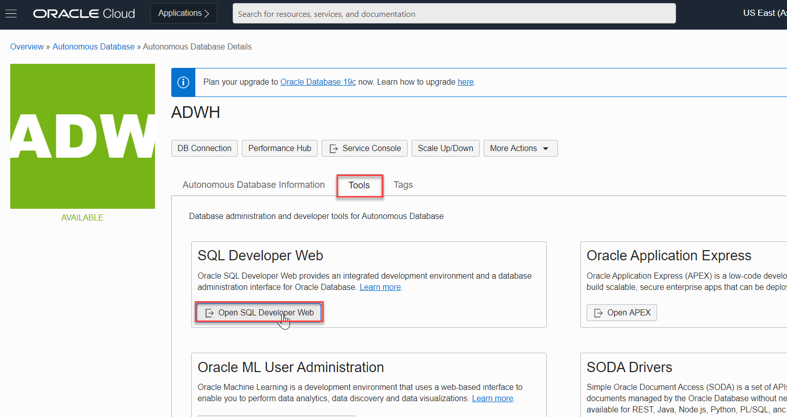 

      - This will open a new window. Click **Open SQL Developer Web**, enter your **Username**, Click **Next**, enter your **Password** and then Click **Sign In**.  
      
       

      - Select **SQL** from **Development** section.  
      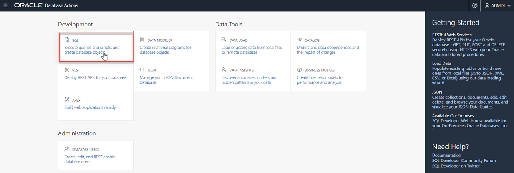

   - Download the [starter file](https://objectstorage.us-ashburn-1.oraclecloud.com/p/c_PgI7AIzbn3bkEkqbZAhAUuNjMVw2KE6dvITNOtj9AVRJ_sNiCub6nRaR2kJApp/n/idbwmyplhk4t/b/LiveLabs/o/starter-file.sql) SQL code, _Copy_ the content and _Paste_ to the _SQL Developer Web_ worksheet.  
   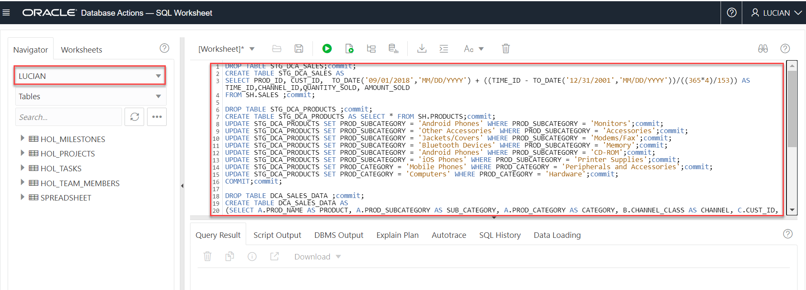    

    - Click **Run Script** ![SQL Developer Web worksheet] 

    - Check 'Script Output'  
     

    - Go to **Navigator** and search for DCA\_SALES\_DATA table

      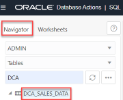

## **STEP 2**: Prepare the connection from Autonomous Database

**Oracle Autonomous Database** only accepts secure connections to the database. This requires a *'wallet'* file that contains the SQL\*NET configuration files and the secure connection information. Wallets are used by client utilities such as SQL Developer, SQL\*Plus etc. For this workshop, you will use this same wallet mechanism to make a connection from OAC to the **Autonomous Database**.

> **Note**: This section assumes you have already created your Oracle Analytics Cloud instance as part of the 'Lab 2 - Provisioning your Oracle Analytics Cloud (OAC)' instance section. If not, please return to the beginning of Lab2 and go through the instance creation.

1. ### Download your Autonomous Database wallet

    You need first to download the wallet file containing your credentials. There are two types of wallet:  
    - **Instance Wallet**: Wallet for a single database only; this provides a database-specific wallet  
    - **Regional Wallet**: Wallet for all Autonomous Databases for a given tenant and region (this includes all service instances that a cloud account owns)  
    > **Note**: Oracle recommends you provide a database-specific wallet, using Instance Wallet, to end users and for application use whenever possible. Regional wallets should only be used for administrative purposes that require potential access to all Autonomous Databases within a region.

2. Go back to "***Autonomous Database Details***" page for your Autonomous Database, click the **DB Connection** button.

    You can access to the '***Autonomous Database Details***' page using the cloud console page.  
    

    This will open a pop-up window. Select Wallet Type **Instance Wallet** and then **Download Wallet**.  
    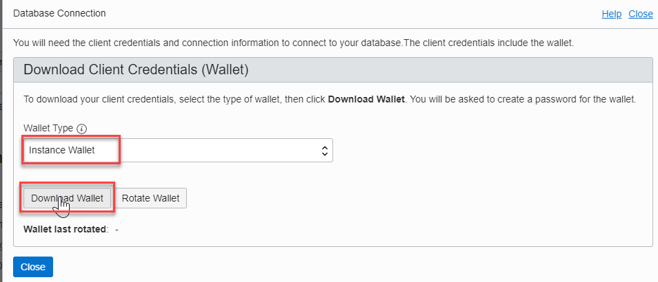

   You will be asked to provide a **password** for the wallet. The password must meet the rules for the **Oracle Cloud password** complexity. This password is a password that you need to remember for your **wallet**. You can use the **admin password** that you created before.

3. Select **Download** and save the wallet to your **local machine**.  

    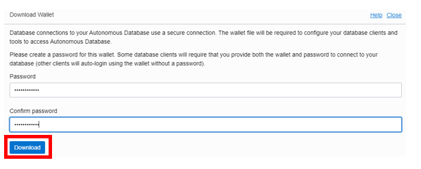

4. You can now **Close** the **Database Connection** pop up window.

    

## **STEP 3**: Create the connection from Oracle Analytics Cloud to Autonomous Database
1. ### Use the Wallet in Oracle Analytics Cloud

    **Return** to the **Oracle Cloud Infrastructure console** and click on the menu icon on the left.
    **Navigate** to **Analytics** and then **Analytics Cloud**.  

    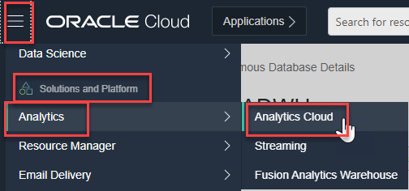

2. **Open** the Cloud Analytics **URL** associated with your instance (the one that we created in Lab 2) by using the dots menu button on the right-hand side of your instance information and selecting **Analytics Home Page**.  

      
    > The **Oracle Analytic**s page will open in a new browser **window/tab**.

3. On the top right-hand side of the screen, click **Create**, and then **Connection**.  

    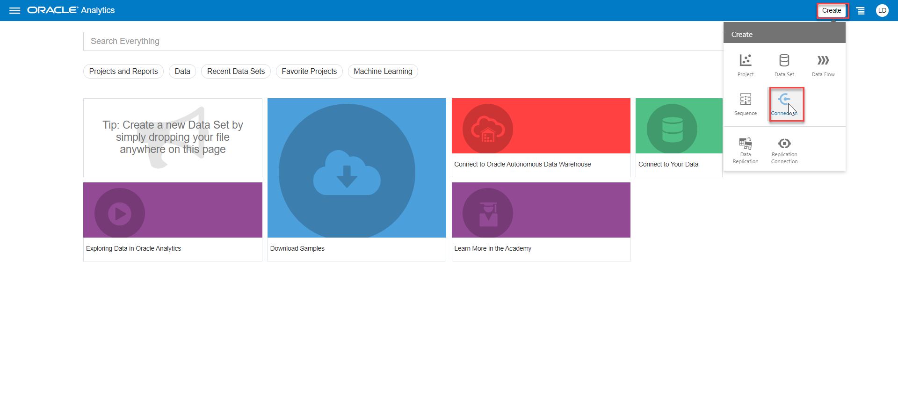

4. Choose **Oracle Autonomous Data Warehouse**.

    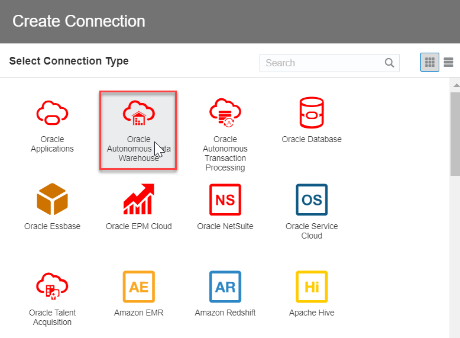

    Use the following information to configure your **connection**.

    I recommend selecting first the autonomous database wallet zip file you just downloaded in ***Client Credentials*** field. It will automatically extract the required *cwallet.sso* and then **autocomplete** several of the fields for you. Later on you just have to review and modify them if need it.

    > **Connection Name**: ADWH or any other connection name you choose 
    >
    > **Service Name**: Choose the name of your database followed by the \_medium suffix.
    >
    > **Username**: ADMIN -- We have created this user on the ADW instance creation.
    >
    > **Password**: The password that you created on the ADW instance creation at the beginning of the workshop.  
    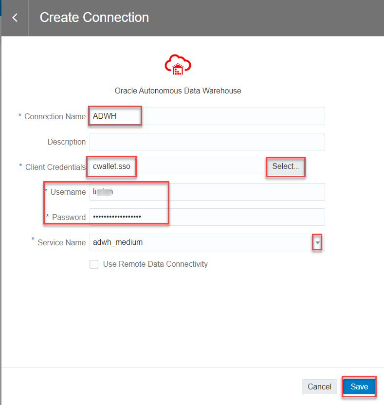

5. Select **Save** to save your new connection **information**.

## **STEP 4**: Create and Adjust the Data Set

When you create a project, you add one or more **Data Sets** containing the data that you want to **visualize and explore**. Data sets contain data
from Subject Areas, Oracle Applications, databases, or uploaded data files such as spreadsheets. You can also add multiple data sets to your existing projects.

Now lets create a Data Set using the ADWH connection just created. And lets select the DCA\_SALES\_DATA as the source table. The table is created as part of the demo preparation script.

1. On the top right-hand side of the ***Oracle Analytics*** Home Page, click **Create**, and then **Data Set** to display the Create Data Set dialog.  

    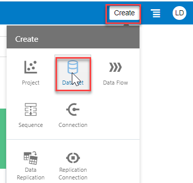

2. In the Data Set editor, browse or search for  **ADWH**, the connection you have **created** in the previous step. Double-click  

    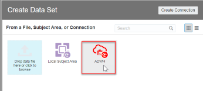

3. In the next window, search for **DCA\_SALES\_DATA** table in **ADMIN**  *schema* and click **Add All**.

    

    Once you add the columns the **Data Set name** took as the default table name (**DCA\_SALES\_DATA**)

    Data can be previewed with just a click.
    Click **Get Preview Data** and then Click **Add** to create the Data Set.  
    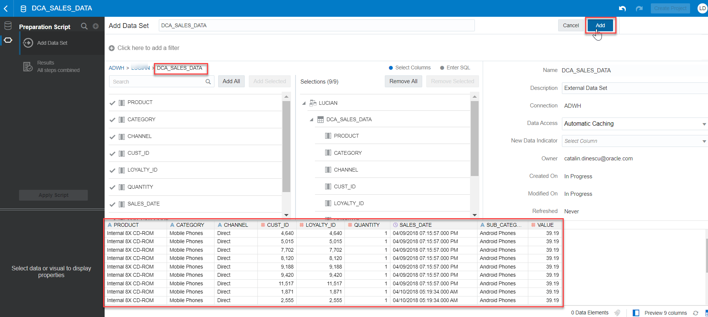

    Once the Data Set is created, it undergoes column-level profiling to produce a set of semantic recommendations to repair or enrich your data.

    That's the **Augmented Data Enrichment** with _Semantic Profiling_ and _Type Discovery_ machine learning (**ML**) driven process. It's over 20 geographic and demographic enrichments and out of the box recognition of over 30 semantic types.

    Based on the data we have a number of 8 recommendations based on SALES_DATE column.

4. Lets change the property of **'CUST\_ID'** to Attribute.  
Select (click) **'CUST\_ID'** column go to Properties Pane from down left, General  and change (click) **Treat As** from Measure to Attribute

   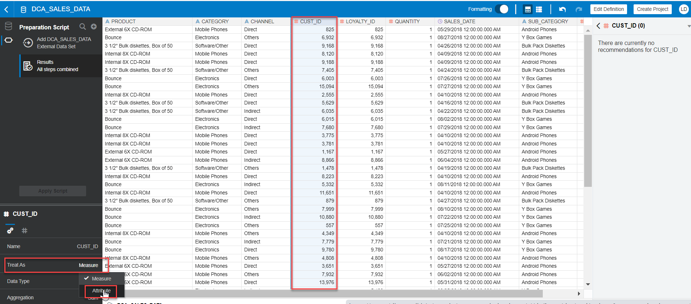
   > Notice that the Aggregation type has changed from Sum to None

5. Lets also change the aggregation rule for **Loyalty ID** and rename the column.  
Select (click) **'Loyalty\_ID'** column
Go to 'Loyalty\_ID' **options**  > Click and select **Rename**   
In the dialog box type in Name "**# Customers**" and Click **Add Step** button  

     

6. Change Aggregation from Sum to Count Distinct Select (click) **# Customers** go to General Property Pane > **Aggregation** > Select **Count Distinct**  

    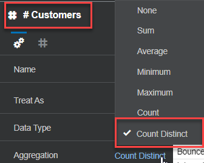

7. Lets extract week from the Sales Date column and rename it appropriate.  
Select (click) **SALES\_DATE** column, go to Options > **Extract** > Week 

    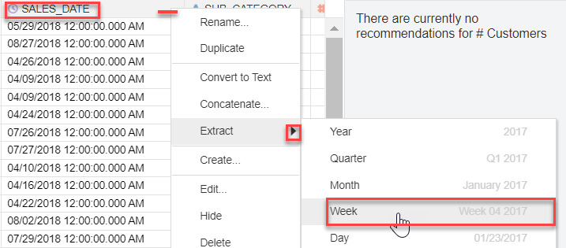

8. Go to the new column Options > **Rename**  

    
   
9. Type in **Sales Week** and Click on **Add Step**  

    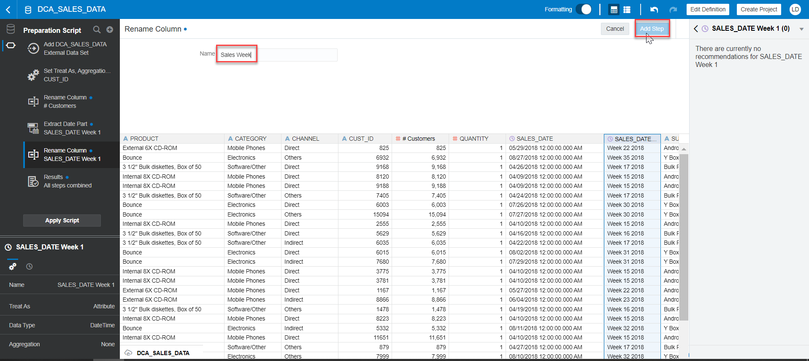

10. Apply the preparation script to persist all the data transformation we did.  
On top left is the Preparation Script Pane, which keeps track of every change to your Data Set. Each Step can be Modify/Remove.  
In Preparation **Script Pane** click **Apply Script**  to apply the property changes to the Data Set. 

    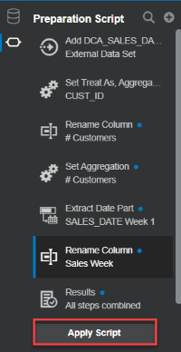

You have just finished to Load and Prepare your Data.

You may now [proceed to the next lab](#next)

## Want to Learn More?

* Free [Udemy: Modern Data Visualization with Oracle Analytics Cloud](https://www.udemy.com/augmented-analytics/), Section 3: Data Preparation and Augumented Data Enrichment 
* [Typical Workflow to Prepare Your Data Set for Analysis](https://docs.oracle.com/en/cloud/paas/analytics-cloud/acubi/typical-workflow-prepare-your-data-set-analysis.html)

## **Acknowledgements**

- **Author** - Lucian Dinescu, Product Strategy, Analytics
- **Contributors** - Priscila Iruela, Database Business Development | Juan Antonio Martin Pedro, Analytics Business Development Victor Martin, Melanie Ashworth-March, Andrea Zengin
- **Last Updated By/Date** - Lucian Dinescu, April 2021