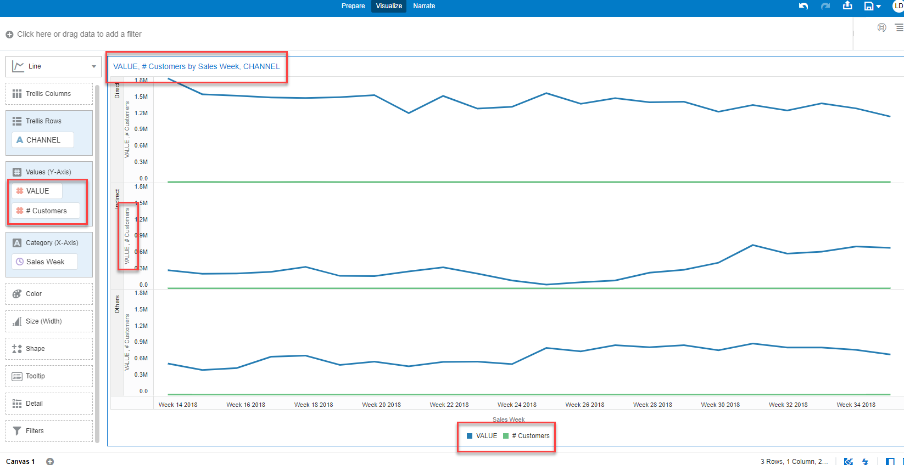
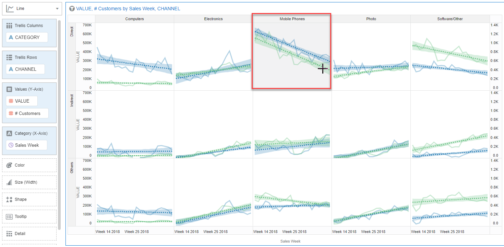
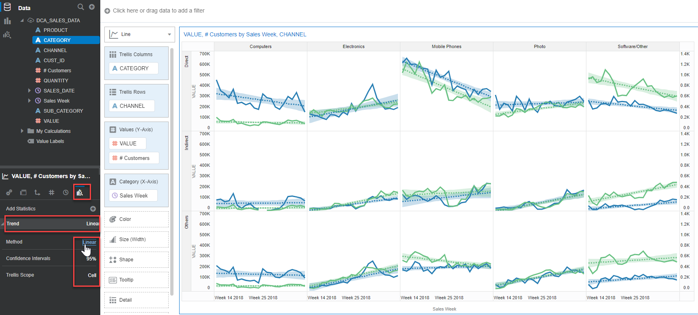

# Gaining insights with visual data dialog

## Introduction

You are going to start asking your business questions and from an automated generated visual you are going to gain additional insights and Advanced Analytics

    Estimated Lab Time: 20 minutes

### Objectives

- **Gain Insights with Visuals**
- **Use Advanced Analytics**

### Prerequisites

- An Oracle Cloud Free Tier or Paid
- You have completed  
["Lab 1: Provisioning your Autonomous Database instance"]("../../provision-adw/provision-adw.md")  
["Lab 2: Provisioning your Oracle Analytics Cloud instance"]("../../provision-oac/provision-oac.md")  
["Lab 3: Connecting OAC to ADW and adjusting Data Set properties"]("../../a-connoactoadw/a-connoactoadw.md")

## **STEP 1**: Gain Insights with Visuals

1. ### Search for your Data Set

    Back in the web mode, lets pick a visual and analyze it further in Data Visualization.

    In the **Home** Page of OAC, a dialog bar appearing at the top can be leveraged to **ask** plain English language questions on the data.

    1.1 Click the **Search** bar and **Type** in the bar area **"show me value by sales week" “for customers” "by channel"**.  
    As you enter the information, the application returns search results in a drop-down list. The system can be searched by column names or data elements or both. Best fit results are returned immediately

    1.2  Press **SHIFT + ENTER** to visualize data  
    

    In order to **enable searching** and ask questions, we already have **indexed** the Data Set in the previous chapter.

    1.3 Hover over the mouse on the first visualization and Click **Explore as Project**  
    

2. ### Explore your Visualization

    2.1 A new Canvas Page is opening  
    

    2.2 We notice that we have 2 measures, with 2 different units, on the same Y axis.  
    We have to move on of measure to the second Y axis.
    Change **"# Customers"** to second Y Axis.
    Go to the **Grammar Panel**, under the **Values** Section, hover over "**# Customers**", right click and select **Y2 axis**  
    

    2.3 Notice the visualization has changed with **Value** scale on the left and **# Customers** scale on the right **Y axis**.  
    

    2.4 Lets add **Category** to **Trellis Columns**.  
    Drag and drop **Category** data element from the Data Panel, to the Grammar Panel, into **Trellis Columns** section.  
    

    2.5 Notice that we are consistently losing Customers over time on Mobile Phones category.  
    

## **STEP 2**: Use Advanced Analytics  

You created your visual to explore a pattern in an overview of Value and Customers by Sales Week and Channel and to understand the split over Categories. You spot it a decrease over Mobil Phones category.  
Now you need to enhance the data displayed and add Advanced Analytics functions as easy as the right-click of a mouse.

1. ### Add a Trend Line

    Adding Trend lines is easy. It is used to analyze the specific direction of a group of value sets.

    1.1 Right-click your visualization, select **Add Statistics** and choose **Trend Line**.  
    

    1.2 Notice that there is downward trend for Mobile Phones.  
    

    1.3 **Properties** of the Trend Line can be controlled on the "**Chart Properties**" pane from bottom left side.  
    Go to **Analytics** tab, and is you click on "Linear" you can select a different Method (Exponential, Polynomial).
      
    It's Linear Trend with 95% Confidence Interval.  
    > please check this [blog](https://blogs.oracle.com/analytics/how-to-add-functions-with-a-simple-right-click-in-oracle-analytics) for deeper details.

2. ### Add a Forecast

    Adding a **Forecast** is pretty much the same one mouse click as the  Trend lines. Forecasting is the process of making predictions about the future based on past and present data and most commonly by analysis of trends

    2.1 Right-click your visualization, select **Add Statistics** and choose **Forecast**.  
    

    2.2 The forecast line predicts a further decline in the number of customers for Mobile Phones.  
    

    2.3 **Properties** of the Forecast can be controlled on the "**Chart Properties**" pane from bottom left side.  
    Go to **Analytics** tab, and is you click on "Linear" you can select a different Method (Exponential, Polynomial).
      
    Method is Next 3 periods, Model is Seasonal ARIMA (a regular pattern of changes that repeats over time periods), with 95% Prediction Interval.  
    > if you want more control over the various options for the computation you can create a [custom calculations](https://blogs.oracle.com/analytics/how-to-add-functions-with-a-simple-right-click-in-oracle-analytics) using Analytics functions.

You have just finished to learn how starting from direct questions to your data using you move and explore the selected visualization and adding one-click advanced analytics functions to get further future looking insights.

**This concludes this lab. Please proceed to the next lab in the Content menu.**

## Want to Learn More?

- [How to Add Functions with a Simple Right-Click in Oracle Analytics](https://blogs.oracle.com/analytics/how-to-add-functions-with-a-simple-right-click-in-oracle-analytics)
- Free [Udemy: Modern Data Visualization with Oracle Analytics Cloud](https://www.udemy.com/augmented-analytics/), Section 2, Build Your First Data Visualization Project with Oracle Analytics
- Free [Augmented Data Visualization with Machine Learning](https://www.udemy.com/machinelearning-analytics/), Section 4 Advanced Analytics Made Easy with Oracle Analytics

## **Acknowledgements**

- **Author** - Lucian Dinescu, Product Strategy, Analytics
- **Contributors** - 
- **Last Updated By/Date** - Lucian Dinescu, January 2021

## Need Help?

Please submit feedback or ask for help using our [LiveLabs Support Forum](https://community.oracle.com/tech/developers/categories/livelabsdiscussions). Please click the **Log In** button and login using your Oracle Account. Click the **Ask A Question** button to the left to start a *New Discussion* or *Ask a Question*.  Please include your workshop name and lab name.  You can also include screenshots and attach files.  Engage directly with the author of the workshop.  
Please contact us at  analyticsenablement_us_grp@oracle.com for any suggestions or challenges you might have with **Oracle Analytics** labs.

If you do not have an Oracle Account, click [here](https://profile.oracle.com/myprofile/account/create-account.jspx) to create one.

TO BE COPIED IN THE NEXT LAB!!!!!!!!
-----------------------------------------------
2. Now that you know a bit your way around in the **Project**, you can continue with the workshop.

    **Remember** that you just added the new dataset from the **SH&#95;SALES** table.

    All the number-type columns from this table are treated as **NUMBER** by default. You can check the information on the **Properties** section of each table column under the Data Type section.

    

3. Select **AMOUNT&#95;SOLD** column from the TABLE panel and add **Aggregation** rule **SUM** from the COLUMNS detail panel from the bottom. By default **Aggregation** value, will be **SUM**, just confirm that it is the case, otherwise change it.

    

4. We will **add Month** to your selection: **Hold the Control Button on your Keyboard** and expand **TIME_ID** and select **Month**, after right click of your mouse and select **Create Best Visualization**.

    

5. Verify that the **information** that is showing in the canvas is the following:

    **Line, Values (Y-Axis) &#45;&#45; AMOUNT&#95;SOLD, Category (X-Axis) &#45;&#45; TIME&#95;ID (Month)**.

    

6. Right click on the chart, select **Add Statistics** and **Trend Line**.

    

7. In the **Properties** panel at the very bottom of the page in the **Trend** section change 95% to **Off**.

    
    

    Although we had some ups and downs in the **totals**, you see that in the overall the total amount sold has been trending up, meaning our **sales are in good shape**.

    We will compare this information (**AMOUNT&#95;SOLD by TIME&#95;ID (Month)**) to our active customer base over time. To find the number of active customers, we will "**count distinct**" on **CUST&#95;ID on a Monthly basis**.

9. Select **CUST_ID** column from the TABLE panel and add **Aggregation** rule **Count Distinct** from the **COLUMNS** Properties panel from the bottom.

    

10. Be sure you drag **CUST&#95;ID** column to the Values (**Y-Axis**) section with your mouse in the canvas. Be sure it is added AMOUNT&#95;SOLD and not replace it. Right click on **CUST&#95;ID** and select **Y2 Axis** as part of the **CUST&#95;ID** details.

    

    

    This **results** shows you that the number of customers is going down but the amount sold is going up, so we are **selling more to less customers**.

    We will create a **new Data Set** of data to enrich the **canvas**.

11. Click the **+** bottom in the left top corner of the Analytics Cloud Page and **Add Data Set**.

    

12. Select **Create Data Set**.

    

13. Select **WORKSHOPADWOAC**.

    

14. Click on the **SH** (Sales History) schema.

    

15. Select **PRODUCTS** table from the *SH schema*.

    

    This will display the columns available in the **PRODUCTS** table.

16. Select **Add All** to select all columns in the table.

    

17. Then, to create the Data Set, select **PRODUCTS** at the top of the page or at the right side of the selection panel depend the version of OAC that you are using to **modify the Data Set** that we are creating right now.

    

    Use the following information to configure your **Data Set**:

    > **Data Access**: Live
    >
    > **Name**: SH&#95;PRODUCTS

18. Then **Add** to create the **Data Set**.

    

    The **Data Set** was successfully **saved**.

    

    Now we have to join the new Data Set, **SH&#95;PRODUCT**, to the data set that we created a few steps before **SH&#95;SALES**.

    You will notice that we have been redirected to the **Prepare** section of the project.

    At the **bottom of the screen**, you can see three tabs, one per each dataset and another one called **Data Diagram**. **Click** on **Data Diagram**.

    

    In this tab, you can view a representation of the **different datasets** included in the project and their **relationships**. Currently, there is no relationship defined, so you see both as isolated boxes.

    Hover over the imaginary line **between** them and click on the **0 number** that will appear:

    

19. A **pop-up window** appears allowing you to define a **new relation** between the datasets (join). Click on **Add Another Match**.

    

20. Select **PROD_ID** under each Data Set, **SH&#95;PRODUCTS** and **SH&#95;SALES** in the **Select Data** Section.

    

    > **NOTE**: You might see a balloon warning about using **PROD_ID** as a **Measure**. Do not worry about it. It is just a kind reminder that you are using a column that looks like a number only as a join column, but that is exactly what we want to do.

    

21. We will add the new dataset as a **Dimension** to this section. Click **Add Facts** and select **Extend a Dimension**.

    

22. Select **OK**.

    

    The **connection** between the two sources has been **created**.

    

23. Now that the **preparation** of the data is done, you can navigate again to **Visualize** page in the right top corner of the **Analytics Cloud Home Page**.

    

24. In the canvas go to **TIME_ID** section, **Show by** and select **Quarter** instead Month.

    

25. Apply the **Quarter** filter and the graph will **change dynamically**.

    

    We will eliminate the **Linear Trend Line** that we have in the graph.

26. Click in the **graph** and in the **Properties section** of the bottom of the page, select the **Analytics** icon and click in the **Trend** section to remove the **Linear** section.

    

27. We can see the **graph without the Trend Linear line**.

    

28. Select **PRODUCT_CATEGORY** from **SH&#95;PRODUCTS** and add it in **the Trellis Columns** section of the canvas.

    

    

    You can see now a **trend** on the **amount sold** and the number of distinct customers by product category. This allows you to compare the performance of each product. However, using just lines can be a bit messy. You will try now to make this graphic more appealing.

29. Select **AMOUNT&#95;SOLD** from the canvas and select **Bar** graph.

    

30. Select **Project Properties** from the Burger Menu in the right top corner.

    
    

31. Select in the **Colour Series** and select another **colour** that you prefer.

    

32. Select **OK** after being applied the **colour changes**.

    

    

33. We will save the **Project** in the **Save** section.

    

    I saved the project with the name **ADW&#95;OAC&#95;SH&#95;SCHEMA**.

    

34. You can share your project by **email or social media**. Have a look at the **possibilities**.

    Select the Share icon and select **File or Print.**

    

35. You can choose to **Save** your project in a wide variety of standard formats such as **PowerPoint (pptx), Acrobat (pdf), Image (png), Data (csv), Package (dva)**.  You can choose which parts of your project to include, such as **All Canvas, only the Active Canvas or the Active Visual**.

    

    The file will be **downloaded** locally on your machine.

    

36. When you select **Print**, you can choose which parts of your project to include in the **printed output, such as All Canvas, only the Active Canvas or the Active Visual**. Etc.

    

Watch our short recap video that includes an outlook of other functionalities of **Oracle Autonomous Database (ADB)** and **Oracle Analytics Cloud (OAC)**:

*Congratulations! Well done!*

You have just finished to ...

*You can proceed to the next lab…*
