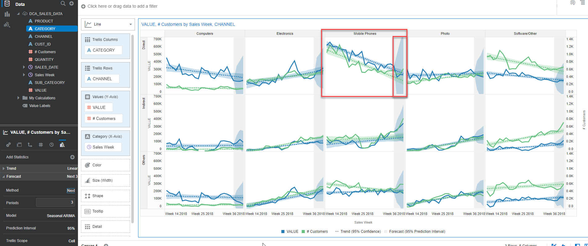

# Gaining Insights with Visual Data Dialog

## Introduction

After you ask your business question(s) and get  automated generated visual(s), you are going to explore the visual and gain additional insights with Advanced Analytics.

_Estimated Lab Time:_ 20 minutes

### Objectives

- **Gain Insights** with Visuals
- Use **Advanced Analytics**

### Prerequisites

- An Oracle Cloud Free Tier or Paid
- You have completed  
    Lab 1: Provisioning your Autonomous Database instance  
    Lab 2: Provisioning your Oracle Analytics Cloud instance  
    Lab 3: Connecting OAC to ADW and adjusting Data Set properties

## **STEP 1**: Gain Insights with Visuals

1. ### Search for your Data Set

    Back in the web mode, lets pick a visual and analyze it further with Data Visualization.

    In the **Home** Page of OAC, a dialog bar appearing at the top can be leveraged to **ask** in plain natural language questions on the data.

    1.1 Click the **Search** bar and **Type** in the bar area **"show me value by sales week" “for customers” "by channel"**.  
    As you enter the information, the application returns search results in a drop-down list. The system can be searched by column names or data elements or both. Best fit results are returned immediately

    1.2  Press **SHIFT + ENTER** to visualize data  
    

    In order to **enable searching** and ask questions, we already have **indexed** the Data Set as part of the previous chapter.

    1.3 Hover over the mouse on the first visualization and Click **Explore as Project**  
    

2. ### Explore your Visualization

    2.1 A new Canvas Page is opening  
    

    2.2 You notice that there are 2 measures, with 2 different units, on the same Y axis. That's difficult to interpret.  
    We have to move one of the measure to the second Y axis and get a proper visualization.  
    Change **"# Customers"** to the second Y Axis.
    Go to the **Grammar Panel**, under the **Values** Section, hover over "**# Customers**", right-click and select **Y2 axis**  
    

    2.3 Notice that the visualization has changed with **Value** scale on the left and **# Customers** scale on the right **Y axis**.  
    

    2.4 Lets add **Category** to **Trellis Columns**.  
    Drag and drop **Category** data element from the Data Panel, to the Grammar Panel, into **Trellis Columns** section.  
    

    2.5 Notice that we are consistently losing Customers over time on Mobile Phones category.  
    

## **STEP 2**: Use Advanced Analytics  

You've created your visual to explore and find patterns with Value and Customers by Sales Week and Channel, and to understand the split over Categories. You spot it a decrease over Mobil Phones category.  
Now you need to enhance the data displayed and add Advanced Analytics functions as easy as the right-click of a mouse.

1. ### Add a Trend Line

    Adding Trend lines is easy. It is used to analyze the specific direction of a group of value sets.

    1.1 Right-click your visualization, select **Add Statistics** and choose **Trend Line**.  
    

    1.2 Notice that there is downward trend for Mobile Phones.  
    

    1.3 **Properties** of the Trend Line can be controlled on the "**Chart Properties**" pane from bottom left side.  
    Go to **Analytics** tab, and is you click on "Linear" you can select a different Method (Exponential, Polynomial).
      
    It's Linear Trend with 95% Confidence Interval.  
    > please check this [blog](https://blogs.oracle.com/analytics/how-to-add-functions-with-a-simple-right-click-in-oracle-analytics) for deeper details.

2. ### Add a Forecast

    Adding a **Forecast** is pretty much the same one mouse click as the Trend lines one.  
    Forecasting is the process of making predictions about the future based on past and present data and most commonly by analysis of trends

    2.1 Right-click your visualization, select **Add Statistics** and choose **Forecast**.  
    

    2.2 The forecast line predicts a further decline in the number of customers for Mobile Phones.  
    

    2.3 **Properties** of the Forecast can be controlled on the "**Chart Properties**" pane from bottom left side.  
    Go to **Analytics** tab, and is you click on "Linear" you can select a different Method (Exponential, Polynomial).
      
    Method is Next 3 periods, Model is Seasonal ARIMA (a regular pattern of changes that repeats over time periods), with 95% Prediction Interval.  
    > if you want more control over the various options for the computation you can create a [custom calculations](https://blogs.oracle.com/analytics/how-to-add-functions-with-a-simple-right-click-in-oracle-analytics) using Analytics functions.

You have just finished to learn how starting from direct questions to your data you can move and explore automated generated visuals and enhancing by adding one-click advanced analytics functions to get further future looking insights.

You may now [proceed to the next lab](#next)

## Want to Learn More?

- [How to Add Functions with a Simple Right-Click in Oracle Analytics](https://blogs.oracle.com/analytics/how-to-add-functions-with-a-simple-right-click-in-oracle-analytics)
- Free [Udemy: Modern Data Visualization with Oracle Analytics Cloud](https://www.udemy.com/augmented-analytics/), Section 2, Build Your First Data Visualization Project with Oracle Analytics
- Free [Augmented Data Visualization with Machine Learning](https://www.udemy.com/machinelearning-analytics/), Section 4 Advanced Analytics Made Easy with Oracle Analytics

## **Acknowledgements**

- **Author** - Lucian Dinescu, Product Strategy, Analytics
- **Contributors** - 
- **Last Updated By/Date** - Lucian Dinescu, January 2021

## Need Help?

Please submit feedback or ask for help using our [LiveLabs Support Forum](https://community.oracle.com/tech/developers/categories/livelabsdiscussions). Please click the **Log In** button and login using your Oracle Account. Click the **Ask A Question** button to the left to start a *New Discussion* or *Ask a Question*.  Please include your workshop name and lab name.  You can also include screenshots and attach files.  Engage directly with the author of the workshop.  
Please contact us at  analyticsenablement_us_grp@oracle.com for any suggestions or challenges you might have with **Oracle Analytics** labs.

If you do not have an Oracle Account, click [here](https://profile.oracle.com/myprofile/account/create-account.jspx) to create one.
