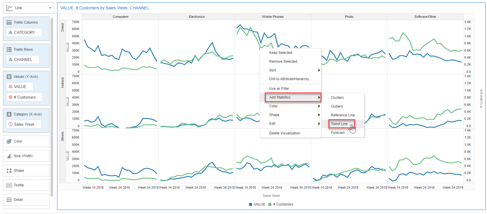
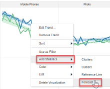
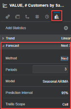

# Gaining Insights with Visual Data Dialog

## Introduction

After you ask your business question(s) and get  automated generated visual(s), you are going to explore the visual and gain additional insights with Advanced Analytics.

_Estimated Lab Time:_ 20 minutes

### Objectives

- **Gain Insights** with Visuals
- Use **Advanced Analytics**

### Prerequisites

* An Oracle Cloud Free Tier or Paid account
* You should have completed  
    * Lab 1: Provisioning your Autonomous Database instance
    * Lab 2: Provisioning your Oracle Analytics Cloud instance
    * Lab 3: Connecting OAC to ADW and adjusting Data Set properties

## **STEP 1**: Gain Insights with Visuals

1.  **Search** for your Data Set.  
Lets go back in the web mode; in the **Home** Page of OAC, a dialog bar appearing at the top can be leveraged to **ask** your business questions using natural language.  
Click the **Search** bar and **Type** in the bar area **"show me value by sales week" “for customers” "by channel"**.  
As you enter the information, the application returns search results in a drop-down list. The system can be searched by column names or data elements or both. Best fit results are returned immediately

2.  Press **SHIFT + ENTER** to visualize data

    

    In order to **enable searching** and ask questions, you already have **indexed** the Data Set as part of the previous chapter.

3.  Mouse Hover on the first visualization and Click **Explore as Project** 

    

4.  **Explore** your Visualization.  
A new Canvas Page will be opened  

    

5.  You would notice that there are 2 measures, with 2 different units, on the same Y axis, which is difficult to interpret.  
We have to move one of the measure to the second Y axis and get a proper visualization.  
Change **"# Customers"** to the second Y Axis > Go to the **Grammar Panel**, under the **Values** Section, hover over "**# Customers**", right-click and select **Y2 axis**  

    

6.  Notice that the visualization has changed with **Value** scale on the left and **# Customers** scale on the right **Y axis**. 

    

7.  Lets add **Category** to **Trellis Columns**.  
    Drag and drop **Category** data element from the Data Panel, to the Grammar Panel, into **Trellis Columns** section.  
   
    

8.  Notice that we are consistently losing Customers over time on Mobile Phones category.  
    
    

## **STEP 2**: Use Advanced Analytics  

You've created your visual to explore and find patterns with Value and Customers by Sales Week and Channel, and to understand the split over Categories. You spot it a decrease over Mobile Phones category.  
Now you need to enhance the insights is the data displayed and add Advanced Analytics functions as easy as the right-click of a mouse.

1. Add a **Trend Line**  
Adding Trend lines is easy. It is used to analyze the specific direction of a group of value sets.  

    Right-click your visualization, select **Add Statistics** and choose **Trend Line**.

    

2.  Notice that there is **downward trend** for **Mobile Phones**. 

    

3.  **Properties** of the Trend Line can be controlled on the "**Chart Properties**" pane from bottom left side.  
Go to **Analytics** tab, and is you click on "Linear" you can select a different Method (Exponential, Polynomial).

      
    It's Linear Trend with 95% Confidence Interval.  
    > please check this [blog](https://blogs.oracle.com/analytics/how-to-add-functions-with-a-simple-right-click-in-oracle-analytics) for deeper details.

4.  Add a **Forecast**  
Adding a **Forecast** is pretty much the same way as the Trend lines one.  

    Forecasting is the process of making predictions about the future based on past and present data and most commonly by analysis of trends.  
    Right-click your visualization, select **Add Statistics** and choose **Forecast**.  
    
    

5.  The forecast line predicts a further decline in the number of customers for Mobile Phones.

    

6.  The **Properties** of the Forecast can be controlled on the "**Chart Properties**" pane from bottom left side.  
Go to **Analytics** tab, and click on "Linear" you can select a different Method (Exponential, Polynomial).

      
    Method is Next 3 periods, Model is Seasonal ARIMA (a regular pattern of changes that repeats over time periods), with 95% Prediction Interval.  
    > if you want more control over the various options for the computation you can create a [custom calculations](https://blogs.oracle.com/analytics/how-to-add-functions-with-a-simple-right-click-in-oracle-analytics) using Analytics functions.

You have just finished to learn how to start from direct questions on your data. You can move and explore automated generated visuals and enhancing by adding one-click advanced analytics functions to get further future looking insights.

You may now [proceed to the next lab](#next)

## Want to Learn More?

* [How to Add Functions with a Simple Right-Click in Oracle Analytics](https://blogs.oracle.com/analytics/how-to-add-functions-with-a-simple-right-click-in-oracle-analytics)  
* Free [Udemy: Modern Data Visualization with Oracle Analytics Cloud](https://www.udemy.com/augmented-analytics/), Section 2, Build Your First Data Visualization Project with Oracle Analytics  
* Free [Augmented Data Visualization with Machine Learning](https://www.udemy.com/machinelearning-analytics/), Section 4 Advanced Analytics Made Easy with Oracle Analytics

## **Acknowledgements**

- **Author** - Lucian Dinescu, Product Strategy, Analytics
- **Contributors** - 
- **Last Updated By/Date** - Lucian Dinescu, April 2021
