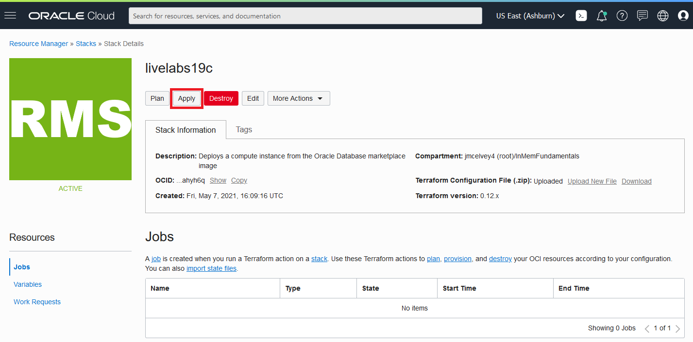
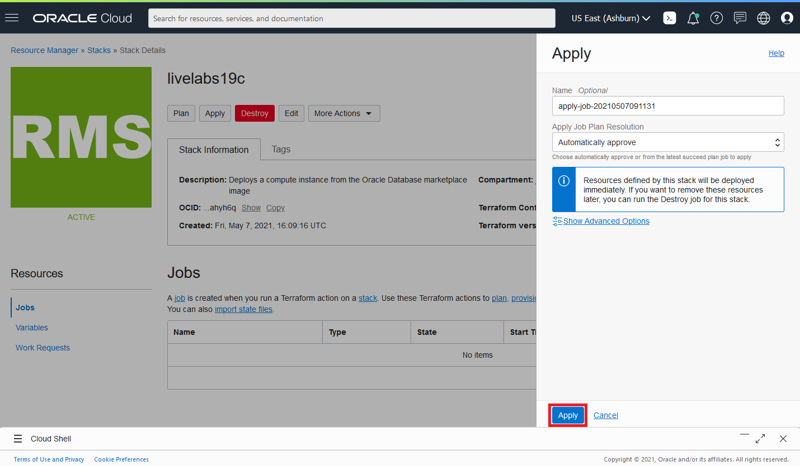
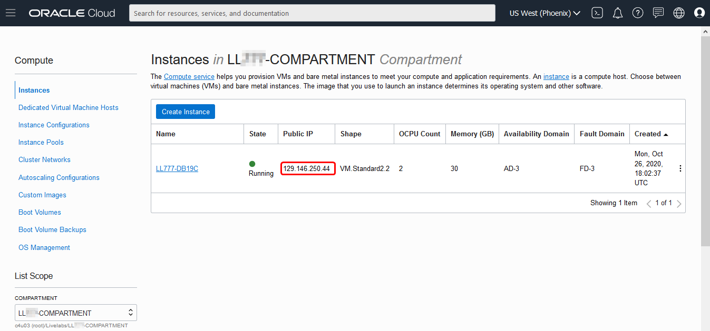
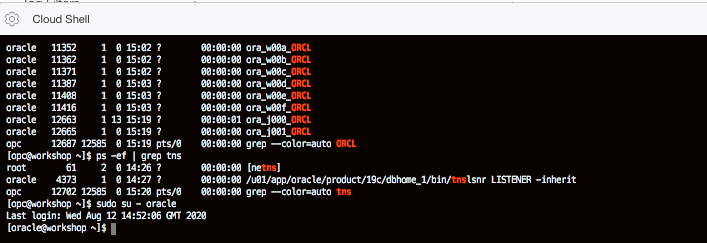

# Setup Compute Instance

## Introduction
This lab will show you how to setup a compute instance running a pre-configured Compute and the corresponding Virtual Cloud Network (VCN).

Estimated Lab Time:  25 minutes

### About Terraform and Oracle Cloud Resource Manager
For more information about Terraform and Resource Manager, please see the appendix below.

### Objectives
In this lab, you will:
* Use Resource Manager to quickly setup a compute instance and VCN
* Login to your compute instance
* Confirm your Oracle Database 19c is up and running

### Prerequisites

This lab assumes you have:
- An Oracle Free Tier or Paid Cloud account
- SSH Keys

## **STEP 1**: Setup Stack
If you already have a VCN created, skip this step and proceed to *STEP 3*.

1.  Click on the link below to download the Resource Manager zip file you need to build your environment.  
    - [livelabs-db19ccompute-0812.zip](https://objectstorage.us-ashburn-1.oraclecloud.com/p/R_vJuMUIrsFofKYcTuJOsDiXl2xdSjHNQU7yjQPtnh4/n/c4u03/b/labfiles/o/livelabs-db19ccompute-0812.zip) - Packaged terraform instance creation script for creating instance running the 19c Oracle Database
2.  Save in your downloads folder.
3.  Login to your Oracle Cloud account.
4.  Click the **Create a Stack** tile on the homepage.  You may also get to Resource Manager by clicking on the Hamburger **Menu** -> **Solutions and Platform** -> **Resource Manager**.
   

5.  Select **My Configuration**, choose the **.ZIP FILE** button, click the **Browse** link and select the zip file (livelabs-db19ccompute-0812.zip) that you downloaded. Click **Select**.

   

6. Enter the name of your choice.  We suggest livelabs19c.  Click **Next**.
   
7. Accept the region and select your compartment.  Select an **availability domain** from the drop down.
   
8. Paste the SSH key you created in the previous lab.
   
9. Scroll down and select the **VMStandard.E2.4**.  *Note: Make sure you select the 2.4 version.  It has enough memory to run the database 19c binaries*
    
10. Accept the network and click **Next**.
    
11. Review the details and click **Next**.
    

## **STEP 2**: Run Stack Apply Job

1. Click the **Terraform Actions** drop down.
    
2. Choose **Apply**
    
3. Resource Manager will begin creating the components needed for this workshop.
    
4. Inspect the log, you will notice that 8 resources were created including the compute instance.
   

*Note:  If you encounter any errors with this step, please see the Troubleshooting Tips in the appendix. 

## **STEP 3**: Gather compute instance details
1. Go to the hamburger menu (in the top left corner) and click **Compute** -> **Instances**
   
2. Look for the instance you just created and jot down the public IP address.
   

## **STEP 4**: Connect to your instance

There are multiple ways to connect to your cloud instance.  Choose the way to connect to your cloud instance that matches the SSH Key you generated.  *(i.e If you created your SSH Keys in cloud shell, choose cloud shell)*

- Oracle Cloud Shell
- MAC or Windows CYCGWIN Emulator
- Windows Using Putty
  
### Oracle Cloud Shell

1. To re-start the Oracle Cloud shell, go to your Cloud console and click the cloud shell icon to the right of the region.  *Note: Make sure you are in the region you were assigned*

    

2.  Go to **Compute** -> **Instances** and select the instance you created (make sure you choose the correct compartment)
3.  On the instance homepage, find the Public IP addresss for your instance.

    
4.  Enter the command below to login to your instance.    
    ````
    ssh -i ~/.ssh/<sshkeyname> opc@<Your Compute Instance Public IP Address>
    ````

    *Note: The angle brackets <> should not appear in your code.*
          
5.  When prompted, answer **yes** to continue connecting.
6.  Continue to the *next Step* on the left hand menu.

*Note:  If you encounter any errors with this step, please see the Troubleshooting Tips in the appendix. 

### MAC or Windows CYGWIN Emulator
1.  Go to **Compute** -> **Instances** and select the instance you created (make sure you choose the correct compartment)
2.  On the instance homepage, find the Public IP addresss for your instance.

3.  Open up a terminal (MAC) or cygwin emulator as the opc user.  Enter yes when prompted.

    ````
    ssh -i ~/.ssh/<sshkeyname> opc@<Your Compute Instance Public IP Address>
    ````
    

    

    *Note: The angle brackets <> should not appear in your code.*

4.  After successfully logging in, proceed to the *next Step* on the left hand menu.

*Note:  If you encounter any errors with this step, please see the Troubleshooting Tips in the appendix. 

### Windows using Putty

1.  Open up putty and create a new connection.

    ````
    ssh -i ~/.ssh/<sshkeyname> opc@<Your Compute Instance Public IP Address>
    ````
    

    *Note: The angle brackets <> should not appear in your code.*

2.  Enter a name for the session and click **Save**.

    

3. Click **Connection** > **Data** in the left navigation pane and set the Auto-login username to root.

4. Click **Connection** > **SSH** > **Auth** in the left navigation pane and configure the SSH private key to use by clicking Browse under Private key file for authentication.

5. Navigate to the location where you saved your SSH private key file, select the file, and click Open.  NOTE:  You cannot connect while on VPN or in the Oracle office on clear-corporate (choose clear-internet).

    

6. The file path for the SSH private key file now displays in the Private key file for authentication field.

7. Click Session in the left navigation pane, then click Save in the Load, save or delete a stored session STEP.

8. Click Open to begin your session with the instance.

*Note:  If you encounter any errors with this step, please see the Troubleshooting Tips in the appendix. 

## **STEP 5**: Verify the ORCL database is up

Once you deploy your compute instance, tail the log to determine when the database has been configured and is available for use.
1.  From your connected session of choice **tail** the last 10 lines of the **dbsingle.log** file.  This file configures the database.  
    ````
    <copy>
    tail -10 /u01/ocidb/buildsingle1.log
    </copy>
    ````
    

2.  After *approximately 20 minutes*, you will see a notice that says the database setup is complete.  Please see troubleshooting tips if you have issues here.

    
*Note:  If you encounter any errors with this step, please see the Troubleshooting Tips in the appendix. 

3. Run the following command to verify the database with the SID **ORCL** is up and running

    ````
    <copy>
    ps -ef | grep ORCL
    </copy>
    ````
    

4. Verify the listener is running
    ````
    <copy>
    ps -ef | grep tns
    </copy>
    ````

    

5. Switch to the oracle user.
      ````
    <copy>
    sudo su - oracle
    </copy>
    ````

    

6.  Set the environment variables to point to the Oracle binaries.  When prompted for the SID (Oracle Database System Identifier), enter **ORCL**.
    ````
    <copy>
    . oraenv
    </copy>
    ORCL
    ````
    

7.  Login using SQL*Plus as the **oracle** user.  

    ````
    <copy>
    sqlplus system/Ora_DB4U@localhost:1521/orclpdb
    </copy>
    ````
    
*Note:  If you encounter any errors with this step, please see the Troubleshooting Tips in the appendix. 

7.  Exit the sqlplus session and switch back to the opc user.  Verify that you are now the opc user.

    ```` 
    SQL> <copy>exit
    </copy>
    ````

    ```` 
    [oracle@server ~]$ <copy>exit
    whoami
    </copy>
    ````
    
    
Congratulations!  You now have a fully functional Oracle Database 19c instance (ORCL) running on Oracle Cloud Compute.  

You may now *proceed to the next lab*.  

## Appendix:  Teraform and Resource Manager
Terraform is a tool for building, changing, and versioning infrastructure safely and efficiently.  Configuration files describe to Terraform the components needed to run a single application or your entire datacenter.  In this lab a configuration file has been created for you to build network and compute components.  The compute component you will build creates an image out of Oracle's Cloud Marketplace.  This image is running Oracle Linux 7.

Resource Manager is an Oracle Cloud Infrastructure service that allows you to automate the process of provisioning your Oracle Cloud Infrastructure resources. Using Terraform, Resource Manager helps you install, configure, and manage resources through the "infrastructure-as-code" model. To learn more about OCI Resource Manager, take a watch the video below.

[](youtube:udJdVCz5HYs)

### Oracle Cloud Marketplace
The Oracle Cloud Marketplace is a catalog of solutions that extends Oracle Cloud services.  It offers multiple consumption modes and deployment modes.  In this lab we will be deploying the free Oracle Enterprise Manager 13c Workshop marketplace image.

[Link to OCI Marketplace](https://www.oracle.com/cloud/marketplace/)

## Appendix: Troubleshooting Tips

If you encountered any issues during the lab, follow the steps below to resolve them.  If you are unable to resolve, please skip to the **Need Help** section to submit your issue via our  support forum.
1. Can't login to instance
2. Invalid public key
3. Limits Exceeded
4. Database Creation stuck at 3x %
5. Apply job is stuck in provisioning state

### Issue 1: Can't login to instance
Participant is unable to login to instance

#### Tips for fixing Issue #1
There may be several reasons why you can't login to the instance.  Here are some common ones we've seen from workshop participants
- Incorrectly formatted ssh key (see above for fix)
- User chose to login from MAC Terminal, Putty, etc and the instance is being blocked by company VPN (shut down VPNs and try to access or use Cloud Shell)
- Incorrect name supplied for ssh key (Do not use sshkeyname, use the key name you provided)
- @ placed before opc user (Remove @ sign and login using the format above)
- Make sure you are the oracle user (type the command *whoami* to check, if not type *sudo su - oracle* to switch to the oracle user)
- Make sure the instance is running (type the command *ps -ef | grep oracle* to see if the oracle processes are running)
- Not enough memory for instance (see Issue #4)


### Issue 2: Invalid public key


#### Issue #2 Description
When creating your SSH Key, if the key is invalid the compute instance stack creation will throw an error.

#### Tips for fixing for Issue #2
- Go back to the instructions and ensure you create and **copy/paste** your key into the stack correctly. 
- Copying keys from Cloud Shell may put the key string on two lines.  Make sure you remove the hard return and ensure the key is all one line.
- Ensure you pasted the *.pub file into the window.
1.  Click on **Stack**-> **Edit Stack** -> **Configure Variables**.
2.  Repaste the correctly formatted key
3.  Click **Next**
4.  Click **Save Changes**
5.  Click **Terraform Actions** -> **Apply**

### Issue 3: Limits Exceeded


#### Issue #3 Description
When creating a stack your ability to create an instance is based on the capacity you have available for your tenancy. 

#### Fix for Issue #3
If you have other compute instances you are not using, you can go to those instances and delete them.  If you are using them, follow the instructions to check your available usage and adjust your variables.

*Please ensure that you are NOT running this in the **Always Free** Tier. This workshop does not run on the Always Free tier, you must have available cloud credits.  Go to **Governance** -> **Limits, Quotas and Usage,** select **compute**, ensure that you have **more than** the micro tier available.  If you have only 2 micro computes, your account has transitioned to an Always Free.  This means that the promotional period of 30 days has expired or you have run out of credits, this workshop will NOT run.*

1. Click on the Hamburger menu, go to **Governance** -> **Limits, Quotas and Usage**
2. Select **Compute**
3. These labs use the following compute types.  Check your limit, your usage and the amount you have available in each availability domain (click Scope to change Availability Domain)
4. Look for Standard.E2, Standard.E3.Flex and Standard2
5. This workshop requires at least 4 OCPU and a minimum of 30GB of memory.  If you do not have that available you may request a service limit increase at the top of this screen.  If you have located capacity, please continue to the next step.
6.  Click on the Hamburger menu -> **Resource Manager** -> **Stacks**
7.  Click on the stack you created previously
8.  Click **Edit Stack** -> **Configure Variables**.
9.  Scroll down to Options
10. Change the shape based on the availability you have in your system
11. Click **Next**
12. Click **Save Changes**
13. Click **Terraform Actions** -> **Apply**

### Issue 4: Database Creation stuck at 3x%
When tailing the log, the database creation seems stuck.

#### Issue #4 Description
Database creation requires at least 30GB of memory.  

#### Fix for Issue #4
1.  Click on Compute -> Instance and verify that your instance created was VMStandard.E2.4 and higher.  If you chose 2.2 or a smaller shape, the instance creation will fail, you will need to rerun your stack and recreate your instance.  The instance has run out of memory and won't be able to create
2.  A known issue has been identified that the create script may take longer, if it has been over 2 hours, please submit an issue.
  
### Issue 5: Apply job is stuck in provisioning state
When the apply job is running certain browsers may not reflect the correct state

#### Fix for Issue #5
Reload your browser


## Acknowledgements
- **Author** - Kay Malcolm, Director, DB Product Management
- **Contributors** - Sanjay Narvekar, Troy Anthony, Anoosha Pilli, Arabella Yao, Jeffrey Malcolm Jr.
- **Last Updated By/Date** - Kay Malcolm, August 2020

## See an issue?
Please submit feedback using this [form](https://apexapps.oracle.com/pls/apex/f?p=133:1:::::P1_FEEDBACK:1). Please include the *workshop name*, *lab* and *STEP* in your request.  If you don't see the workshop name listed, please enter it manually. If you would like us to follow up with you, enter your email in the *Feedback Comments* section.    Please include the workshop name and lab in your request.
