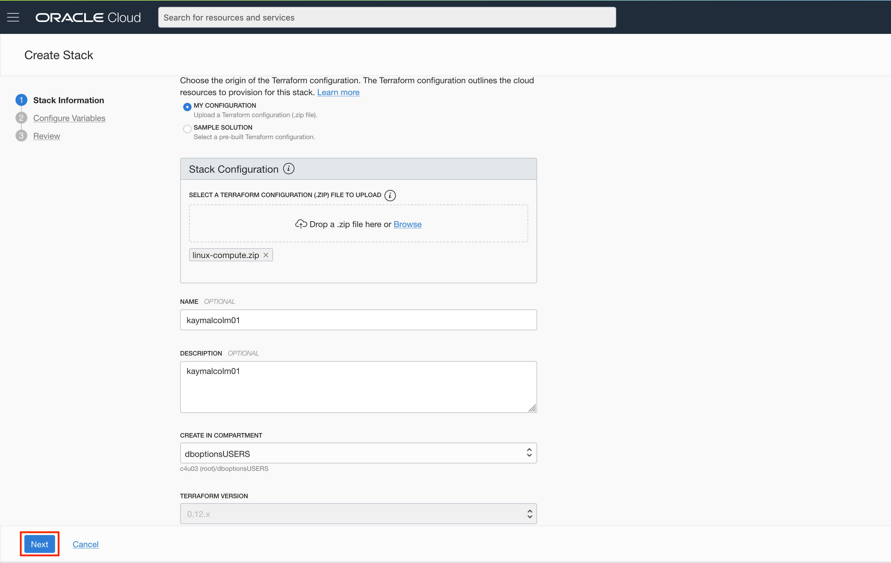
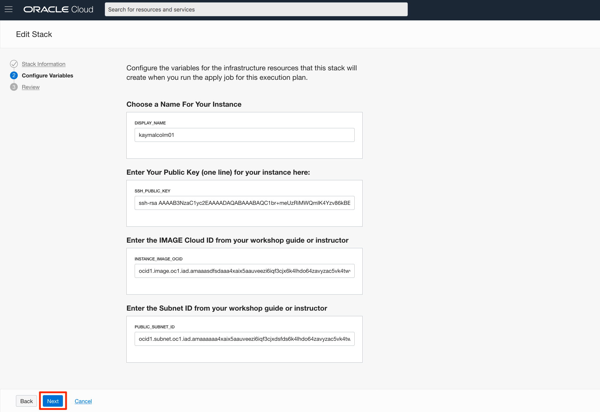

# Setup - LiveLabs 

## Introduction
This lab will show you how to setup a Oracle Cloud network (VCN) and a compute instance running a pre-configured Oracle Cloud Developer install using Oracle Resource Manager and Terraform.  

### About Terraform and Oracle Cloud Resource Manager
Terraform is a tool for building, changing, and versioning infrastructure safely and efficiently.  Configuration files describe to Terraform the components needed to run a single application or your entire datacenter.  In this lab a configuration file has been created for you to build network and compute components.  The compute component you will build creates an image out of Oracle's Cloud Marketplace.  This image is running Oracle Cloud Developer.

Resource Manager is an Oracle Cloud Infrastructure service that allows you to automate the process of provisioning your Oracle Cloud Infrastructure resources. Using Terraform, Resource Manager helps you install, configure, and manage resources through the "infrastructure-as-code" model. To learn more about OCI Resource Manager, take a watch the video below.

[](youtube:udJdVCz5HYs)

### Oracle Cloud Marketplace

The Oracle Cloud Marketplace is a catalog of solutions that extends Oracle Cloud services.  It offers multiple consumption modes and deployment modes.  In this lab we will be deploying the free Oracle Cloud Developer marketplace image.

Link to Marketplace - https://www.oracle.com/cloud/marketplace/

### Objectives

-   Setup a network and compute instance using the Cloud Developer Marketplace image
-   Use Terraform and Resource Manager to complete the setup

### Lab Prerequisites

This lab assumes you have already completed the following labs:
- Register for Free Tier
- Create SSH Keys

## Step 1: Login and Create Stack using Resource Manager

1.  Click on the link below to download the Resource Manager zip file you need to build your enviornment.  
    - [cloud-dev-compute.zip](https://objectstorage.us-ashburn-1.oraclecloud.com/p/k3xZLXdJAT1vE-i1jMotl3nhDMtfKn0YOq1QgrWsmKo/n/c4u03/b/labfiles/o/linux-compute.zip) - Packaged terraform instance creation script

2.  Save in your downloads folder.

3.  Open up the hamburger menu in the left hand corner.  Choose **Resource Manager > Stacks**.   Choose the compartment from your email, click the  **Create Stack** button.  *Note:  If you are in a workshop, double check your region to ensure you are on the assigned region*

     

    

    

    

4.  Click the **Browse** link and select the zip file (cloud-dev-compute.zip) that you downloaded. Click **Select**.

    


    Enter the following information and accept all the defaults

    - **Name**:  Enter your firstname and lastname and the day you were born (DO NOT ENTER ANY SPECIAL CHARACTERS HERE, including periods, underscores, exclamation etc, it will mess up the configuration and you will get an error during the apply process)
    
    - **Description**:  Same as above
    
    - **Compartment**:  Select Compartment from Email 2

5.  Click **Next**.

    

    Enter the following information:

    **Choose a Name for your Instance:** Enter a display name. This will be the display name for the compute instance you create.  We recommend your name and a set of numbers

    **SSH Public Key**:  Paste the public key you created in the earlier lab *(Note: If you used the Oracle Cloud Shell to create your key, make sure you paste the pub file in a notepad, remove any hard returns.  The file should be one line or you will not be able to login to your compute instance)*

    **Image ID**: The image cloud OCI ID is the unique identifier for the Oracle Cloud Developer Image you will use to build your instance.  Enter the string in the box.  *ID:*  ocid1.image.oc1..aaaaaaaa2es7kqqgmmjyymzdaaeqmmehrprg6gdjxs4on5lpzwiv64przksa

    **Subnet ID:** The subnet id which is the address for the pre-created network was provided in Email 2.  Enter that information here.

6. Click **Next**.

    

7.  Your stack has now been created!  Now to create your environment.  *Note: If you get an error about an invalid DNS label, go back to your Display Name, please do not enter ANY special characters or spaces.  It will fail.*

    

## Step 2: Terraform Plan (OPTIONAL)
When using Resource Manager to deploy an environment, execute a terraform **plan** to verify the configuration.  This is an optional step in this lab.  

1.  [OPTIONAL]Click **Terraform Actions** -> **Plan** to validate your configuration.  This takes about a minute, please be patient.

    

    

    


## Step 3: Terraform Apply
When using Resource Manager to deploy an environment, execute a terraform **plan** and **apply**.  Let's do that now.

1.  At the top of your page, click on **Stack Details**.  Click the button, **Terraform Actions** -> **Apply**.  This will create your instance and install Oracle 19c.
    

    

2.  Once this job succeeds, you will get an apply complete notification from Terraform.  Examine it closely, 1 resource has been added.  Congratulations, your environment is created!  Time to login to your instance to finish the configuration.

    


## Step 4: Connect to your instance

Choose the environment where you created your ssh-key in the previous lab (Generate SSH Keys)

*NOTE 1:  If you are using your laptop to connect, you cannot connect while on VPN or in the Oracle office on clear-corporate (choose clear-internet).  This does not apply to the Oracle Cloud Shell.*

*NOTE 2: The ssh-daemon is disable for up to 5 minutes or so while the instance is processing.  If you are unable to connect and sure you have a valid key, wait a few minutes and try again.*

### Oracle Cloud Shell

1. To re-start the Oracle Cloud shell, go to your Cloud console and click the cloud shell icon to the right of the region.  *Note: Make sure you are in the region you were assigned*

     

2.  Go to **Compute** -> **Instance** and select the instance you created (make sure you choose the correct compartment)
3.  On the instance homepage, find the Public IP addresss for your instance.
4.  Enter the command below to login to your instance.    
    ````
    ssh -i ~/.ssh/<sshkeyname> opc@<Your Compute Instance Public IP Address>
    ````
5.  When prompted, answer **yes** to continue connecting.
6.  Continue to Step 5 on the left hand menu.

### MAC or Windows CYGWIN Emulator
1.  Go to **Compute** -> **Instance** and select the instance you created (make sure you choose the correct compartment)
2.  On the instance homepage, find the Public IP addresss for your instance.

3.  Open up a terminal (MAC) or cygwin emulator as the opc user.  Enter yes when prompted.

    ````
    ssh -i ~/.ssh/optionskey opc@<Your Compute Instance Public IP Address>
    ````
     

     

4.  After successfully logging in, proceed to Step 5.

### Windows using Putty

1.  Open up putty and create a new connection.

    ````
    ssh -i ~/.ssh/optionskey opc@<Your Compute Instance Public IP Address>
    ````
     

2.  Enter a name for the session and click **Save**.

     

3. Click **Connection** > **Data** in the left navigation pane and set the Auto-login username to root.

4. Click **Connection** > **SSH** > **Auth** in the left navigation pane and configure the SSH private key to use by clicking Browse under Private key file for authentication.

5. Navigate to the location where you saved your SSH private key file, select the file, and click Open.  NOTE:  You may not be able to connect while on any corporate VPN or in the Oracle office on clear-corporate (choose clear-internet if you are in an Oracle office).

     

6. The file path for the SSH private key file now displays in the Private key file for authentication field.

7. Click Session in the left navigation pane, then click Save in the Load, save or delete a stored session Step.

8. Click Open to begin your session with the instance.

You may now proceed to the next lab.  

## Acknowledgements

- **Author** - Kay Malcolm, Director, DB Product Management
- **Last Updated By/Date** - Kay Malcolm, April 2020

See an issue?  Please open up a request [here](https://github.com/oracle/learning-library/issues).   Please include the workshop name and lab in your request.    Please include the workshop name and lab in your request. 
