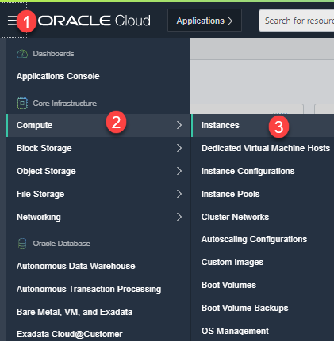
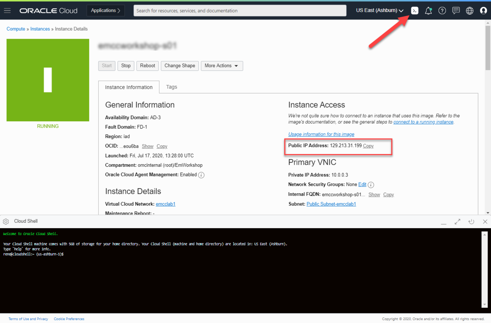
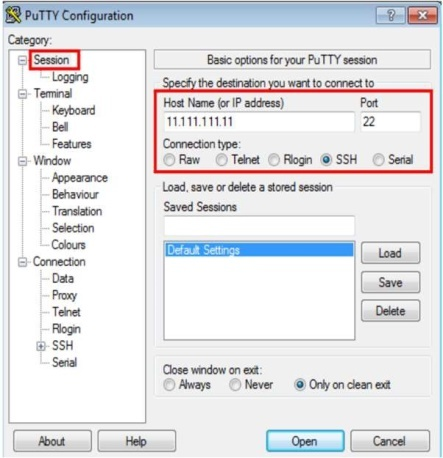
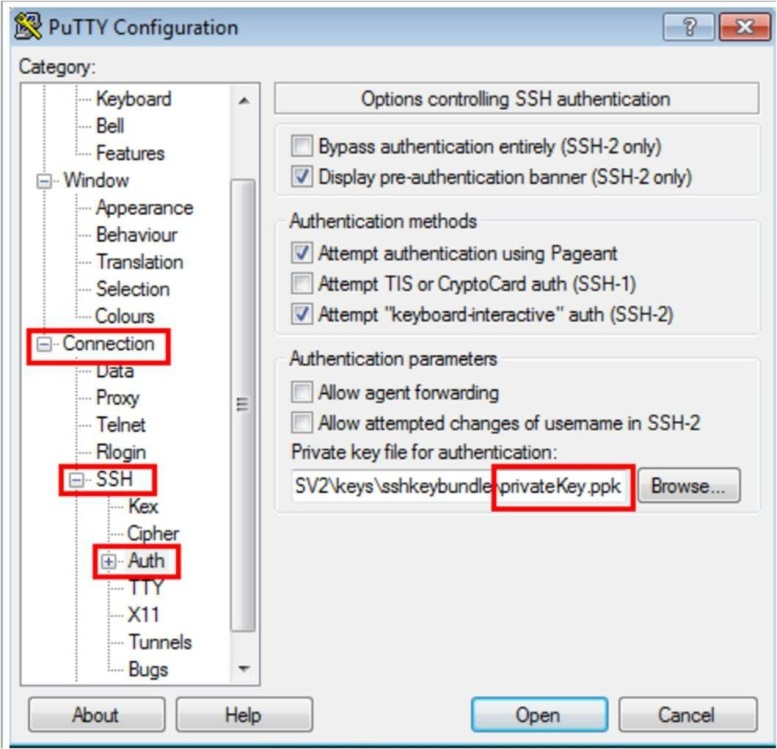
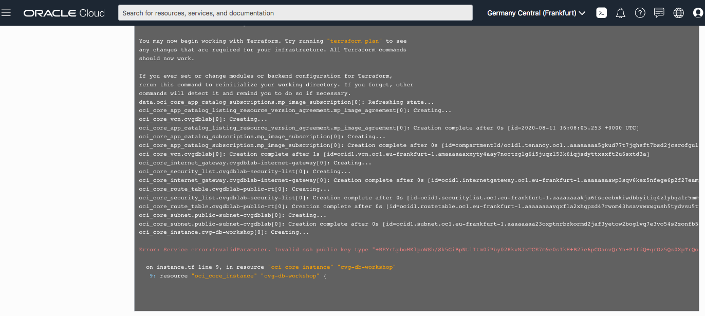

# Verify Compute Instance Setup

## Introduction
This lab will show you how to login to your pre-created compute instance running on Oracle Cloud.

*Estimated Lab Time*: 10 minutes

### Objectives
In this lab, you will:
* Connect to your compute instance

### Prerequisites

This lab assumes you have:
- A LiveLabs Cloud account and assigned compartment
- The IP address and instance name for your Compute instance
- Successfully logged into your LiveLabs account
- A Valid SSH Key

## **STEP 1**: Gather compute instance details
1. Go to the hamburger menu (in the top left corner) and click ***Compute >> Instances***.

   

2. Select the compartment that was assigned.
3. Look for the instance that was created for you jot down the public IP address.

   

## **Step 2:** Connect to your instance

### Oracle Cloud Shell

1. To re-start the Oracle Cloud shell, go to your Cloud console and click the cloud shell icon to the right of the region.  *Note: Make sure you are in the region you were assigned*

    

2.  Go to ***Compute >> Instances*** and select the instance you created (make sure you choose the correct compartment)
3.  On the instance homepage, find the Public IP address for your instance.
4.  Enter the command below to login to your instance.    
    ````
    ssh -i ~/.ssh/<sshkeyname> opc@<Your Compute Instance Public IP Address>
    ````

    

If you used the default RSA key name of **id_rsa** then use the following to connect as there's no need to explicitly specify the key.

````
ssh  opc@<Your Compute Instance Public IP Address>
````

5.  When prompted, answer **yes** to continue connecting.
6.  Continue to Step 5 on the left hand menu.

### MAC or Windows CYGWIN Emulator
1.  Go to ***Compute >> Instances*** and select the instance you created (make sure you choose the correct compartment)
2.  On the instance homepage, find the Public IP address for your instance.
3.  Open up a terminal (MAC) or cygwin emulator as the opc user.  Enter yes when prompted.

    ````
    ssh -i ~/.ssh/<sshkeyname> opc@<Your Compute Instance Public IP Address>
    ````
    

4.  After successfully logging in, proceed to Step 5.

### Windows using Putty

On Windows, you can use PuTTY as an SSH client. PuTTY enables Windows users to connect to remote systems over the internet using SSH and Telnet. SSH is supported in PuTTY, provides for a secure shell, and encrypts information before it's transferred.

1.  Download and install PuTTY. [http://www.putty.org](http://www.putty.org)
2.  Run the PuTTY program. On your computer, go to **All Programs > PuTTY > PuTTY**
3.  Select or enter the following information:
    - Category: _Session_
    - IP address: _Your service instance’s public IP address_
    - Port: _22_
    - Connection type: _SSH_

    

#### **Configuring Automatic Login**

1.  In the category section, **Click** Connection and then **Select** Data.

2.  Enter your auto-login username. Enter **opc**.

    

#### **Adding Your Private Key**

1.  In the category section, **Click** Auth.
2.  **Click** browse and find the private key file that matches your VM’s public key. This private key should have a .ppk extension for PuTTy to work.

    

#### **To save all your settings:**

1.  In the category section, **Click** session.
2.  In the saved sessions section, name your session, for example ( EM13C-ABC ) and **Click** Save.

You may now *proceed to the next lab*.

## Appendix: Troubleshooting Tips

If you encountered any issues during the lab, follow the steps below to resolve them.  If you are unable to resolve, please skip to the **See an Issue** section to submit your issue via our feedback form.
1. Can't login to instance
2. Invalid public key

### Issue 1: Can't login to instance
Participant is unable to login to instance

#### Tips for fixing Issue #1
There may be several reasons why you can't login to the instance.  Here are some common ones we've seen from workshop participants
- Incorrectly formatted ssh key (see above for fix)
- User chose to login from MAC Terminal, Putty, etc and the instance is being blocked by company VPN (shut down VPNs and try to access or use Cloud Shell)
- Incorrect name supplied for ssh key (Do not use sshkeyname, use the key name you provided)
- @ placed before opc user (Remove @ sign and login using the format above)
- Make sure you are the oracle user (type the command *whoami* to check, if not type *sudo su - oracle* to switch to the oracle user)
- Make sure the instance is running (type the command *ps -ef | grep oracle* to see if the oracle processes are running)


### Issue 2: Invalid public key


#### Issue #2 Description
When creating your SSH Key, if the key is invalid the compute instance stack creation will throw an error.

#### Tips for fixing for Issue #2
- Go back to the registration page, delete your registration and recreate it ensuring you create and **copy/paste** your *.pub key into the registration page correctly.
- Ensure you pasted the *.pub file into the window.

## Acknowledgements
- **Author** - Rene Fontcha, Master Principal Solutions Architect, NA Technology
- **Contributors** - Kay Malcolm, Product Manager, Database Product Management
- **Last Updated By/Date** - Rene Fontcha, Master Principal Solutions Architect, NA Technology, September 2020

## See an issue?
Please submit feedback using this [form](https://apexapps.oracle.com/pls/apex/f?p=133:1:::::P1_FEEDBACK:1). Please include the *workshop name*, *lab* and *step* in your request.  If you don't see the workshop name listed, please enter it manually. If you would like us to follow up with you, enter your email in the *Feedback Comments* section.
