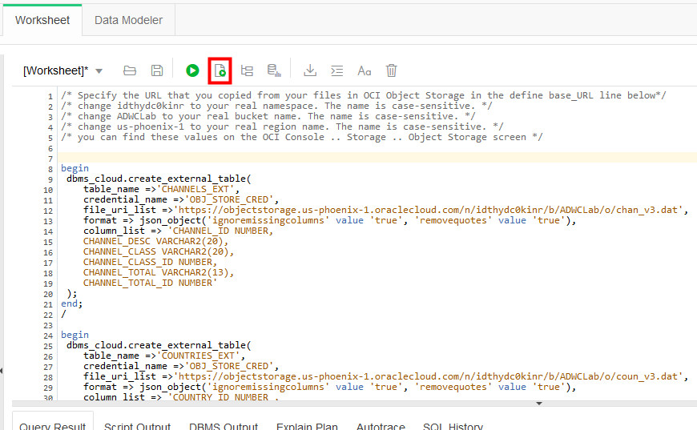
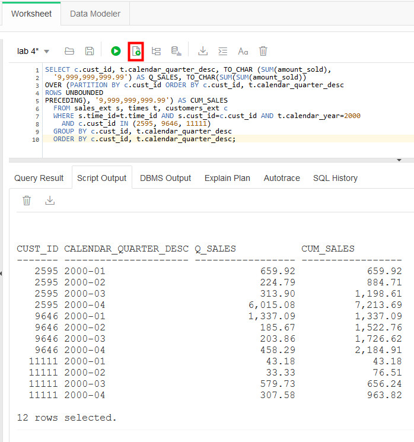

<!--September 21, 2018-->

# Querying Data in External Files

## Introduction

In this lab, you will be querying files on the Oracle Cloud Infrastructure Object Storage (OCI) directly without loading them to your database.

**Note:** Make sure you have completed Lab 3, **Loading Data into Your New Autonomous Database**, before you proceed with this lab. You will use the data files on the OCI Object Storage and the credential object from Lab 3 in this lab.

To **log issues**, click <a href="https://github.com/millerhoo/journey4-adwc/issues/new" target="\_blank"> here </a> to go to the github oracle repository issue submission form.

## Objectives

-   Learn how to create external tables on top of files residing on the object store

-   Learn how to query external data by the external tables

## Required Artifacts

-   The following lab requires an Oracle Cloud account. You may use your own cloud account, a cloud account that you obtained through a trial, or a training account whose details were given to you by an Oracle instructor.

## STEP 1: Create External Tables with DBMS_CLOUD

-   While connected as your user in SQL Developer Web, copy and paste <a href="./scripts/400/create_external_tables_without_base_url.txt" target="\_blank">this code snippet</a> to SQL Developer worksheet.  

    Use the **create\_external\_table** procedure of the **DBMS\_CLOUD** package to create external tables on the files staged in your object store. Note that you are still using the same credential and the URLs of files on OCI Object Storage you used when loading data in the previous lab.

<!--    -   At the top of the script, specify the Object Store base URL in the definition of the **base\_URL** variable. -->

-   For each **file\_uri\_list** statement, specify the Object Store base URL that you copied and saved in the step "Copy the URLs of the Files on Your OCI Object Storage" above.

    **Note:** In SQL Developer Web, you will soon be able to define the Object Store base URL once, to use as a variable in file\_uri\_list statements. This capability is already supported in the full Oracle SQL Developer client tool.

- Run the script.

    

    Now you have **external tables** for the sample data pointing to files in the object store. Any query against the external tables will return the same result as against the original tables.

## STEP 2: Querying External Data

-   Copy and paste <a href="./scripts/400/query_external_data.txt" target="\_blank">this code snippet</a> to a SQL Developer Web worksheet. Compared to the query in the previous lab, we only replaced the original table names **TABLE\_NAME** with **TABLE\_NAME\_EXT** in the sample query.  

-   **Run the script**. You will now see the same query result as in the previous lab, but from data pulled directly from the Object Store.

    

<table>
<tr><td class="td-logo"></td>
<td class="td-banner">
## Great Work - All Done!
**You are ready to move on to the next lab. You may now close this tab.**
</td>
</tr>
<table>
