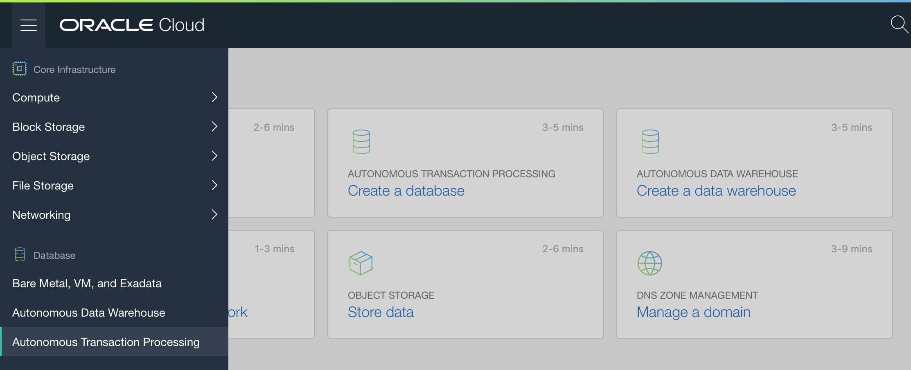
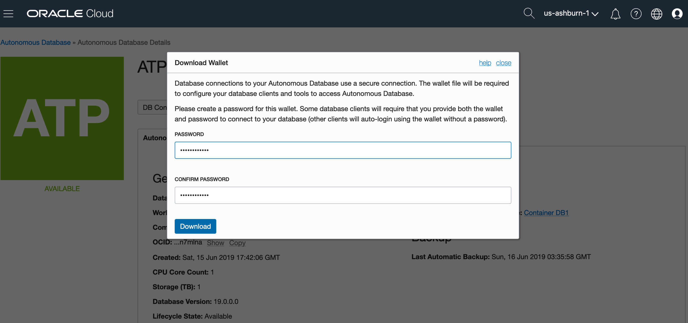

# Building and deploying Python application stacks on dedicated autonomous infrastructure

## Introduction
The Oracle Cloud Infrastructure marketplace provides a pre-built image with necessary client tools and drivers to build applications on autonomous databases. As an application developer you can now provision a developer image within minutes and connect it to your dedicated or serverless database deployment. 

The image is pre-configured with tools and language drivers to help you build applications written in node.js, python, java and golang.
For a complete list of features, login to your OCI account, select 'Marketplace' from the top left menu and browse details on the 'Oracle Developer Cloud Image'.

*In this lab we will configure and deploy a python application in a developer client VM and connect it to an autonomous database.*

### Objectives

As an application developer,

1. Learn how to deploy a python application and connect it to your dedicated autonomous database instance.
   

### Required Artifacts

   - An Oracle Cloud Infrastructure account.
   - A pre-provisioned instance of Oracle Developer Client image in an application subnet. Refer to [Lab 6](?lab=lab-6-configuring-vpn-into-private-atp).
   - A pre-provisioned dedicated autonomous database instance. Refer to [Lab 4](?lab=lab-4-provisioning-databases).
   - A network that provides connectivity between the application and database subnets. Refer to [Lab 1](?lab=lab-1-prepare-private-network).


## STEP 1: Instances Setup

- Login to your Oracle Cloud Infrastructure account and select *Compute* —> *Instances* from top left menu.
    

- Select the right Oracle Developer Cloud image you created in [Lab 5](?lab=lab-5-configuring-development-system).

- Copy the public IP address of the instance in a note pad. 
    

**Mac / Linux users**

- Open Terminal and SSH into linux host machine.

    ```
    <copy>
    sudo ssh -i /path_to/sshkeys/id_rsa opc@publicIP
    </copy>
    ```

    

**Windows users**

- You can connect to and manage linux host mahine using SSH client. Recent versions of Windows 10 provide OpenSSH client commands to create and manage SSH keys and make SSH connections from a command prompt.

- Other common Windows SSH clients you can install locally is PuTTY. Click [here](https://docs.microsoft.com/en-us/azure/virtual-machines/linux/ssh-from-windows) to follow the steps to connect to linux host machine from you windows using PuTTY.

## STEP 2: Download sample python application

- In your developer client ssh session,

    ```
    <copy>
    cd /home/opc/
    </copy>
    ```

- Lets download a sample python application for the purpose of this lab,

    ```
    <copy>
    wget --no-check-certificate --content-disposition https://github.com/oracle/learning-library/blob/master/data-management-library/autonomous-transaction-processing/dedicated/scripts/700/ATPDpython.zip?raw=true
    </copy>
    ```

- Unzip the application. 

    ```
    <copy>
    unzip ATPDpython.zip
    </copy>
    ```


## STEP 3: Transfer database wallet to developer client

- Login to Oracle Cloud Infrastructure account and select *Autonomous Transaction Processing* from menu.
    

- Click on Autonomous Database and select your previously created database.
    

- Click on DB Connection and under Download Client Credential(Wallet) click *Download*.
    

- Provide a password and download the wallet to a local folder. 
    

    The credentials zip file contains the encryption wallet, Java keystore and other relevant files to make a secure TLS 1.2 connection to your database from client applications. Store this file in a secure location.

    Let us now secure copy the downloaded wallet to developer client machine.

- Open Terminal in your laptop and type in the following commands

    *Note: Please change path and name of your private ssh keyhole,  wallet and the ip address of your developer client in the command below.*

    ```
    <copy>
    sudo scp -i /Path/to/your/private_ssh_key /Path/to/your/downloaded_wallet opc@publicIP:/home/opc/
    </copy>
    ```

    


## STEP 4: Run your python application

Now that you have successfully SCP'd the encryption to your client machine, let's connect to our linux host, unzip the wallet and update sqlnet.ora file to point to the wallet folder.

- Open terminal on your laptop and SSH into linux host machine. Windows users follows instructions provided above to ssh using Putty.

    ```
    <copy>
    ssh -i /path/to/your/private_ssh_key opc@PublicIP
    </copy>
    ```

- Create a new directory for wallet and unzip the wallet.

    ```
    <copy>
    cd /home/opc/ATPDpython/

    mkdir wallet

    unzip Wallet_ATPDedicatedDB.zip -d /home/opc/ATPDpython/wallet/
    </copy>
    ```

- The sqlnet.ora file in the wallet folder needs to be edited to point to the location of the wallet as shown below.

    ```
    <copy>
    vi /home/opc/ATPDpython/wallet/sqlnet.ora
    </copy>
    ```

- Change *DIRECTORY* path to /home/opc/ATPDpython/wallet/ and save the file.
    

- Export TNS_ADMIN

    ```
    <copy>
    export TNS_ADMIN=/home/opc/ATPDpython/wallet/
    </copy>
    ```

- Verify TNS_ADMIN points to the wallet folder.

    ```
    <copy>
    echo $TNS_ADMIN
    </copy>
    ```
    

- That's all! Lets fire up our python app and see if it makes a connection to the database.

    ```
    <copy>
    python exampleConnection.py ADMIN PASSWORD dbname_tp
    </copy>
    ```
    

## Acknowledgements

*Congratulations! You successfully deployed and connected a python app to your autonomous database.*

- **Author** - Tejus S. & Kris Bhanushali
- **Adapted by** -  Yaisah Granillo, Cloud Solution Engineer
- **Last Updated By/Date** - Yaisah Granillo, March 2020

See an issue?  Please open up a request [here](https://github.com/oracle/learning-library/issues).