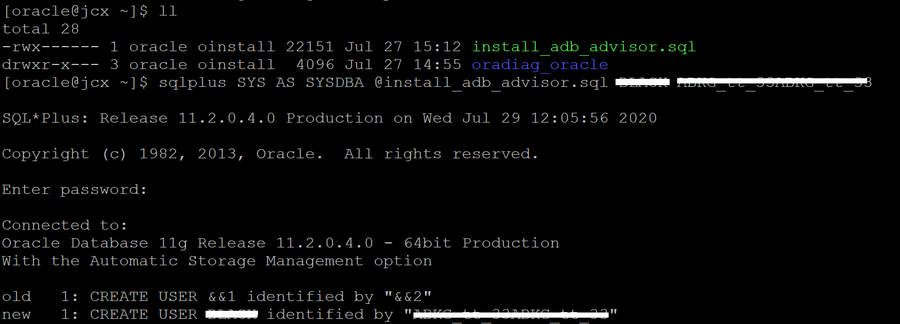
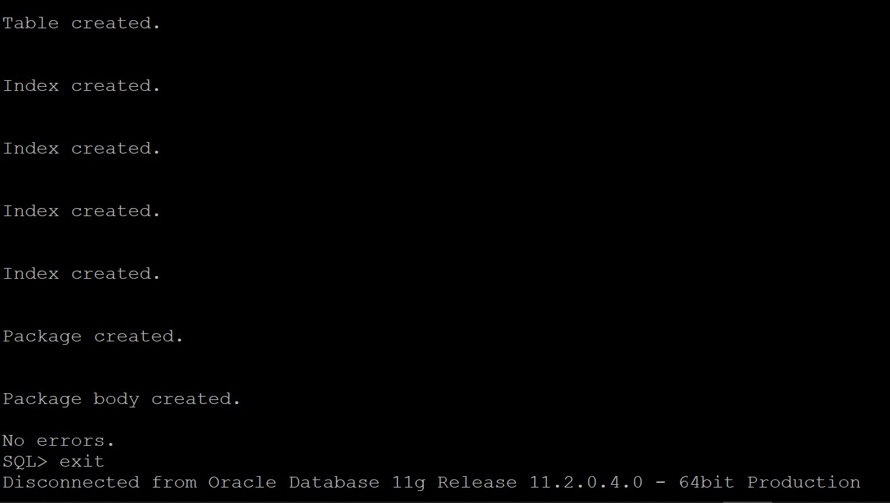
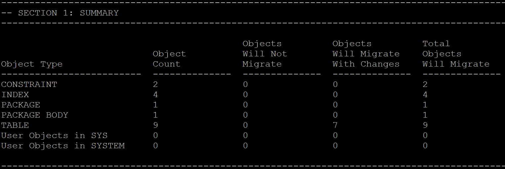

# ADB Schema Advisor
## Introduction
The Autonomous Database Schema Advisor assists in discovering the database schema objects prior to performing the actual migration. The Advisor analyzes an existing schema in your database and examines the types and structures of objects within it, and generates a report highlighting: 
- Summary of schema objects that will migrate/not migrate to ADB
- List of schema objects that will not migrate to ADB (due to the lockdown profile)
- List of objects that will migrate with changes (due to transformations)

*Note: The Advisor is supported on Oracle Database versions 10.2, 11g, 12c, 18c and 19c. Currently there is no license required to download and run the Advisor.*

### Objectives

As a LOB user
1. Download and install the ADB Schema Advisor.
2. Generate the Advisor report on a Database Schema.
3. Analyze the Advisor Report.

### Required Artifacts

- A pre-provisioned source database instance. (Above Oracle Version 10.2)
- A precreated Source DB user with DBA privileges or SYS User.

## STEP 1: Download and Install the ADW Schema Advisor

- Download the Schema Advisor installer SQL file from the [MOS Note 2462677.1](https://support.oracle.com/epmos/faces/DocumentDisplay?_afrLoop=277447597426018&parent=EXTERNAL_SEARCH&sourceId=BULLETIN&id=2462677.1&_afrWindowMode=0&_adf.ctrl-state=14ax6bm2am_4)

- Run the downloaded SQL script using SQL*Plus, connecting as the SYS user.

    ```
    <copy>
    sqlplus SYS AS SYSDBA @install_adb_advisor.sql <ADB_ADVISOR_Schema> "<Password>"
    </copy>
    ```
   
  
- Before proceeding, verify that you see “No errors” displayed as the last output.
   

*Note: The above step will create the ADB Advisor schema with the supplied password. If the schema already exists, the above script will ignore “user name conflicts with another user or role” message and continue the installation.*
  
## STEP 2: Generate the Advisor report on a Database Schema

- Start a SQL*Plus session as the ADB Advisor Schema owner and setup the SQL*Plus environment.

    ```
    <copy>
    CONNECT <ADB_ADVISOR_Schema>/<password>
    SET SERVEROUTPUT ON FORMAT WRAPPED
    SET LINES 200
    </copy>
    ```
   
  
- Generate the Advisor report by executing ADB_ADVISOR package.

    ```
    <copy>
    EXEC ADB_ADVISOR.REPORT(schemas=>'<List of Schemas>', adb_type=>'<adb_type>');
    </copy>
    ```
   
  
*Note : Where <List of Schemas> is a comma separated list of Schemas that you like to analyze; or specify ‘ALL’ to analyze all user schemas.
Where <adb_type> is one of the following migration destinations:*
    
    1. ATP for Autonomous Transaction Processing (Serverless)
    2. ADW for Autonomous Data Warehouse (Serverless)
    3. ATPD for Autonomous Transaction Processing (Dedicated)
    4. ADWD for Autonomous Data Warehouse (Dedicated)
    
*You may specify a maximum of 30 schemas in a single advisor run. If you like to run more than 30, consider running using schemas=>’ALL’.*
    
## STEP 3: Analyze the Advisor Report

The report has 4 sections (see Sample Report for ATP-D): 

 • Section 1: Summary Section with object counts 
   
  
 • Section 2: List of objects that will not migrate to ADB 
   
  
 • Section 3: List of objects that will migrate with changes
   
  
 • Section 4: Informational section and migration guidelines
   

*Note: You can see the following section at the end of the report.*
  
  
## De-installing the Advisor 
If you wish to de-install the Advisor, execute the following command using a privileged user: 

    ```
    <copy>
    SQL> DROP USER ADB_ADVISOR CASADE;
    </copy>
    ```

## Acknowledgements

*Great Work! You have successfully installed ADB schema Advisor on your source database to help analyse your workload better.*

- **Author** - Padma Priya Rajan, Navya M S & Jayshree Chatterjee
- **Last Updated By/Date** - Jayshree Chatterjee, July 2020


## Need Help?
Please submit feedback or ask for help using our [LiveLabs Support Forum](https://community.oracle.com/tech/developers/categories/autonomous-database-dedicated). Please click the **Log In** button and login using your Oracle Account. Click the **Ask A Question** button to the left to start a *New Discussion* or *Ask a Question*.  Please include your workshop name and lab name.  You can also include screenshots and attach files.  Engage directly with the author of the workshop.

If you do not have an Oracle Account, click [here](https://profile.oracle.com/myprofile/account/create-account.jspx) to create one.
