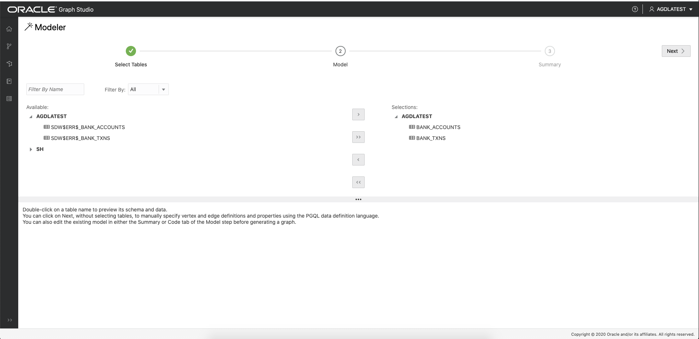
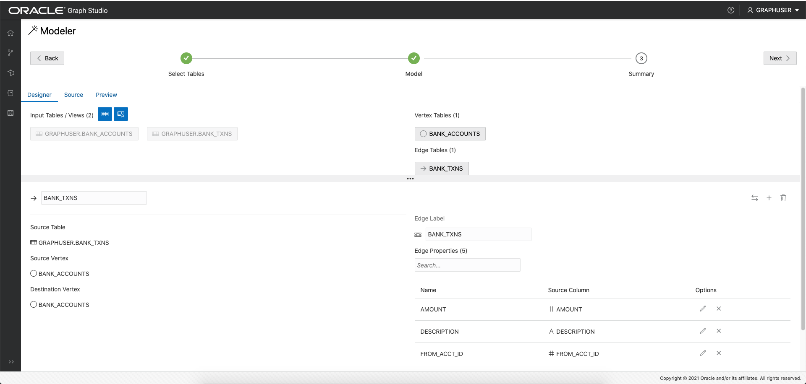
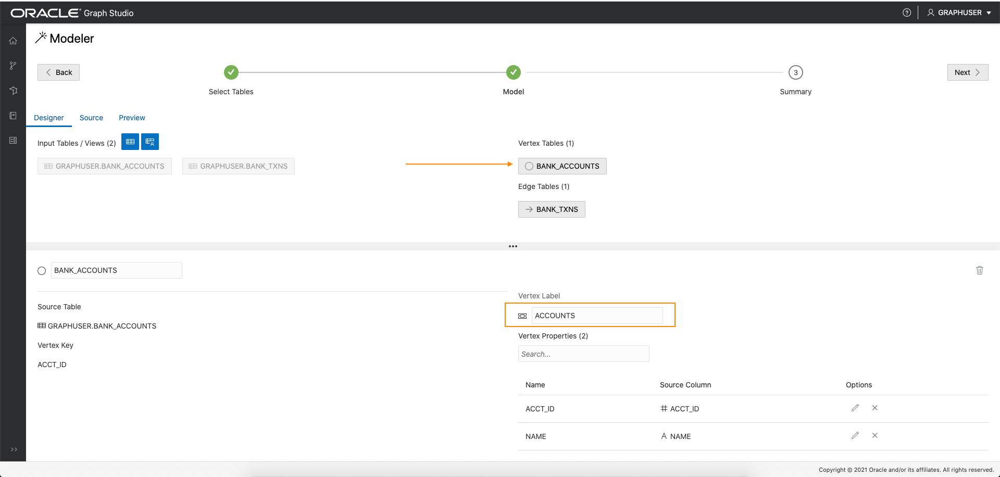
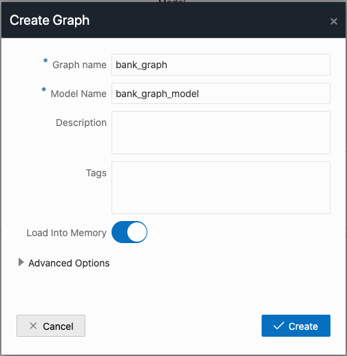

# Graph Studio: Create a graph using PGQL CREATE PROPERTY GRAPH statement

## Introduction

In this lab you will create a graph from the `bank_accounts` and `bank_txns` tables using Graph Studio and the CREATE PROPERTY GRAPH statement.

The following video shows the steps you will execute in this lab.

[](youtube:5g9i9HA_cn0) Graph Studio: Create a graph.

Estimated Lab Time: 15 minutes. 

### Objectives

Learn how to
- use Graph Studio and PGQL DDL (i.e. CREATE PROPERTY GRAPH statement) to model and create a graph from existing tables or views.

### Prerequisites

- The following lab requires an Autonomous Database - Shared Infrastructure account. 
- And that the Graph-enabled user (`GRAPHUSER`) has been created. That is, a database user with the correct roles and privileges exists.

## **STEP 1**: Connect to your Autonomous Database using Graph Studio

1. If you have the Graph Studio URL then proceed to step 4. 

    Log in to the OCI Console, choose the Autonomous Database instance, then click on the Tools tab on the details page menu on the left. 

   


2. Click on the Graph Studio card to open in a new page or tab in your browser.   
   
   If your tenancy administrator provided you the Graph Studio URL to connect directly then use that instead.


3. Enter your Autonomous Database account credentials (e.g. `GRAPHUSER`) into the login screen:
 
    

4. Then click the "Sign In" button. You should see the studio home page.   

     

    Graph Studio consists of a set of pages accessed from the menu on the left. 

    The Home icon  takes you to the Home page you see above.  
    The Models icon  takes you to the Models page where you start modeling your existing tables and views as a graph and then create, or instanstiate, a graph.  
    The Graph page  lists existing graphs which can be used in notebooks.  
    The Notebook page  lists existing notebooks and lets you create a new one.  
    The Jobs page  lists the status of background jobs and lets you view the associated log if any.  


## **STEP 2**: Create a graph of accounts and transactions from the corresponding tables

1. Click on the Models icon to navigate to the start of the modeling workflow.  
   Then click on `Create`.  
     

   **Note: If you clicked on `Start Modeling` button instead then you'll see the screen shown in the next step.**

2. Then select the `BANK_ACCOUNTS` and `BANK_TXNS` tables.   


2. Move them to the right, i.e. click the first icon on the shuttle control.   

   

3.  Click `next` to get a suggested model. We will edit and update this model to add an edge and a vertex label.  

    The suggested model has the `BANK_ACCOUNTS` as a vertex table since there are foreign key constraints specified on `BANK_TXNS` that reference it.   

    And `BANK_TXNS` is a suggested edge table.

      
  

4.  Now let's modify the default Vertex and Edge labels.  

    Click on the `BANK_ACCOUNTS` vertex table. Change the label to `ACCOUNTS`. Then click outside the input box to save the update.  

      

    Click the `BANK_TXNS` edge table and change the label from `BANK_TXNS' to `TRANSFERS`.  
    Then click outside the input box to save the update.  

      

    This is **important** because we will use these edge labels in the next lab of this workshop when querying the graph.  

5.  Since the edges are directed, a best practice is verifying that the direction is correct.  
    In this instance we want to **confirm** that the direction is from `from_acct_id` to `to_acct_id`.  

  Click the Source tab to bring up the existing statement and the edit dialog.  
     

  **Notice** that the direction is incorrect. The Source Key is `to_acct_id` instead of what we want, which is `from_acct_id`. 

6. Click the `Designer` tab to go back to the model design page.  

   Now select the `BANK_TXNS` edge table, then click on the swap edge icon  
     
   to change the edge direction.  

     


   Click the `Source` to verify that the edge direction, and hence the generated CREATE PROPERTY GRAPH statement, is correct.  

   
  

  **An alternate approach:** In the previous step 5 you could have just updated the CREATE PROPERTY GRAPH statement and saved the updates. That is, you could have just replaced the existing statement with the following one which specifies that the SOURCE KEY is  `from_acct_id`  and the DESTINATION KEY is `to_acct_id`.  

    ```
    -- This is not required if you used swap edge in UI to fix the edge direction.
    -- This is only to illustrate an alternate approach.
    <copy>
    CREATE PROPERTY GRAPH bank_graph
        VERTEX TABLES (
            BANK_ACCOUNTS as ACCOUNTS 
            KEY (ACCT_ID) 
            LABEL ACCOUNTS
            PROPERTIES (ACCT_ID, NAME)
        )
        EDGE TABLES (
            BANK_TXNS 
            KEY (FROM_ACCT_ID, TO_ACCT_ID, AMOUNT)
            SOURCE KEY (FROM_ACCT_ID) REFERENCES ACCOUNTS
            DESTINATION KEY (TO_ACCT_ID) REFERENCES ACCOUNTS
            LABEL TRANSFERS
            PROPERTIES (AMOUNT, DESCRIPTION)
        )
    </copy>
    ```

     

   **Important:** Click the **Save** (floppy disk icon) to commit the changes.


7. Click `Next` and then click `Create Graph` to move on to the next step in the flow.   

   Enter `bank_graph` as the graph name.  
   That graph name is used throughout the next lab.  Do not enter a different name because then the queries and code snippets in the next lab will fail.  
   
   Enter a model name (e.g. `bank_graph_model`), and other optional information.  
   

8. Graph Studio modeler will now save the metadata and start a job to create the graph.  
   The Jobs page shows the status of this job. 

     

   Once the graph has been created and loaded into memory, you can query and visualize it in a notebook.


Please **proceed to the next lab** to do so.

## Acknowledgements
* **Author** - Jayant Sharma, Product Management
* **Contributors** -  Jayant Sharma, Product Management
* **Last Updated By/Date** - Jayant Sharma, May 2021
  
