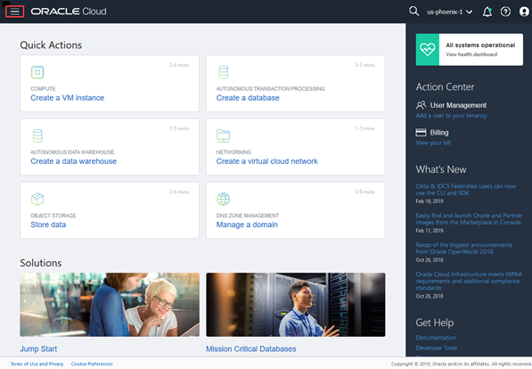
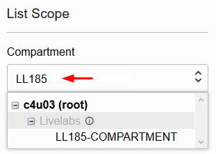

# Provisioning Autonomous Database (ATP and ATP)

## Introduction

This lab walks you through the steps to get started using the Oracle Autonomous Database on Oracle Cloud. You will provision a new <if type="atp">ATP</if><if type="adw">ADW</if> instance and connect to the database using Oracle SQL Developer Web.

*Note: While this lab uses <if type="atp">ATP</if> <if type="adw">ADW</if>, the steps are identical for creating and connecting to any other kind of ADB database.*

Estimated time: 5 minutes

### Objectives
-   Learn how to provision a new Autonomous Database

### Prerequisites
* An Oracle Always Free/Free Tier, Paid or LiveLabs Cloud Account

### Video Preview

Watch a video demonstration of provisioning a new <if type="atp">Autonomous Transaction Processing</if> <if type="adw">Autonomous Data Warehouse</if> instance:

*Note: Interfaces in this video may look different from the interfaces you will see. For updated information, please see steps below.*

## **STEP 1**: Choosing ADB from the Services Menu

1. Login to the Oracle Cloud, as shown in the previous lab.
2. Once you are logged in, you are taken to the cloud services dashboard where you can see all the services available to you. Click the navigation menu in the upper left to show top level navigation choices.

    __Note:__ You can also directly access your <if type="atp">Autonomous Transaction Processing</if> <if type="adw">Autonomous Data Warehouse</if>   service in the __Quick Actions__ section of the dashboard.

    

3. The following steps apply similarly to either <if type="atp">Autonomous Transaction Processing</if> <if type="adw">Autonomous Data Warehouse</if>  . This lab shows provisioning of an <if type="atp">Autonomous Transaction Processing</if> <if type="adw">Autonomous Data Warehouse</if>   database, so click **<if type="atp">Autonomous Transaction Processing</if> <if type="adw">Autonomous Data Warehouse</if>  **.

    

4. Make sure your workload type is __Data Warehouse__ or __All__ to see your <if type="atp">Autonomous Transaction Processing</if> <if type="adw">Autonomous Data Warehouse</if> instances. Use the __List Scope__ drop-down menu to select a compartment. If you are using a LiveLabs environment, be sure to select the compartment provided by the environment.

    

   *Note: Avoid the use of the ManagedCompartmentforPaaS compartment as this is an Oracle default used for Oracle Platform Services.*

5. This console shows that no databases yet exist. If there were a long list of databases, you could filter the list by the **State** of the databases (Available, Stopped, Terminated, and so on). You can also sort by __Workload Type__. Here, the __<if type="atp">Transaction</if> <if type="adw">Data Warehouse</if>__ workload type is selected.

    

6. If you are using a Free Trial or Always Free account, and you want to use Always Free Resources, you need to be in a region where Always Free Resources are available. You can see your current default **region** in the top, right hand corner of the page.

    

## **STEP 2**: Creating the ADB instance

1. Click **Create Autonomous Database** to start the instance creation process.

    

2.  This brings up the __Create Autonomous Database__ screen where you will specify the configuration of the instance.
3. Provide basic information for the autonomous database:

    - __Choose a compartment__ - Select a compartment for the database from the drop-down list.
    - __Display Name__ - *adb1*
    - __Database Name__ - *adb1*

    

4. Choose the workload type:  ATP. 

    

5. Choose the deployment type: Shared Infrastructure. Select the deployment type for your database from the choices:

    - __Shared Infrastructure__ - For this lab, choose __Shared Infrastructure__ as the deployment type.
    - __Dedicated Infrastructure__ - Alternatively, you could have chosen Dedicated Infrastructure as the deployment type.

    

6. Configure the database:

    - __Always Free__ - An always free database comes with 1 CPU and 20 GB of storage. For this lab, we recommend you leave Always Free unchecked.
    - __Choose database version__ - <if type="atp">21c</if><if type="adw">19c</if>

    *Note: You cannot scale up/down an Always Free autonomous database.*
    <if type="atp">
    * Note 2: 21c is only available with Always Free*
     
    </if>
    

7. Create administrator credentials:

    - __Password and Confirm Password__ - WElcome123##

    *Note: This password will be used multiple times throughout this lab.*

    
8. Choose network access:
    - For this lab, accept the default, "Allow secure access from everywhere".
    - If you want a private endpoint, to allow traffic only from the VCN you specify - where access to the database from all public IPs or VCNs is blocked, then select "Virtual cloud network" in the Choose network access area.
    - You can control and restrict access to your Autonomous Database by setting network access control lists (ACLs). You can select from 4 IP notation types: IP Address, CIDR Block, Virtual Cloud Network, Virtual Cloud Network OCID).

    

9. Choose a license type. For this lab, choose __License Included__. The two license types are:

    - __Bring Your Own License (BYOL)__ - Select this type when your organization has existing database licenses.
    - __License Included__ - Select this type when you want to subscribe to new database software licenses and the database cloud service.

10. Click __Create Autonomous Database__.

    

11.  Your instance will begin provisioning. In a few minutes, the state will turn from Provisioning to Available. At this point, your <if type="atp">Autonomous Transaction Processing</if> <if type="adw">Autonomous Data Warehouse</if> database is ready to use! Have a look at your instance's details here including its name, database version, OCPU count, and storage size.

    

Please *proceed to the next lab*.

## Want to Learn More?

- [ADB Typical Workflow](https://docs.oracle.com/en/cloud/paas/autonomous-data-warehouse-cloud/user/autonomous-workflow.html#GUID-5780368D-6D40-475C-8DEB-DBA14BA675C3)

## **Acknowledgements**

- **Author** - Nilay Panchal, ADB Product Management
- **Adapted for Cloud by** - Richard Green, Principal Developer, Database User Assistance
- **Contributors** - Jeffrey Malcolm Jr, Arabella Yao, Kay Malcolm, Richard Green
- **Last Updated By/Date** - Kay Malcolm, March 2020
