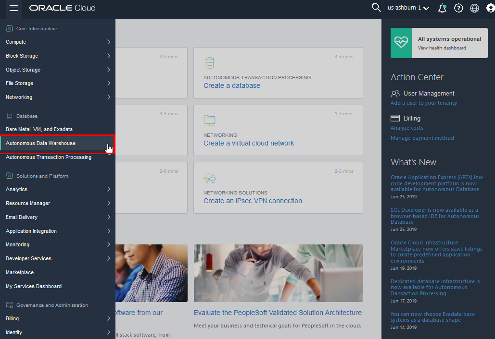
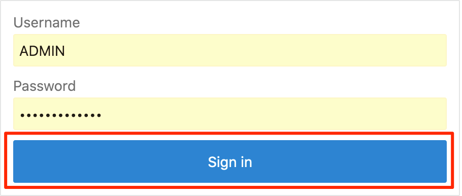
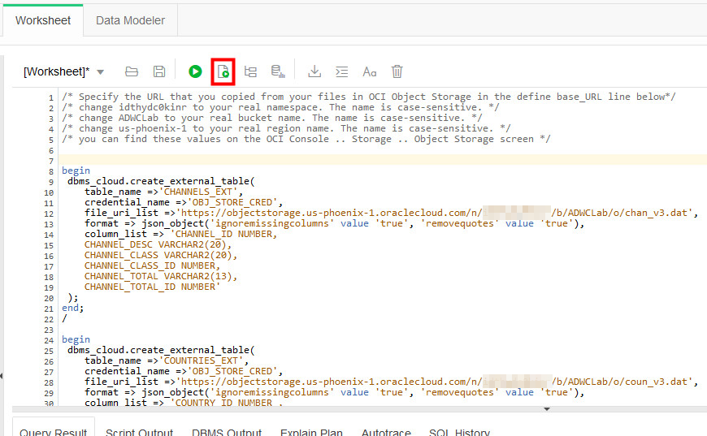

# Query Data in External Files

## **Introduction**

In this lab, you will query files on the Oracle Cloud Infrastructure (OCI) Object Storage directly without loading them to your database.

### Objectives

-   Learn how to create external tables on top of files residing on the object store
-   Learn how to query external data by the external tables

### Lab Prerequisites

- The following lab requires an <a href="https://www.oracle.com/cloud/free/" target="\_blank">Oracle Cloud account</a>. You may use your own cloud account, a cloud account that you obtained through a trial, a LiveLabs account or a training account whose details were given to you by an Oracle instructor.
- This lab assumes you have completed the **Prerequisites** and **Lab 1** seen in the Contents menu on the right.
- Make sure you have completed the previous lab in the Contents menu on the right, *Loading Data*, before you proceed with this lab. In Loading Data, you created data files on the OCI Object Storage and you created the credential object, all of which you will use in this lab.

## **STEP 1**: Create External Tables with DBMS_CLOUD

1.  If you are not logged in to Oracle Cloud Console, login and select Autonomous Data Warehouse from the hamburger menu and navigate into your ADW Finance Mart instance.

    

    

2.  To login to SQL Developer Web, in your ADW Finance Mart Database Details page, click the **Tools** tab and then click on **Open SQL Developer Web**. Enter **Username - ADMIN** and with the ADMIN **Password** you specified when creating the database and click **Sign in**.

    

    

    

3. Download <a href="./files/create_external_tables_without_base_url.txt" target="\_blank">this code snippet</a> to a text editor.

4. Replace `<file_uri_base>` in the code with the base URL you copied in Loading Data Lab, Step 6. You should make 9 substitutions.

    This code uses the **create\_external\_table** procedure of the **DBMS\_CLOUD** package to create external tables on the files staged in your object store. Note that you are still using the same credential and URLs of files on OCI Object Storage you used when loading data in Loading Data Lab.

    For each `<file_uri_list>` statement:
        
    - Change `us-phoenix-1` to your real region name. The name is case-sensitive.
    - Change `idthydc0kinr` to your real namespace. The name is case-sensitive.
    - Change `ADWCLab` to your real bucket name. The name is case-sensitive.

    

5.  Run the script. In the Substitutions Variables dialog, paste the base URL you copied in Loading Data Lab, Step 6, and click **OK**.

  

  

    Now you have **external tables** for the sample data pointing to files in the object store. Any query against the external tables will return the same result as against the original tables.

    

## **STEP 2**: Querying External Data

1.  Copy and paste <a href="./files/query_external_data.txt" target="\_blank">this code snippet</a> to a SQL Developer Web Worksheet. Compared to the query in the previous lab, we only replaced the original table names **table\_name** with **table\_name\_ext** in the sample query.

2.  Run the script. You will now see the same query result as in the previous lab, but from data pulled directly from the Object Store.

    

Please *proceed to the next lab*.

## Want to Learn More?

For more information about querying external data, see the documentation [Querying External Data with Autonomous Data Warehouse](https://docs.oracle.com/en/cloud/paas/autonomous-data-warehouse-cloud/user/query-external.html#GUID-ABF95242-3E04-42FF-9361-52707D14E833).

## **Acknowledgements**

- **Author** - Nilay Panchal, ADB Product Management
- **Adapted for Cloud by** - Richard Green, Principal Developer, Database User Assistance
- **Last Updated By/Date** - Arabella Yao, Product Manager Intern, DB Product Management, July 2020

## See an issue?
Please submit feedback using this [form](https://apexapps.oracle.com/pls/apex/f?p=133:1:::::P1_FEEDBACK:1). Please include the *workshop name*, *lab* and *step* in your request.  If you don't see the workshop name listed, please enter it manually. If you would like for us to follow up with you, enter your email in the *Feedback Comments* section.
