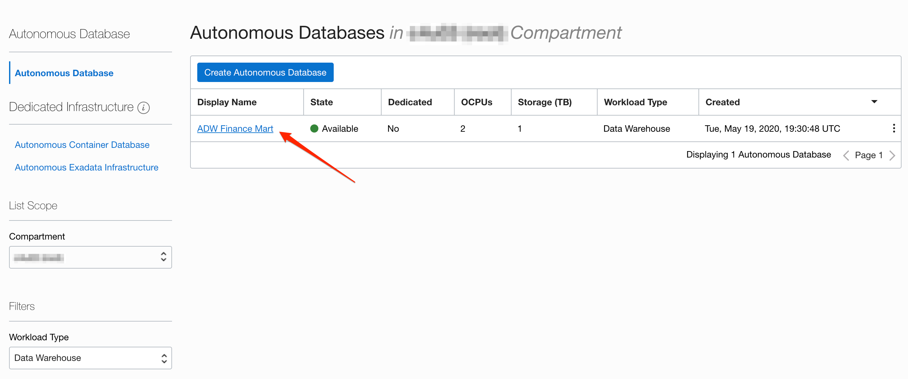
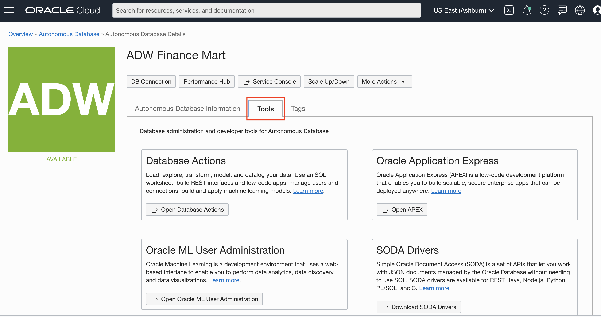
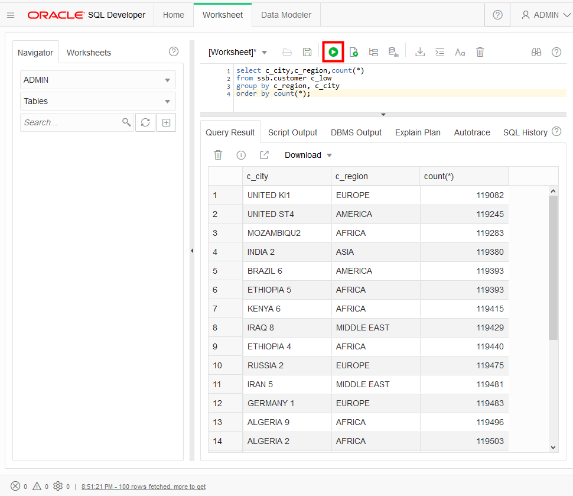

# Connect to ADB with SQL Developer Web and Run Your First Query

## Introduction

In this lab, you will explore the provided sample data sets that come with your Autonomous Data Warehouse (ADW) or Autonomous Transaction Processing (ATP) instance using SQL Developer Web.

### Before You Begin

This lab uses SQL Developer Web, which currently connects only with the LOW database service level. For performance or for a higher degree of parallelism, you can use Oracle SQL Developer, as described in another lab in this series.

This lab will demo queries on sample data sets provided out of the box with ADW. ADW provides the Oracle Sales History sample schema and the Star Schema Benchmark (SSB) data set; these data sets are in the SH and SSB schemas, respectively.

You will run a basic query on the SSB data set which is a 1TB data set with one fact table with around 6 billion rows, and several dimension tables.

*Note: While this lab uses ADW, the steps are identical for creating and connecting to an ATP database.*

### Objectives

- Learn how to connect to your new Autonomous Database using SQL Developer Web
- Learn about the Star Schema Benchmark (SSB) and Sales History (SH) sample data sets
- Run a query on an ADW sample dataset

### Prerequisites

- The following lab requires an <a href="https://www.oracle.com/cloud/free/" target="\_blank">Oracle Cloud Account</a>. You may use your own cloud account, a cloud account that you obtained through a trial, a LiveLabs account, or a training account whose details were given to you by an Oracle instructor.
- This lab assumes you have completed the **Prerequisites** and **Lab 1** seen in the Contents menu on the right.

## **STEP 1**: Connect with SQL Developer Web

Although you can connect to your autonomous database using local PC desktop tools like Oracle SQL Developer, you can conveniently access the browser-based SQL Developer Web directly from your ADW or ATP console.

1.  If you are not logged in to Oracle Cloud Console, login and select Autonomous Data Warehouse from the hamburger menu and navigate into your ADW Finance Mart instance.

    

    

2. In your ADW Finance Mart database's details page, click the **Tools** tab.

    

3.  The Tools page provides you access to SQL Developer Web, Oracle Application Express, Oracle ML User Administration, etc. In the SQL Developer Web box, click **Open SQL Developer Web**.

    

4.  A sign-in page opens for the SQL Developer Web. For this lab, simply use your database instance's default administrator account, **Username - ADMIN**, and with the admin **Password** you specified when creating the database. Click **Sign in**.

    

5.  SQL Developer Web opens on a worksheet tab. The first time you open the SQL Developer Web, a series of pop-up informational boxes introduce you to the main features.

    

## **STEP 2**: Run Scripts in SQL Developer Web

Run a Query on a Sample Autonomous Database Dataset.

1.  Copy and paste the code snippet below to your SQL Developer Web worksheet. This query will run on the Star Schema Benchmark (ssb.customer), one of the two ADW sample data sets that may be accessed from any ADW instance. Take a moment to examine the script. Make sure you click the **Run Statement** button to run it in the SQL Developer Web so that all the rows are displayed on the screen.

    ````
    <copy>
    select /* low */ c_city,c_region,count(*)
    from ssb.customer c_low
    group by c_region, c_city
    order by count(*);
    </copy>
    ````

    

2.  Take a look at the output response from your Autonomous Data Warehouse.

3.  When possible, ADW also *caches* the results of a query for you. If you run identical queries more than once, you will notice a much lesser response time when your results have been cached.

4.  You can find more sample queries to run in the ADW documentation. Try some of the queries from the ADW Documentation <a href="https://docs.oracle.com/en/cloud/paas/autonomous-data-warehouse-cloud/user/sample-queries.html" target="\_blank">here</a>.

Please *proceed to the next lab*.

## Want to Learn More?

Click [here](https://docs.oracle.com/en/cloud/paas/autonomous-data-warehouse-cloud/user/sql-developer-web.html#GUID-102845D9-6855-4944-8937-5C688939610F) for documentation on connecting with the built-in SQL Developer Web.

## **Acknowledgements**

- **Author** - Nilay Panchal, ADB Product Management
- **Adapted for Cloud by** - Richard Green, Principal Developer, Database User Assistance
- **Contributors** - Oracle LiveLabs QA Team (Arabella Yao, Product Manager Intern | Ayden Smith, QA Intern)
- **Last Updated By/Date** - Arabella Yao, July 2020

## See an issue?
Please submit feedback using this [form](https://apexapps.oracle.com/pls/apex/f?p=133:1:::::P1_FEEDBACK:1). Please include the *workshop name*, *lab* and *step* in your request.  If you don't see the workshop name listed, please enter it manually. If you would like us to follow up with you, enter your email in the *Feedback Comments* section.
