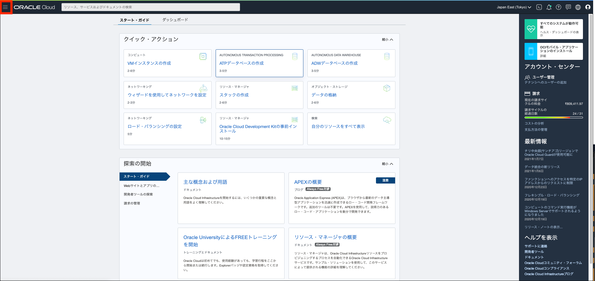
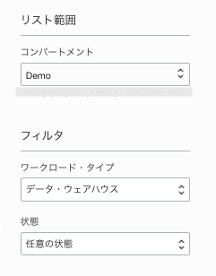
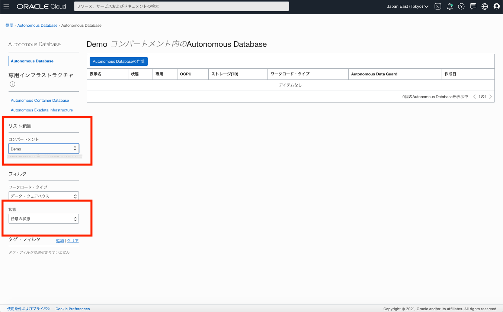
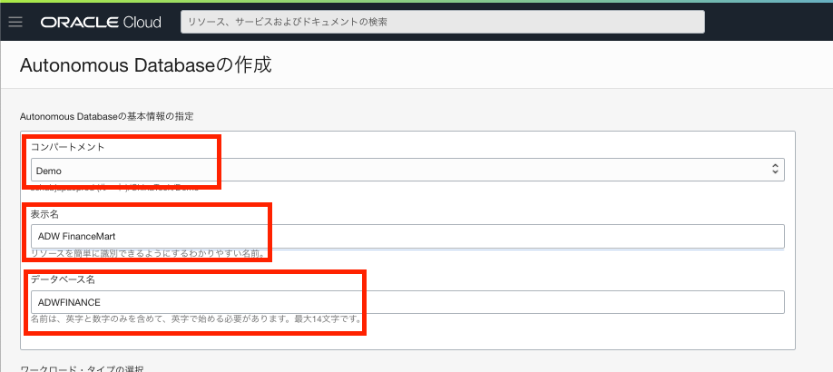
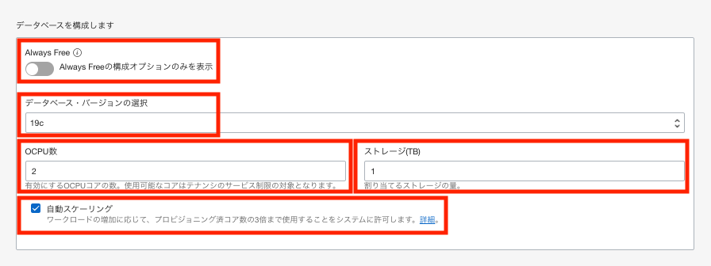
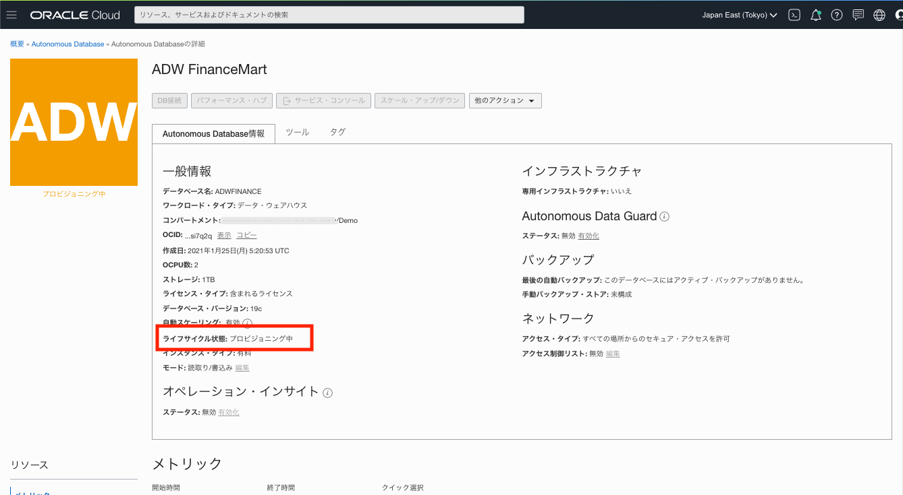

# Oracle Autonomous Database のプロビジョニング(ADW と ATP)

## Introduction

このラボでは、OracleCloudでOracleAutonomous Database（Autonomous Data Warehouse [ADW]およびAutonomousTransaction Processing [ATP]）の使用を開始する手順について説明します。新しいADWインスタンスをプロビジョニングし、Oracle SQL DeveloperWebを使用してデータベースに接続します。

*注意点：このラボではADWを使用していますが、ATPデータベースを作成して接続する手順は同じです。*

推定時間：5分

### 目的

-   自律型データベースをプロビジョニングする方法を学ぶ

### 前提条件
-　次のラボでは、<a href="https://www.oracle.com/cloud/free/" target="\_blank"> OracleCloudアカウント</a>が必要です。独自のクラウドアカウント、トライアルで取得したクラウドアカウント、無料利用枠アカウント、LiveLabsアカウント、またはオラクルのインストラクターから詳細が提供されたトレーニングアカウントを使用できます。
-　このラボは、左側の[コンテンツ]メニューに表示される　**前提条件**ラボを完了していることを前提としています。このラボでは、クラウドコンソールを使用してADBデータベースインスタンスをプロビジョニングします。

### ビデオプレビュー

自律型トランザクション処理のプロビジョニングのビデオデモをご覧ください:

*注意点：このビデオのインターフェースは、表示されるインターフェースとは異なる場合があります。更新された情報については、以下の手順を参照してください。*

## **STEP 1**: サービスメニューからADWまたはATPを選択する

1. 前のラボで示したように、OracleCloudにログインします。
2. ログインすると、利用可能なすべてのサービスを確認できるクラウドサービスダッシュボードが表示されます。左上のナビゲーションメニューをクリックして、トップレベルのナビゲーションの選択肢を表示します。

    __提示:__ ダッシュボードの　__クイック・アクション__　セクションで、Autonomous DataWarehouseまたはAutonomousTransactionProcessingサービスに直接アクセスすることもできます.

    

3. 次の手順は、Autonomous DataWarehouseまたはAutonomousTransactionProcessingのいずれにも同様に適用されます。このラボでは、Autonomous Data Warehouseデータベースのプロビジョニングについて説明しているので、** Autonomous Data Warehouse **　をクリックします

    

4. Autonomous Data Warehouseインスタンスを表示するには、ワークロードタイプが　__データ・ウェアハウス__　または　__All__　であることを確認してください。 __リスト範囲__　ドロップダウンメニューを使用して、コンパートメントを選択します。 LiveLabs環境を使用している場合は、環境によって提供されるコンパートメントを必ず選択してください

    

   *注意点：ManagedCompartmentforPaaSコンパートメントはOracle Platform Servicesで使用されるOracleのデフォルトであるため、使用しないでください。*

5. このコンソールは、データベースがまだ存在しないことを示しています。データベースの長いリストがある場合は、データベースの　**状態**（使用可能、停止、終了など）でリストをフィルタリングできます。 __ワークロード・タイプ__　で並べ替えることもできます。ここでは、__データウェアハウス__　ワークロードタイプが選択されています.

    

6. 無料トライアルまたはAlwaysFreeアカウントを使用していて、Always Freeリソースを使用する場合は、AlwaysFreeリソースが利用可能な地域にいる必要があります。ページの右上隅に、現在のデフォルトの**リージョン**が表示されます

    

## **STEP 2**: ADBインスタンスの作成

1.  **Autonomous Databaseの作成** をクリックして、インスタンス作成プロセスを開始します

    

2.  これにより、インスタンスの構成を指定する　__Autonomous Databaseの作成__　画面が表示されます。
3. 自律データベースの基本情報を提供します:

    -　__コンパートメントを選択します__　-ドロップダウンリストからデータベースのコンパートメントを選択します。
    -　__表示名__ -表示用にデータベースの覚えやすい名前を入力します。このラボでは、__ ADW FinanceMart__を使用します。
    -　__データベース名__ -文字で始まる文字と数字のみを使用します。最大長は14文字です。 （アンダースコアは最初はサポートされていません。）このラボでは、__ ADWFINANCE__を使用します

    

4. ワークロードタイプを選択します。選択肢からデータベースのワークロードタイプを選択します:

    - __データ・ウェアハウス__ - このラボでは、ワークロードタイプとして __データウェアハウス__ を選択します。
    - __トランザクション処理__ - または、ワークロードタイプとしてトランザクション処理を選択することもできます。

    

5. デプロイメント・タイプを選択します。選択肢からデータベースのデプロイメントタイプを選択します:

    - __共有インフラストラクチャ__ - このラボでは、展開タイプとして __共有インフラストラクチャ__ を選択します.
    - __専用インフラストラクチャ__ - または、展開タイプとして専用インフラストラクチャを選択することもできます。

    

6. データベースを構成します:

    - __Always Free__ -クラウドアカウントがAlwaysFreeアカウントの場合、このオプションを選択して、AlwaysFreeの自律型データベースを作成できます。常に無料のデータベースには、1つのCPUと20GBのストレージが付属しています。このラボでは、AlwaysFreeをオフのままにしておくことをお勧めします。
    - __データベースバージョンの選択__ -使用可能なバージョンからデータベースバージョンを選択します。
    - __OCPU数__ -サービスのCPUの数。このラボでは、__ 2CPU__を指定します。または、Always Freeデータベースを選択した場合は、CPUが1つ付属しています。
    - __ストレージ（TB）__ -ストレージ容量をテラバイト単位で選択します。このラボでは、ストレージの__1TB__を指定します。または、Always Freeデータベースを選択した場合は、20GBのストレージが付属しています。
    - __自動スケーリング__-このラボでは、自動スケーリングを有効にして、システムがワークロードの需要を満たすために最大3倍のCPUおよびIOリソースを自動的に使用できるようにします。
    - __新しいデータベースプレビュー__ -新しいデータベースバージョンをプレビューするためのチェックボックスが使用可能な場合は、それを選択しないでください。

    *注意点：AlwaysFree自律データベースをスケールアップ/スケールダウンすることはできません。*

    

7. 管理者の資格情報を作成します:

    - __パスワード および パスワードの確認__ - サービスインスタンスのADMINユーザーのパスワードを指定します。パスワードは次の要件を満たしている必要があります:
    -　パスワードは12〜30文字の長さで、少なくとも1つの大文字、1つの小文字、および1つの数字を含める必要があります。
    -　パスワードにユーザー名を含めることはできません。
    -　パスワードに二重引用符（ "）文字を含めることはできません。
    -　パスワードは、最後に使用した4つのパスワードとは異なる必要があります。
    -　パスワードは、24時間以内に設定されたものと同じであってはなりません。
    -　パスワードを再入力して確認します。このパスワードをメモします。

    
8. ネットワークアクセスを選択します:
    -　このラボでは、デフォルトの「すべての場所からのセキュア・アクセスを許可」を受け入れます。
    -　プライベートエンドポイントが必要な場合は、指定したVCNからのトラフィックのみを許可します-すべてのパブリックIPまたはVCNからのデータベースへのアクセスがブロックされている場合は、[ネットワークアクセスの選択]領域で[仮想クラウドネットワーク]を選択します。
    -　ネットワークアクセス制御リスト（ACL）を設定することにより、自律データベースへのアクセスを制御および制限できます。 IPアドレス、CIDRブロック、仮想クラウドネットワーク、仮想クラウドネットワークOCIDの4つのIP表記タイプから選択できます

    

9. ライセンスタイプを選択します。このラボでは、__ライセンス込み__　を選択します。 2つのライセンスタイプは次のとおりです:

    - __ライセンス持込み(BYOL)__ - 既存のデータベースライセンスがある場合は、このタイプを選択します。
    - __ライセンス込み__ - 新しいデータベースソフトウェアライセンスとデータベースクラウドサービスをサブスクライブする場合は、このタイプを選択します。

10. __Autonomous Databaseの作成__　をクリックします。

    

11.  インスタンスがプロビジョニングを開始します。数分で、状態はプロビジョニングから利用可能に変わります。この時点で、Autonomous DataWarehouseデータベースを使用する準備が整いました。名前、データベースバージョン、OCPU数、ストレージサイズなど、インスタンスの詳細をここで確認してください。

    

*次のラボに進んでください*。

## 詳細を知りたいですか?

Click [here](https://docs.oracle.com/en/cloud/paas/autonomous-data-warehouse-cloud/user/autonomous-workflow.html#GUID-5780368D-6D40-475C-8DEB-DBA14BA675C3) for documentation on the typical workflow for using Autonomous Data Warehouse.

## **Acknowledgements**

- **Author** - Nilay Panchal, ADB Product Management
- **Adapted for Cloud by** - Richard Green, Principal Developer, Database User Assistance
- **Contributors** - Oracle LiveLabs QA Team (Jeffrey Malcolm Jr, Intern | Arabella Yao, Product Manager Intern)
- **Last Updated By/Date** - Richard Green, March 2020

