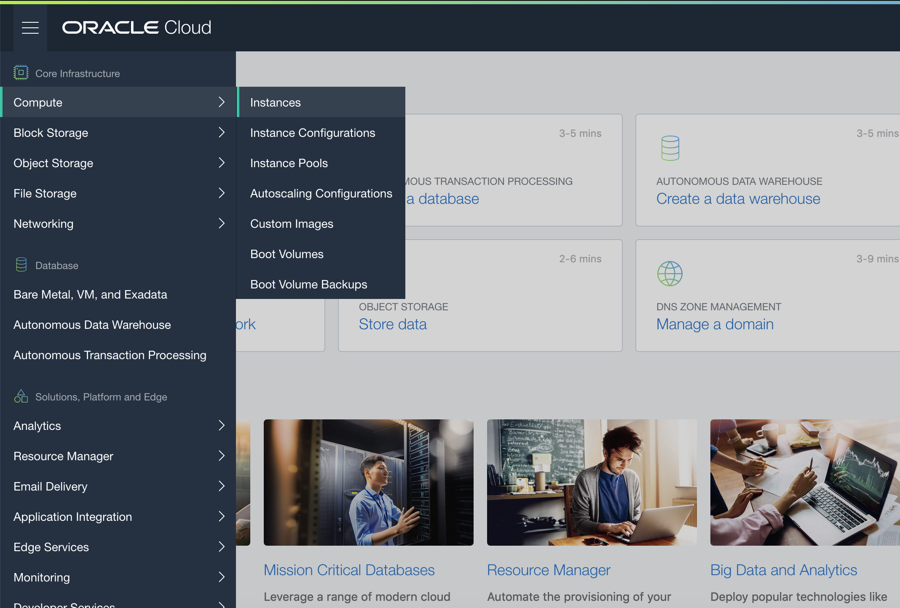
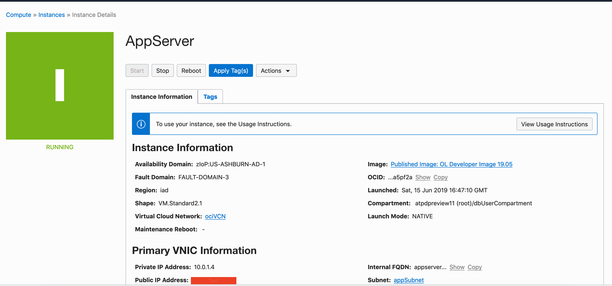
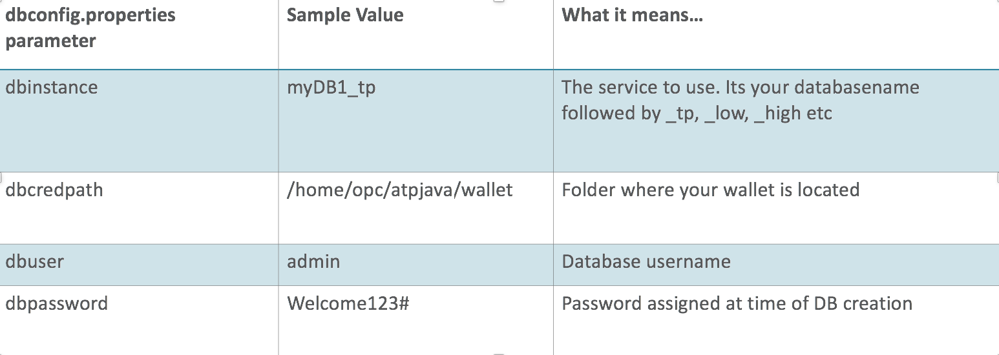

<table class="tbl-heading"><tr><td class="td-logo">

June 13, 2019
</td>
<td class="td-banner">
# Lab 9: Building and deploying Java application stacks on dedicated autonomous infrastructure
</td></tr><table>

## Introduction

The Oracle Cloud Infrastructure marketplace provides a pre-built image with necessary client tools and drivers to build applications on autonomous databases. As an application developer you can now provision a developer image within minutes and connect it to your dedicated or serverless database deployment. 

 The image is pre-configured with tools and language drivers to help you build applications written in node.js, python, java and golang.
For a complete list of features, login to your OCI account, select 'Marketplace' from the top left menu and browse details on the 'Oracle Developer Cloud Image'

In this lab we will configure and deploy a java application in a developer client VM and connect it to an autonomous database.


### See an issue?
Please submit feedback using this [form](https://apexapps.oracle.com/pls/apex/f?p=133:1:::::P1_FEEDBACK:1). Please include the *workshop name*, *lab* and *step* in your request.  If you don't see the workshop name listed, please enter it manually. If you would like for us to follow up with you, enter your email in the *Feedback Comments* section.
## Objectives

As an application developer,
- Learn how to deploy a java application and connect it to your dedicated autonomous database instance


## Required Artifacts

- An Oracle Cloud Infrastructure account.

- A pre-provisioned instance of Oracle Developer Client image in an application subnet. Refer to [Lab5](LabGuide500ConfigureADevelopmentSystemForUseWithYourDedicatedAutonomousDatabase.md)

- A pre-provisioned dedicated autonomous database instance. Refer to [Lab 4](./LabGuide400ProvisioningdatabasesonyourdedicatedAutonomousInfrastructure.md)

- A network that provides connectivity between the application and database subnets. Refer to [Lab1](./LabGuide100PreparingyourprivatedatacenterintheOracleCloudInfrastructure.md)

## Steps

### STEP 1: Download sample java application

- Login to your Oracle Cloud Infrastructure account and select **Compute** and **Instances** from the hamburger menu top left



- Select the right Oracle Developer Cloud image you created in earlier labs. 

- Copy the public IP address of the instance on to a note pad. 




**Mac users**

- Open Terminal and SSH into linux host machine

```
sudo ssh -i /path_to/sshkeys/id_rsa opc@publicIP
```


**Windows users**

- You can connect to and manage linux host mahine using SSH client. Recent versions of Windows 10 provide OpenSSH client commands to create and manage SSH keys and make SSH connections from a command prompt.

- Other common Windows SSH clients you can install locally is PuTTY. Click [here](https://docs.microsoft.com/en-us/azure/virtual-machines/linux/ssh-from-windows) to follow the steps to connect to linux host machine from you windows using PuTTY.


- Download a sample java application for the purpose of this lab as follows,

```
cd /home/opc/


wget --no-check-certificate --content-disposition https://github.com/oracle/learning-library/blob/master/data-management-library/autonomous-transaction-processing/dedicated/scripts/800/ATPDjava.zip?raw=true
```


Unzip the application in /home/opc


```
unzip /home/opc/ATPDjava.zip
```

**Note: The package unzips to a folder /home/opc/atpjava**

Next,  download ojdbc8 drivers needed for connectivity,

```
cd /home/opc/atpjava/

mkdir ojdbc

cd ojdbc/

wget --no-check-certificate --content-disposition https://github.com/oracle/learning-library/blob/master/data-management-library/autonomous-transaction-processing/dedicated/scripts/800/ojdbc8-full.tar.gz?raw=true


tar xzfv ojdbc8-full.tar.gz

```


### STEP 2: Transfer database wallet to developer client

- Login to Oracle Cloud Infrastructure account and click on **Autonomous Transaction Processing** from top left menu


- Click on Autonomous Database and select your previously created database


- Click on DB Connection and under Download Client Credential(Wallet) click **Download**


- Database connections to you Autonomous Database use a secure connection. You will be asked to create a password for your wallet. 

- Enter **Password** and **Confirm password** and click on **Download**


- The credentials zip file contains the encryption wallet, Java keystore and other relevant files to make a secure TLS 1.2 connection to your database from client applications. Store this file in a secure location on your local machine.

- Let us now scp the downloaded wallet to our developer client machine

- Mac Users: Open a terminal window on your laptop and type in the following commands,

#### Note: Please change the path and file name for your ssh keyfile and the encryption wallet. Also provide the IP address of your developer client machine

```
sudo scp -i /Path/to/your/private_ssh_key /Path/to/your/downloaded_wallet opc@publicIP:/home/opc/ATPDjava
```


- Windows users: Use a scp client such as winSCP to move your wallet to the client machine

### STEP 3: Run your java application**

Now that you have successfully SCP'd the encryption to your client machine, let's connect to our linux host, unzip the wallet and update sqlnet.ora file to point to the wallet folder

- Open terminal in your laptop and SSH into linux host machine

```
ssh -i /path/to/your/private_ssh_key opc@PublicIP
```
Once logged in ,

```
cd /home/opc/atpjava/

mkdir wallet

unzip Wallet_ATPDedicatedDB.zip -d /home/opc/atpjava/wallet/
```

- Edit sqlnet.ora to update the directory path

```
cd /home/opc/atpjava/wallet/

vi sqlnet.ora
```

- Change **DIRECTORY** path to /home/opc/ATPDjava/wallet/ and save the file


- Next, configure your java applications DB config file

```
cd /home/opc/atpjava/atpjava/src

vi dbconfig.properties
```

- Change **dbinstance**, **dbcredpath**, **dbuser**, **dbpassword** as per the autonomous database you created earlier





Next, let's set the TNS_ADMIN environment variable to point to the wallet and set the java classpath

```
export TNS_ADMIN=/home/opc/atpjava/wallet/
```

- Verify TNS_ADMIN path

```
echo $TNS_ADMIN
```


- Set java class path

```
javac -cp .:/home/opc/atpjava/ojdbc/ojdbc8-full/ojdbc8.jar com/oracle/autonomous/GetAutonomousConnection.java
```

- Run application 

```
java -cp .:/home/opc/atpjava/ojdbc/ojdbc8-full/ojdbc8.jar com/oracle/autonomous/GetAutonomousConnection
```


<table>
<tr><td class="td-logo">[](#)</td>
<td class="td-banner">
### Congratulations! You successfully deployed and connected a java app to your autonomous database.
</td>
</tr>
<table>