# Access a BDS Node Using a Public IP Address

## Introduction

Big Data Service nodes are by default assigned private IP addresses, which aren't accessible from the public internet. You can make the nodes in the cluster available using one of the following methods:

* You can map the private IP addresses of selected nodes in the cluster to public IP addresses to make them publicly available on the internet. _**We will use this method in this lab which assumes that making the IP address public is an acceptable security risk.**_
* You can set up an SSH tunnel using a bastion host. Only the bastion host is exposed to the public internet. A bastion host provides access to the cluster's private network from the public internet. See [Bastion Hosts Protected Access for Virtual Cloud Networks](https://www.oracle.com/a/ocom/docs/bastion-hosts.pdf).
* You can also use VPN Connect which provides a site-to-site Internet Protocol Security (IPSec) VPN between your on-premises network and your virtual cloud network (VCN). IPSec VPN is a popular set of protocols used to ensure secure and private communications over IP networks. See [VPN Connect](https://docs.cloud.oracle.com/en-us/iaas/Content/Network/Tasks/managingIPsec.htm).
* Finally, you can use OCI FastConnect to access services in OCI without going over the public internet. With FastConnect, the traffic goes over your private physical connection. [See FastConnect](https://www.oracle.com/pls/topic/lookup?ctx=en/cloud/paas/autonomous-data-warehouse-cloud/user&id=oci-fastconnect).

**Note:**     
Using a bastion Host, VPN Connect, and OCI FastConnect provide more private and secure options than making the IP address public.

**Important:**    
A Utility node generally contains utilities used for accessing the cluster. Making the utility nodes in the cluster publicly available (which you will do in this lab) isn't enough to make services that run on the utility nodes available from the internet. For example, in a non-HA cluster such as our **`training-cluster`**, both Cloudera Manager (CM) and Hue run on the first utility node, **`traininun0`**.

Before you can access CM and Hue on the utility node using a web browser, you must also open the ports associated with both services. You do this by adding an ingress rule to a security list for each service. You will <if type="livelabs">review how to do this</if> <if type="freetier">do this</if> in **Lab 5, Use Cloudera Manager (CM) and Hue to Access a BDS Cluster**. See [Define Security Rules](https://docs.oracle.com/en/cloud/paas/big-data-service/user/configure-security-rules-network.html#GUID-42EDCC75-D170-489E-B42F-334267CE6C92).

In this lab, you will use the **Oracle Cloud Infrastructure Cloud Shell**, which is a web browser-based terminal accessible from the **Oracle Cloud Console**. You'll gather some information about your network and your cluster utility nodes, and then you will pass that information to the **`oci network`** command that you will use to map the private IP addresses of the utility nodes to two new public IP addresses. Finally, you learn how to edit an existing public IP address.

Estimated Lab Time: 45 minutes

### Objectives

* Gather information about the cluster.
* Map the private IP address of a node to a public IP address.
* Edit a public IP address using both the **Oracle Cloud Console** and the OCI Command Line Interface (CLI).

### What Do You Need?

This lab assumes that you have successfully completed the following labs in the **Contents** menu:
<if type="freetier">
+ **Lab 1: Setup the BDS Environment**
</if>
<if type="livelabs">
+ **Lab 1: Review Creating BDS Environment Resources (Optional)**
</if>
+ **Lab 2: Create a BDS Hadoop Cluster**
+ **Lab 3: Add Oracle Cloud SQL to the Cluster**

## **STEP 1:** Gather Information About the Cluster

<if type="livelabs">
1. Log in to the **Oracle Cloud Console**, if you are not already logged in, using your LiveLabs credentials and instructions. The **Oracle Cloud Console** Home page is displayed.
</if>

<if type="freetier">
1. Log in to the **Oracle Cloud Console** as the Cloud Administrator that you used to create the resources in **Lab 1**, if you are not already logged in. On the **Sign In** page, select your `tenancy` if needed, enter your `username` and `password`, and then click **Sign In**. The **Oracle Cloud Console** Home page is displayed.
</if>

2. Click the **Navigation** menu in the upper left-hand corner of the **Oracle Cloud Console** Home page. Under **Data and AI**, select **Big Data**.

3. On the **Clusters** page, click the **`training-cluster`** link in the **Name** column to display the **Cluster Details** page.

4. In the **Cluster Information** tab, in the **Customer Network Information** section, click the **Copy** link next to **Subnet OCID**. Next, paste that OCID to an editor or a file, so that you can retrieve it later in **STEP 2** in this lab.

  <if type="freetier">
  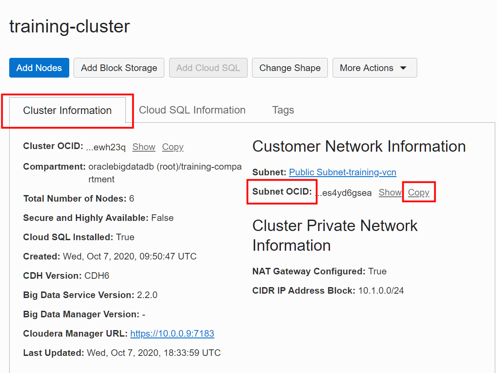
  </if>

  <if type="livelabs">
  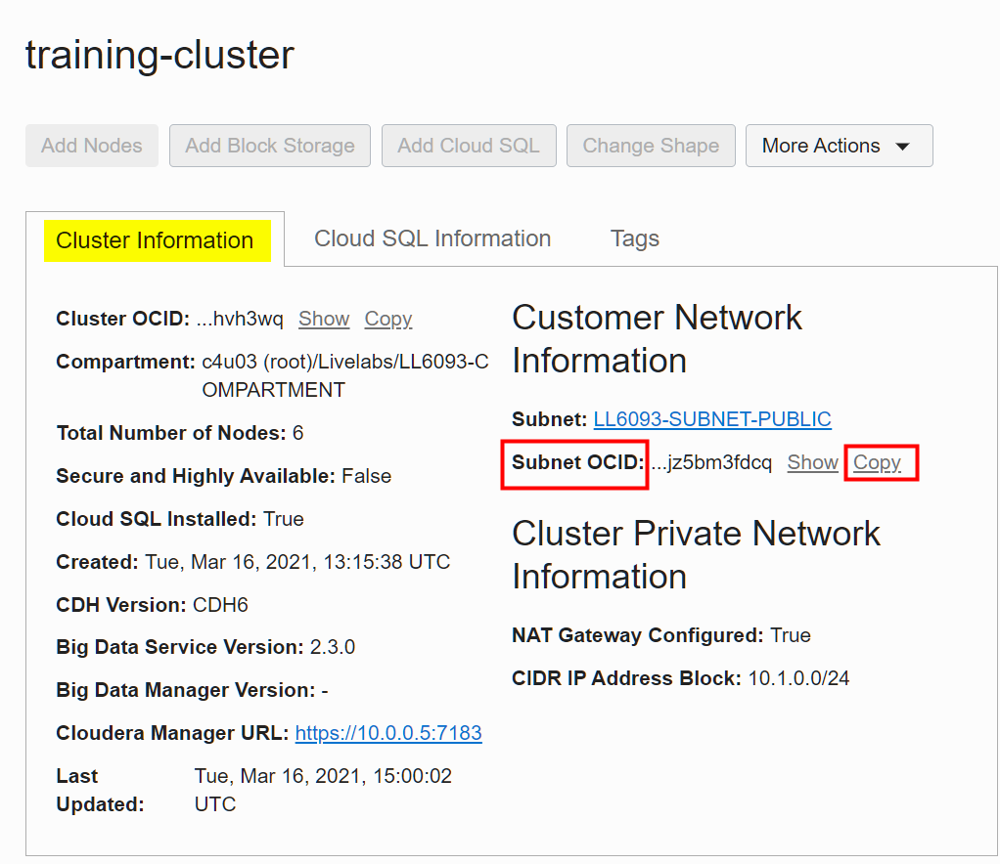
  </if>

<if type="freetier">
5. On the same page, in the **List of cluster nodes** section, in the **IP Address** column, find the private IP addresses for the first utility node, **`traininun0`**, and the Cloud SQL node, **`traininqs0`**. Save the IP addresses as you will need them in later steps. In our example, the private IP address of our first utility node in the cluster is **`10.0.0.9`**. The private IP address for the Cloud SQL node in the cluster is **`10.0.0.12`**.

  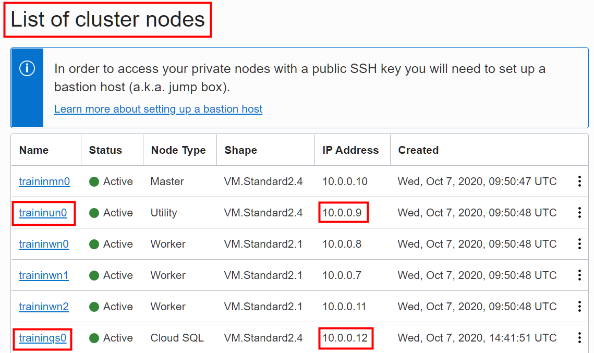
</if>

<if type="livelabs">
5. On the same page, in the **List of cluster nodes** section, in the **IP Address** column, find the private IP addresses for the first utility node, **`traininun0`**, and the Cloud SQL node, **`traininqs0`**. Save the IP addresses as you will need them in later steps. In our example, the private IP address of our first utility node in the cluster is **`10.0.0.5`**. The private IP address for the Cloud SQL node in the cluster is **`10.0.0.7`**.

  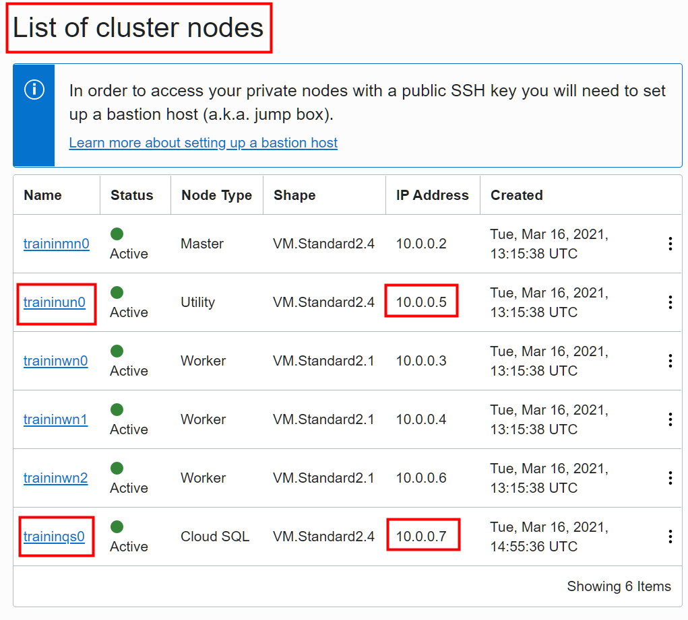
</if>

## **STEP 2:** Map the Private IP Address of the First Utility Node to a Public IP Address

In this step, you will set three variables using the **`export`** command. The variables will be used in the **`oci network`** command that you will use to map the private IP address of the **first utility node** to a new public IP address.

1. On the **Oracle Cloud Console** banner at the top of the page, click **Cloud Shell** . It may take a few moments to connect and authenticate you.

  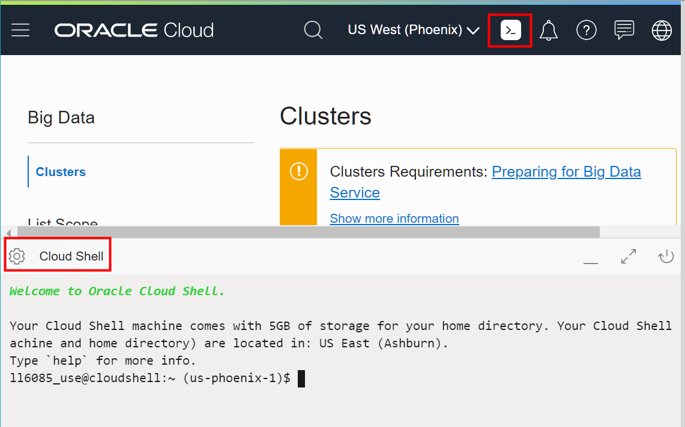

  **Note:** To change the Cloud Shell background color theme from dark to light, click **Settings**  on the Cloud Shell banner, and then select **Theme > Light** from the **Settings** menu.

  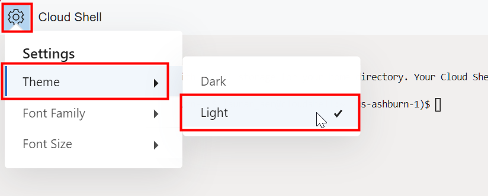

2. At the **$** command line prompt, enter the following command, or click **Copy** to copy the command, and then paste it on the command line. The **_`display-name`_** is an optional descriptive name that will be attached to the reserved public IP address that will be created for you.

    ```
    $ <copy>export DISPLAY_NAME="display-name"</copy>
    ```

    **Note:** In the preceding command, substitute **_`display-name`_** with a descriptive name of your choice. Press the **`[Enter]`** key to run the command.

    In our example, we will use **`traininun0-public-ip`** for the descriptive name.

    ```
    $ export DISPLAY_NAME="traininun0-public-ip"
    ```
3. At the **$** command line prompt, enter the following command, or click **Copy** to copy the command, and then paste it in the command line.

    ```
    $ <copy>export SUBNET_OCID="subnet-ocid"</copy>
    ```
    **Note:** In the preceding command, substitute **_``subnet-ocid``_** with your own **`subnet-ocid`** that you identified in **STEP 1** of this lab. Press the **`[Enter]`** key to run the command.  

    <if type="freetier">
    In our example, we replaced the **_``subnet-ocid``_** with our own **`subnet-ocid`**:

    ```
    $ export SUBNET_OCID="ocid1.subnet.oc1.iad.aaaaaaaa3mhu4yuaito4trodn4cywlv2ys3dtwj67cu26bs2gses4yd6gsea"
    ```
    </if>

    <if type="livelabs">
    In our example, we replaced the **_``subnet-ocid``_** with our own **`subnet-ocid`**:

    ```
    $ export SUBNET_OCID="ocid1.subnet.oc1.phx.aaaaaaaav7csf6i5lsevfr3egwsxagknkyjppdgdlqrdknsyw3jz5bm3fdcq"
    ```
    </if>


4. At the **$** command line prompt, enter the following command, or click **Copy** to copy the command, and then paste it on the command line. The **`ip-address`** is the private IP address that is assigned to the node that you want to map.

    ```
    $ <copy>export PRIVATE_IP="ip-address"</copy>
    ```
  **Note:** In the preceding command, substitute **_`ip-address`_** with your first utility node's private IP address. Press the **`[Enter]`** key to run the command.

  <if type="freetier">
  In our example, we replaced the **_``ip-address``_** with the private IP address of our first utility node that we identified in **STEP 1** of this lab.

    ```
    $ export PRIVATE_IP="10.0.0.4"
    ```
  </if>

  <if type="livelabs">
  In our example, we replaced the **_``ip-address``_** with the private IP address of our first utility node that we identified in **STEP 1** of this lab.

    ```
    $ export PRIVATE_IP="10.0.0.5"
    ```
  </if>

5.  At the **$** command line prompt, enter the following command exactly as it's shown below **_without any line breaks_**, or click **Copy** to copy the command, and then paste it on the command line. Press the **`[Enter]`** key to run the command.

    ```
    $ <copy>oci network public-ip create --display-name $DISPLAY_NAME --compartment-id `oci network private-ip list --subnet-id $SUBNET_OCID --ip-address $PRIVATE_IP | jq -r '.data[] | ."compartment-id"'` --lifetime "RESERVED" --private-ip-id `oci network private-ip list --subnet-id $SUBNET_OCID --ip-address $PRIVATE_IP | jq -r '.data[] | ."id"'`</copy>
    ```
<if type="freetier">
6.  In the output returned, find the value for **ip-address** field. In our example, it's **`193.122.194.103`**. This is the new reserved public IP address that is mapped to the private IP address of your **first utility node**.

  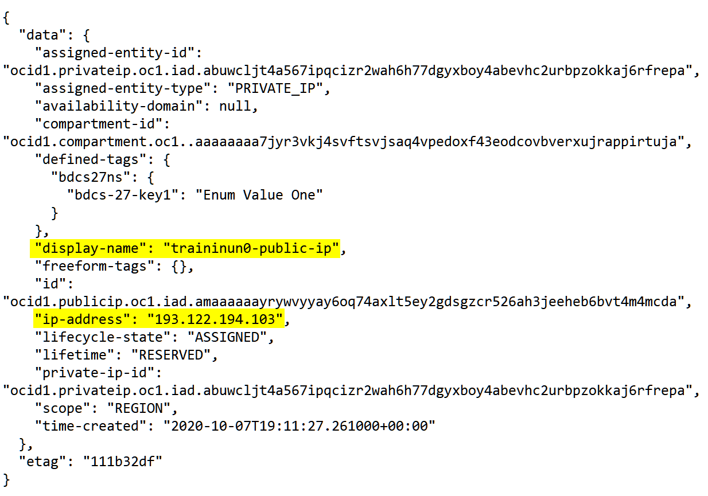
</if>

<if type="livelabs">

7.  In the output returned, find the value for **ip-address** field. In our example, it's **`158.101.36.9`**. This is the new reserved public IP address that is mapped to the private IP address of your **first utility node**.

  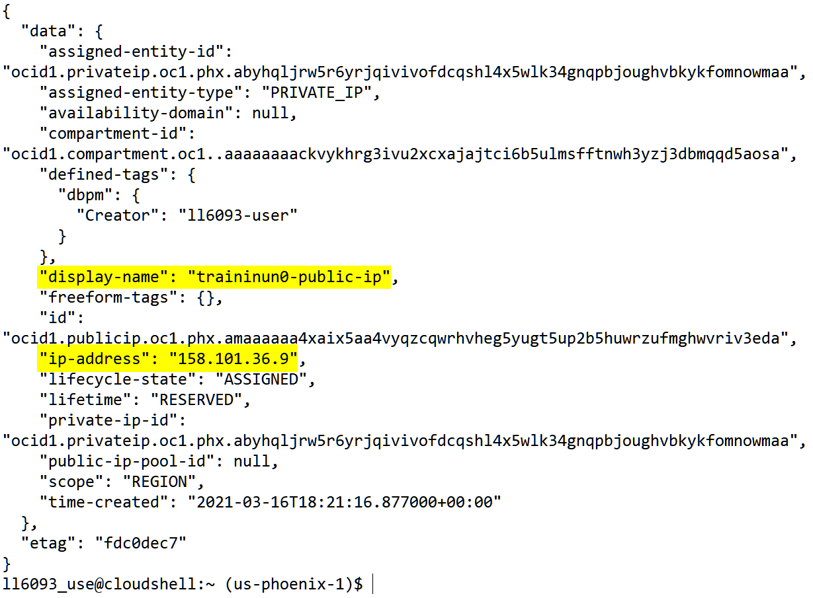

</if>


8.  To view the newly created reserved public IP address in the console, click the Navigation menu and navigate to  **Core Infrastructure > Networking > IP Management**. In the **IP Management** section on the left, the **Public IPs** option is selected by default. The new reserved public IP address is displayed in the **Reserved Public IP Addresses** list. If you did specify a descriptive name as explained earlier, that name will appear in the **Name** column; Otherwise, a name such as  **publicip_nnnnnnnnn_** is generated.

  <if type="freetier">
  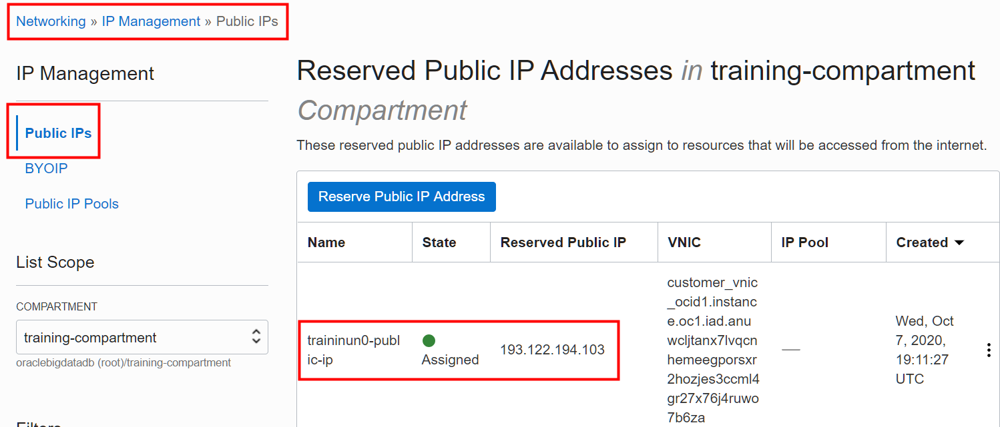
  </if>

  <if type="livelabs">
  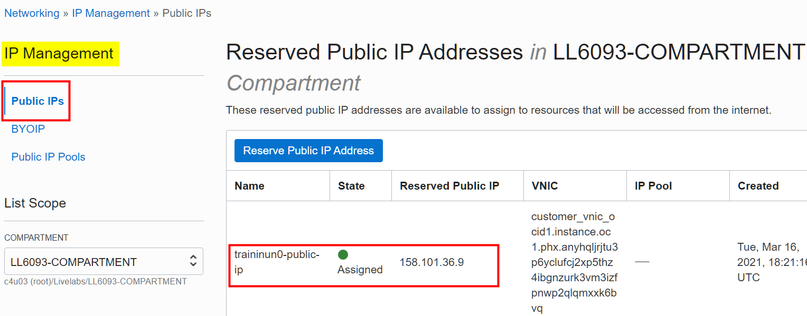
  </if>


## **STEP 3:** Map the Private IP Address of the Cloud SQL Node to a Public IP Address

In this step, you will set two variables using the **`export`** command. Next, you use the **`oci network`** command to map the private IP address of the **Cloud SQL node** to a new public IP address.

1. In the **Cloud Shell**, at the **$** command line prompt, enter the following command, or click **Copy** to copy the command, and then paste it on the command line.

    ```
    $ <copy>export DISPLAY_NAME="traininqs0"</copy>
    ```

    **Note:**    
    You already set the **`SUBNET_OCID`** variable to your own **`subnet-ocid`** value that you identified in **STEP 2** of this lab. You don't need to set this variable again.

2. At the **$** command line prompt, enter the following command, or click **Copy** to copy the command, and then paste it on the command line. Remember, the **`ip-address`** is the private IP address that is assigned to the Cloud SQL node that you want to map to a public IP address.

    <if type="freetier">
    ```
    $ <copy>export PRIVATE_IP="10.0.0.12"</copy>
    ```
    </if>

    <if type="livelabs">
    ```
    $ <copy>export PRIVATE_IP="10.0.0.7"</copy>
    ```
    </if>

    **Note:** In the preceding command, substitute the **_`ip-address`_** shown with your own Cloud SQL node's private IP address that you identified in **STEP 1** of this lab.

3.  At the **$** command line prompt, enter the following command exactly as it's shown below **_without any line breaks_**, or click **Copy** to copy the command, and then paste it on the command line.

    ```
    $ <copy>oci network public-ip create --display-name $DISPLAY_NAME --compartment-id `oci network private-ip list --subnet-id $SUBNET_OCID --ip-address $PRIVATE_IP | jq -r '.data[] | ."compartment-id"'` --lifetime "RESERVED" --private-ip-id `oci network private-ip list --subnet-id $SUBNET_OCID --ip-address $PRIVATE_IP | jq -r '.data[] | ."id"'`</copy>
    ```
<if type="freetier">
4.  In the output returned, find the value for **ip-address** field. In our example, it's **`193.122.162.136`**. This is the new reserved public IP address that is mapped to the private IP address of your **Cloud SQL node**.

      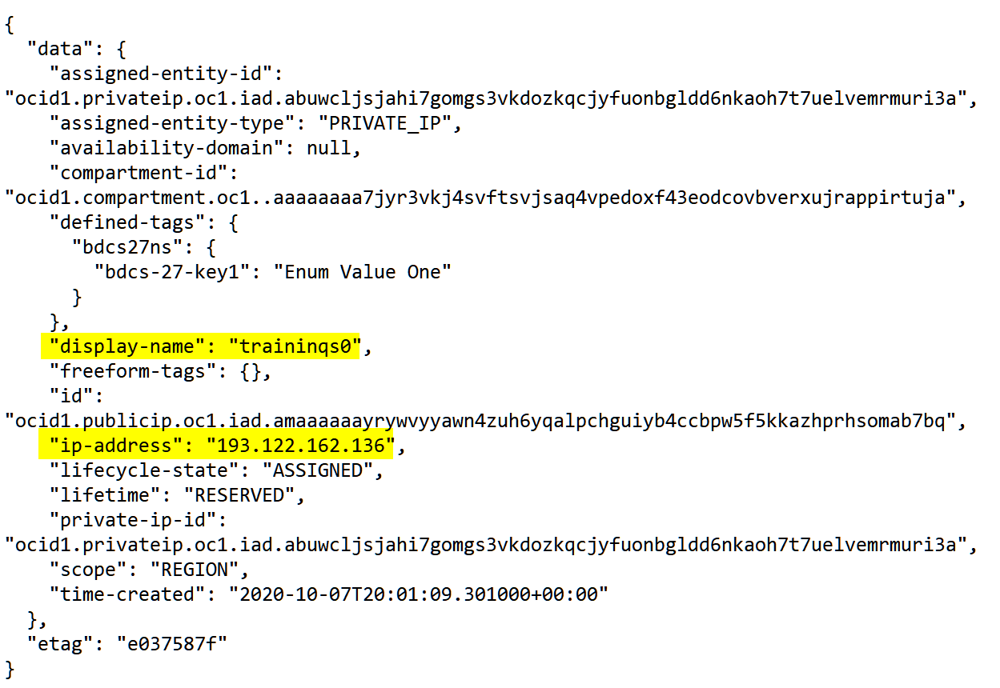
</if>

<if type="livelabs">
4.  In the output returned, find the value for **ip-address** field. In our example, it's **`129.146.214.30`**. This is the new reserved public IP address that is mapped to the private IP address of your **Cloud SQL node**.

      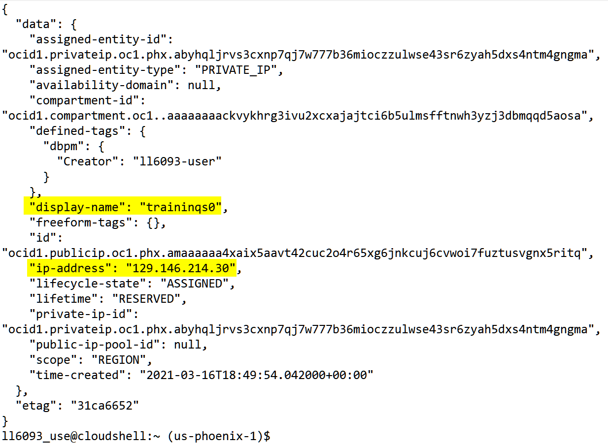
</if>


5.  To view the newly created reserved public IP address in the console, click the Navigation menu and navigate to **Core Infrastructure > Networking > IP Management**. Make sure that the **Public IPs** option in the **IP Management** section on the left is selected. The new reserved public IP address is displayed in the **Reserved Public IP Addresses** page.

      <if type="freetier">
      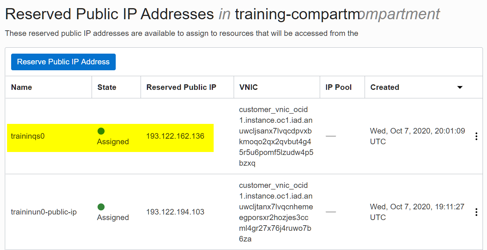
      </if>

      <if type="livelabs">
      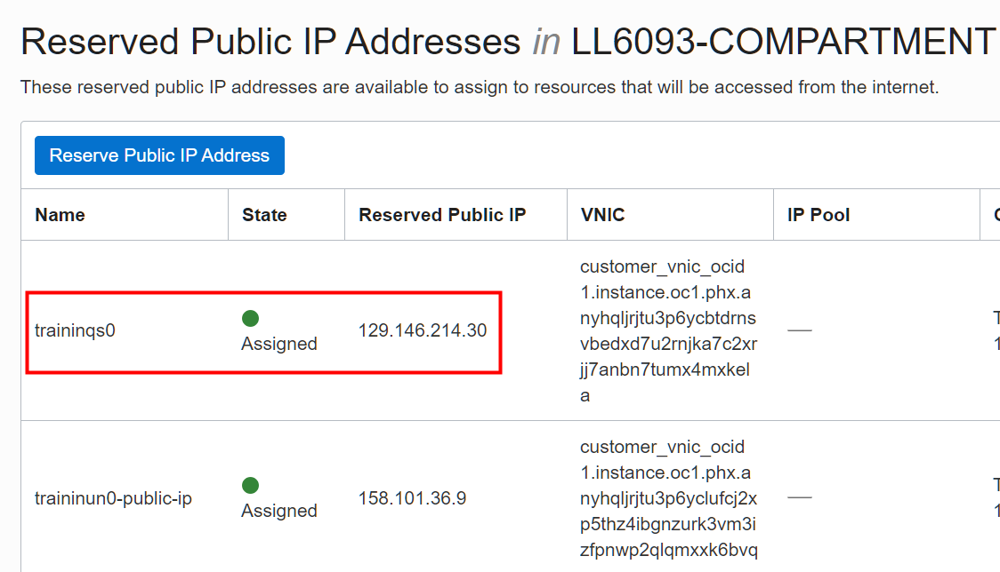
      </if>


## **STEP 4:** Edit a Public IP Address

In this step, you will learn how to edit a public IP address using both the **Cloud Console** and the **Cloud Shell**.

1. On the **Oracle Cloud Console** banner at the top of the page, click the Navigation menu and navigate to **Core Infrastructure > Networking > IP Management**. Select the **Public IPs** option in the **IP Management** section on the left, if not already selected. The new reserved public IP addresses that you created in this lab are displayed in the **Reserved Public IP Addresses** page.

  <if type="freetier">
  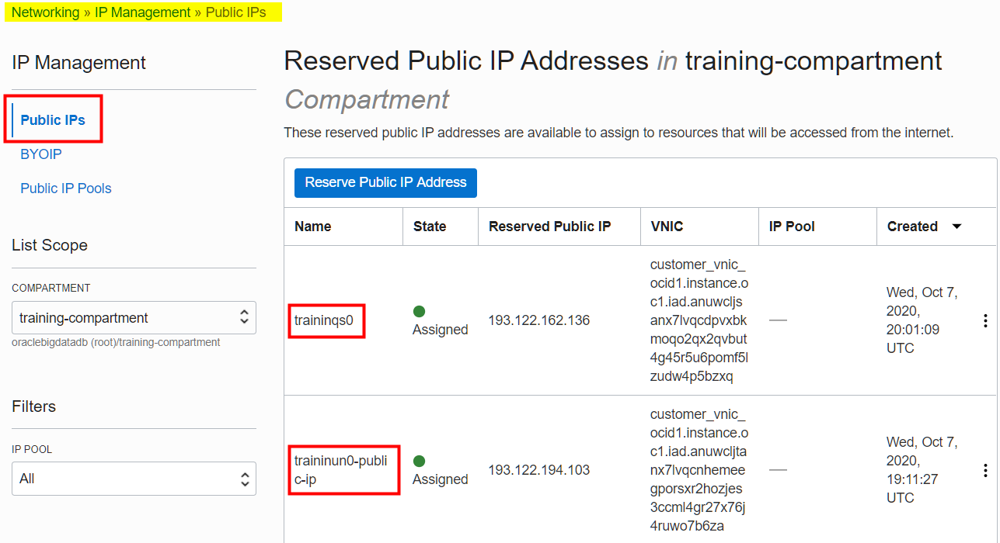
  </if>

  <if type="livelabs">
  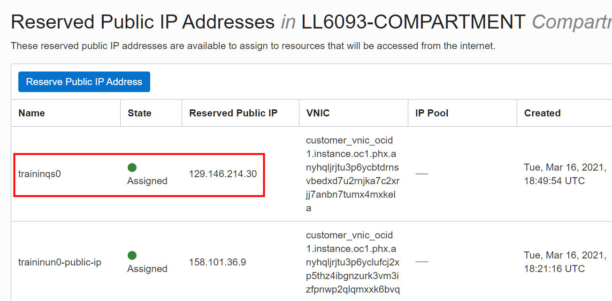
  </if>

2. Change the name of the public IP address associated with the Cloud SQL node from `traininqs0` to **`traininqs0-public-ip`**. On the row for `traininqs0`, click the **Actions** button, and then select **Rename** from the context menu.

    <if type="freetier">
    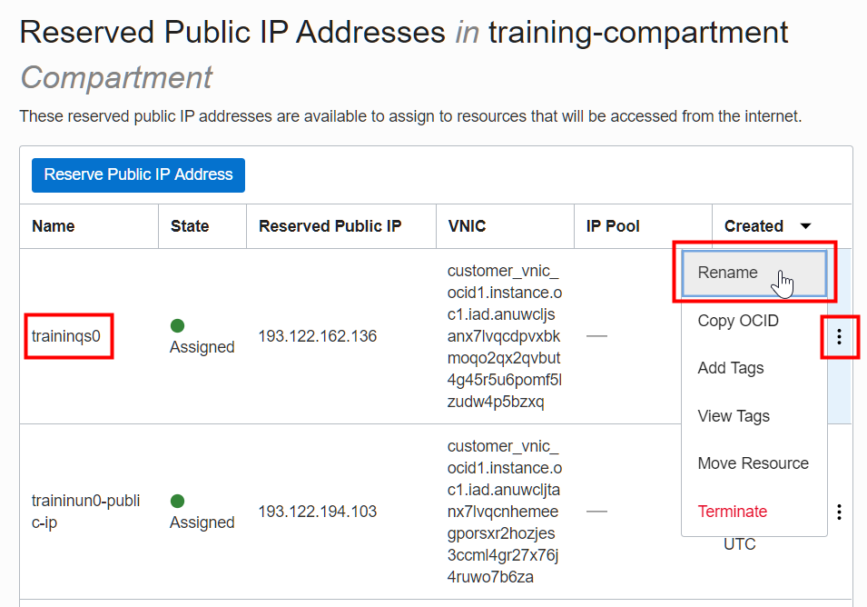
    </if>

    <if type="livelabs">
    
    </if>

3. In the **Rename** dialog box, in the **RESERVED PUBLIC IP NAME** field, enter **`traininqs0-public-ip`**, and then click **Save Changes**.

    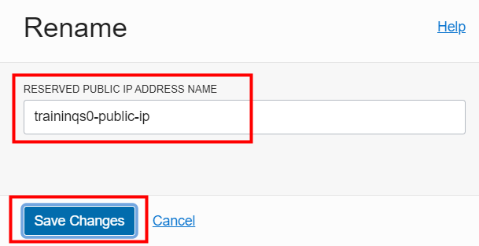  

    The renamed public IP address is displayed.
    <if type="freetier">
    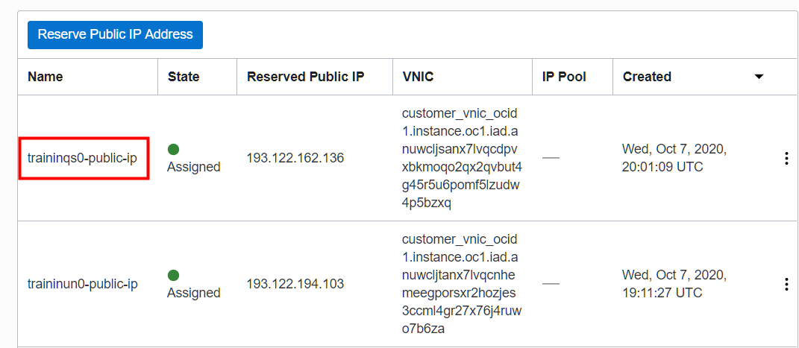  
    </if>

    <if type="livelabs">
    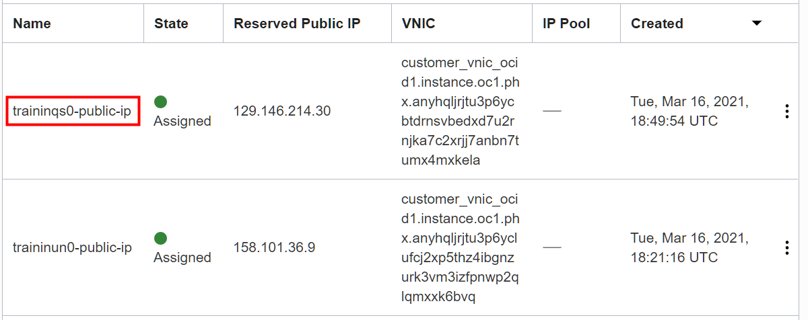  
    </if>


5. You can also edit public IP addresses using the OCI CLI. See [OCI CLI Command Reference - public-ip](https://docs.cloud.oracle.com/en-us/iaas/tools/oci-cli/2.9.0/oci_cli_docs/cmdref/network/public-ip.html#) in the _Oracle Cloud Infrastructure_ documentation.

  

    **Note:** Don't delete any of your public IP addresses as you will need them in this workshop.

This concludes this lab. You may now [proceed to the next lab](#next).

## Want to Learn More?

* [Using Oracle Big Data Service](https://docs.oracle.com/en/cloud/paas/big-data-service/user/index.html)
* [Oracle Cloud Infrastructure Documentation](https://docs.cloud.oracle.com/en-us/iaas/Content/GSG/Concepts/baremetalintro.htm)
* [Getting Started with the Command Line Interface (CLI)](https://docs.cloud.oracle.com/en-us/iaas/Content/GSG/Tasks/gettingstartedwiththeCLI.htm)
* [OCI CLI Command Reference - Public-IP](https://docs.cloud.oracle.com/en-us/iaas/tools/oci-cli/2.9.0/oci_cli_docs/cmdref/network/public-ip.html#)
* [OCI CLI Command Reference - Big Data Service (bds)](https://docs.cloud.oracle.com/en-us/iaas/tools/oci-cli/2.10.0/oci_cli_docs/cmdref/bds.html)

## Acknowledgements

* **Author:**
    + Lauran Serhal, Principal User Assistance Developer, Oracle Database and Big Data User Assistance
* **Contributors:**
    + Martin Gubar, Director, Oracle Big Data Product Management
    + Ben Gelernter, Principal User Assistance Developer, DB Development - Documentation
* **Last Updated By/Date:** Lauran Serhal, March 2021

## Need Help?
Please submit feedback or ask for help using our [LiveLabs Support Forum](https://community.oracle.com/tech/developers/categories/livelabsdiscussions). Please click the **Log In** button and login using your Oracle Account. Click the **Ask A Question** button to the left to start a *New Discussion* or *Ask a Question*.  Please include your workshop name and lab name.  You can also include screenshots and attach files.  Engage directly with the author of the workshop.

If you do not have an Oracle Account, click [here](https://profile.oracle.com/myprofile/account/create-account.jspx) to create one.
