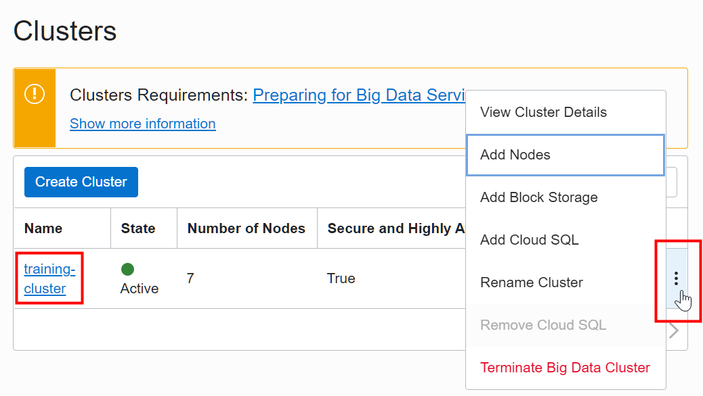
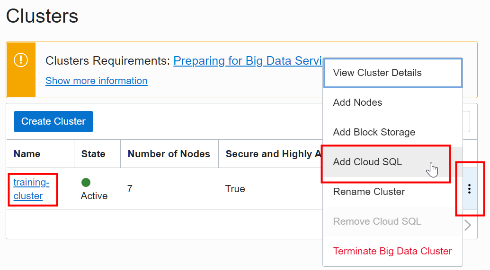
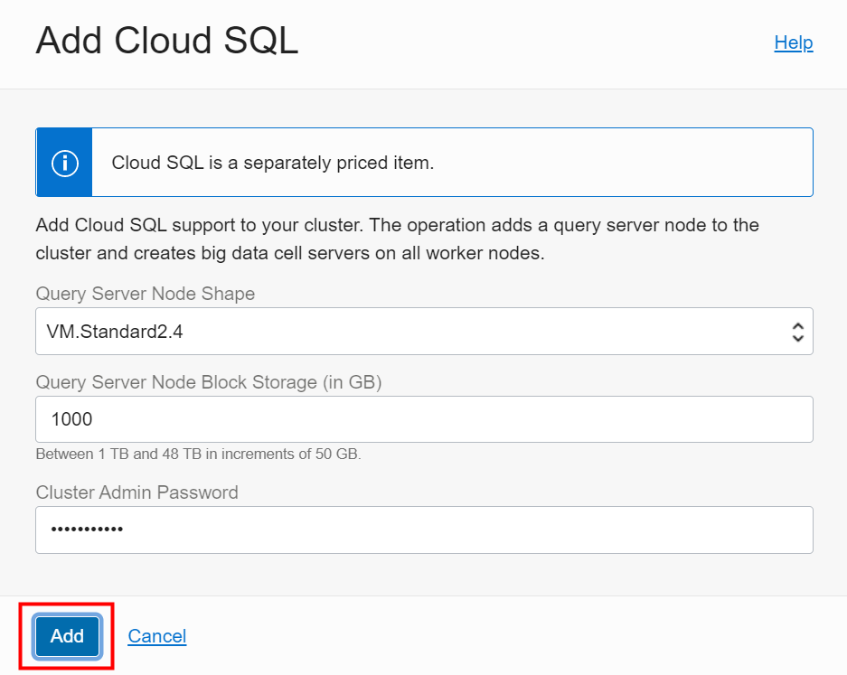
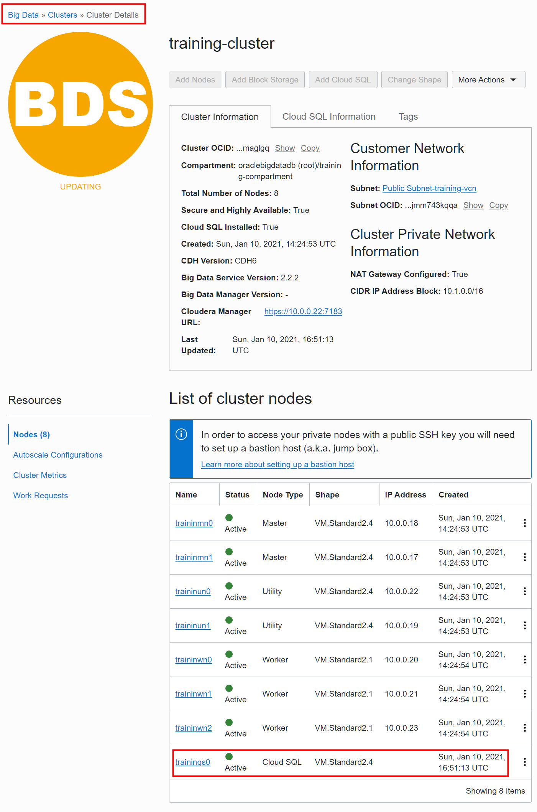
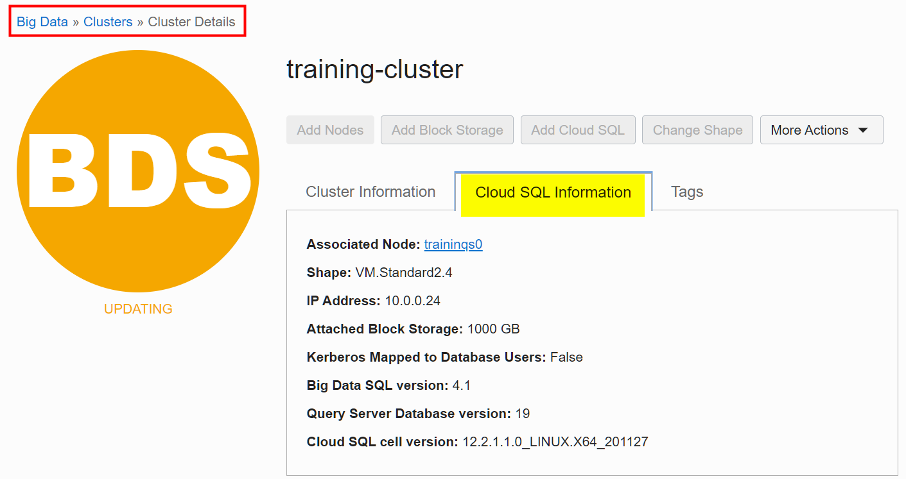
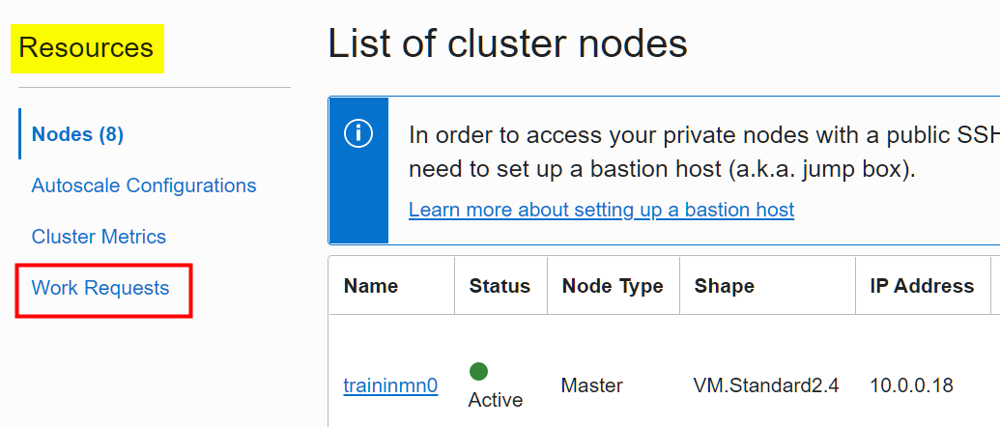

# Add Oracle Cloud SQL to the Cluster

## Introduction

In this lab, you will learn how to maintain the new cluster that you created in the previous lab. You will also learn how to add Oracle Cloud SQL to your cluster.

Estimated Lab Time: 15 minutes

### Objectives

* Maintain your cluster.
* Add Oracle Cloud SQL to your cluster.

### What Do You Need?

This lab assumes that you have successfully completed the following labs in the **Contents** menu:
+ **Lab 1: Setup the BDS Environment**
+ **Lab 2: Create a BDS Hadoop Cluster**

## **STEP 1:** Maintain the Cluster

You can use the **Clusters** and **Cluster Details** pages to maintain your clusters.

1. Log in to the **Oracle Cloud Console** as the Cloud Administrator, if you are not already logged in. On the **Sign In** page, select your `tenancy`, enter your `username` and `password`, and then click **Sign In**. The **Oracle Cloud Console** Home page is displayed.

2. Click the **Navigation** menu in the upper left-hand corner of the **Oracle Cloud Console** Home page. Under **Data and AI**, select **Big Data**.

3. On the **Clusters** page, on the row for **`training-cluster`**, click the **Actions** button. You can use the context menu to view the cluster's details, add nodes, add block storage, add Cloud SQL, rename the cluster, remove Cloud SQL (if it's already added), and terminate the Big Data cluster.

      

4. Alternatively, you can click the **`training-cluster`** link in the **Name** column to display the **Cluster Details** page. You can use the buttons at the top of the page to do the following:

    + Add nodes to the cluster.
    + Add block storage.
    + Add Cloud SQL.
    + Change shape.
    + Use the **More Actions** drop-down list to rename the cluster, move a resource from the current compartment to a different compartment, add tags, remove Cloud SQL (if it's already added), and terminate Big data Cluster.

      

    **Note:** Oracle Cloud Infrastructure Tagging allows you to add metadata to resources, which enables you to define keys and values and associate them with resources. You can use the tags to organize and list resources based on your business needs. For additional information, see [Tagging Overview](https://docs.cloud.oracle.com/en-us/iaas/Content/Tagging/Concepts/taggingoverview.htm#Tagging_Overview) in the OCI documentation.    

## **STEP 2:** Add Oracle Cloud SQL to the Cluster

You can add Oracle Cloud SQL to a cluster so that you can use SQL to query your big data sources. When you add Cloud SQL support to a cluster, a query server node is added and big data cell servers are created on all worker nodes. For information about using Cloud SQL with Big Data Service see [Use Cloud SQL with Big Data Service](https://docs.oracle.com/en/cloud/paas/big-data-service/user/use-cloud-sql-big-data-service.html).

**Note:** Cloud SQL is not included with Big Data Service. You must pay an extra fee for using Cloud SQL.

1. On the **Clusters** page, on the row for **`training-cluster`**, click the **Actions** button. From the context menu, select **Add Cloud SQL**.

    

2. In the **Add Cloud SQL** dialog box, provide the following information:
    + **Query Server Node Shape:** Select **`VM.Standard2.4`**.
    + **Query Server Node Block Storage (IN GB):** Enter **`1000`**.
    + **Cluster Admin Password:** Enter your cluster administration password that you chose when you created the cluster such as **`Training123`**.

    

    **Note:** For information on the supported Query Server node shapes and block storage size, see [Plan Your Cluster](https://docs.oracle.com/en/cloud/paas/big-data-service/user/plan-your-cluster.html#GUID-0A40FB4C-663E-435A-A1D7-0292DBAC9F1D).

3. Click **Add**. The **Clusters** page is re-displayed. The state of the **`training-cluster`** is now **Updating** and the number of nodes in the cluster is now **`8`** instead of **`7`**.

      

4. Click the **`training-cluster`** name link in the **Name** column to display the **Cluster Details** page. Scroll-down the page to the **List of cluster nodes** section. The newly added Cloud SQL node, **`traininqs0`**, is displayed.

    

    The **Cloud SQL Information** tab displays the Cloud SQL node information.

    

5. In the **Cluster Details** page, in the **Resources** section on the left, click **Work Requests**.

    

6.  In the **Work Requests** section, the `ADD_CLOUD_SQL` operation is displayed along with the status of the operation and percent completed. Click the `ADD_CLOUD_SQL` link.

    

7. The **Work Request Details** page displays the status, logs, and errors (if any) of adding the Cloud SQL node to the cluster.

    

8. Click the **Clusters** link in the breadcrumbs at the top of the page to re-display the **Clusters** page. Once the Cloud SQL node is successfully added to the cluster, the cluster's state changes to **Active** and the number of nodes in the cluster is now **`8`**.

        

This concludes this lab. You may now [proceed to the next lab](#next).

## Want to Learn More?

* [Using Oracle Big Data Service](https://docs.oracle.com/en/cloud/paas/big-data-service/user/index.html)
* [Oracle Cloud Infrastructure Documentation](https://docs.cloud.oracle.com/en-us/iaas/Content/GSG/Concepts/baremetalintro.htm)
* [Overview of Oracle Cloud Infrastructure Identity and Access Management](https://docs.cloud.oracle.com/en-us/iaas/Content/Identity/Concepts/overview.htm)

## Acknowledgements

* **Authors:**
    + Lauran Serhal, Principal User Assistance Developer, Oracle Database and Big Data User Assistance
* **Contributor:**
    + Martin Gubar, Director, Oracle Big Data Product Management
* **Last Updated By/Date:** Lauran Serhal, January 2021

## Need Help?
Please submit feedback or ask for help using our [LiveLabs Support Forum](https://community.oracle.com/tech/developers/categories/livelabsdiscussions). Please click the **Log In** button and login using your Oracle Account. Click the **Ask A Question** button to the left to start a *New Discussion* or *Ask a Question*.  Please include your workshop name and lab name.  You can also include screenshots and attach files.  Engage directly with the author of the workshop.

If you do not have an Oracle Account, click [here](https://profile.oracle.com/myprofile/account/create-account.jspx) to create one.
