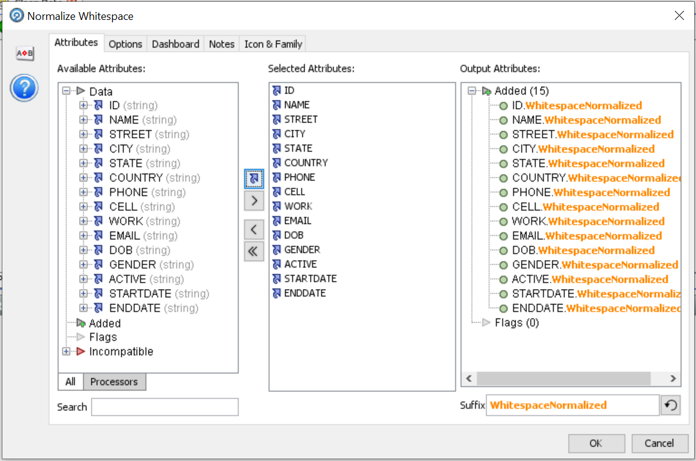
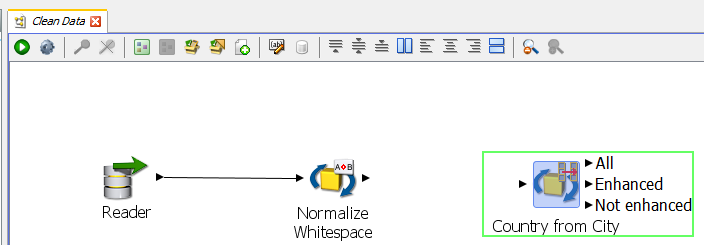
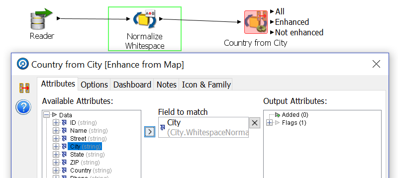
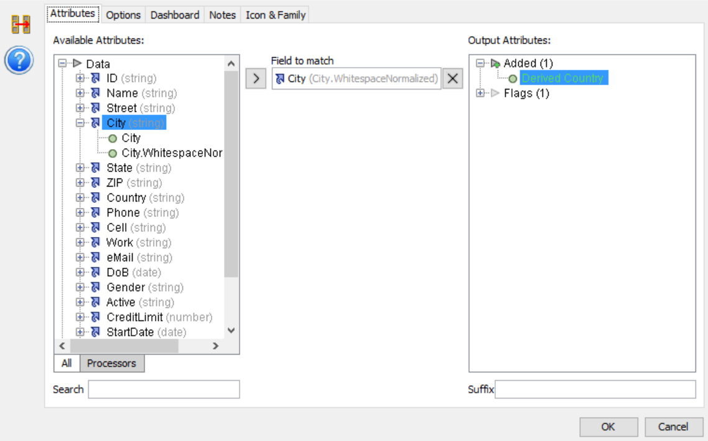
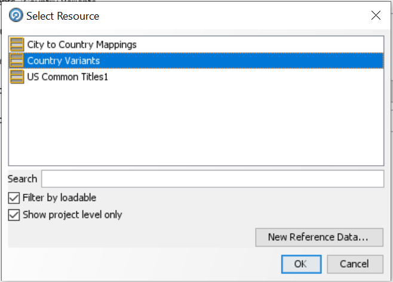
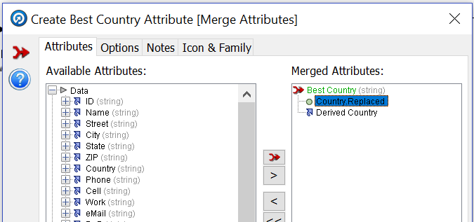
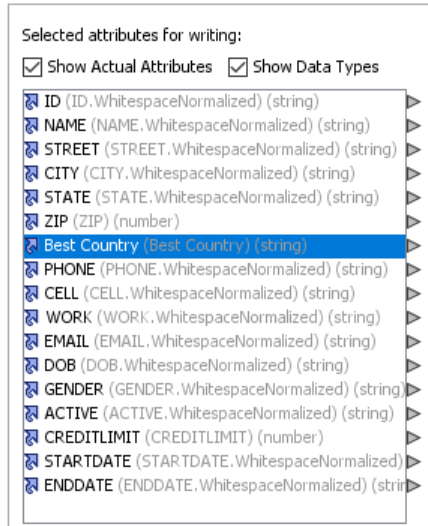
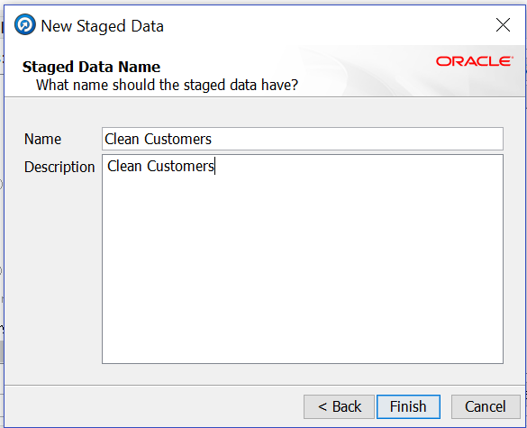

# Data Standardization

## Introduction
This lab describes how to implement data standardization and enhancement rules in Enterprise Data Quality.

*Estimated Lab Time* - 30 minutes

### Objectives
You will be working on the below EDQ components in this lab.
* Normalize Whitespace - Remove extra whitespaces in data
* Enhance from Map - Derive the country from city
* Replace - Standardize country value
* Merge - Remove null/duplicate values
* Writer - Write the results to a staged data

### Prerequisites
This lab assumes you have:
- A Free Tier, Paid or LiveLabs Oracle Cloud account
- SSH Private Key to access the host via SSH
- You have completed:
    - Lab: Generate SSH Keys
    - Lab: Prepare Setup
    - Lab: Environment Setup
    - Lab: Access and Configure EDQ
    - Lab: Data Profiling
    - Lab: Reference Data
    - Lab: Data Auditing

## **STEP 1:** Normalize Whitespace

1.	Create a New Process under your project in the “Project Browser” by right-clicking on “Processes” and clicking “New Process…”.

2.	Select “US Customer Data” and click “Next”. Click “Next” without adding any profiling.

3.	Name your process “Clean Data” and then click "Finish".

4.	Return to the “Tool Palette” on the right side of the screen and find the “Normalize Whitespace” processor under the “Transformation” category.

    **Note**: You can always use the search box on the bottom of the “Tool Palette” to help you find the processor you are looking for.

5.	Connect the “Reader” to the “Normalize Whitespace” processor. The Normalize Whitespace Dialog Box appears on screen. Click on “Select All” icon and click “OK”.

    

6.	Click the “Run” icon to start the process.

## **STEP 2:** Enhance from Map
1.	Find the “Enhance from Map” processor from the “Tool Palette” (you can use the "Search" field, type "Enhance"). Drag and drop the processor to the "Process Canvas". Double click the “Enhance from Map” and rename it to “Country from City”.

    

2.	Connect “Normalize Whitespace” processor to “Country from City” processor. In the “Country from City” dialog box, expand the "City" field from the “Available Attributes” to observe the extra metadata value(s) created by the “Normalize Whitespace” processor. Double-click on “City” (the “City” to the right of the blue arrow) to add “City” to the “Field to Match”. Next, click the “Options” tab at the top of the dialog box.

    

3.	Click the “Browse” button within the “Value Map” section to select the reference data we will use.

    

4.	Select “City to Country Mappings”, click “OK” to continue.

    

5.	Click “Attributes” tab on the top left corner of the dialog box to adjust the name of the “Output Attribute”. Double click in the current value (EnhancedResult) and change it to “Derived Country”, then click “OK”.

    

6.	Click the “Run” icon to start the process.

7.	You will notice several unenhanced results, but we are not done yet! Feel free to drill down on the “Enhanced” and “Unenhanced” values (Result Browser panel) to glance at what this processor did.

    

## **STEP 3:** Replace

1.	Go back to the “Tool Palette” and search for the “Replace” processor. Drag and drop the “Replace” processor to the “Project Canvas”. Rename “Replace” processor to “Standardize Country”.

2.	Connect the “All” end triangle from the “Country from City” processor to the “Standardize Country” processor. The configuration dialog appears, double-click the “Country” field to add “Country.WhitespaceNormalized” to the “Input field”. Then click the “Options” tab at the top of the dialog box to setup the replacements.

    

    **Note**: If you want, you could select the original 'country' value from the source data. By default, EDQ will take the most recent field conversion as the input attribute (e.g. it will take fullname.whitespacenormalized and not the original fullname field from the source data).

3.	Click the “Browse” button on the “Replacements” row.

    

4.	Select “Country Variants” and click “OK”.

    

5.	Click the “Run” icon to start the process.

## **STEP 4:** Merge

1.	Return to the “Tool Palette” and search for “Merge”. Drag and drop the “Merge Attributes” processor onto the “Project Canvas” and rename it to “Create Best Country Attribute”.

    

    We will use this to combine the “Country” and “Derived Country” columns to a single attribute.

2.	Connect the “All” end triangle from “Standardize Country” to the “Create Best Country Attribute” processor. In the dialog applet, double-click on “Country.Replaced” and “Derived Country” from the “Available Attributes” to add to the “Merged Attributes”. Lastly, double click on “Merged (string)” at the top of the “Merged Attribute” section and type “Best Country”, then click “OK” to continue.

    

3.	Click the “Run” icon to start the process then click on “Create Best Country Attribute” processor to view the results in the “Results Browser” panel.

    

    Notice how the two columns, “Country.Replaced” and “Derived Country” have now been merged to a single column “Best Country”.

## **STEP 5:** Writer

1.	In the “Tool Palette”, search for “Writer”. This processor enables an EDQ process to write data to different types of data stores, for example, Staged Data. Drag and drop the “Writer” to the right of the “Create Best Country Attribute” processor on the Project Canvas.

    

2.	Connect the end triangle from the “Create Best Country Attribute” processor to the “Writer” processor. The writer dialog comes up. click button ">>" to select all “Available Attributes”. Using button "<" send back attributes “Country” and “Derived Country”. Drag and drop “Best Country” until it is after “ZIP” and before “Phone”.

    

3.	Now press the "+" button on the right side of the “Writer Configuration” dialog box to add a new staged data set.

    

4.	Double click on “Best Country” and rename it to “Country”.

    

5.	Click “Next” to accept the default configuration of creating the staged data set.
6.	Provide the following information:
    - Name: Clean Customers
    - Description: Clean Customers
7.	Click “Finish”.
8.	Click OK to finish setting up the Writer Configuration.

    

9.	Click the “Run” icon to start the process.

Now, you can see the standardized data in the Result Browser by clicking on Writer component.

You may now *proceed to the next lab*.

## Learn More
- [Oracle Enterprise Data Quality](https://docs.oracle.com/en/middleware/fusion-middleware/enterprise-data-quality/index.html)

## Acknowledgements
* **Author** - Ravi Lingam, Sri Vishnu Gullapalli, Data Integration Team, Oracle, August 2020
* **Contributors** - Meghana Banka, Rene Fontcha, Narayanan Ramakrishnan
* **Last Updated By/Date** - Rene Fontcha, LiveLabs Platform Lead, NA Technology, January 2021

## Need Help?
Please submit feedback or ask for help using our [LiveLabs Support Forum](https://community.oracle.com/tech/developers/categories/goldengate-on-premises). Please click the **Log In** button and login using your Oracle Account. Click the **Ask A Question** button to the left to start a *New Discussion* or *Ask a Question*.  Please include your workshop name and lab name.  You can also include screenshots and attach files.  Engage directly with the author of the workshop.

If you do not have an Oracle Account, click [here](https://profile.oracle.com/myprofile/account/create-account.jspx) to create one.
