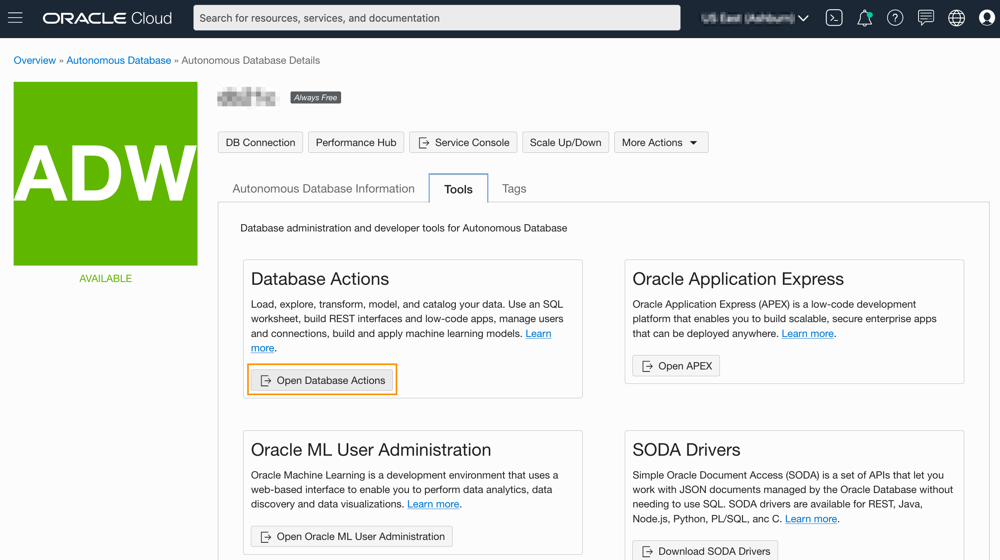
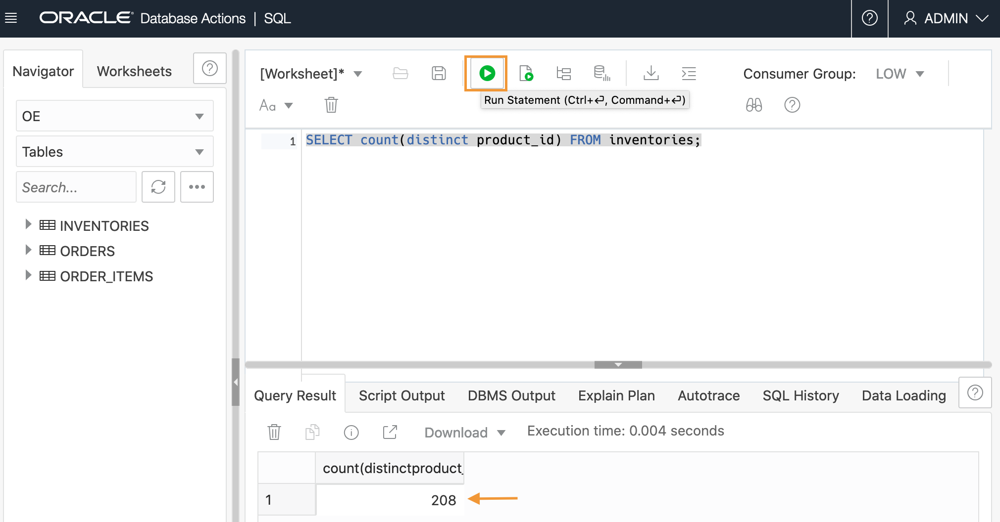

# New Set Operators

## Introduction
This lab introduces new operators, parameters, expressions and SQL Macros available in the latest release of Oracle Database, 21c. Oracle 21c introduces three new operators, EXCEPT, EXCEPT ALL and INTEREST ALL. The SQL set operators now support all keywords as defined in ANSI SQL. The new operator EXCEPT [ALL] is functionally equivalent to MINUS [ALL]. The operators MINUS and INTERSECT now support the keyword ALL.

Set operators are nothing new to the Oracle Database.  They join the following SQL set operators introduced prior to 21c.
- UNION
- UNION ALL
- INTERSECT
- MINUS
- ORDER BY

This lab shows how to use the new set operators, EXCEPT, EXCEPT ALL and INTERSECT ALL.

Estimated Lab Time: 10 minutes

### Objectives

In this lab, you will:
<if type="atp">* Login to SQL Developer Web as the Order Entry (OE) user
* Run queries using the new 21c operators EXCEPT and INTERSECT </if>
<if type="dbcs">* Run queries on Order Entry data using the new 21c operators EXCEPT and INTERSECT</if>

### Prerequisites
<if type="dbcs">
* An Oracle Free Tier, Paid or LiveLabs Cloud Account
* Lab: SSH Keys
* Lab: Create a DBCS VM Database
* Lab: 21c Setup
</if>
<if type="atp">

* An Oracle Always Free/Free Tier, Paid or LiveLabs Cloud Account
* Lab: Provision ADB
* Lab: Setup
</if>

<if type="dbcs">
## **STEP  1**: Set up the environment

In this step you will execute the `/home/oracle/labs/M104783GC10/setup_oe_tables.sh` shell script. The shell script creates and loads the `OE.INVENTORIES`, `OE.ORDERS` and `OE.ORDER_ITEMS` tables.

1.  Open up the Oracle Cloud Shell or terminal of your choice and login to the 21c instance in DB Systems.  Switch to the oracle user.
	````
	ssh -i ~/.ssh/sshkeyname opc@Your Compute Instance Public IP Address
	sudo su - oracle
	````

2.  Change to the lab directory and run the shell script to setup the tables

	```

	$ <copy>cd /home/oracle/labs/M104783GC10</copy>

	```

2. Run the script to setup the Order Entry (OE) tables.

	```
	$ <copy>/home/oracle/labs/M104783GC10/setup_oe_tables.sh</copy>

	...

	Commit complete.

	Disconnected from Oracle Database 21c Enterprise Edition Release 21.0.0.0.0 - Production

	Version 21.2.0.0.0

	$

	```
</if>
<if type="atp">
## **STEP  1**: Login to SQL Developer Web on ADB

There are multiple ways to access your Autonomous Database.  You can access it via sqlplus or by using SQL Developer Web.  To access it via sqlplus, skip to [Step 1B](#STEP1B:LogintoADBusingSQLPlus).

1.  If you aren't still logged in, login to your ADB screen by clicking on the Hamburger Menu and selecting the Autonomous Database flavor you selected (ATP, ADW or AJD). Otherwise skip to the next step.
      

2.  If you can't find your ADB instance, ensure you are in the correct compartment, you have chosen the flavor of ADB you choose in the earlier lab and that you are in the correct region.
3.  Click on the **Display Name** to go to your ADB main page.
      

4.  Click on the **Tools** tab, select **Database Actions**, a new browser will open up.
      

5.  Login with the *admin* user, click **Next**.  Enter the password *WElcome123##* 
6.  Click on the **SQL** button.
7.  Change the word *admin* in the URL to *oe*.  You will be logging in to the admin schema
8.  Enter the username *oe* and password *WElcome123##*
</if>

## **STEP  1B**: Login to ADB using SQL Plus
1. If you aren't logged into the cloud, log back in
2. Open up Cloud Shell 
3. Connect to the OE user using sqlplus by entering the commands below.
   
    ```
    export TNS_ADMIN=$(pwd)/wallet
    sqlplus /nolog
	conn oe/WElcome123##@adb1_high
	```

## **STEP  2**: Test the set operator with the `EXCEPT` clause

<if type="dbcs">

1. Connect to `PDB21` as `OE`.

	```
	$ <copy>sqlplus oe@PDB21</copy>
	Copyright (c) 1982, 2020, Oracle.  All rights reserved.
	Enter password: <b><i>WElcome123##</i></b>
	Last Successful login time: Mon Mar 16 2020 11:32:00 +00:00
	Connected to:
	SQL>
	```
</if>
<if type="atp">
For the subsequent sections you will be pasting sql into the SQL worksheet and pressing the green play button or Ctrl+Enter to execute the highlighted statement.  You can also run this in the terminal by logging in to sqlplus as oe/WElcome123##@adb1_high.

1. Click the admin drop down and scroll down and choose the OE schema.  Note that there are 3 tables that you setup in the previous lab.  Enter the following sql queries to explore set operators.
</if>
2. Count in both tables, `INVENTORIES` and `ORDER_ITEMS`, respectively the number of products available in the inventory and the number of products that customers ordered.  Start with the `INVENTORIES` table.


	```
	SQL> <copy>SELECT count(distinct product_id) FROM inventories;</copy>

	<if type="atp">
	```
    
	</if>
	<if type="dbcs">
	COUNT(PRODUCT_ID)
	-----------------
				208
	```
	</if>

3. Run a count in the `ORDER_ITEMS` table.  Note the difference.

	```

	SQL> <copy>SELECT count(distinct product_id) FROM order_items;</copy>

	<if type="atp">
	```
    
	</if>
	<if type="dbcs">	
	COUNT(PRODUCT_ID)
	-----------------
				185
	SQL>
	```
	</if>

4. How many products are in the inventory that were never ordered? Use the `EXCEPT` operator to retrieve only unique rows returned by the first query but not by the second.


	```

	SQL> <copy>SELECT count(*) FROM
			(SELECT product_id FROM inventories
			EXCEPT
			SELECT product_id FROM order_items);</copy>

	COUNT(*)
	----------
		84

	SQL>

	```

5. How many products were ordered that are now missing in the inventory? The order of the queries is relevant for the result.


	```

	SQL> <copy>SELECT count(*) FROM
			(SELECT product_id FROM order_items
					EXCEPT
			SELECT product_id FROM inventories);
		</copy>

	COUNT(*)
	----------
    61

	SQL>

	```

## **STEP  3**: Test the set operator with the `EXCEPT ALL` clause

1. Would the usage of ALL in the set operator defined in a query in a previous step mean anything? Run the SQL statement using the *EXCEPT ALL* operator.

	```
	SQL> <copy>SELECT product_id FROM inventories
		EXCEPT ALL
		SELECT product_id FROM order_items;</copy>

	PRODUCT_ID
	----------
		1729
		1729
		1729
		1733
		1733
		1733
	...
		3502
		3502
		3502
		3502
		3502
		3503
		3503
		3503
		3503
		3503

	826 rows selected.
	```

2. Run the same query but reverse the tables.  

	```
	SQL> <copy>SELECT count(*) FROM
		(SELECT product_id FROM inventories
		EXCEPT ALL
		SELECT product_id FROM order_items);</copy>

	COUNT(*)
	----------
		826

	SQL>

	```

The result shows all rows in the `INVENTORIES` table that contain products that were never ordered all inventories. This does not mean anything relevant. The use of `ALL` in operators must be appropriate.

## **STEP  4**: Test the set operator with the `INTERSECT` clause

1. How many products that were ordered are still orderable? The statement combining the results from two queries with the `INTERSECT` operator returns only those unique rows returned by both queries.

	````
	SQL> <copy>SELECT count(*) FROM
		(SELECT product_id FROM inventories
		INTERSECT
		SELECT product_id FROM order_items);</copy>

	COUNT(*)
	----------
		124

	````

2. Run the sql statement below reversing the intersect clause.

	````
	SQL>
	<copy>
	SELECT count(*) FROM
		(SELECT product_id FROM order_items
		INTERSECT
		SELECT product_id FROM inventories);
		</copy>

	COUNT(*)
	----------
		124

	SQL>

	````

## **STEP  5**: Test the set operator with the `INTERSECT ALL` clause

1. Would the usage of `ALL` in the operator defined in the query in step 8 mean anything?

	```

	SQL> <copy>SELECT count(*) FROM
		(SELECT product_id FROM order_items
		INTERSECT ALL
		SELECT product_id FROM inventories);</copy>

	COUNT(*)
	----------
		286
	```

2. Exit SQL*Plus

	```
	SQL> <copy>exit</copy>
	```

	The result shows all rows in the `INVENTORIES` table that contain products that were ordered. This does not mean that these products were ordered from these warehouses. The query does not mean anything relevant. The use of `ALL` in operators must be appropriate.

You may now [proceed to the next lab](#next).

## Acknowledgements
* **Author** - Donna Keesling, Database UA Team
* **Contributors** -  David Start, Kay Malcolm, Database Product Management
* **Last Updated By/Date** -  Kay Malcolm, March 2020

