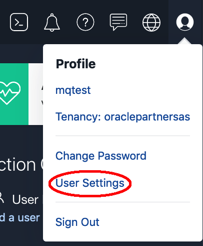
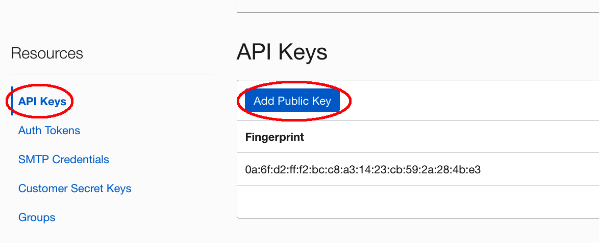
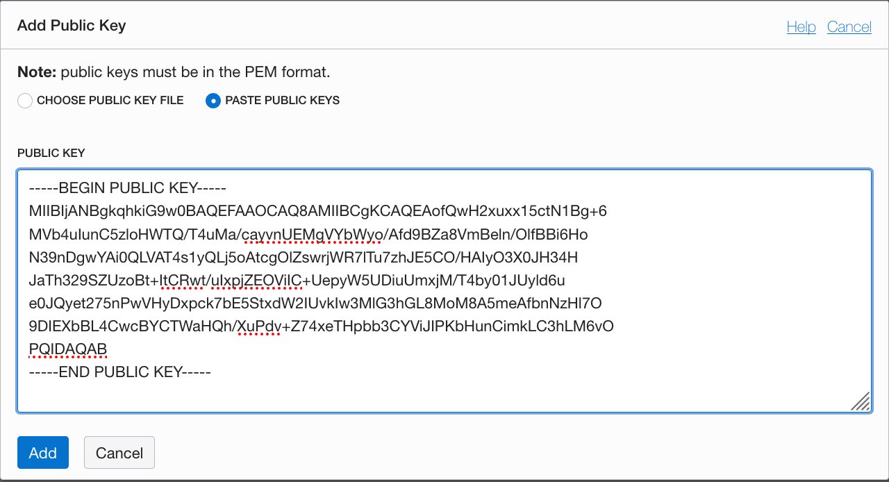
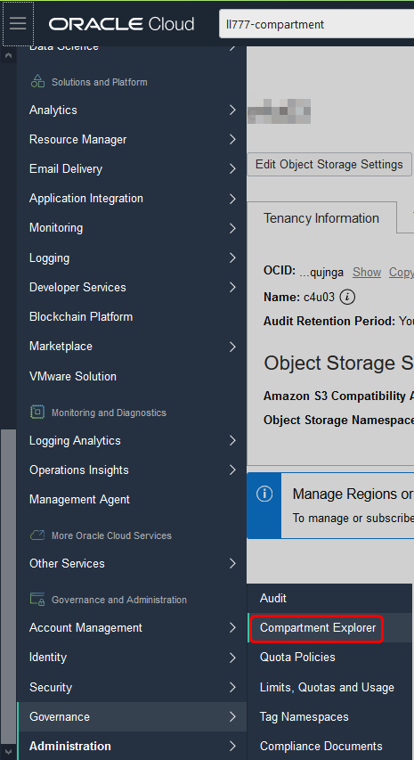
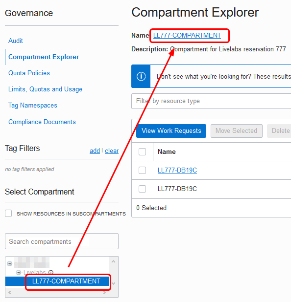
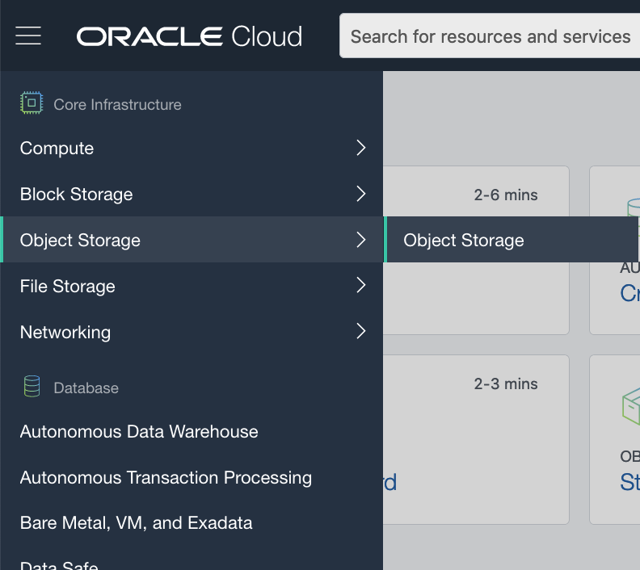
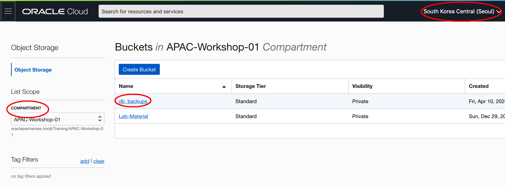
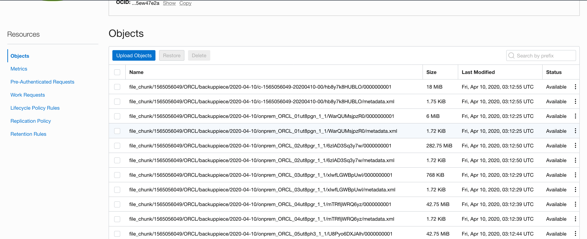

# Oracle Database Backup Service to OCI

## Introduction

Oracle Database Backup Service (ODBS) is a backup-as-a-service offering that enables customers to store their backups securely in the Oracle cloud. ODBS provides a transparent, scalable, efficient, and elastic cloud storage platform for Oracle database backups. The client side Oracle Database Cloud Backup Module which is used with Recovery Manager (RMAN) transparently handles the backup and restore operations.

Oracle Database Cloud Backup Module is the cloud backup module that is installed in the database server. During the install process, a platform specific backup module is downloaded and installed. The RMAN environment of the client database is configured to use the cloud backup module to perform backups to ODBS. Using familiar RMAN commands, backups and restores are transparently handled by the backup module.

*Supported Database Versions* - You can back up Oracle Database 11g Release 2 (11.2.0.4) and later to Oracle Database Backup Cloud Service.

Estimated Lab Time: 2 hours

### Objectives

- Install the Oracle Database Cloud Backup Module onto the VM image provided in the workshop. The database provided is used as our “On-Premise” example.

- Configure RMAN to support the Oracle Database Cloud Backup Module. Then, backup the database and take a restore point to be used for Point-In-Time-Recovery.

- Do a destructive operation to the database and then Restore and Recover to a specific Point-In-Time.


### Prerequisites

- On premise Oracle Database version 11.2.0.4 or higher
- An OCI account with proper privileges to access the object storage in OCI


## **STEP 1:** Download the Cloud Backup Module

1. Log back in as user **oracle**.

    ```
    <copy>sudo su - oracle</copy>
    ```

2. Create a `downloads` directory and cd into it.

    ```
    <copy>mkdir downloads ; cd downloads</copy>
    ```

3. You can download the backup module from [Oracle Cloud Backup Downloads](https://www.oracle.com/database/technologies/oracle-cloud-backup-downloads.html), however, to load the zip through Cloud Shell, you will use this `wget` command:

    ```
    <copy>wget https://objectstorage.us-ashburn-1.oraclecloud.com/p/wca3eJkQbQO5uK8yNu33FVtASa0gLhZC1CMrXW6rsEb8JunoEHtw4zlsjQYBCb-x/n/c4u03/b/data-management-library-files/o/opc_installer.zip</copy>
    ```

4. Extract the contents of the zip file. The file contains two directories: oci\_installer and opc\_installer, and a README file.

    ```
    [oracle@dbhost downloads]$ <copy>unzip opc_installer.zip; cd opc_installer</copy>
    ```

5. The **oci\_installer** directory contain the Oracle Database Cloud Backup Module for OCI, the **opc\_installer** directory contain the Oracle Database Cloud Backup Module for OCI Classic. In the following steps we will use Oracle Cloud Infrastructure, so cd into the **oci\_installer** directory.

    ```
    [oracle@dbhost opc_installer]$ <copy>cd oci_installer/</copy>
    ```

    ```
    [oracle@dbhost oci_installer]$ <copy>ls</copy>
    oci_install.jar  oci_readme.txt
    ```

6. Check your JDK version is JDK 1.7 or above.

    ```
    [oracle@dbhost oci_installer]$ <copy>java -version</copy>
    openjdk version "1.8.0_232"
    OpenJDK Runtime Environment (build 1.8.0_232-b09)
    OpenJDK 64-Bit Server VM (build 25.232-b09, mixed mode)
    ```

## **STEP 2:** Prepare SSH Keys Pairs and collect data

For the Oracle Database Backup Cloud Service, you need to have the identifiers and credentials below.  You will need an OCI user able to call APIs with these credentials.

   - RSA key pair in PEM format (minimum 2048 bits).
   - Fingerprint of the public key.
   - Tenancy OCID and user OCID.

1. If you haven't already, create a `.oci` directory to store the credentials:

    ```
    <copy>mkdir ~/.oci</copy>
    ```

2. Generate the private key with one of the following commands.

    ```
    <copy>openssl genrsa -out ~/.oci/oci_api_key.pem 2048</copy>
    ```

3. Ensure that only you can read the private key file:

    ```
    <copy>chmod go-rwx ~/.oci/oci_api_key.pem</copy>
    ```

4. Generate the public key:

    ```
    <copy>openssl rsa -pubout -in ~/.oci/oci_api_key.pem -out ~/.oci/oci_api_key_public.pem</copy>
    ```

5. Cat the public key. Copy all the content of the public key.

    ```
    <copy>cat ~/.oci/oci_api_key_public.pem</copy>
    ```

6. Get the key's fingerprint with the following OpenSSL command. If you are using Windows you can get the fingerprint with Git Bash for Windows.

    ```
    <copy>openssl rsa -pubout -outform DER -in ~/.oci/oci_api_key.pem | openssl md5 -c</copy>
    ```

   When you upload the public key in the Console, the fingerprint is also automatically displayed there.

7. From the OCI console, click the user icon (top right of your browser) and click **User Settings**. Click **API Keys** and **Add Public Key**.
   
   

8. Paste the content of oci\_api\_key\_public.pem copied earlier and click **Add**. A new finger print will be generated. Compare the fingerprint in the output of config file to the one in OCI console window and make sure they match.
   

  Make a note of the fingerprint for later.

  To see more information about generating the keys and finding your OCIDs, refer to [API Signing Key](https://docs.cloud.oracle.com/en-us/iaas/Content/API/Concepts/apisigningkey.htm).

9. On the User Details page, copy the user OCID and save it for later:

  

10. Click on the user icon again and click **Tenancy: <tenancy-name>**, then copy and save the tenancy OCID for later:

  

<if type="livelabs">
11. From the Oracle Cloud menu, select **Governance** -> **Compartment Explorer**.

  

12. Select the compartment assigned to you from the left, then click on the compartment link above.

  
</if>
13. From your compartment details page, copy the compartment OCID and save it for later.

  

## **STEP 3:** Install the Backup Module

Run the installer, **oci\_install.jar** to install the backup module. This example shows how the installer automatically downloads the Oracle Database Cloud Backup Module for OCI for your operating system, creates a wallet that contains Oracle Database Backup Cloud Service identifiers and credentials, creates the backup module configuration file, and downloads the library necessary for backups and restores to Oracle Cloud Infrastructure.  Provide the required parameters in one line, with each parameter preceded by a hyphen and followed by its value.

The following table lists the required and some optional parameters.

| **Parameter**             | **Description**                                              | **Required or Optional**|
| ------------------------- | ------------------------------------------------------------ |-------------------------|
| -host                     | End point of the Oracle Cloud Infrastructure account. Constructed as https://objectstorage.`<region>`.oraclecloud.com. See [this reference](https://docs.cloud.oracle.com/en-us/iaas/Content/General/Concepts/regions.htm) for the region codes.       |Required                 |
| -vtKeyFile               | File that contains the private key used to authenticate Oracle Cloud Infrastructure API requests. The key file must be in PEM format. |Required|
| -pubFingerPrint           | Finger print of the public key paired with the specified private key. |Required|
| -tOCID          | Tenancy OCID for the Oracle Cloud Infrastructure account.    |Required|
| -uOCID          | User OCID for the Oracle Cloud Infrastructure account.       |Required|
| -cOCID          | Resource compartment ID for the Oracle Cloud Infrastructure account. |Required|
| -bucket         | Name of the bucket in which backups are stored. If this bucket does not exist, then the installer creates it. When this parameter is omitted, a default bucket is automatically created to store backups |Optional|
| -walletDir      | Directory in which Oracle Cloud Infrastructure Object Storage credentials are stored. |Required|
| -libDir         | Directory in which the system backup to tape (SBT) library used for backups and restores with Oracle Cloud Infrastructure is stored. |Required|


The installation creates a configuration file *opcORCL.ora* and wallet directory *oci\_wallet* and places these in $ORACLE_HOME/dbs.

It also downloads a library file *libopc.so* (Linux and Unix) or *oraopc.dll* (Windows) that RMAN uses to communicate with the Oracle Database Backup Service and places that in $ORACLE_HOME/lib. You specified these locations in the syntax of the install command.

It also downloads cwallet.sso an Oracle wallet that securely stores Oracle Object Storage credentials.  This file is used during RMAN backup and restore operations.

1. Run the following command to install the backup module, changing the parameter values based on your environment.

      ```
      [oracle@dbhost oci_installer]$ <copy>java -jar oci_install.jar -host <host> -pvtKeyFile ~/.oci/oci_api_key.pem -pubFingerPrint <fingerprint> -uOCID <user-ocid> -tOCID <tenancy-ocid> -cOCID <compartment-ocid> -walletDir $ORACLE_HOME/dbs/oci_wallet -libDir $ORACLE_HOME/lib -bucket db_backups</copy>

      Oracle Database Cloud Backup Module Install Tool, build 19.3.0.0.0DBBKPCSBP_2019-10-16
      Oracle Database Cloud Backup Module credentials are valid.
      Backups would be sent to bucket db_backups.
      Oracle Database Cloud Backup Module wallet created in directory /u01/app/oracle/product/19c/dbhome_1/dbs/oci_wallet.
      Oracle Database Cloud Backup Module initialization file /u01/app/oracle/product/19c/dbhome_1/dbs/opcORCL.ora created.
      Downloading Oracle Database Cloud Backup Module Software Library from Oracle Cloud Infrastructure.
      Download complete.
      [oracle@dbhost oci_installer]$
      ```

2. Verify these files are present by entering the following commands:

      ```
      [oracle@dbhost oci_installer]$ <copy>ls $ORACLE_HOME/lib/libopc.so</copy>
      /u01/app/oracle/product/19c/dbhome_1/lib/libopc.so
      ```

      ```
      [oracle@dbhost oci_installer]$ <copy>ls $ORACLE_HOME/dbs/opc*</copy>
      /u01/app/oracle/product/19c/dbhome_1/dbs/opcORCL.ora
      ```

      ```
      [oracle@dbhost oci_installer]$ <copy>ls $ORACLE_HOME/dbs/oci_wallet</copy>
      cwallet.sso  cwallet.sso.lck
      ```

## **STEP 4:** Prepare the on premise database
Now, We will set the database to Archivelog mode. Create a user in the pdb and create a new table for testing the backup and recover.

1. Start a SQL\*Plus session

    ```  
    $ <copy>sqlplus / as sysdba </copy>
    ```

2. Execute the following SQL commands to set the Database to archivelog mode


      ```
      SQL> <copy>shutdown immediate;</copy>
      Database closed.
      Database dismounted.
      ORACLE instance shut down.
      ```

      ```
      SQL> <copy>startup mount;</copy>
      ORACLE instance started.

      Total System Global Area 9428793296 bytes
      Fixed Size		    9144272 bytes
      Variable Size		 1476395008 bytes
      Database Buffers	 7918845952 bytes
      Redo Buffers		   24408064 bytes
      Database mounted.
      ```

      ```
      SQL> <copy>alter database archivelog;</copy>

      Database altered.
      ```

      ```
      SQL> <copy>alter database open;</copy>

      Database altered.

      SQL>
      ```

3. Now let's create a user in  the pdb.

      ```
      SQL> <copy>show pdbs</copy>

      CON_ID CON_NAME			  OPEN MODE  RESTRICTED
      ---------- ------------------------------ ---------- ----------
         2 PDB$SEED			  READ ONLY  NO
         3 ORCLPDB			  READ WRITE NO
      ```

      ```
      SQL> <copy>alter session set container=orclpdb;</copy>

      Session altered.
      ```

      ```
      SQL> <copy>show con_name</copy>

      CON_NAME
      ------------------------------
      ORCLPDB
      ```

      ```
      SQL> <copy>create user johnsmith identified by johnsmith;</copy>

      User created.
      ```

      ```
      SQL> <copy>grant connect, resource, dba, create table to johnsmith;</copy>

      Grant succeeded.

      SQL>
      ```

4. Create a new table for testing database backup and recovery.

      ```
      SQL> <copy>create table johnsmith.mstars(firstname varchar2(20),lastname varchar2(20));</copy>

      Table created.
      ```

      ```
      SQL> <copy>
      insert into johnsmith.mstars values('Jimmy','Stewart');
      insert into johnsmith.mstars values('Katharine','Hepburn');
      insert into johnsmith.mstars values('Tom','Hanks');
      insert into johnsmith.mstars values('Anne','Hathaway');</copy>
      1 row created.

      SQL>
      1 row created.

      SQL>
      1 row created.

      SQL>

      1 row created.

      SQL>
      ```

      ```
      SQL> <copy>commit;</copy>

      Commit complete.
      ```

      ```
      SQL> <copy>exit</copy>
      Disconnected from Oracle Database 19c Enterprise Edition Release 19.0.0.0.0 - Production
      Version 19.5.0.0.0
      [oracle@dbhost oci_installer]$
      ```

## **STEP 5:** Configure RMAN to support Cloud Backups

   Before we can do backups to the Cloud storage location in your account, you need to configure a number of RMAN properties. These properties define:

- How long to retain the backups (30 days)
- Setting up a device type called `sbt_tape` that uses the library and config files you just installed. Notice that any defined storage chunks in the cloud will have names starting with `onPremBackup_`.
- Turning on Encryption. This is for data security and mandatory for an on premise to cloud backup scenario.
- Set a degree of parallelism so that multiple threads will be backing-up/restoring your datafiles. This is for performance.
- Setting backup optimization to ON so that RMAN will not do unnecessary transfers to and from the cloud. (e.g. If a backup file is already present and has not had any changes before a “new” backup is performed, this file will not be dealt with, saving time).
- Setting a compression level for the files going to/from the cloud.
- Configuring the `sbt_tape` device as the default for all backups.

1. Connect RMAN to the local database using ```rman target /```

      ```
      $ <copy>rman target /</copy>

      Recovery Manager: Release 19.0.0.0.0 - Production on Fri Apr 10 02:46:38 2020
      Version 19.5.0.0.0

      Copyright (c) 1982, 2019, Oracle and/or its affiliates.  All rights reserved.

      connected to target database: ORCL (DBID=1565056049)

      RMAN>    
      ```

2. Commands in RMAN can be run in blocks so you can do a sequence all at once. Copy and Paste from the entire run block as shown below:

      ```
      <copy>
      run {
      configure retention policy to recovery window of 30 days;
      configure channel device type 'sbt_tape' MAXPIECESIZE 2 G FORMAT  'onprem_%d_%U' PARMS 'SBT_LIBRARY=libopc.so, ENV=(OPC_PFILE=/u01/app/oracle/product/19c/dbhome_1/dbs/opcORCL.ora)';
      configure encryption for database on;
      configure device type 'sbt_tape' parallelism 3 backup type to backupset;
      configure backup optimization on;
      configure compression algorithm 'MEDIUM' as of release 'default' optimize for load true;
      configure default device type to sbt_tape;
      }
      </copy>
      ```

3. Hit Enter and the parameters will be set to the following:

      ```
      RMAN> run {
      configure retention policy to recovery window of 30 days;
      configure channel device type 'sbt_tape' MAXPIECESIZE 2 G FORMAT  'onprem_%d_%U' PARMS 'SBT_LIBRARY=libopc.so, ENV=(OPC_PFILE=/u01/app/oracle/product/19c/dbhome_1/dbs/opcORCL.ora)';
      configure encryption for database on;
      configure device type 'sbt_tape' parallelism 3 backup type to backupset;
      configure backup optimization on;
      configure compression algorithm 'MEDIUM' as of release 'default' optimize for load true;
      configure default device type to sbt_tape;
      }2> 3> 4> 5> 6> 7> 8> 9>

      new RMAN configuration parameters:
      CONFIGURE RETENTION POLICY TO RECOVERY WINDOW OF 30 DAYS;
      new RMAN configuration parameters are successfully stored

      new RMAN configuration parameters:
      CONFIGURE CHANNEL DEVICE TYPE 'SBT_TAPE' MAXPIECESIZE 2 G FORMAT   'onprem_%d_%U' PARMS  'SBT_LIBRARY=libopc.so, ENV=(OPC_PFILE=/u01/app/oracle/product/19c/dbhome_1/dbs/opcORCL.ora)';
      new RMAN configuration parameters are successfully stored

      new RMAN configuration parameters:
      CONFIGURE ENCRYPTION FOR DATABASE ON;
      new RMAN configuration parameters are successfully stored

      new RMAN configuration parameters:
      CONFIGURE DEVICE TYPE 'SBT_TAPE' PARALLELISM 3 BACKUP TYPE TO BACKUPSET;
      new RMAN configuration parameters are successfully stored

      new RMAN configuration parameters:
      CONFIGURE BACKUP OPTIMIZATION ON;
      new RMAN configuration parameters are successfully stored

      new RMAN configuration parameters:
      CONFIGURE COMPRESSION ALGORITHM 'MEDIUM' AS OF RELEASE 'default' OPTIMIZE FOR LOAD TRUE;
      new RMAN configuration parameters are successfully stored

      new RMAN configuration parameters:
      CONFIGURE DEFAULT DEVICE TYPE TO 'SBT_TAPE';
      new RMAN configuration parameters are successfully stored

      RMAN>
      ```

4. You can verify the changes in RMAN by typing **show all;**

      ```
      RMAN> <copy>show all;</copy>

      RMAN configuration parameters for database with db_unique_name ORCL are:
      CONFIGURE RETENTION POLICY TO RECOVERY WINDOW OF 30 DAYS;
      CONFIGURE BACKUP OPTIMIZATION ON;
      CONFIGURE DEFAULT DEVICE TYPE TO 'SBT_TAPE';
      CONFIGURE CONTROLFILE AUTOBACKUP ON; # default
      CONFIGURE CONTROLFILE AUTOBACKUP FORMAT FOR DEVICE TYPE SBT_TAPE TO '%F'; # default
      CONFIGURE CONTROLFILE AUTOBACKUP FORMAT FOR DEVICE TYPE DISK TO '%F'; # default
      CONFIGURE DEVICE TYPE 'SBT_TAPE' PARALLELISM 3 BACKUP TYPE TO BACKUPSET;
      CONFIGURE DEVICE TYPE DISK PARALLELISM 1 BACKUP TYPE TO BACKUPSET; # default
      CONFIGURE DATAFILE BACKUP COPIES FOR DEVICE TYPE SBT_TAPE TO 1; # default
      CONFIGURE DATAFILE BACKUP COPIES FOR DEVICE TYPE DISK TO 1; # default
      CONFIGURE ARCHIVELOG BACKUP COPIES FOR DEVICE TYPE SBT_TAPE TO 1; # default
      CONFIGURE ARCHIVELOG BACKUP COPIES FOR DEVICE TYPE DISK TO 1; # default
      CONFIGURE CHANNEL DEVICE TYPE 'SBT_TAPE' MAXPIECESIZE 2 G FORMAT   'onprem_%d_%U' PARMS  'SBT_LIBRARY=libopc.so, ENV=(OPC_PFILE=/u01/app/oracle/product/19c/dbhome_1/dbs/opcORCL.ora)';
      CONFIGURE MAXSETSIZE TO UNLIMITED; # default
      CONFIGURE ENCRYPTION FOR DATABASE ON;
      CONFIGURE ENCRYPTION ALGORITHM 'AES128'; # default
      CONFIGURE COMPRESSION ALGORITHM 'MEDIUM' AS OF RELEASE 'default' OPTIMIZE FOR LOAD TRUE;
      CONFIGURE RMAN OUTPUT TO KEEP FOR 7 DAYS; # default
      CONFIGURE ARCHIVELOG DELETION POLICY TO NONE; # default
      CONFIGURE SNAPSHOT CONTROLFILE NAME TO '/u01/app/oracle/product/19c/dbhome_1/dbs/snapcf_ORCL.f'; # default

      RMAN>   
      ```

## **STEP 6:** Backup the On Premise Database

For backup and recovery we could always run the following sequence of commands from a shell script or an RMAN run block, but we’ll be copying and pasting each individual command in sequence so you’ll get a better feel for what is going on.

For security reasons, backing up to the Oracle Cloud requires that encryption is used. Options are - Transparent Data Encryption (TDE) and/or password encryption. We will be using password encryption in this lab.

1. Set password encryption

      ```
      RMAN> <copy>set encryption on identified by 'Oracle_1' only;</copy>

      executing command: SET encryption

      RMAN>
      ```

2. Copy and Paste the backup command

      ```
      <copy>
      backup as compressed backupset tag 'onprem' database plus archivelog;
      </copy>
      ```

   The backup will commence. Depending on the speed of your network this will take about 30 minutes. The database control files and SPFILE are the last part to be backed up.

      ```
      Starting backup at 10-APR-20
      current log archived
      allocated channel: ORA_SBT_TAPE_1
      channel ORA_SBT_TAPE_1: SID=23 device type=SBT_TAPE
      channel ORA_SBT_TAPE_1: Oracle Database Backup Service Library VER=19.0.0.1
      allocated channel: ORA_SBT_TAPE_2
      channel ORA_SBT_TAPE_2: SID=18 device type=SBT_TAPE
      channel ORA_SBT_TAPE_2: Oracle Database Backup Service Library VER=19.0.0.1
      allocated channel: ORA_SBT_TAPE_3
      channel ORA_SBT_TAPE_3: SID=147 device type=SBT_TAPE
      channel ORA_SBT_TAPE_3: Oracle Database Backup Service Library VER=19.0.0.1
      channel ORA_SBT_TAPE_1: starting compressed archived log backup set
      channel ORA_SBT_TAPE_1: specifying archived log(s) in backup set
      input archived log thread=1 sequence=14 RECID=1 STAMP=1037329942
      channel ORA_SBT_TAPE_1: starting piece 1 at 10-APR-20
      channel ORA_SBT_TAPE_1: finished piece 1 at 10-APR-20
      piece handle=onprem_ORCL_01ut8pgn_1_1 tag=ONPREM comment=API Version 2.0,MMS Version 19.0.0.1
      channel ORA_SBT_TAPE_1: backup set complete, elapsed time: 00:00:03
      Finished backup at 10-APR-20

      Starting backup at 10-APR-20
      using channel ORA_SBT_TAPE_1
      using channel ORA_SBT_TAPE_2
      using channel ORA_SBT_TAPE_3
      channel ORA_SBT_TAPE_1: starting compressed full datafile backup set
      channel ORA_SBT_TAPE_1: specifying datafile(s) in backup set
      input datafile file number=00001 name=/u01/app/oracle/oradata/ORCL/system01.dbf
      input datafile file number=00003 name=/u01/app/oracle/oradata/ORCL/sysaux01.dbf
      channel ORA_SBT_TAPE_1: starting piece 1 at 10-APR-20
      channel ORA_SBT_TAPE_2: starting compressed full datafile backup set
      channel ORA_SBT_TAPE_2: specifying datafile(s) in backup set
      input datafile file number=00004 name=/u01/app/oracle/oradata/ORCL/undotbs01.dbf
      input datafile file number=00007 name=/u01/app/oracle/oradata/ORCL/users01.dbf
      channel ORA_SBT_TAPE_2: starting piece 1 at 10-APR-20
      channel ORA_SBT_TAPE_3: starting compressed full datafile backup set
      channel ORA_SBT_TAPE_3: specifying datafile(s) in backup set
      input datafile file number=00010 name=/u01/app/oracle/oradata/ORCL/orclpdb/sysaux01.dbf
      input datafile file number=00011 name=/u01/app/oracle/oradata/ORCL/orclpdb/undotbs01.dbf
      channel ORA_SBT_TAPE_3: starting piece 1 at 10-APR-20
      channel ORA_SBT_TAPE_2: finished piece 1 at 10-APR-20
      piece handle=onprem_ORCL_03ut8pgr_1_1 tag=ONPREM comment=API Version 2.0,MMS Version 19.0.0.1
      channel ORA_SBT_TAPE_2: backup set complete, elapsed time: 00:00:07
      channel ORA_SBT_TAPE_2: starting compressed full datafile backup set
      channel ORA_SBT_TAPE_2: specifying datafile(s) in backup set
      input datafile file number=00006 name=/u01/app/oracle/oradata/ORCL/pdbseed/sysaux01.dbf
      channel ORA_SBT_TAPE_2: starting piece 1 at 10-APR-20
      channel ORA_SBT_TAPE_3: finished piece 1 at 10-APR-20
      piece handle=onprem_ORCL_04ut8pgr_1_1 tag=ONPREM comment=API Version 2.0,MMS Version 19.0.0.1
      channel ORA_SBT_TAPE_3: backup set complete, elapsed time: 00:00:15
      channel ORA_SBT_TAPE_3: starting compressed full datafile backup set
      channel ORA_SBT_TAPE_3: specifying datafile(s) in backup set
      input datafile file number=00009 name=/u01/app/oracle/oradata/ORCL/orclpdb/system01.dbf
      input datafile file number=00012 name=/u01/app/oracle/oradata/ORCL/orclpdb/users01.dbf
      channel ORA_SBT_TAPE_3: starting piece 1 at 10-APR-20
      channel ORA_SBT_TAPE_2: finished piece 1 at 10-APR-20
      piece handle=onprem_ORCL_05ut8ph3_1_1 tag=ONPREM comment=API Version 2.0,MMS Version 19.0.0.1
      channel ORA_SBT_TAPE_2: backup set complete, elapsed time: 00:00:10
      channel ORA_SBT_TAPE_2: starting compressed full datafile backup set
      channel ORA_SBT_TAPE_2: specifying datafile(s) in backup set
      input datafile file number=00005 name=/u01/app/oracle/oradata/ORCL/pdbseed/system01.dbf
      channel ORA_SBT_TAPE_2: starting piece 1 at 10-APR-20
      channel ORA_SBT_TAPE_3: finished piece 1 at 10-APR-20
      piece handle=onprem_ORCL_06ut8pha_1_1 tag=ONPREM comment=API Version 2.0,MMS Version 19.0.0.1
      channel ORA_SBT_TAPE_3: backup set complete, elapsed time: 00:00:07
      channel ORA_SBT_TAPE_3: starting compressed full datafile backup set
      channel ORA_SBT_TAPE_3: specifying datafile(s) in backup set
      input datafile file number=00008 name=/u01/app/oracle/oradata/ORCL/pdbseed/undotbs01.dbf
      channel ORA_SBT_TAPE_3: starting piece 1 at 10-APR-20
      channel ORA_SBT_TAPE_1: finished piece 1 at 10-APR-20
      piece handle=onprem_ORCL_02ut8pgr_1_1 tag=ONPREM comment=API Version 2.0,MMS Version 19.0.0.1
      channel ORA_SBT_TAPE_1: backup set complete, elapsed time: 00:00:25
      channel ORA_SBT_TAPE_2: finished piece 1 at 10-APR-20
      piece handle=onprem_ORCL_07ut8phd_1_1 tag=ONPREM comment=API Version 2.0,MMS Version 19.0.0.1
      channel ORA_SBT_TAPE_2: backup set complete, elapsed time: 00:00:06
      channel ORA_SBT_TAPE_3: finished piece 1 at 10-APR-20
      piece handle=onprem_ORCL_08ut8phh_1_1 tag=ONPREM comment=API Version 2.0,MMS Version 19.0.0.1
      channel ORA_SBT_TAPE_3: backup set complete, elapsed time: 00:00:03
      Finished backup at 10-APR-20

      Starting backup at 10-APR-20
      current log archived
      using channel ORA_SBT_TAPE_1
      using channel ORA_SBT_TAPE_2
      using channel ORA_SBT_TAPE_3
      channel ORA_SBT_TAPE_1: starting compressed archived log backup set
      channel ORA_SBT_TAPE_1: specifying archived log(s) in backup set
      input archived log thread=1 sequence=15 RECID=2 STAMP=1037329972
      channel ORA_SBT_TAPE_1: starting piece 1 at 10-APR-20
      channel ORA_SBT_TAPE_1: finished piece 1 at 10-APR-20
      piece handle=onprem_ORCL_09ut8phk_1_1 tag=ONPREM comment=API Version 2.0,MMS Version 19.0.0.1
      channel ORA_SBT_TAPE_1: backup set complete, elapsed time: 00:00:01
      Finished backup at 10-APR-20

      Starting Control File and SPFILE Autobackup at 10-APR-20
      piece handle=c-1565056049-20200410-00 comment=API Version 2.0,MMS Version 19.0.0.1
      Finished Control File and SPFILE Autobackup at 10-APR-20

      RMAN>
      ```

   *NOTE: If for some reason your backup does not finish properly because of network issues, there is a way to clean up the partial backup files and retry. This is documented in the Appendix at the end of this lab*.

3. When creating a backup, the file chunks are placed in a user defined object storage buck **db\_backups** in the compartment, or it will use a system generated container called oracle-data-storage-xxx. We can verify the backup actually went to the cloud once the backup command has completed.

   Using RMAN, you can verify the backup files by typing: **list backup summary;**

      ```
      RMAN> <copy>list backup summary;</copy>


      List of Backups
      ===============
      Key     TY LV S Device Type Completion Time #Pieces #Copies Compressed Tag
      ------- -- -- - ----------- --------------- ------- ------- ---------- ---
      1       B  A  A SBT_TAPE    10-APR-20       1       1       YES        ONPREM
      2       B  F  A SBT_TAPE    10-APR-20       1       1       YES        ONPREM
      3       B  F  A SBT_TAPE    10-APR-20       1       1       YES        ONPREM
      4       B  F  A SBT_TAPE    10-APR-20       1       1       YES        ONPREM
      5       B  F  A SBT_TAPE    10-APR-20       1       1       YES        ONPREM
      6       B  F  A SBT_TAPE    10-APR-20       1       1       YES        ONPREM
      7       B  F  A SBT_TAPE    10-APR-20       1       1       YES        ONPREM
      8       B  F  A SBT_TAPE    10-APR-20       1       1       YES        ONPREM
      9       B  A  A SBT_TAPE    10-APR-20       1       1       YES        ONPREM
      10      B  F  A SBT_TAPE    10-APR-20       1       1       NO         TAG20200410T031253

      RMAN>
      ```

4. Enter the following command at the RMAN prompt**:**

      ```
      RMAN> <copy>create restore point gold preserve;</copy>

      Statement processed

      RMAN>
      ```

5. Exit RMAN

    ```
    RMAN> <copy>exit</copy>
    ```

5. Open a browser and login in to the OCI Console. Click the main menu and select **Object Storage**, Click the **Object Storage**.
   

6. Select the correct Region and Compartment, You can see the bucket named **db\_backups** in the Object Storage page,  Click the link and drill down.
   

7. In the bucket, you can see the file\_chunks of the backup set.
   

## **STEP 7:** Query and Exit

1. Open up a new terminal window and connect to the **johnsmith** schema in the local **orclpdb** container database.

      ```
      [oracle@dbhost ~]$ <copy>sqlplus johnsmith/johnsmith@orclpdb</copy>

      SQL*Plus: Release 19.0.0.0.0 - Production on Fri Apr 10 03:35:43 2020
      Version 19.5.0.0.0

      Copyright (c) 1982, 2019, Oracle.  All rights reserved.


      Connected to:
      Oracle Database 19c Enterprise Edition Release 19.0.0.0.0 - Production
      Version 19.5.0.0.0

      SQL>
      ```

2. There is a table called **mstars** in the schema. Query the table to see the records.

      ```
      SQL> <copy>select * from mstars;</copy>

      FIRSTNAME	     LASTNAME
      -------------------- --------------------
      Jimmy		     Stewart
      Katharine	     Hepburn
      Tom		     Hanks
      Anne		     Hathaway

      SQL>
      ```

3. Drop the table and query the table again:

      ```
      SQL> <copy>drop table mstars;</copy>

      Table dropped.
      ```

      ```
      SQL> <copy>select * from mstars;</copy>
      select * from mstars
                    *
      ERROR at line 1:
      ORA-00942: table or view does not exist
      SQL>
      ```

4. Exit out of sqlplus:

      ```
      SQL> <copy>exit;</copy>
      Disconnected from Oracle Database 19c Enterprise Edition Release 19.0.0.0.0 - Production
      Version 19.5.0.0.0
      [oracle@dbhost ~]$
      ```

## **STEP 8:** Restore and Recover the Database to a Point in Time

We now need to restore the database to the point in time before the **mstar** table was accidentally deleted (:> The backup files stored in cloud will be used.

1. Go back to the RMAN session you used in the previous steps. If you’ve exited out of RMAN, it can be reloaded by entering the following within a terminal window:

      ```
      $ <copy>rman target /</copy>
      ```

2. Shutdown the database and startup mount.

      ```
      RMAN> <copy>shutdown immediate;</copy>

      database closed
      database dismounted
      Oracle instance shut down
      ```

      ```
      RMAN> <copy>startup mount;</copy>

      connected to target database (not started)
      Oracle instance started
      database mounted

      Total System Global Area    9428793296 bytes

      Fixed Size                     9144272 bytes
      Variable Size               1476395008 bytes
      Database Buffers            7918845952 bytes
      Redo Buffers                  24408064 bytes

      RMAN>
      ```

3. We need to set the de-encryption password we set when encrypting and backing up the database.

      ```
      RMAN> <copy>set decryption identified by 'Oracle_1';</copy>

      executing command: SET decryption

      RMAN>
      ```

 The following steps will bring the entire database to a point where media recovery can occur. This of course takes the database offline. If you had multiple PDBs in the database and only needed to recover data in one PDB while leaving the others on-line, you could use the steps to only close the PDB, restore and recover the PDB to the restore point. It takes a little longer using this method, so in this lab we’ll recover the entire database.

4. Copy and Paste the RMAN run block that does the restore / recovery to our “gold” restore point. The final step opens the database and resets the logs since we’ve restored to a previous point in time.

      ```
      <copy>
      run {

      restore database;

      recover database to restore point gold;

      alter database open resetlogs;

      }
      </copy>
      ```

5. Hit Enter and the commands will be executed:

      ```
      Starting restore at 10-APR-20
      allocated channel: ORA_SBT_TAPE_1
      channel ORA_SBT_TAPE_1: SID=138 device type=SBT_TAPE
      channel ORA_SBT_TAPE_1: Oracle Database Backup Service Library VER=19.0.0.1
      allocated channel: ORA_SBT_TAPE_2
      channel ORA_SBT_TAPE_2: SID=264 device type=SBT_TAPE
      channel ORA_SBT_TAPE_2: Oracle Database Backup Service Library VER=19.0.0.1
      allocated channel: ORA_SBT_TAPE_3
      channel ORA_SBT_TAPE_3: SID=390 device type=SBT_TAPE
      channel ORA_SBT_TAPE_3: Oracle Database Backup Service Library VER=19.0.0.1
      allocated channel: ORA_DISK_1
      channel ORA_DISK_1: SID=14 device type=DISK

      skipping datafile 5; already restored to file /u01/app/oracle/oradata/ORCL/pdbseed/system01.dbf
      skipping datafile 6; already restored to file /u01/app/oracle/oradata/ORCL/pdbseed/sysaux01.dbf
      skipping datafile 8; already restored to file /u01/app/oracle/oradata/ORCL/pdbseed/undotbs01.dbf
      channel ORA_SBT_TAPE_1: starting datafile backup set restore
      channel ORA_SBT_TAPE_1: specifying datafile(s) to restore from backup set
      channel ORA_SBT_TAPE_1: restoring datafile 00004 to /u01/app/oracle/oradata/ORCL/undotbs01.dbf
      channel ORA_SBT_TAPE_1: restoring datafile 00007 to /u01/app/oracle/oradata/ORCL/users01.dbf
      channel ORA_SBT_TAPE_1: reading from backup piece onprem_ORCL_03ut8pgr_1_1
      channel ORA_SBT_TAPE_2: starting datafile backup set restore
      channel ORA_SBT_TAPE_2: specifying datafile(s) to restore from backup set
      channel ORA_SBT_TAPE_2: restoring datafile 00010 to /u01/app/oracle/oradata/ORCL/orclpdb/sysaux01.dbf
      channel ORA_SBT_TAPE_2: restoring datafile 00011 to /u01/app/oracle/oradata/ORCL/orclpdb/undotbs01.dbf
      channel ORA_SBT_TAPE_2: reading from backup piece onprem_ORCL_04ut8pgr_1_1
      channel ORA_SBT_TAPE_3: starting datafile backup set restore
      channel ORA_SBT_TAPE_3: specifying datafile(s) to restore from backup set
      channel ORA_SBT_TAPE_3: restoring datafile 00009 to /u01/app/oracle/oradata/ORCL/orclpdb/system01.dbf
      channel ORA_SBT_TAPE_3: restoring datafile 00012 to /u01/app/oracle/oradata/ORCL/orclpdb/users01.dbf
      channel ORA_SBT_TAPE_3: reading from backup piece onprem_ORCL_06ut8pha_1_1
      channel ORA_SBT_TAPE_3: piece handle=onprem_ORCL_06ut8pha_1_1 tag=ONPREM
      channel ORA_SBT_TAPE_3: restored backup piece 1
      channel ORA_SBT_TAPE_3: restore complete, elapsed time: 00:00:07
      channel ORA_SBT_TAPE_3: starting datafile backup set restore
      channel ORA_SBT_TAPE_3: specifying datafile(s) to restore from backup set
      channel ORA_SBT_TAPE_3: restoring datafile 00001 to /u01/app/oracle/oradata/ORCL/system01.dbf
      channel ORA_SBT_TAPE_3: restoring datafile 00003 to /u01/app/oracle/oradata/ORCL/sysaux01.dbf
      channel ORA_SBT_TAPE_3: reading from backup piece onprem_ORCL_02ut8pgr_1_1
      channel ORA_SBT_TAPE_1: piece handle=onprem_ORCL_03ut8pgr_1_1 tag=ONPREM
      channel ORA_SBT_TAPE_1: restored backup piece 1
      channel ORA_SBT_TAPE_1: restore complete, elapsed time: 00:00:15
      channel ORA_SBT_TAPE_2: piece handle=onprem_ORCL_04ut8pgr_1_1 tag=ONPREM
      channel ORA_SBT_TAPE_2: restored backup piece 1
      channel ORA_SBT_TAPE_2: restore complete, elapsed time: 00:00:15
      channel ORA_SBT_TAPE_3: piece handle=onprem_ORCL_02ut8pgr_1_1 tag=ONPREM
      channel ORA_SBT_TAPE_3: restored backup piece 1
      channel ORA_SBT_TAPE_3: restore complete, elapsed time: 00:00:16
      Finished restore at 10-APR-20

      Starting recover at 10-APR-20
      using channel ORA_SBT_TAPE_1
      using channel ORA_SBT_TAPE_2
      using channel ORA_SBT_TAPE_3
      using channel ORA_DISK_1

      starting media recovery
      media recovery complete, elapsed time: 00:00:00

      Finished recover at 10-APR-20

      Statement processed

      RMAN>
      ```

6. When the script completes, exit RMAN:

    ```
    RMAN> <copy>exit</copy>
    ```

7. Connect with sqlplus and re-connect back into the **orclpdb** container as **johnsmith/johnsmith** and query to see if the **mstars** table has been recovered.

      ```
      [oracle@dbhost ~]$ <copy>sqlplus johnsmith/johnsmith@orclpdb</copy>
      SQL*Plus: Release 19.0.0.0.0 - Production on Fri Apr 10 03:53:13 2020
      Version 19.5.0.0.0

      Copyright (c) 1982, 2019, Oracle.  All rights reserved.

      Connected to:
      Oracle Database 19c Enterprise Edition Release 19.0.0.0.0 - Production
      Version 19.5.0.0.0
      ```

      ```
      SQL> <copy>select * from mstars;</copy>

      FIRSTNAME	     LASTNAME

      -------------------- --------------------

      Jimmy		     Stewart
      Katharine	     Hepburn
      Tom		     Hanks
      Anne		     Hathaway

      SQL>
      ```

*Congratulations! You have successfully recovered your data, and completed this workshop.*

## Appendix

In case your backup does not complete properly you can clean up the partial backupset and rerun the backup. You may have to wait a few minutes after the backup failure before the partial backup files can be deleted.

- In RMAN type:
      ```
      <copy>
      delete noprompt backupset tag 'onprem';
      </copy>
      ```

- Rerun the backup.

      ```
      <copy>
      backup as compressed backupset tag 'onprem' database plus archivelog;
      </copy>
      ```

## Acknowledgements

- **Author** - Minqiao Wang, Database Product Management, PTS China - April 2020
- **Adapted by** -  Yaisah Granillo, Cloud Solution Engineer
- **Last Updated By/Date** - Tom McGinn, October 2020

## Need Help?
Please submit feedback or ask for help using our [LiveLabs Support Forum](https://community.oracle.com/tech/developers/categories/livelabsdiscussions). Please click the **Log In** button and login using your Oracle Account. Click the **Ask A Question** button to the left to start a *New Discussion* or *Ask a Question*.  Please include your workshop name and lab name.  You can also include screenshots and attach files.  Engage directly with the author of the workshop.

If you do not have an Oracle Account, click [here](https://profile.oracle.com/myprofile/account/create-account.jspx) to create one.
