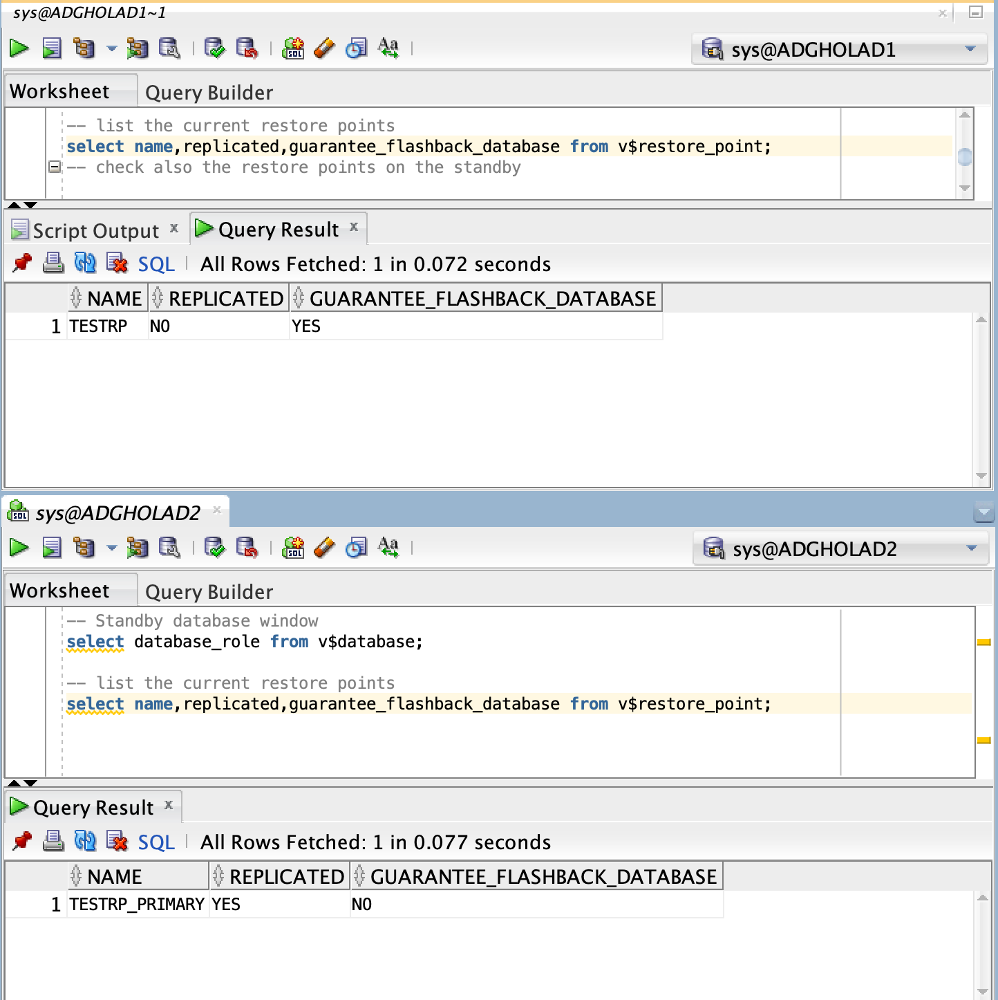
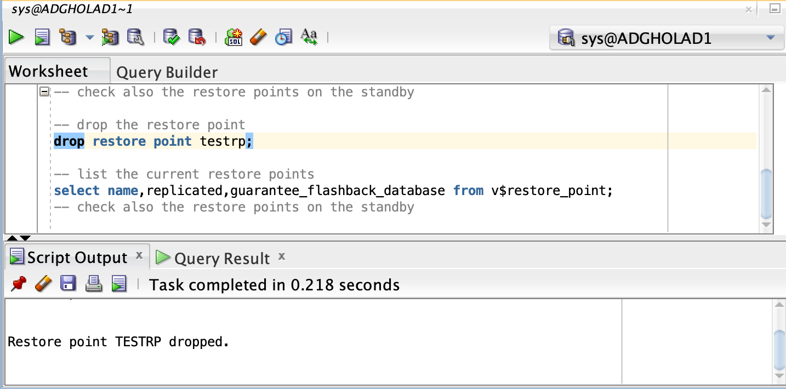
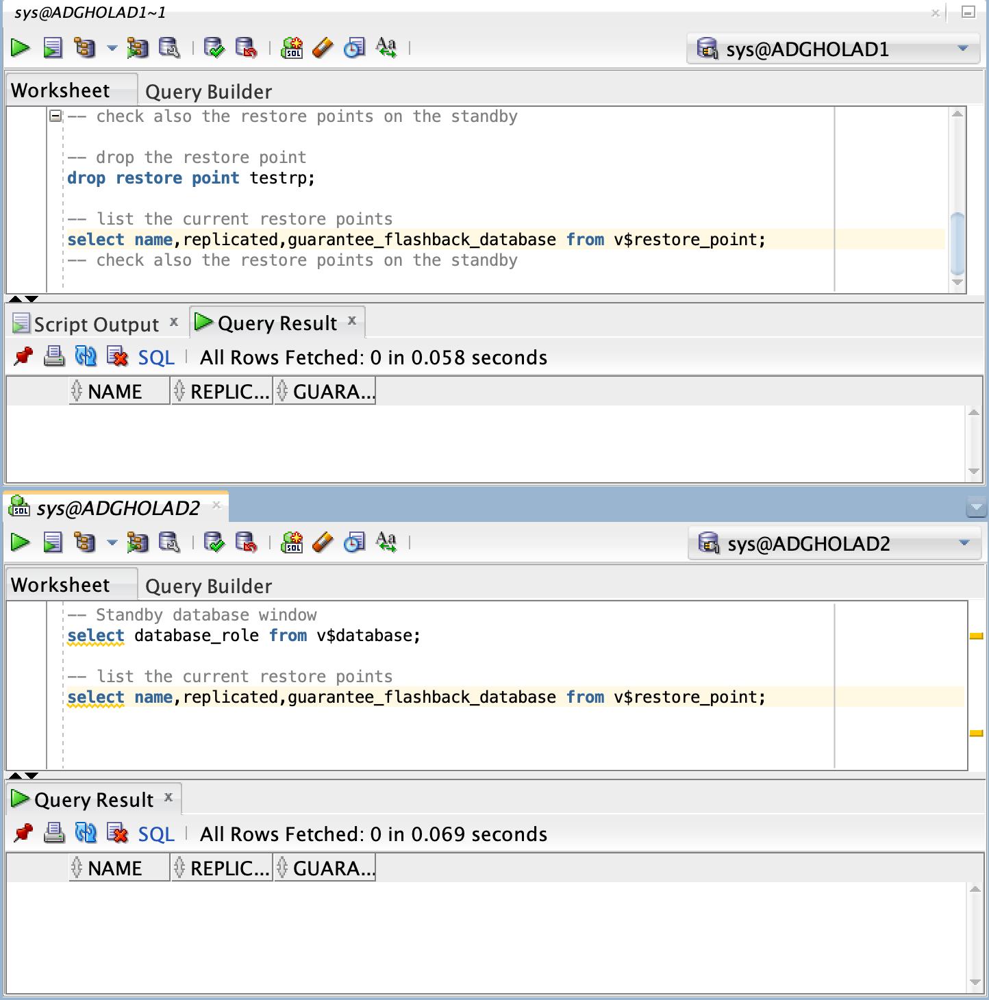

# Restore Point Propagation

## Introduction
In this lab, we will use the 19c new feature which is called the Restore point propagation.


Oracle 19c supports automatic restore point propagation from the primary database to the standby database.

This can be particularly useful in situations that during a logical operation on the primary database, the database suddenly fails beyond repair. When you perform a failover, the database would be in the same state as the primary, which would be logically corrupt. 

To avoid this, we are now forwarding the restore points automatically, that in case you need to use the standby, you can also flashback the standby database to a known good point in time.

To accommodate this, the `v$restore_point` view was updated with a `REPLICATED` column and the restore point name is suffixed with `_PRIMARY`.

Estimated Lab Time: 15 Minutes

### Objectives
- Create a restore point in the primary database
- Check the restore points
- Drop the restore point in the primary database

### Prerequisites
- An Oracle LiveLabs or Paid Oracle Cloud account
- Lab 3: Connect to the Database
- Lab 6: Enable Active Data Guard DML Redirection

## **STEP 1**: Create a restore point in the primary

1. Download the 2 textfiles with the sql commands.

    [For the primary
    ](./images/primary.txt)

    [For the standby
    ](./images/standby.txt)

2. As the SYS user connection, first check the restore points with the following query

    ````
    select name,replicated,guarantee_flashback_database from v$restore_point;
    ````

3. Do the same on the standby database.

    

4. Next, create a restore point in the primary database
    

5. Check the restore points with following query

    ````
    select name,replicated,guarantee_flashback_database from v$restore_point;
    ````

6. Do the same on the standby database.
    

The restore point drop is now replicated to the standby and has been suffixed with `_PRIMARY` and the replicated column on the primary indicates this has been performed.

## **STEP 2**: Drop the restore point

1. Next, drop the restore point in the primary database with following query 
    ````
    drop restore point testrp;
    ````

    

2. Check the restore points with following query

    ````
    select name,replicated,guarantee_flashback_database from v$restore_point;
    ````

3. Do the same on the standby database.
    

You have now successfully used Active Data Guard Restore point propagation. You may now [proceed to the next lab](#next).


## Acknowledgements

- **Author** - Pieter Van Puymbroeck, Product Manager Data Guard, Active Data Guard and Flashback Technologies
- **Contributors** - Robert Pastijn, Database Product Management
- **Last Updated By/Date** -  Kamryn Vinson, March 2021