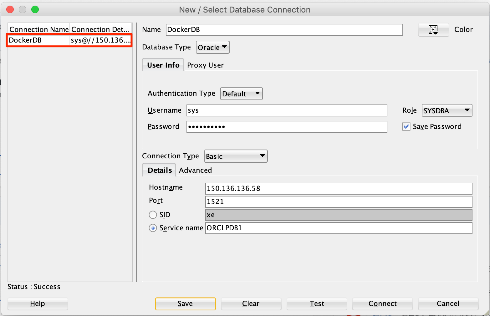

# Connect to an Oracle Database in a Docker Container
## Before You Begin

This lab walks you through the steps to connect to an Oracle Database running in a Docker container on an Oracle Cloud Compute instance. You can connect the Oracle Database instance using any client you wish. In this lab, you will connect using Oracle SQL Developer.

### What Do You Need?

* An Oracle Cloud paid account or free trial. To sign up for a trial account with $300 in credits for 30 days, click [here](http://oracle.com/cloud/free).
* SSH keys
* A Docker container running Oracle Database 19c
* An open port (1521) on your Oracle Virtual Cloud Network (VCN)
* [Oracle SQL Developer](https://www.oracle.com/tools/downloads/sqldev-downloads.html)

## **STEP 1**: Create a connection through SQL Developer

1. If you do not have Oracle SQL Developer installed in your computer, first download it using the above link and install it on your computer.

2. Launch Oracle SQL Developer and select **New Connection** (the green + sign).

  

3. In the New / Select Database Connection window, enter the following information:
     * In the **Name** field, enter **DockerDB** as the name of this connection.
     * In the **Username** field, enter **sys**.
     * In the **Password** field, enter the password (`LetsDocker`) for the SYS account.
     * Select **SYSDBA** from the **Role** drop down list.
     * Check the **Save Password** checkbox.
     * In the **Hostname** field, enter your Oracle Compute instance Public IP address.
     * Click **Service name** and enter **ORCLPDB1**.

   

4. Click **Test** to check your connection. You will see a Success message in the **Status** field.

  *Note: If you see `The Network Adapter could not establish the connection` error, you may want to check if the Source CIDR of Ingress Rule was entered correctly in the previous lab.*  

5. Click **Save** to save your connection details and then click **Connect**.

  

6. You now have a connection to your Oracle VM Database system, and you can expand the connection and Tables.

  

  You may now *proceed to the next lab*.

## Want to Learn More?

* [Oracle SQL Developer Documentation](https://docs.oracle.com/en/database/oracle/sql-developer/)
* [Oracle Cloud Infrastructure: Connecting to a DB System](https://docs.cloud.oracle.com/en-us/iaas/Content/Database/Tasks/connectingDB.htm)

## Acknowledgements
* **Author** - Gerald Venzl, Master Product Manager, Database Development
* **Adapted for Cloud by** -  Tom McGinn, Learning Architect, Database User Assistance
* **Last Updated By/Date** - Tom McGinn, March 2020
* **Contributor** - Arabella Yao, Product Manager Intern, Database Management, June 2020

## See an issue?
Please submit feedback using this [form](https://apexapps.oracle.com/pls/apex/f?p=133:1:::::P1_FEEDBACK:1). Please include the *workshop name*, *lab* and *step* in your request.  If you don't see the workshop name listed, please enter it manually. If you would like for us to follow up with you, enter your email in the *Feedback Comments* section. 
