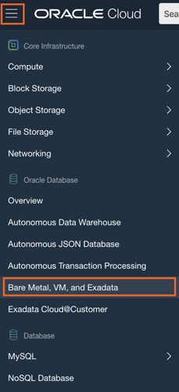
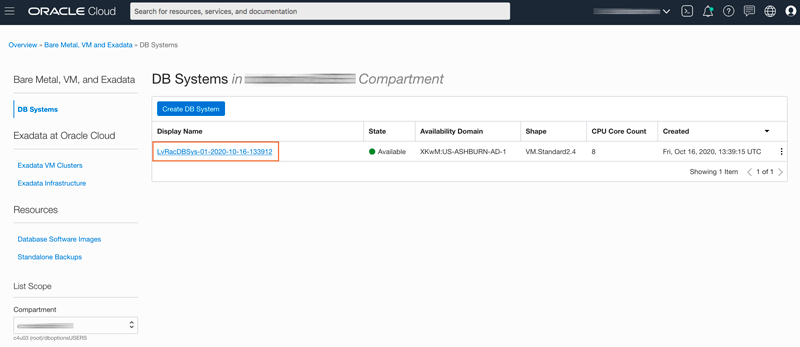
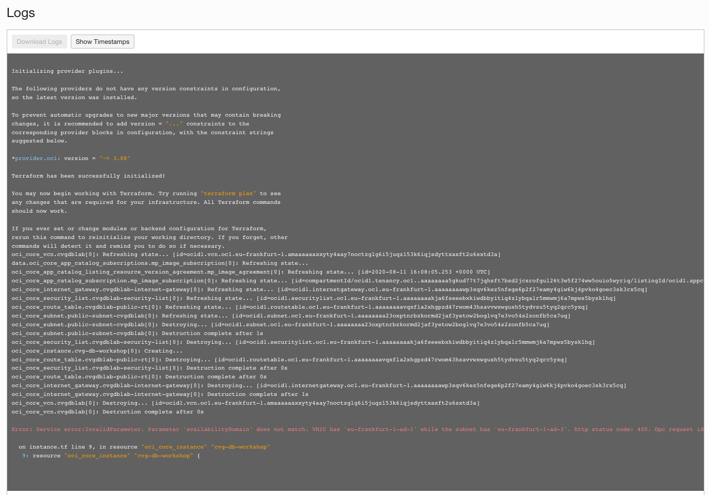
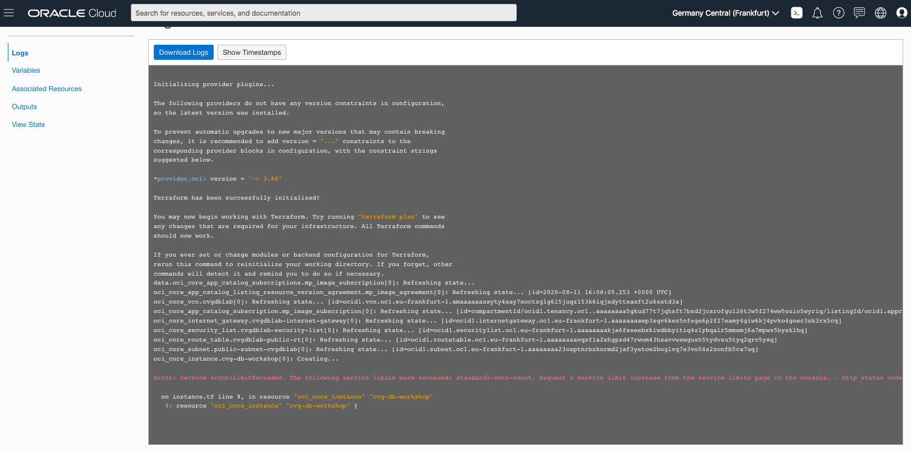

# Build a DB System

## Introduction
This lab will show you how to connect to your DB System.  

Estimated Lab Time:  5 minutes 

Watch the video below for an overview of the Build a DB System lab
[](youtube:tRo33KktXt0)

### About Terraform and Oracle Cloud Resource Manager
For more information about Terraform and Resource Manager, please see the appendix below.

### Objectives
-   Identify DB Instance Public IP Addresses
-   Connect to the each RAC instance:  Node 1 and Node 2

### Prerequisites
- An assigned Oracle LiveLabs Cloud account
- An assigned compartment
- An assigned Database Cluster Password
- Lab: Download SSH Keys 

## **STEP 1**: Login to Oracle Cloud

1.  Login to Oracle Cloud
2.  Click on the down arrow next to Oracle Cloud Infrastructure Direct Sign in
3.  Enter your username and password you were provided
4.  Change the password if prompted
5.  In the upper right corner select the region you were assigned
6.  Open up the hamburger menu in the left hand corner.  

7.  From the hamburger menu, select **Bare Metal, VM, and Exadata** in the Oracle Database category. 

  

2.  Identify your database system from your My Reservations page in LiveLabs and click it.  (Note:  Remember to choose the compartment that you were assigned if running on LiveLabs)

  

3. Explore the DB Systems home page.  On the left hand side, scroll down to view the Resources section.  Click Nodes.

  

4. Locate your two nodes and jot down their public IP addresses.

  

5. Now that you have your IP address select the method of connecting. Choose the environment where you created your ssh-key in the previous lab (Generate SSH Keys) and select one of the following steps. If you choose to use Oracle Cloud Shell, you will need to copy your SSH Private and Public Key to the cloud shell and set the proper permissions, otherwise, choose the platform that matches your local environment. 
- [Step 2: Oracle Cloud Shell (RECOMMENDED)](#STEP5:OracleCloudShell)
- [Step 3: MAC or Windows CYGWIN Emulator](#STEP6:MACorWindowsCYGWINEmulator)
- [Step 4: Putty](#STEP7:WindowsusingPutty)

## **STEP 2**: Oracle Cloud Shell

1.  To re-start the Oracle Cloud shell, go to your Cloud console and click the Cloud Shell icon to the right of the region.  *Note: Make sure you are in the region you were assigned*

    

2.  Using one of the Public IP addresses, enter the command below to login as the *opc* user and verify connection to your nodes.    

    ````
    ssh -i ~/.ssh/<sshkeyname> opc@<Your Public IP Address>
    ````
    

3.  When prompted, answer **yes** to continue connecting.
4.  Repeat step 2 for your 2nd node.
5.  You may now *proceed to the next lab*.  


## **STEP 3**: MAC or Windows CYGWIN Emulator
*NOTE:  If you have trouble connecting and are using your work laptop to connect, your corporate VPN may prevent you from logging in. Log out of your VPN before connecting. *
1.  Using one of the Public IP addresses, open up a terminal (MAC) or cygwin emulator as the opc user.  Enter yes when prompted.

    ````
    ssh -i ~/.ssh/<sshkeyname> opc@<Your Public IP Address - node1>
    ````
    

2. You can also log in to the **Public IP Address of node2**

    ````
    ssh -i ~/.ssh/<sshkeyname> opc@<Your Public IP Address - node2>
    ````
    

3. After successfully logging in, you may *proceed to the next lab*

## **STEP 4**: Windows using Putty
*NOTE:  If you have trouble connecting and are using your work laptop to connect, your corporate VPN may prevent you from logging in. Log out of your VPN before connecting. *

On Windows, you can use PuTTY as an SSH client. PuTTY enables Windows users to connect to remote systems over the internet using SSH and Telnet. SSH is supported in PuTTY, provides for a secure shell, and encrypts information before it's transferred.

1.  Download and install PuTTY. [http://www.putty.org](http://www.putty.org)
2.  Run the PuTTY program. On your computer, go to **All Programs > PuTTY > PuTTY**
3.  Select or enter the following information:
    - Category: _Session_
    - IP address: _Your service instance’s (node1) public IP address_
    - Port: _22_
    - Connection type: _SSH_

  

### **Configuring Automatic Login**

1.  In the category section, **Click** Connection and then **Select** Data.

2.  Enter your auto-login username. Enter **opc**.

  

### **Adding Your Private Key**

1.  In the category section, **Click** Auth.
2.  **Click** browse and find the private key file that matches your VM’s public key. This private key should have a .ppk extension for PuTTy to work.

  

3.  To save all your settings, in the category section, **Click** session.
4.  In the saved sessions section, name your session, for example ( EM13C-ABC ) and **Click** Save.

### **Repeat Putty setup for the second node**

1. Repeat the steps above to create a login window for the second node - use the Public IP address of node2
3.  Select or enter the following information:
    - Category: _Session_
    - IP address: _Your service instance’s (node2) public IP address_
    - Port: _22_
    - Connection type: _SSH_

  

You may now *proceed to the next lab*.  

## Appendix:  Terraform and Resource Manager
Terraform is a tool for building, changing, and versioning infrastructure safely and efficiently.  Configuration files describe to Terraform the components needed to run a single application or your entire datacenter.  In this lab a configuration file has been created for you to build network and compute components.  The compute component you will build creates an image out of Oracle's Cloud Marketplace.  This image is running Oracle Linux 7.

Resource Manager is an Oracle Cloud Infrastructure service that allows you to automate the process of provisioning your Oracle Cloud Infrastructure resources. Using Terraform, Resource Manager helps you install, configure, and manage resources through the "infrastructure-as-code" model. To learn more about OCI Resource Manager, take a watch the video below.

[](youtube:udJdVCz5HYs)

### Oracle Cloud Marketplace
The Oracle Cloud Marketplace is a catalog of solutions that extends Oracle Cloud services.  It offers multiple consumption modes and deployment modes.  In this lab we will be deploying the free Oracle Enterprise Manager 13c Workshop marketplace image.

[Link to OCI Marketplace](https://www.oracle.com/cloud/marketplace/)

## Appendix: Troubleshooting Tips

If you encountered any issues during this lab, follow the steps below to resolve them.  If you are unable to resolve, please skip to the **Need Help** section to submit your issue via our  support forum.
- Availability Domain Mismatch
- Limits Exceeded
- Invalid public key
- Flex Shape Not Found

### Issue 1: Availability Domain Mismatch


#### Issue #1 Description
When creating a stack and using an existing VCN, the availability domain and the subnet must match otherwise the stack errors.  

#### Fix for Issue #1
1.  Click on **Stack**-> **Edit Stack** -> **Configure Variables**.
2.  Scroll down to the network definition.
3.  Make sure the Availability Domain number matches the subnet number.  E.g. If you choose AD-1, you must also choose subnet #1.
4.  Click **Next**
5.  Click **Save Changes**
6.  Click **Terraform Actions** -> **Apply**

### Issue 2: Invalid public key


#### Issue #2 Description
When creating your SSH Key, if the key is invalid the compute instance stack creation will throw an error.

#### Tips for fixing for Issue #2
- Go back to the instructions and ensure you create and **copy/paste** your key into the stack correctly.
- Copying keys from Cloud Shell may put the key string on two lines.  Make sure you remove the hard return and ensure the key is all one line.
- Ensure you pasted the *.pub file into the window.
1.  Click on **Stack**-> **Edit Stack** -> **Configure Variables**.
2.  Repaste the correctly formatted key
3.  Click **Next**
4.  Click **Save Changes**
5.  Click **Terraform Actions** -> **Apply**

### Issue 3: Flex Shape Not Found


#### Issue #3 Description
When creating a stack your ability to create an instance is based on the capacity you have available for your tenancy.

#### Fix for Issue #3
If you have other compute instances you are not using, you can go to those instances and delete them.  If you are using them, follow the instructions to check your available usage and adjust your variables.
1. Click on the Hamburger menu, go to **Governance** -> **Limits, Quotas and Usage**
2. Select **Compute**
3. These labs use the following compute types.  Check your limit, your usage and the amount you have available in each availability domain (click Scope to change Availability Domain)
4. Look for Standard.E2, Standard.E3.Flex and Standard2
4.  Click on the hamburger menu -> **Resource Manager** -> **Stacks**
5.  Click on the stack you created previously
6.  Click **Edit Stack** -> **Configure Variables**.
7.  Scroll down to Options
8.  Change the shape based on the availability you have in your system
9.  Click **Next**
10. Click **Save Changes**
11. Click **Terraform Actions** -> **Apply**

### Issue 4: Limits Exceeded


#### Issue #4 Description
When creating a stack your ability to create an instance is based on the capacity you have available for your tenancy.

#### Fix for Issue #4
If you have other compute instances you are not using, you can go to those instances and delete them.  If you are using them, follow the instructions to check your available usage and adjust your variables.

1. Click on the Hamburger menu, go to **Governance** -> **Limits, Quotas and Usage**
2. Select **Compute**
3. These labs use the following compute types.  Check your limit, your usage and the amount you have available in each availability domain (click Scope to change Availability Domain)
4. Look for Standard.E2, Standard.E3.Flex and Standard2
5. This workshop requires at least 4 OCPU and a minimum of 30GB of memory.  If you do not have that available you may request a service limit increase at the top of this screen.  If you have located capacity, please continue to the next step.
6.  Click on the Hamburger menu -> **Resource Manager** -> **Stacks**
7.  Click on the stack you created previously
8.  Click **Edit Stack** -> **Configure Variables**.
9.  Scroll down to Options
10. Change the shape based on the availability you have in your system
11. Click **Next**
12. Click **Save Changes**
13. Click **Terraform Actions** -> **Apply**

## Acknowledgements

* **Author** - Rene Fontcha, Master Principal Platform Specialist, NA Technology
* **Contributors** - Kay Malcolm, Product Manager, Database Product Management
* **Last Updated By/Date** - Kay Malcolm, October 2020

