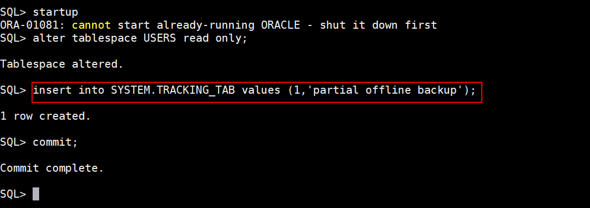
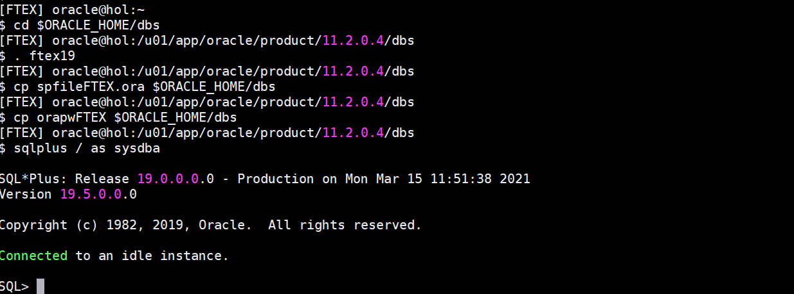
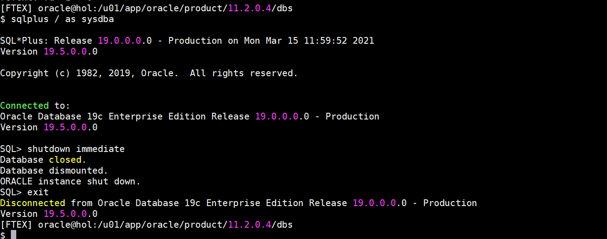
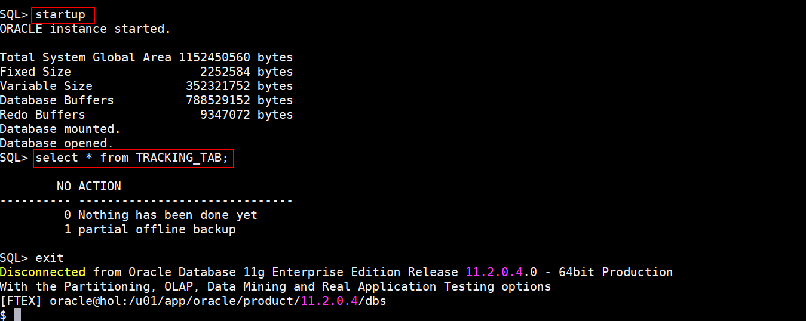
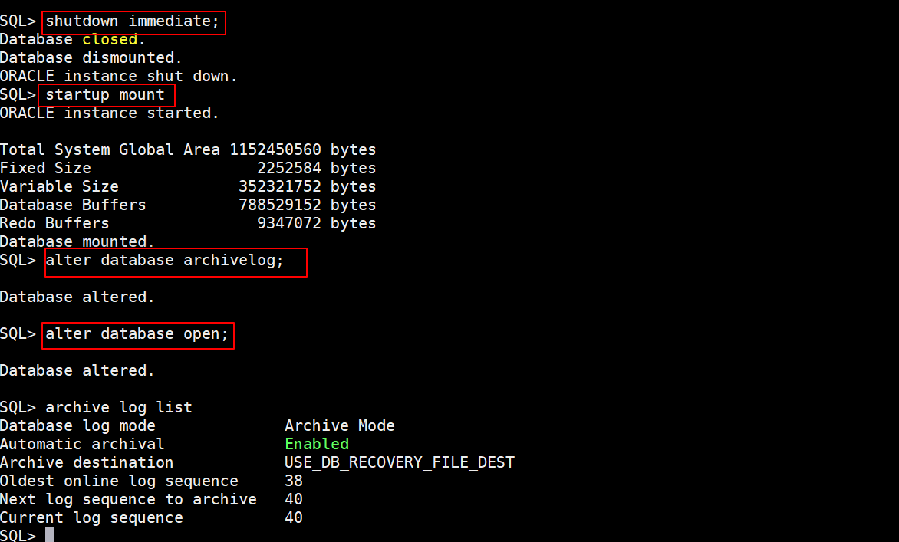
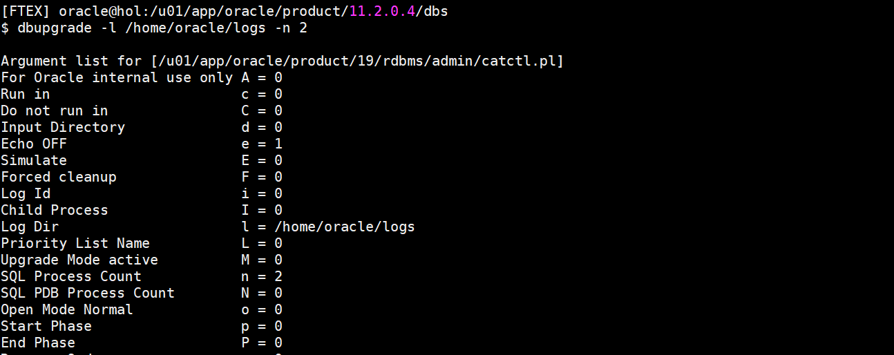
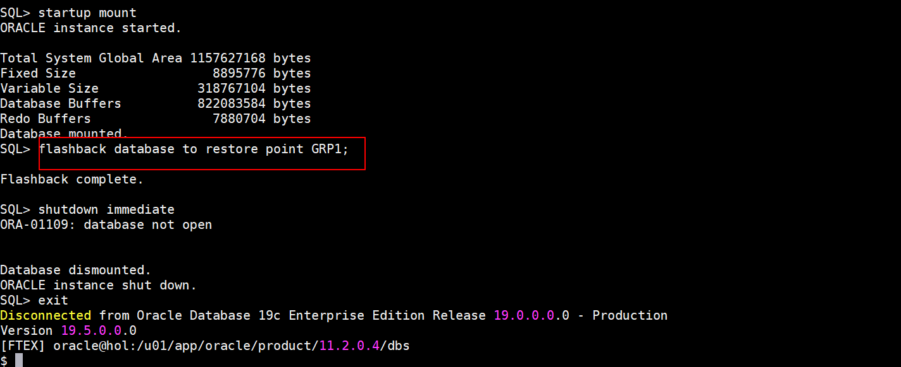
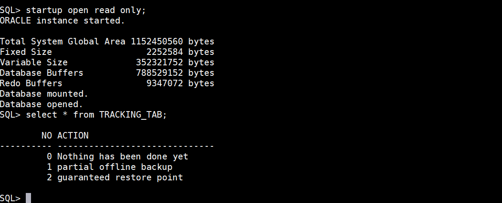
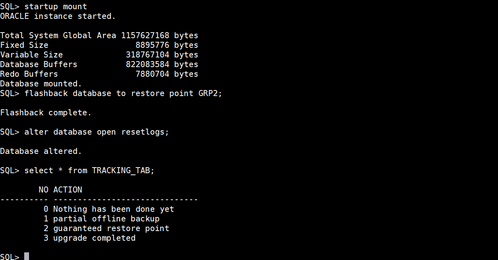
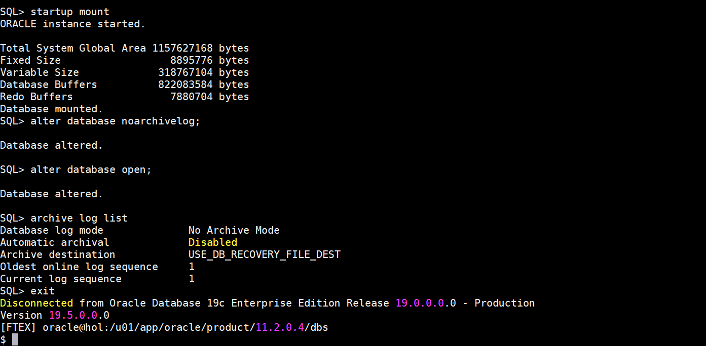

# Fallback Strategies

## Introduction

In this lab you will use two techniques to protect your database, but this time for issues happening after the upgrade.

Estimated Lab Time: n minutes

### About Fallback Strategies


You will have to protect your environment for issues during, but also after the upgrade. And of course you’ll have to consider and maintain the Service Level Agreements about fallback requirements in seconds, minutes, hours or days. In addition it is very important to be aware that some of the fallback strategies won’t allow to change COMPATIBLE. This means, you will need extra downtime to change COMPATIBLE afterwards as it requires a restart of the database(s).

The minimum COMPATIBLE setting in Oracle Database 19c is “11.0.0“. Keep COMPATIBLE at 3 digits. The default COMPATIBLE setting in Oracle Database 19c is “19.0.0".

We won’t cover RMAN Online Backups as we assume that everybody is doing RMAN backups anyways. And we won’t cover Oracle GoldenGate as this would go beyond the lab possibilities. We may add this in a later stage.

### Objectives
In this lab, you will:
* Objective 1
* Objective 2
* Objective 3

### Prerequisites
This lab assumes you have:
- A Free Tier, Paid or LiveLabs Oracle Cloud account
- SSH Private Key to access the host via SSH
- You have completed:
    - Lab: Generate SSH Keys (*Free-tier* and *Paid Tenants* only)
    - Lab: Prepare Setup (*Free-tier* and *Paid Tenants* only)
    - Lab: Environment Setup
		- Lab: Initialize Environment

## **STEP 1**: Partial Offline Backup

1. At first, set the USERS tablespace read-only and then SHUTDOWN the database

    Run the full database export:
    ````
    <copy>
    . ftex
    sqlplus / as sysdba
    </copy>
    ````
    

    ````
    <copy>
    startup
    alter tablespace USERS read only;
    insert into SYSTEM.TRACKING_TAB values (1,'partial offline backup');
    commit;
    </copy>
    ````
    
    

    ````
    <copy>
    shutdown immediate
    exit
    </copy>
    ````
    

2. Then copy the “heart of the database” to a backup location Execute the “backupFTEX.sh” script.
    
    ````
    <copy>
    mkdir -p /home/oracle/FTEX/bck
    sh /home/oracle/scripts/backupFTEX.sh
    </copy>
    ````
    
    
3. Startup the database in 19c and upgrade it.

    ````
    <copy>
    cd $ORACLE_HOME/dbs
    . ftex19
    cp spfileFTEX.ora $ORACLE_HOME/dbs
    cp orapwFTEX $ORACLE_HOME/dbs
    sqlplus / as sysdba
    </copy>
    ````
    
    ````
    <copy>
    startup upgrade
    exit
    </copy>
    ````
    
    ````
    <copy>
    dbupgrade -l /home/oracle/logs
    </copy>
    ````
    
    
4. After 2-3 minutes, CTRL-C the upgrade and try the fallback.
    
    The upgrade failed.

5. Now first of all, try out the RESUME of the upgrade driver.
    
    ````
    <copy>
    dbupgrade -R -l /home/oracle/logs
    </copy>
    ````
    
    The upgrade should start from where it had been stopped.

6. Let the upgrade fail a second time , Press CTRL+C.
    

7. Then SHUTDOWN the database and RESTORE it.
    
    Check the content of the TRACKING_TAB:
    ````
    <copy>
    sqlplus / as sysdba
    shutdown immediate
    exit
    </copy>
    ````
    

    ````
    <copy>
    . /home/oracle/scripts/restoreFTEX.sh
    . ftex
    sqlplus / as sysdba
    </copy>
    ````
    
    ````
    <copy>
    startup
    select * from TRACKING_TAB;
    exit
    </copy>
    ````
    
    Now you completed the first exercise.


## **STEP 2**: Flashback to a Guaranteed Restore Point

1. Turn on ARCHIVELOG mode.

    ````
    <copy>
    . ftex
    sqlplus / as sysdba
    </copy>
    ````
    

    ````
    <copy>
    shutdown immediate;
    startup mount
    alter database archivelog;
    alter database open;
    archive log list    
    </copy>
    ````
    

2. Set a Guaranteed Restore Point.

    ````
    <copy>
    insert into SYSTEM.TRACKING_TAB values (2,'guaranteed restore point');
    commit;
    create restore point GRP1 guarantee flashback database;
    </copy>
    ````
    
    ````
    <copy>
    shutdown immediate
    exit    
    </copy>
    ````
    

3. Switch to the 19c environment and upgrade the FTEX database.
    
    ````
    <copy>
    . ftex19
    sqlplus / as sysdba
    </copy>
    ````
    

    ````
    <copy>
    startup upgrade
    exit
    </copy>
    ````
    
    ````
    <copy>
    dbupgrade -l /home/oracle/logs -n 2
    </copy>
    ````
    
    

    This will now take 15-30 minutes depending on your hardware equipment.
    <!-- If you don’t want to wait so long, you can CTRL-C the upgrade at any point, and FLASHBACK to the restore point without taking the second one. -->

    ````
    <copy>
    sqlplus / as sysdba
    </copy>
    ````
    
    ````
    <copy>
    @?/rdbms/admin/utlrp.sql
    @/u01/app/oracle/cfgtoollogs/FTEX/preupgrade/postupgrade_fixups.sql
    insert into SYSTEM.TRACKING_TAB values (3,'upgrade completed');
    commit;
    select * from TRACKING_TAB;
    </copy>
    ````
    

4. Set a new GRP and then flashback to the GRP to before-upgrade. The FLASHBACK DATABASE happens in the new environment, the OPEN of the database (in this case READ ONLY – alternative would be OPEN RESETLOGS) in the source environment.
    
    ````
    <copy>
    create restore point GRP2 guarantee flashback database;
    shutdown immediate
    startup mount
    flashback database to restore point GRP1;
    shutdown immediate
    exit
    </copy>
    ````
    
    
    ````
    <copy>
    . ftex
    sqlplus / as sysdba
    </copy>
    ````
    

    ````
    <copy>
    startup open read only;
    select * from TRACKING_TAB;
    </copy>
    ````
    

    Do you recognize that the database has been flashed back to “before upgrade” in less than a minute? You could open it RESETLOGS and repeat the upgrade.

5. But FLASHBACK DATABASE works in all directions, backwards and forward (even though forward may take a bit longer now).
    
    ````
    <copy>
    shutdown immediate
    exit
    </copy>
    ````
    

    ````
    <copy>
    . ftex19
    sqlplus / as sysdba 
    </copy>
    ````
    
    ````
    <copy>
    startup mount
    flashback database to restore point GRP2;
    alter database open resetlogs;
    select * from TRACKING_TAB;
    </copy>
    ````
    
    Even though you opened the database with OPEN RESETLOGS you can repeat the FLASHBACK DATABASE operations as often as you’d like.

6. Take also note of the components which exist now in the database.

    ````
    <copy>
    select COMP_ID, STATUS from DBA_REGISTRY order by COMP_ID;
    </copy>
    ````
    
7. Clean up and drop the restore points as otherwise at some point you’ll run out of archive space. In addition you’ll turn off ARCHIVELOG mode now as we won’t need it for the next exercises:

    ````
    <copy>
    drop restore point GRP1;
    drop restore point GRP2;
    shutdown immediate
    </copy>
    ````
    
    ````
    <copy>
    startup mount
    alter database noarchivelog;
    alter database open;
    archive log list
    exit
    </copy>
    ````
 
    

    You successfully completed the second part of the Fallback Strategies lab.
    You can watch an entire database downgrade in this short video as well:

You may now [proceed to the next lab](#next).

## Learn More

*(optional - include links to docs, white papers, blogs, etc)*

* [URL text 1](http://docs.oracle.com)
* [URL text 2](http://docs.oracle.com)

## Acknowledgements
* **Author** - <Name, Title, Group>
* **Contributors** -  <Name, Group> -- optional
* **Last Updated By/Date** - <Name, Group, Month Year>
* **Workshop (or Lab) Expiry Date** - <Month Year> -- optional, use this when you are using a Pre-Authorized Request (PAR) URL to an object in Oracle Object Store.
