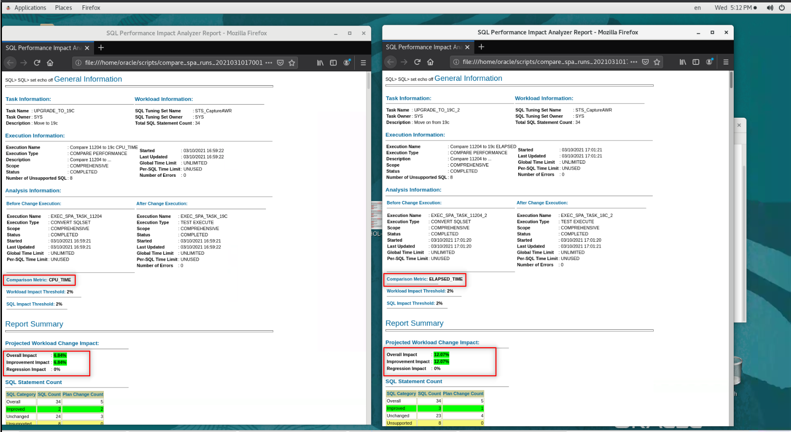
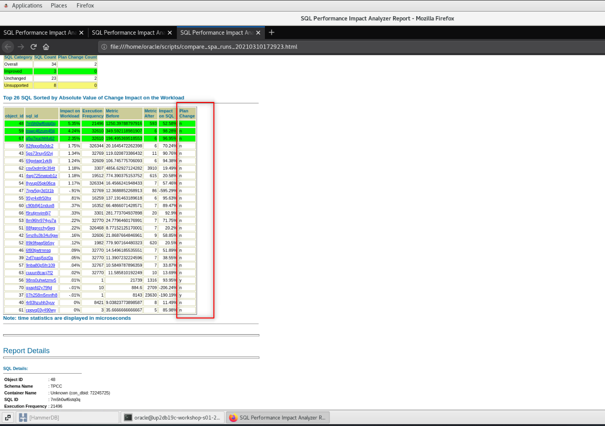

# SQL Performance Analyer

## Introduction

In this section of the Hands-On Lab you will use the SQL Performance Analyzer (SPA) which is part of Real Application Testing (RAT). You will compare statements collected before upgrade to a simulation of these statements after upgrade. You will use the SQL Tuning Sets collected earlier in the lab.


You have collected SQL statements from the first load of HammerDB earlier in this lab into two SQL Tuning Sets:

    STS_CaptureAWR
    STS_CaptureCursorCache

You will “test execute” now the statements of one of the SQL Tuning Sets (you can do both if time allows) and generate a comparison report.

Estimated Lab Time: n minutes

### SQL Performance Analyzer
You can run SQL Performance Analyzer on a production system or a test system that closely resembles the production system. Testing a system change on a production system will impact the system's throughput because SQL Performance Analyzer must execute the SQL statements that you are testing. Any global changes made on the system to test the performance effect may also affect other users of the system. If the system change does not impact many sessions or SQL statements, then running SQL Performance Analyzer on the production system may be acceptable. However, for systemwide changes—such as a database upgrade—using a production system is not recommended.


### Objectives

In this lab, you will:
* Check Statements

### Prerequisites
This lab assumes you have:
- A Free Tier, Paid or LiveLabs Oracle Cloud account
- SSH Private Key to access the host via SSH
- You have completed:
    - Lab: Generate SSH Keys (*Free-tier* and *Paid Tenants* only)
    - Lab: Prepare Setup (*Free-tier* and *Paid Tenants* only)
    - Lab: Environment Setup
		- Lab: Initialize Environment

## **STEP 1**: Check Statements


1. At first, check how many statements you collected in the SQL Tuning Sets:

    ````
    <copy>
    . upgr19
    cd /home/oracle/scripts
    sqlplus / as sysdba
    </copy>
    ````
    

2. Run this query:

    ````
    <copy>
    select count(*), sqlset_name from dba_sqlset_statements group by sqlset_name order by 2;
    </copy>
    ````
    

3. Then start a completely scripted SQL Performance Analyzer run. 
   It will:
      - Convert the information from STS_CaptureAWR into the right format
      - Simulate the execution of all statements in STS_CaptureAWR
      - Compare before/after
      - Report on the results – in this case based on CPU_TIME and ELAPSED_TIME

    **There are more metrics available. See an overview here.**
4. You will do two simulations using different comparison metrics for both, CPU\_TIME and ELAPSED\_TIME.  Start the an initial run for CPU\_TIME with the script:

    ````
    <copy>
    @/home/oracle/scripts/spa_cpu.sql
    </copy>
    ````
    

5. Afterwards generate the HTML Report containing the results:

    ````
    <copy>
    @/home/oracle/scripts/spa_report_cpu.sql
    </copy>
    ````
6. Then repeat this for ELAPSED_TIME:

    ````
    <copy>
    @/home/oracle/scripts/spa_elapsed.sql
    </copy>
    ````
    

7. Finally generate the HTML Report containing the results:

    ````
    <copy>
    @/home/oracle/scripts/spa_report_elapsed.sql
    </copy>
    exit
    ````

8. There will be now two html files in /home/oracle/scripts. Open them with Firefox:

    ````
    <copy>
    cd /home/oracle/scripts
    firefox compare_spa_* &
    </copy>
    ````
    

9.  First of all, see the different comparison metrics in the report’s header:
   
    *** This screenshot is just an example – you may see a very different report ***
    

10.  You may recognize regressed statements and statements with plan changes (rightmost column).  But you may recognize also that the statements NOT marked in GREEN have been improved drastically, too.  Why are they not marked GREEN, too? The reason is the THRESHOLD of 2% I set:
    

11.  You can change the threshold value in the script 
    ````
    <copy>
    /home/oracle/scripts/spa_elapsed.sql
    </copy>
    ````

12.  The statement in the screen shot is slightly better than before measured.  Now click on the first statement, 7m5h0wf6stq0q, and check the plan differences.  Scroll down to the two plans, BEFORE and AFTER:

    “BATCHED” access means that the database retrieves a few row ids from the index, and then attempts to access rows in block order to improve the clustering and reduce the number of times that the database must access a block. This makes it run faster.

    Feel free to check other examples in the report, too.
13. But this demonstrates that it is not always a good advice to deny plan changes as part of an upgrade. I repeated the ELAPSED run but set:

    ````
    <copy>
    alter session set optimizer_features_enable=’11.2.0.4′;
    @/home/oracle/scripts/spa_elapsed.sql
    </copy>
    ````
    

14.  Then I regenerate the HTML Report containing the results:

    ````
    <copy>
    @/home/oracle/scripts/spa_report_elapsed.sql
    exit
    </copy>
    ````

15.  And I open it with Firefox:

    ````
    cd /home/oracle/scripts
    firefox compare_spa_* &
    ````
    

16.  Now there is no plane change, there is still an improvement as 19c seems to do something different internally. But we basically “lost” the improvement partially be using old optimizer parametrization.

The idea of such SPA runs is to accept the better plans and identify and cure the ones which are misbehaving.

You may now [proceed to the next lab](#next).

## Learn More

* [SQL Performance Analyzer](https://docs.oracle.com/en/database/oracle/oracle-database/19/ratug/introduction-to-sql-performance-analyzer.html#GUID-860FC707-B281-4D81-8B43-1E3857194A72)

## Acknowledgements
* **Author** - Mike Dietrich, Database Product Management
* **Contributors** -  Roy Swonger, Sanjay Rupprel, Cristian Speranta
* **Last Updated By/Date** - Kay Malcolm, February 2021
