# Prepare EDQ Process for ODI Consumption

## Introduction

This chapter describes how to work with jobs in Oracle EDQ. You will work on exporting the data from EDQ using jobs. Once the data is exported, the data can be used for ODI consumption.

This chapter includes the following sections:
  * Export Cleansed Data
  * EDQ Jobs

    
## **Step 1:**  Export Cleansed Data
We will create a job that runs data through the process we just created.This job can be called from an ODI package to automate the Data Quality project. 
1.	The first step is direct EDQ to export the output file. Navigate to the “Project Browser” on the left side of the screen and right-click on "Clean Customers” under the “Staged Data” category (expand the “Staged Data” category if you do not see it). Right click on it and select “Export Staged Data…”

    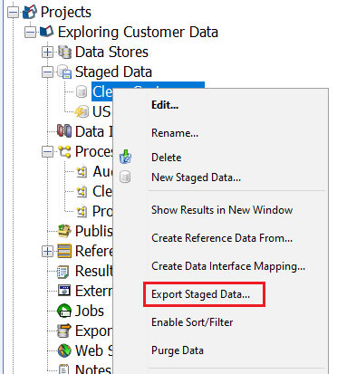

2.	 Click “Next” on the first window of the dialog since the Staged Data is already selected

    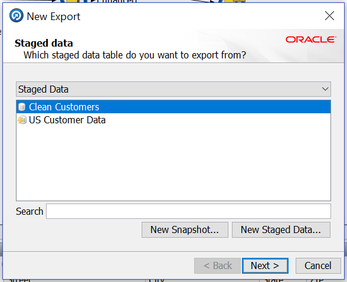

3.	Select “Connection to Oracle Database” for Output data store. Click “Next”

    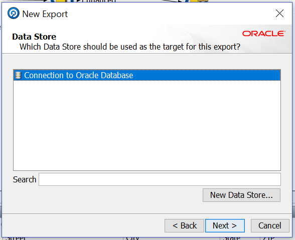

4.	Select “CLEAN_CUSTOMERS” table. Click on “Next”

    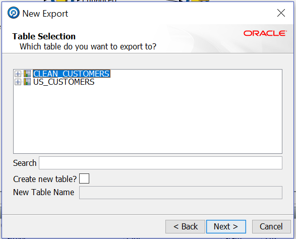

5.  Click Next on the screen.

    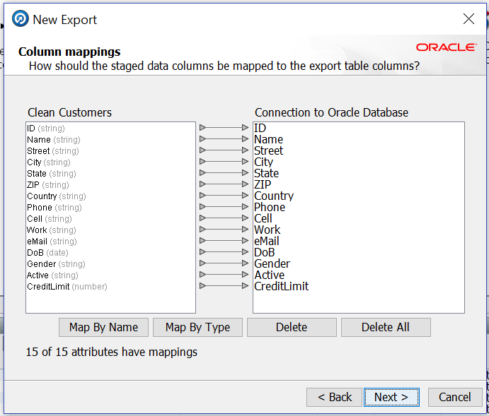

5.	You can leave the default name or assign a new one. We will leave the default this time. Make sure “Run now?” box is NOT checked. Click “Finish”

    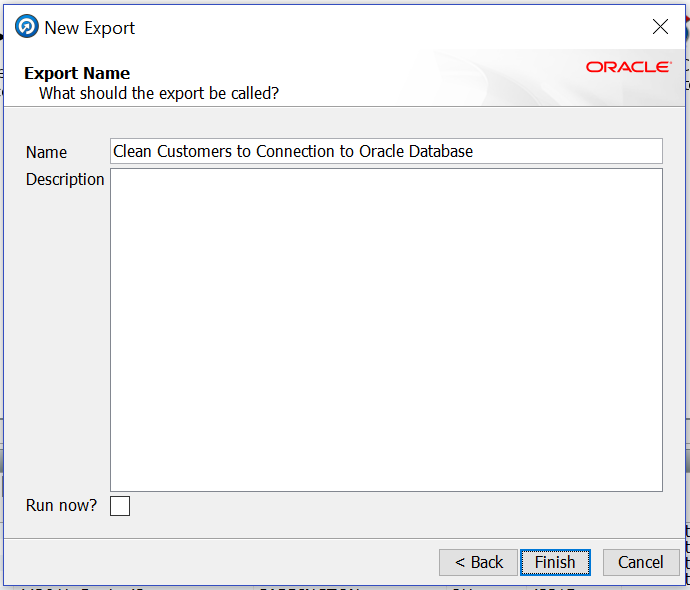

## **Step 2:** EDQ Jobs

1.	We now need to create a job that could be invoked externally. Navigate to the “Project Browser”, and select the “Jobs” category, right-click it and select “New Job…”

    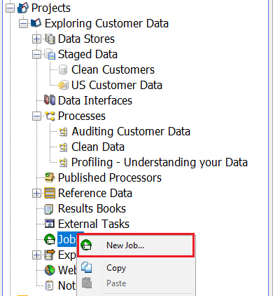

2.	Name the job by typing “Clean US Customers”, click “Finish”.

    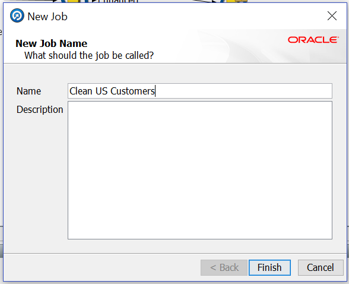

3.	The “Job Canvas” is displayed next with a slightly different “Tool Palette”. The “Tool Palette” contains all of the runnable configuration tasks in the project including snapshots, processes, exports, etc. Notice the icons at the top of the “Tool Palette” are different – click through them to explore

    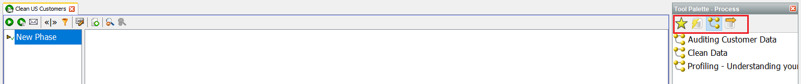

4.	Click the   icon in the “Tool Palette” to display the “Snapshots” and drag the “US\_Customer\_Data” snapshot onto the canvas

5.	Next, click the   icon in the “Tool Palette” to display the “Processes” and drag the “Clean Data” process onto the canvas

    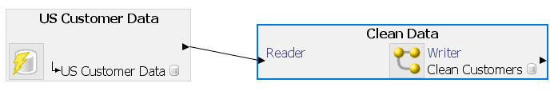

6.	Lastly, click the  icon on the right side of the “Tool Palette” to display the “Exports”. Drag and drop the “Clean Customers to Connection to Oracle” for output export onto the canvas

    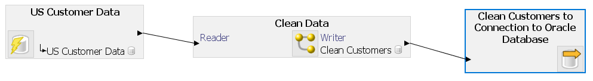

7.	Click the "Run" icon in the toolbar to run the job. Note the "Tasks Window" in the bottom left of the "Director" to monitor the job status.

Now, this job can be executed from ODI (or) you can schedule this job to run periodically.

## Acknowledgements

 - **Author** - Ravi Lingam, September 2020
 - **Contributors** - Narayanan Ramakrishnan, Sri Vishnu Gullapalli
 - **Reviewer** - Sudip Bandyopadhyay, Winston Shirley
 - **Last Updated By/Date** - Sri Vishnu Gullapalli, September 2020

## See an issue?
Please submit feedback using this [form](https://apexapps.oracle.com/pls/apex/f?p=133:1:::::P1_FEEDBACK:1). Please include the *workshop name*, *lab* and *step* in your request.  If you don't see the workshop name listed, please enter it manually. If you would like for us to follow up with you, enter your email in the *Feedback Comments* section.
