## Introduction

In this lab, you will be installing 2 python applications and load tweets into the Oracle Database.

You can load data into Oracle Database by multiple methods but in this exercise we will use the Python SDK and a REST Service to load tweets.

This lab shows how to integrate the SDK and a REST Service with the Python application and use it to load data from Python Application to Oracle Database.

- The First Python Application will upload data to oracle database using the Python SDK. This application will parse tweets and unpacks the tweets from a file using the Python SDK for Oracle DB before uploading it to the database.

- The second Python Application will upload tweets in the form of JSON objects using the REST Service we created in the earlier exercise. Please refer **Lab 16-2** for more information. 

- To Demonstrate the native JSON support in Oracle Database, we will then create an APEX application which will directly extract data from these JSON objects without having to parse them first like any other data structure within the database.

### See an issue?
Please submit feedback using this [form](https://apexapps.oracle.com/pls/apex/f?p=133:1:::::P1_FEEDBACK:1). Please include the *workshop name*, *lab* and *step* in your request.  If you don't see the workshop name listed, please enter it manually. If you would like for us to follow up with you, enter your email in the *Feedback Comments* section.
## Objectives

- Learn how to load JSON data into Oracle Database using the Python SDK and a REST Service.
- Learn how to create a sample apex application on top of that data.
- Demonstrate native JSON support in oracle database.

## Required Artifacts

- Please ensure you completed the previous parts of this lab before you start this lab. Refer **Lab 16-1** and **Lab 16-2** for more info.

## Steps

### **STEP 1: Download the Python Applications**

- For this lab, we will download the applications to your developer client, from in the following repositories. These applications will help us load data into our database.

- SSH into the Developer client or any compute instance that has connectivity to the database. For this lab exercise we will use the Developer client we have been using to run the Terraform script in Lab 16-1.

- Create a Directory to store your python applications.

```
<copy>mkdir dataload</copy>
```

- change directory to the new directory we just created.

```
<copy>cd dataload</copy>
```
- Execute the below command to download the first Python Application. 

```
<copy>wget -O jsonapp.zip https://objectstorage.us-ashburn-1.oraclecloud.com/p/7gl3t07MlT6J4ezUM__0UCGW2akWJAx_8iTjQONwQ0o/n/orasenatdpltintegration02/b/ExaCSScripts/o/jsonapp.zip</copy>
```

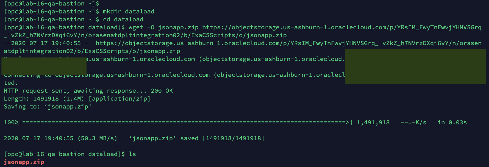

- Unzip it to a directory we just created. Since we are inside the newly created directory, we can just give "." as the directory path to indicate the destination as the current directory like mentioned in the below command.

```
<copy>unzip jsonapp.zip -d .</copy>
```


    - You will see:
        - Python Application: **jsonapp.py**
        - Config file: **parameters.txt**
        - Tweet Dataset file: **testjson.json**

    **Note : This Application will store the data in "TWEETSDATA" table which you was created in part 1 on this lab.**

- Execute the below command to download the second Python Application. 

```
<copy>wget -O pythonapp.zip https://objectstorage.us-ashburn-1.oraclecloud.com/p/aScoF9QtxLAo558bbsyp1_rA0SutbFk_ASsYyd_5WBE/n/orasenatdpltintegration02/b/ExaCSScripts/o/pythonapp.zip</copy>
```

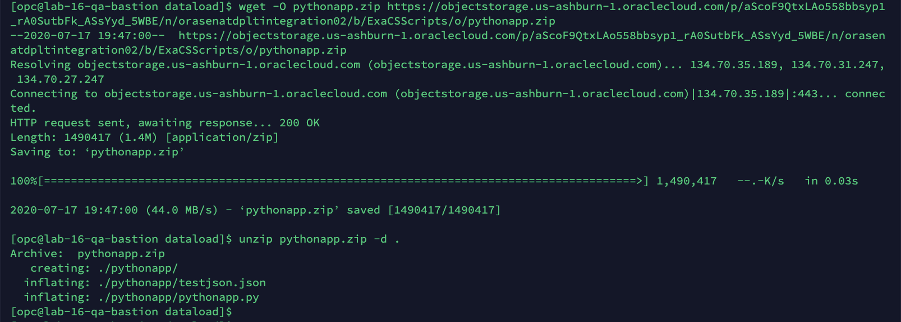


- Unzip it to a directory we just created similar to what we did for the first application. 

```
<copy>unzip pythonapp.zip -d .</copy>
```

    - You will see:
        - Python Application: **pythonapp.py**
        - Tweet Dataset file: **testjson.json**

    **Note : This Application will store the data in "JSONTWEETS" table which which was created in part 1 of this lab**

### **STEP 2: Setting up the configuration file for the first application**

- The Python Application you installed is going to load the tweets from tweets stores in JSON format into the Oracle Database.

- Since, JSON is natively supported by the Oracle Database. You don't have to worry about reformatting the JSON object or parsing the JSON object to extract the data and then store it. You can directly store the JSON objects in the Oracle database.


- Now, Modify the application config to work with your environment.

- Navigate inside the first application folder named "jsonapp"

```
<copy>cd jsonapp</copy>
```

- open the config file

```
<copy>vi parameters.txt</copy>
```


- change all the parameters based on your database environment. The jsonfile is the name of the json file in the jsonapp application folder

```
<copy>jsonfile=testjson.json
ip=<DB IP>
port=<DB Port>
service=<DB Service Name>
sys_password=<Database SYS Password></copy>
```


### **STEP 3: Running the Python Applications**

- Make sure you are in the folder with the name "jsonapp".

- If you are not using the Oracle Developer Client to run these applications. You might have to install cx_Oracle which is the Python SDK for Oracle database. Please use the below mentioned command to install cx_Oracle if your machine does not have it installed already.

- For a linux based systems, below are the required steps for the setup.

```
<copy>sudo yum -y install oracle-release-el7 oraclelinux-developer-release-el7</copy>
```

```
<copy>sudo yum -y install python-cx_Oracle</copy>
```

```
<copy>sudo sh -c "echo /usr/lib/oracle/18.3/client64/lib > /etc/ld.so.conf.d/oracle-instantclient.conf"</copy>
```

```
<copy>sudo ldconfig</copy>
```

- Run the First Python App.
    - This app will extract tweets from the file, parse them and store the data into the respective columns using the Python SDK available for Oracle Cloud Infrastructure.

```
<copy>python jsonapp.py parameters.txt</copy>
```
    
- Run the Application.


- verify that the tweets are being stored in the database by connecting to the database, using SQL Developer, as the same user for which you created the REST Service.

- Run the second Python App.

    - This app will directly store JSON objects in Oracle Database using the REST Service we developed in the previous part of the lab. As JSON data is natively supported in Oracle Database we can easily extract data directly from the JSON object using a dot notation method.

    - This application needs some extra libraries to run successfully. Please install the libraries as mentioned below.

    - Note: If you are not using the Oracle Developer Client to run this application you might also need to install Python3. Please refer this <a href=https://realpython.com/installing-python>link</a> to install python3.


```
<copy>sudo pip3 install simplejson</copy>
```

```
<copy>sudo pip3 install requests</copy>
```


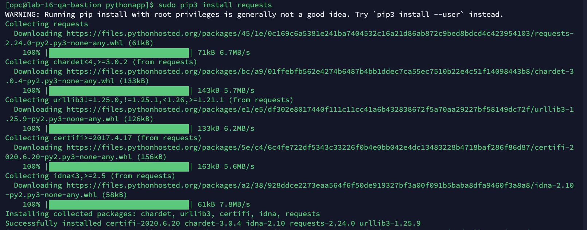

- Now run the application as shown below. 
    - REST Endpoint URL : URL of REST Endpoint we created in part 2 of this lab
    - JSON file name with extension : testjson.json

```
<copy>python3 pythonapp.py "REST Endpoint URL" "JSON File Name with extension"</copy>
```


- verify that the tweets are being stored in the database by connecting to the database, using SQL Developer or SQL CL, as the same user for which you created the REST Service.

- Alternatively, you can also verify by making a GET request using the REST URL through the browser as shown below.


- Now lets log in to APEX installed on Oracle Database and create an application.

### **STEP 4: Create an APEX Application**

- Login to APEX using the following URL : 
   
```
http://ip_address:ORDS_Port/ords
```


- Click on the App Builder tab from the top menu and then click on Create tab and then click on New Application option.


- Enter the name for the application and click on "Add Page" to add a page to the application.


- Select Interactive Report from the options.

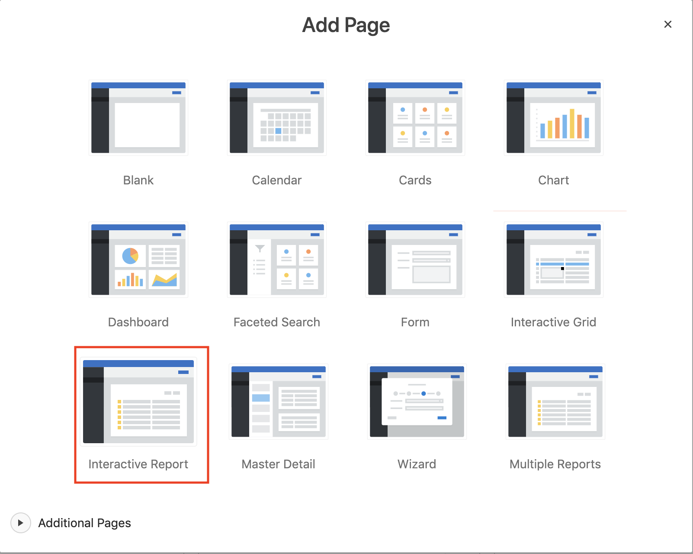

- Enter a name for the Page, Select the "Table or View" option and make sure the "Interactive Report" option is selected. Select the correct table (which is TWEETSDATA for us) by click on the button beside the field. Finally click on Add Page button.
   


- Observe that a new page has been added to the application


- Similarly, click on Add Page option again, and select Interactive Grid option.

- **This page will display the data extracted from the json objects, ingested into the Oracle database using the REST Service in the previous step, using a simple sql statement. Since JSON is natively supported in oracle database, it is really simple to deal with data in JSON format.**

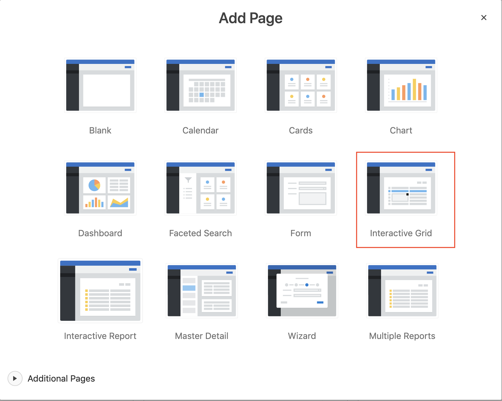

- Enter a name for the Page, Select the "SQL Query" option is selected. Enter the query mentioned below in the query box. Finally, click on Add Page button.

```
<copy>SELECT a.tweetjson.created_at, a.tweetjson.id, a.tweetjson.text, a.tweetjson.source, a.tweetjson.place, a.tweetjson.retweet_count, a.tweetjson.retweeted FROM   appschema.jsontweets a;</copy>
```

    **Note : As you can see in this query, since JSON is supported natively in Oracle Database, we can very easily extract data from JSON objects using the dot notation.**

    - Here in this example, we have extracted the attribute tweet id from the JSON object as follows :
    "tablename.column_consisting_json_object.attribute_to_be_extracted"

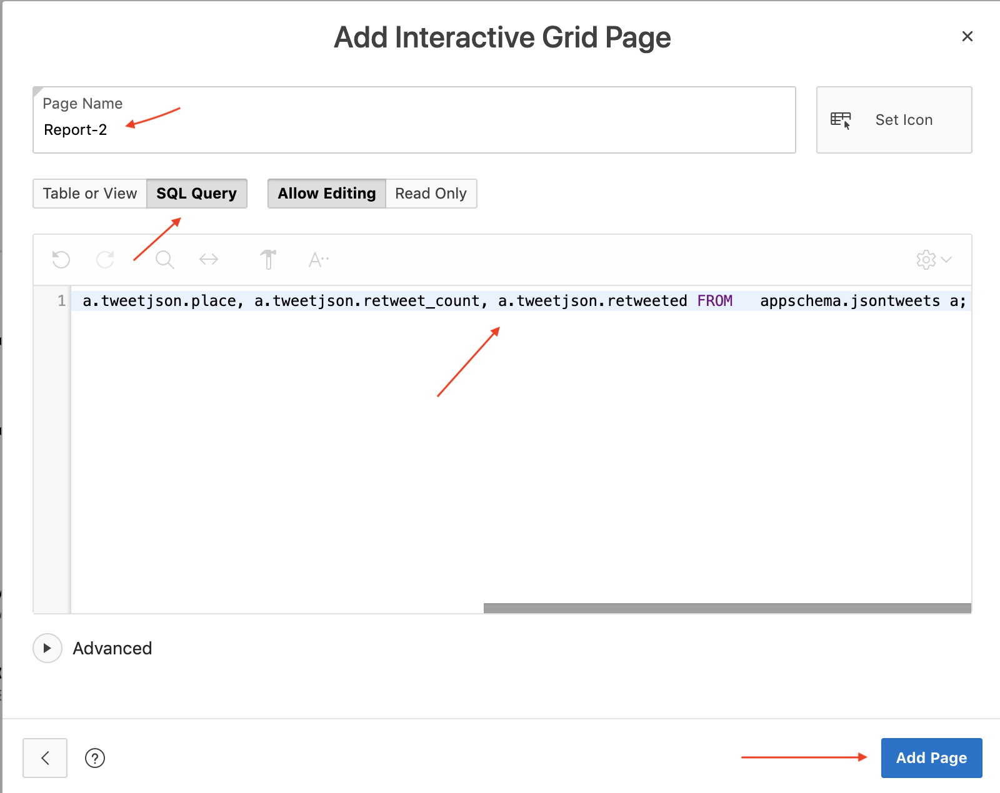

- Select APPSCHEMA user under the settings section and click Create Application


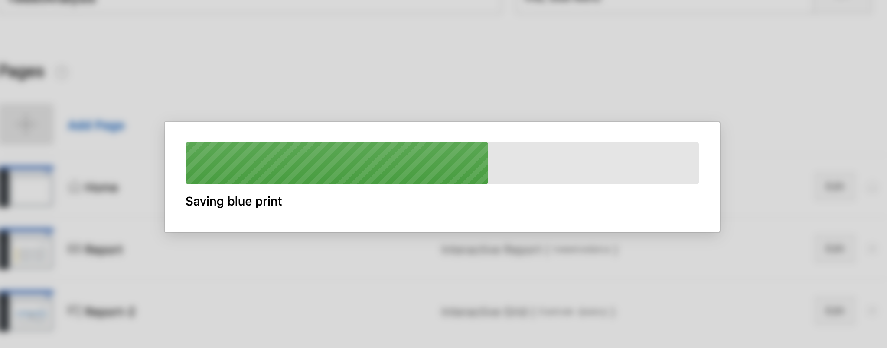

- The application has been created under the apps builder tab.

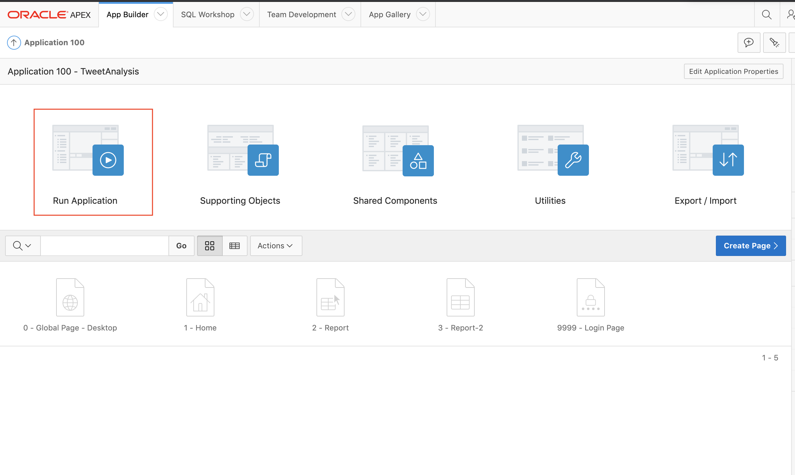

- Click on the Run Application button. You will be navigated to the App login page. Enter the admin user credentials or any other user credentials if you have created any.

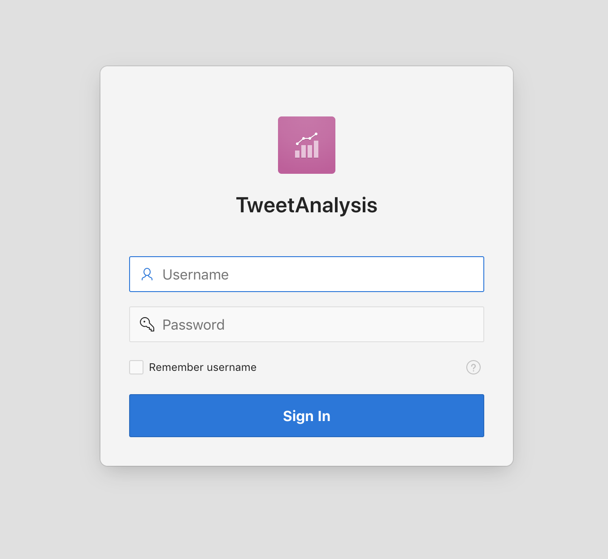

- Once you login, you will see the Application home page.

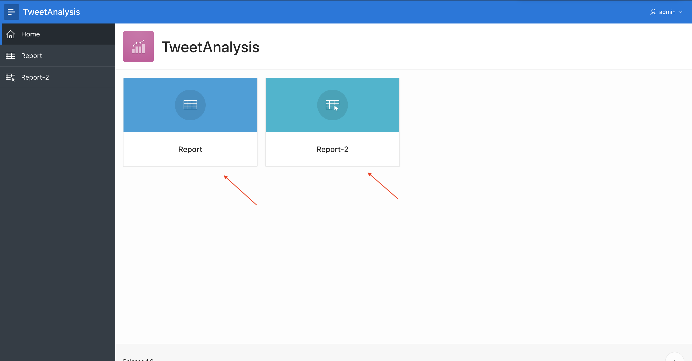

- On the Panel on left side, click on Report Page under Home to see the data we loaded into the database. This page loads the data up-loaded by the first python application

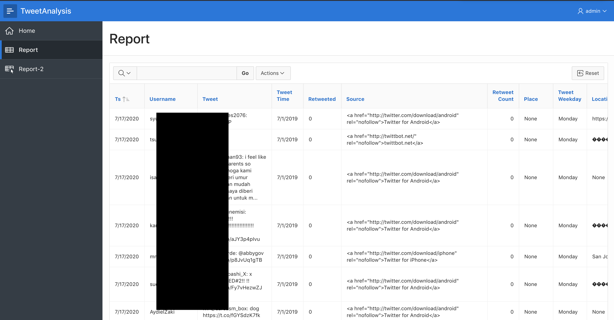

- Similarly, click on the Extracted Data option on the same panel to see the data we loaded using the REST Service.

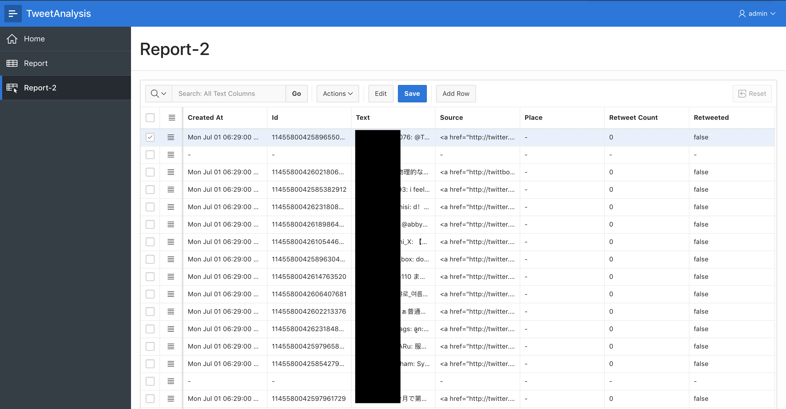

- You have now successfully loaded data using an SDK, send GET and POST data requests using REST Service and also created a Web Application using APEX and ORDS on top of the loaded data.

**Congratulations!! you have successfully setup ORDS and APEX and built a sample application.**
