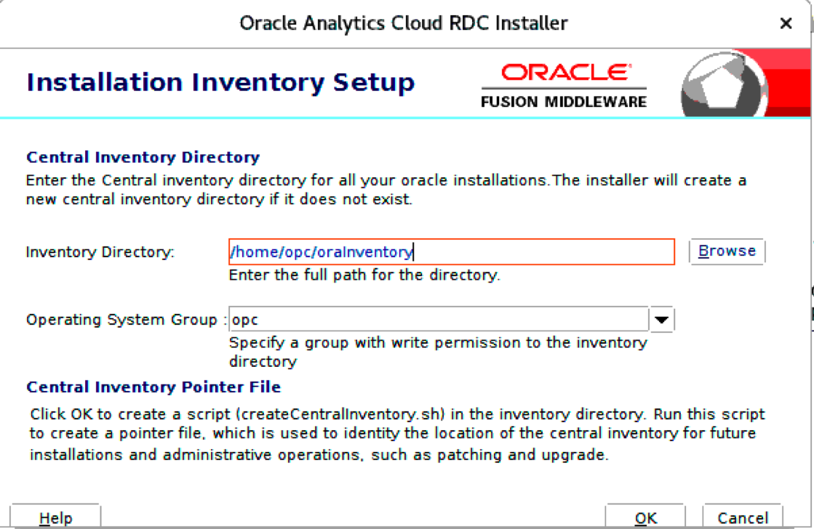
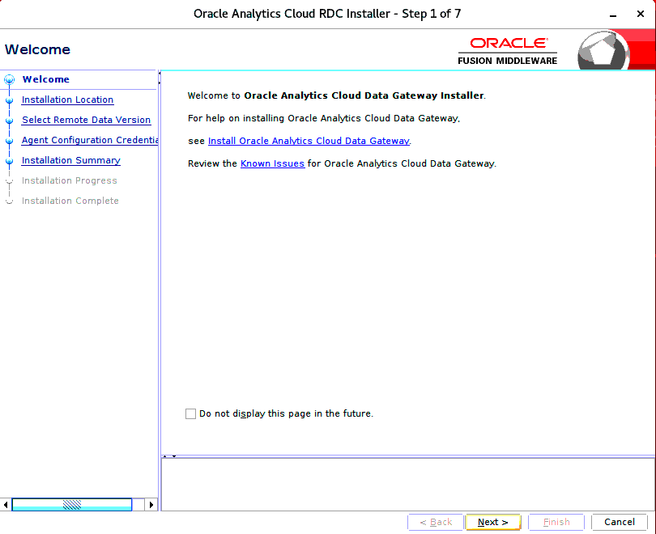
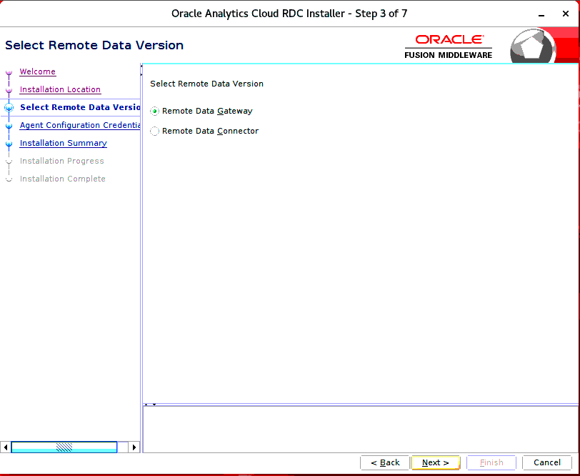
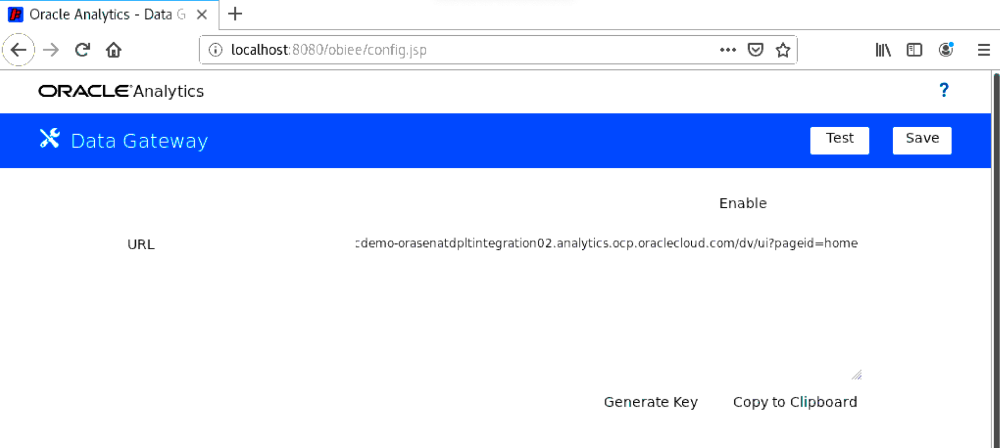
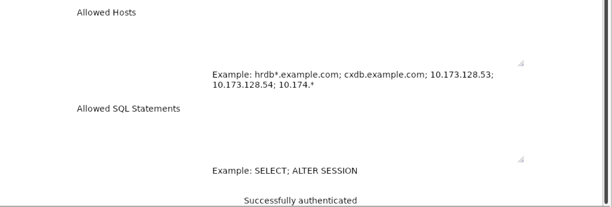

# Connect Oracle Analytics Cloud with your Exadata Cloud Service Database

## Introduction
Oracle Analytics Cloud empowers business analysts and consumers with modern, AI-powered, self-service analytics capabilities for data preparation, visualization, enterprise reporting, augmented analysis, and natural language processing/generation.

Oracle Analytics Cloud is a scalable and secure public cloud service that provides a full set of capabilities to explore and perform collaborative analytics for you, your workgroup, and your enterprise.

With Oracle Analytics Cloud you also get flexible service management capabilities, including fast setup, easy scaling and patching, and automated lifecycle management.

### See an issue?
Please submit feedback using this [form](https://apexapps.oracle.com/pls/apex/f?p=133:1:::::P1_FEEDBACK:1). Please include the *workshop name*, *lab* and *step* in your request.  If you don't see the workshop name listed, please enter it manually. If you would like for us to follow up with you, enter your email in the *Feedback Comments* section.
Watch the video below for an overview on how to connect Oracle Analytics Cloud with your Exadata Cloud Service Database

<div style="max-width:768px"><div style="position:relative;padding-bottom:56.25%"><iframe id="kaltura_player" src="https://cdnapisec.kaltura.com/p/2171811/sp/217181100/embedIframeJs/uiconf_id/35965902/partner_id/2171811?iframeembed=true&playerId=kaltura_player&entry_id=1_7a5h6vqs&flashvars[streamerType]=auto&amp;flashvars[localizationCode]=en&amp;flashvars[leadWithHTML5]=true&amp;flashvars[sideBarContainer.plugin]=true&amp;flashvars[sideBarContainer.position]=left&amp;flashvars[sideBarContainer.clickToClose]=true&amp;flashvars[chapters.plugin]=true&amp;flashvars[chapters.layout]=vertical&amp;flashvars[chapters.thumbnailRotator]=false&amp;flashvars[streamSelector.plugin]=true&amp;flashvars[EmbedPlayer.SpinnerTarget]=videoHolder&amp;flashvars[dualScreen.plugin]=true&amp;flashvars[hotspots.plugin]=1&amp;flashvars[Kaltura.addCrossoriginToIframe]=true&amp;&wid=1_iqzud899" width="768" height="432" allowfullscreen webkitallowfullscreen mozAllowFullScreen allow="autoplay *; fullscreen *; encrypted-media *" sandbox="allow-forms allow-same-origin allow-scripts allow-top-navigation allow-pointer-lock allow-popups allow-modals allow-orientation-lock allow-popups-to-escape-sandbox allow-presentation allow-top-navigation-by-user-activation" frameborder="0" title="Kaltura Player" style="position:absolute;top:0;left:0;width:100%;height:100%"></iframe></div></div>

### Objectives

As a LOB user
1. Install and configure Remote Data Gateway in Oracle Cloud Developer Image
2. Configure Remote Data Gateway with Oracle Analytics Cloud
3. Connect Exadata Cloud Service Database with Oracle Analytics Cloud

### Required Artifacts

- A pre-provisioned instance of Oracle Developer Client image in an application subnet. Refer to [Lab 4](?lab=lab-4-configure-development-system-for-use).
- A pre-provisioned ExaCS database instance. Refer to [Lab 3](?lab=lab-3-provision-databases-on-exadata-cloud).
- A pre-provisioned Oracle Analytics Cloud instance. Refer [here](https://docs.oracle.com/en/cloud/paas/analytics-cloud/acoci/create-services.html#GUID-D2F03D22-95FB-45C8-AB94-928AE4E167AB) to create an Oracle Analytics Cloud instance.
- VNC Viewer or other suitable VNC client on your local laptop


## STEP 1: Connect to dev client desktop over VNC

First, we shh into the dev client and invoke the VNC server that comes pre-installed.

- SSH into your dev client compute instance.

    ```
    <copy>ssh -i /path_to/private-key opc@PublicIP</copy>
    ```

- Change the password on the VNC server.
    
    ```
    <copy>vncpasswd</copy>
    ```
- Once you update the password, start your VNC server with the following command,
  
    ```
    <copy>vncserver -geometry 1280x1024</copy>
    ```
- Your development system may now be ready for accepting VNC connections.

**Mac Users**

  - Open a terminal window and create an ssh tunnel using the following command,
    
    ```
    <copy>ssh -N -L 5901:127.0.0.1:5901 -i /path_to/priv-key-file opc@publicIP-of-your-devClient</copy>
     ```

**Windows Users**
  - Windows 10 users can use powershell to connect using command above.

  - Alternatively, you may create and ssh tunnel using putty. Detailed instructions on using putty for ssh tunnels are provided in the [Appendix](?lab=appendix).

  You now have a secure ssh tunnel from your local laptop to your developement system in OCI on VNC port 5901.

  *Note: As mentioned earlier, you need a VNC client installed on your laptop. This lab uses VNC Viewer.*

  Start VNC Viewer on your laptop and configure a client connection using the settings as shown.
      

  - Note how the connect string for VNC Server is simply localhost:1  That is because the default port 5901 on your local machine is forwarded to 5901 on your OCI dev client over an ssh tunnel.

  - Connect to your VNC desktop and provide the password you changed on the host earlier.

  - If all goes well, you should now see a linux desktop in your VNC window.

## STEP 2: Download, install and configure Remote Data Gateway

1. Download OAC Data Gateway 5.6.0+ from [here](https://www.oracle.com/middleware/technologies/oac-downloads.html).

2. Secure copy the file using scp, sftp or a windows ftp client.

#### Note: You will be secure copying the zip file from your local machine to Cloud Developer Image

    ```
    <copy>scp -i /path_to/keyfile /path_to/datagateway-linux.zip  opc@ipaddress-of-dev-client:/home/opc</copy>
    ```

Example, for mac users with a private key file named id_rsa in their home directoy,

    ```
    <copy>scp -i ~/id_rsa datagateway-linux.zip  opc@129.162.23.12:/home/opc</copy>
    ```

3. In your VNC session, unzip the data gateway file.

    ```
    unzip 'datagateway_file.zip'
    ```

    

4. Run the datagate_file.bin

    ```
    ./datagate_file.bin
    ```
    

5. Oracle Analytics Cloud RDC Installer should pop-up. Select default Inventory Directory and click OK.

    

6. Click NEXT on the Welcome page

    

7. Enter RDC installer location and click NEXT
    
    ```
    /home/opc/Oracle/Middleware/Oracle_Home
    ```
    

8. Select Remote Data Gateway in Remote Data Version and click NEXT

    

9. Enter Username and Password for Agent Configuration Credentials and click NEXT
    ```
    Username: admin
    Password: WElcome_123#
    ```
    

10. Verify the Installation Summary and click INSTALL

    

11. Once the installation progress is 100% click NEXT

    

12. Verify Start Jetty is checked and click FINISH

    

13. Next we will configure Data Gateway with Oracle Analytics Cloud. Open web browser in your Cloud Developer Image and type in the below URL.

    ```
    http://localhost:8080/obiee/config.jsp
    ```

    

14. Enter the Username and Password as specified earlier in this lab and click OK

    ```
    Username: admin
    Password: WElcome_123#
    ```

    

15. Enter your OAC URL, click Generate Key and Save. Once saved, Enable Data Gateway.

    #### Note: Copy the Generated key to a note pad. We will be using the key in Orace Analytics Cloud console.

    

    

16. Now, on your local machine, open a browser and navigate to the homepage of the OAC instance you are attempting to connect to. In the top left, click on the hamburger menu to open the side menu

     

17. In the side menu, click on Console.

     

18. In the console, scroll to the bottom and click **Remote Data Connectivity**.

     

19. Inside the Remote Data Connectivity pane, click on the **Add** button.

     

20. Paste the generated key inside the Public Key box. Notice that all of the information will then populate in the  Name, ID, and Host page.

     

21. After entering the Public Key, click **Ok** and then **Add**. Then, see your connection added.

     

16. Now, navigate back to your VNC Viewer where you got the Public Key from. Click on Test and you should see a Successfully Authenticated message.

    ```
    Sucecessfully authenticated
    ```
    
    

17. Click on Save and scroll down to bottom of the page to verify

    ```
    Successfully Submitted
    ```

    


## STEP 3: Configure Remote Data Connectivity and connect ExaCS Database to Oracle Analytics Cloud


1. Now, in your Oracle Analytics Cloud URL in you local machine, log in to the console.

7. Click on Create on the top right corner and click on Connection

    

8. Select Oracle Database.

    

9. Enter Host, Port, Service Name, Username and Password in the Create Connection page. Then click **Save** to save your connection.
    

```
Host: Host Name can be found in tnsnames.ora
Port: 1521
Service Name: Service name can be found in tnsnames.ora
Username: sysdba
Password: Database Admin password
```

10. After saving your connection, click on the Search bar and select **Connection** from the drop-down menu.
    
    

11. Here, you can see your ExaCS db connected to Oracle Analytics Cloud.
    


For more information on Oracle Analytics Cloud please click [Here](https://www.oracle.com/business-analytics/analytics-cloud.html).

To further explore Oracle Analytics Cloud you can visit our blogs [Here](https://blogs.oracle.com/analytics/).

## Acknowledgements

*Great Work! You successfully connected ExaCS Database to Oracle Analytics Cloud through Remote Data Gateway.*
