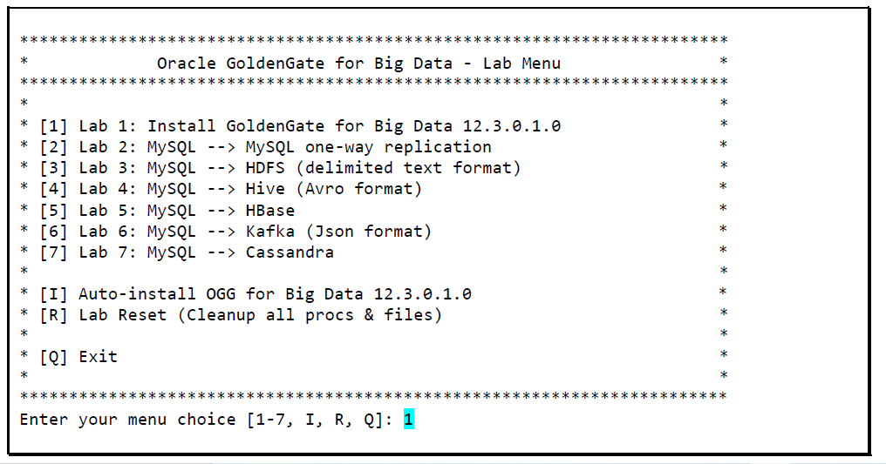

# Installation

## Introduction 

In this lab you will install GoldenGate for Big Data in the GG Target Home.

*Estimated Lab Time*:  15 minutes

  

### About Oracle GoldenGate for Big Data

#### KEY FEATURES

Non-invasive, real-time transactional data streaming

Secured, reliable and fault-tolerant data delivery 
Easy to install, configure and maintain 
Streams real-time changed data 
Easily extensible and flexible to stream changed data to other big data targets and message queues

#### KEY BENEFITS

Improve IT productivity in integrating with big data systems 
Use real-time data in big data analytics for more timely and reliable insight 
Improve operations and customer experience with enhanced business insight • Minimize overhead on source systems to maintain high performance

Oracle GoldenGate for Big Data provides optimized and high performance delivery to Flume, HDFS, Hive, HBase, Kafka and Cassandra to support customers with their real-time big data analytics initiatives.

Oracle GoldenGate for Big Data includes Oracle GoldenGate for Java, which enables customers to easily integrate to additional big data systems, such as Apache Storm, Apache Spark, Oracle NoSQL, MongoDB, SAP HANA, IBM PureData System for Analytics and many others.

Oracle GoldenGate for Big Data’s real-time data streaming platform also allows customers to keep their big data reservoirs, or big data lakes, up to date with their production systems.

#### Summary

Oracle GoldenGate for Big Data offers high-performance, fault-tolerant, easy-to-use, and flexible real- time data streaming platform for big data environments. It easily extends customers’ real-time data
integration architectures to big data systems without impacting the performance of the source systems and enables timely business insight for better decision making.

## **STEP 1**: Login in to Instance

**Access image via Live Lab Marketplace**

 Follow the steps below to install GoldenGate, or optionally you can select “I” from the Lab Menu below to auto-install GG.

   
1.  Change to the ggadmin user.  When prompted, enter the password *oracle*.  

Open a terminal session locally

<copy>$ ssh opc@xxx.xxx.xx.xx</copy>

Use Public IP allocated from LiveLabs

**Note: PLEASE USE ‘ggadmin’ USER FOR ALL THE LABS**
    
    <copy>sudo su – ggadmin</copy>
    

1. The following Lab Menu will be displayed

  
Follow these instructions to install GoldenGate for Big Data

## **STEP 3**: Performing the Install

1.  **Select Option 1** 
   
Review the overview notes on the following screen, then select **Q** to quit. 
      

  These online notes have been provided so you can cut/paste file names to another session, to avoid typos.

1. To install and configure GoldenGate, we have extracted the GG binaries from a tar file prior to the labs – this file has been copied to /u01 as part of the setup. We will connect to the GoldenGate command line interface (ggsci) and run CREATE SUBDIRS to create the subdirectories in the GoldenGate home.

**Optional**  (Do not select Auto-install if you already installed GG manually)

If you would like to auto-install GoldenGate for Big Data, you can select option "I". To access the Lab Menu, type the alias ‘labmenu’, then select I.

Congratulations, GoldenGate for Big Data is now installed. You can proceed to the next lab, or to any other lab. Each lab can be run independently.

You may now *proceed to the next lab*.

## Learn More

* [Oracle GoldenGate for Big Data 19c | Oracle](https://www.oracle.com/middleware/data-integration/goldengate/big-data/)

## Acknowledgements
* **Author** - Brian Elliott, Data Integration Team, Oracle, August 2020
* **Contributors** - Meghana Banka
* **Last Updated By/Date** - Brian Elliott, September 2020

## See an issue?
Please submit feedback using this [form](https://apexapps.oracle.com/pls/apex/f?p=133:1:::::P1_FEEDBACK:1). Please include the *workshop name*, *lab* and *step* in your request.  If you don't see the workshop name listed, please enter it manually. If you would like us to follow up with you, enter your email in the *Feedback Comments* section.

