# Lab 5 -   MySQL --> HBase

## Introduction

This lab is intended to give you familiarity with how to configure GG for database to database replication. If you are already familiar with GG, you can choose to skip this lab.

In this lab we will load data in MySQL database ‘ggsource’, GG extract process ‘extmysql’ will capture the changes from MySQL’s binary logs and write them to the local trail file. The pump process ‘pmphadop’ will route the data from the local trail (on the source) to the remote trail (on the target). The replicat
process ‘rhbase’ will read the remote trail files, create the HBase tables and write the data to those tables.

Lab Architecture

  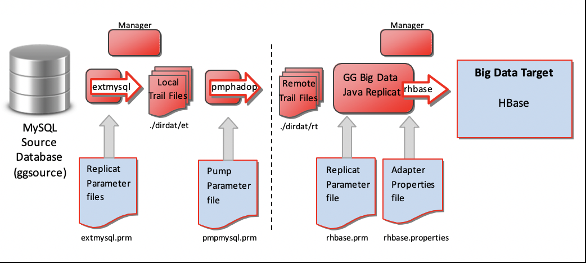

Estimated Lab Time: 60 minutes

### Objectives
- Explore GoldenGate replication from **MySQL to HBase**

### Prerequisites
* An Oracle Free Tier, Always Free, Paid or LiveLabs Cloud Account
* Lab: Installation

## **STEP 1**: Configuration

1. Use the following credentials if you are at a terminal session:

su - ggadmin

User ID: ggadmin
Password:  oracle

or
    
If you are already at a Unix prompt, you can access the Lab Menu by typing the alias ‘labmenu’

2. The following Lab Menu will be displayed, 
select R to reset the lab environment, then select 5.
Review the overview notes on the following screen, then select Q to quit. 

  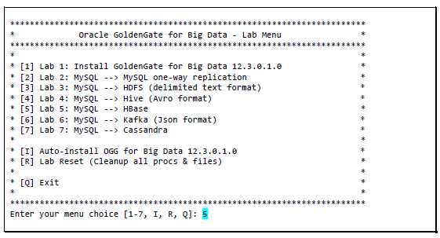

**Step3:** The above step will copy the GoldenGate configuration files to the GG Home directories, under ./dirprm. The workshop facilitator will review the content of each of these files to understand how GoldenGate is being configured.
  ````
  view /u01/gg4mysql/dirprm/create_mysql_to_hadoop_gg_procs.oby
  
  view these files, same as in previous lab:
  /u01/gg4mysql/dirprm/mgr.prm
  /u01/gg4mysql/dirprm/extmysql.prm
  /u01/gg4mysql/dirprm/pmpmysql.prm

  view /u01/gg4hadoop123010/dirprm/create_hbase_replicat.oby

  view /u01/gg4hadoop123010/dirprm/rhbase.prm

  view /u01/gg4hadoop123010/dirprm/rhbase.properties
  ````

**Step4:** The first step is to start the GG manager process on the source and target. Start two terminal sessions and connect to ggadmin/oracle (then click Q to get to a prompt). Keep these sessions open for the rest of this lab.

**Step5:** In the first session, navigate to the GG Home for MySQL, and start the manager process. You can either cd to the directory, or call the alias ggmysql:

  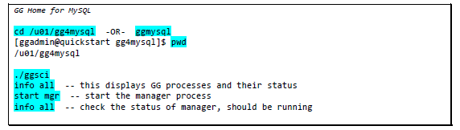

**Step6:** In the second session, navigate to the GG Home for Hadoop, and start the manager process. You can either cd to the directory, or call the alias gghadoop:

  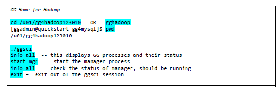

**Step7:** In the GG for MySQL ggsci session, we will create and start the GG extract process:

  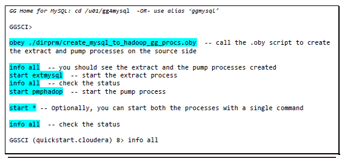
  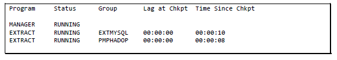

**Step8:** Now that the source side is setup, let us configure GG on the target side (HBase).

**Step9:** In the GG for Hadoop session, you will need to modify the HBase properties by removing the ‘---‘ from the highlighted values:

  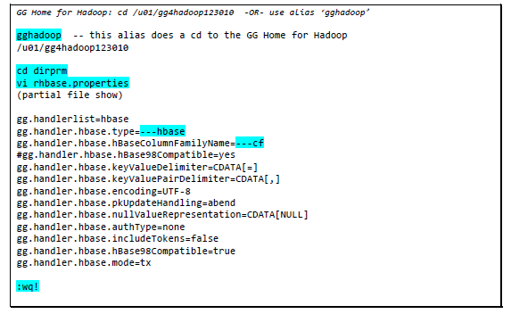

**Step10:** Now create and start the HBase replicat process:

  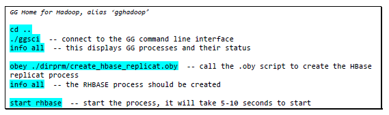
  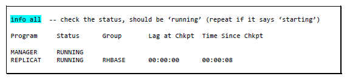

**Step11:** Now that GG processes have been created and started on both the source and target, let us take a look at what is in the HBase tables. Make sure that the tables are empty (they don’t even exist yet). We will load some data on the MySQL database ‘ggsource’ and GG will extract the data, create the HBase tables, and write the data to the HBase target tables.

**Step12:** Start a new session, connect to ggadmin/oracle (then click Q to get to a prompt):

  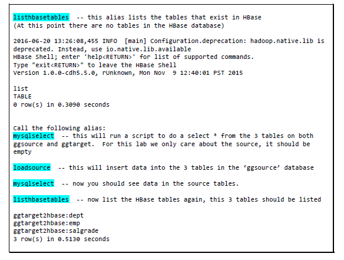

**Step13:** Starting with GG version 12.2.0.1.1, GG automatically creates the HBase tables. Let us take a look at the contents of the tables

  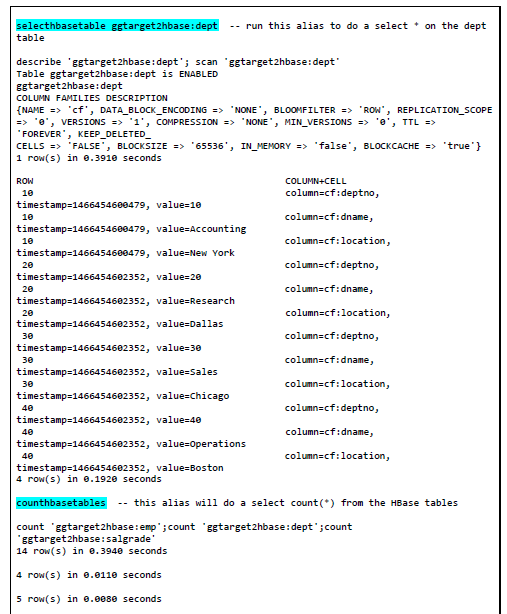

  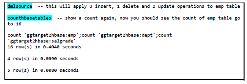

**Step14:** Let us confirm that GG replicated the data that it captured. In a GG Home for Hadoop session:

  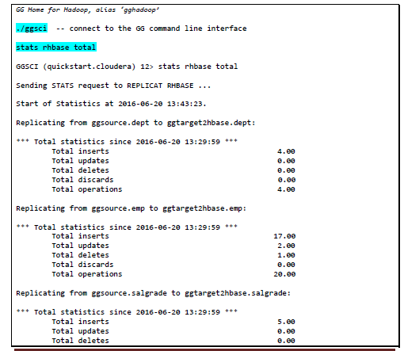
  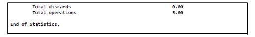

In conclusion, you loaded data in the MySQL database ‘ggsource’ while GG extract process ‘extmysql’ captured the changes from the MySQL binary logs and wrote them to the local trail file. The pump process ‘pmphadop’ routed the data from the local trail (on the source) to the remote trail (on the target). The replicat process ‘rhbase’ read the remote trail files, created the HBase tables and wrote the data to those tables.

**End of Lab 5 - You may proceed to the next Lab**

**Optional:** only if VNC is available

You can also see the HBase data created by GG from Hue:

Open a Browser window>

[HUE - Click here](http://127.0.0.1:8888) 

Login to HUE: cloudera/cloudera

## Acknowledgements

  * **Author** - Brian Elliott
  * Team - Data Integration Team
  * Last Updated By/Date - Meghana Banka, September 2020
 
 ## See an issue?
Please submit feedback using this [form](https://apexapps.oracle.com/pls/apex/f?p=133:1:::::P1_FEEDBACK:1). Please include the *workshop name*, *lab* and *step* in your request.  If you don't see the workshop name listed, please enter it manually. If you would like for us to follow up with you, enter your email in the *Feedback Comments* section.
