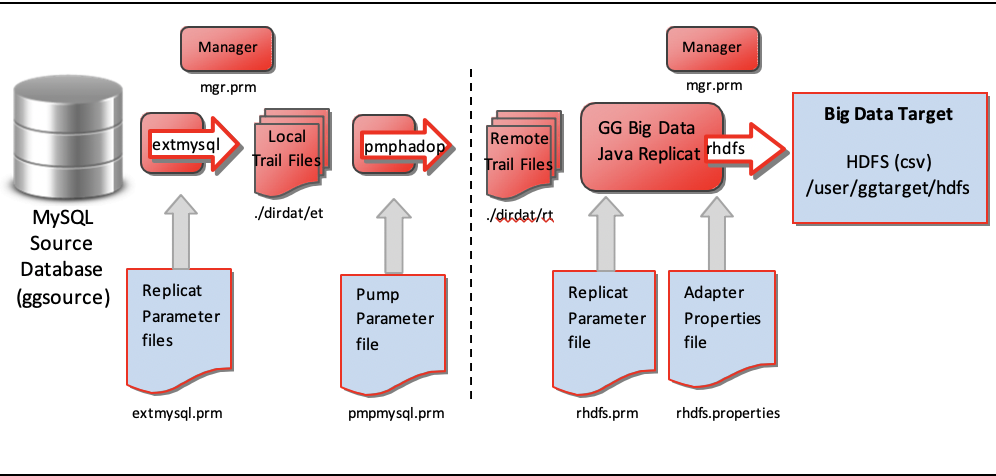
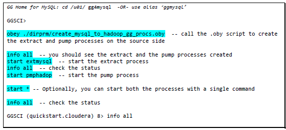
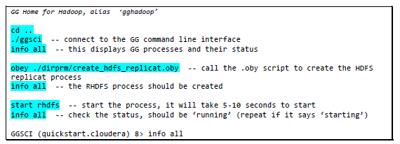
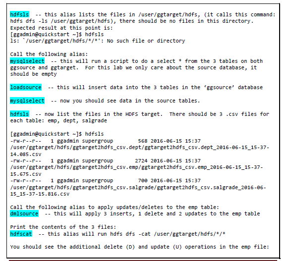
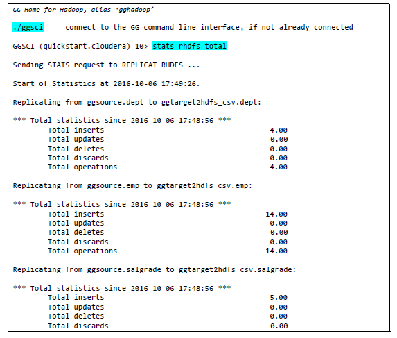
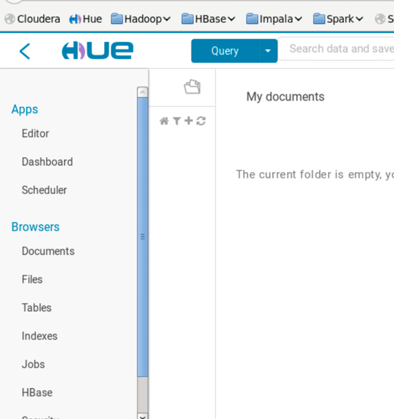
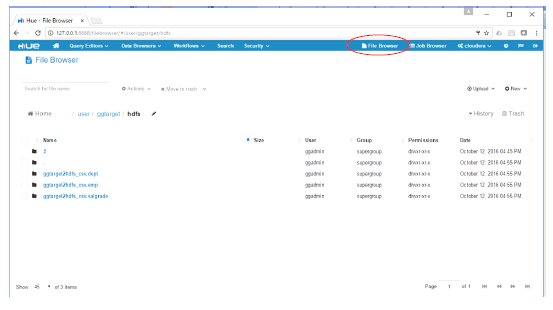
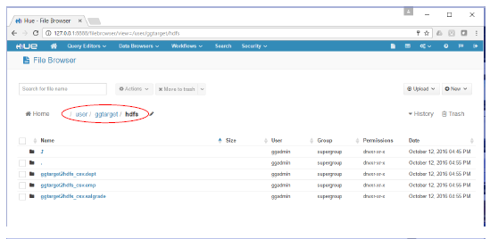
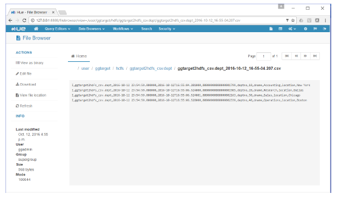

#  MySQL --> HDFS(delimited text format)

## Introduction
In this lab we will load data in MySQL database ‘ggsource’, GG extract process ‘extmysql’ will capture the changes from MySQL’s binary logs and write them to the local trail file. The pump process ‘pmphadop’ will route the data from the local trail (on the source) to the remote trail (on the target). The replicat
process ‘rhdfs’ will read the remote trail files, and write the data to the HDFS target directory
/user/ggtarget/hdfs/

*Estimated Lab Time*:  60 minutes

#### Lab Architecture

  

### Objectives
- Explore GoldenGate replication from **MySQL to HDFS**

### Prerequisites
* An Oracle Free Tier, Always Free, Paid or LiveLabs Cloud Account
* Lab: Installation

## STEPS

For the Lab:

If at a terminal session:

<copy>$ ssh opc@xxx.xxx.xx.xx</copy>

<copy>>sudo su - ggadmin</copy>

Password:  oracle

If already at a Unix prompt, you can access the Lab Menu by typing the alias ‘labmenu’
For the Lab terminal session:

  

The following Lab Menu will be displayed,

**1:** select **R** to reset the lab environment, then select **3** to begin Lab3.

**2:** Review the overview notes on the following screen, then select Q to quit. These online notes have been provided to can cut/paste file names to another session, to avoid typos.

**3:** The above step will copy the GoldenGate configuration files to the GG Home directories, under ./dirprm. 

(Is already done in the env script for this workshop)

<copy>cd /u01/gg4hadoop/dirprm</copy>

<copy> view /dirprm/create_hdfs_replicat.oby</copy>

<copy>cd /u01/gg4hadoop/dirprm</copy>

<copy> view /u01/gg4hadoop123010/dirprm/rhdfs.prm</copy>

<copy> view /u01/gg4hadoop123010/dirprm/rhdfs.properties</copy>

**4:**Start the GG manager process on both the source and target. Start two putty sessions, connect to ggadmin/oracle (then click Q to get to a prompt). Keep these sessions open for the rest of this lab.

**5:** In the first session, go to the **GG Home for MySQL**, and start the manager process. You can either cd to the directory, or call the alias ggmysql:

  

<copy> cd /u01/gg4mysql</copy>

<copy> pwd</copy>

<copy>./ggsci</copy>

<copy> info all</copy>

<copy> start mgr</copy>		
 
<copy> info all</copy>	

**6:** In the second session, go to the **GG Home for Hadoop**, and start the manager process. You can cd to the directory:

  

<copy> cd /u01/ gg4hadoop123010</copy>

<copy>./ggsci</copy>

<copy> info all</copy>	 

<copy> start mgr</copy>		

<copy> info all</copy>	 

<copy> exit</copy>

**7:** In the **GG for MySQL ggsci session**, we will create and start the GG extract process:

  
  

<copy>obey ./dirprm/create_mysql_to_hadoop_gg_procs.oby</copy>

<copy> info all</copy>	
 
<copy> start extmysql</copy>

<copy> info all</copy>	

<copy> start pmphadop</copy>	

<copy> start *</copy>

<copy> info all</copy> 

**8:** Now that the source side is setup, let us configure GG on the target side (HDFS).

**9:** In the **GG for Hadoop session**, you will need to modify the HDFS properties by removing the ‘---‘ from the highlighted values:

  

<copy> cd dirprm</copy>

<copy> vi rhdfs.properties</copy>

**Remove "--" below**

<copy> ---hdfs</copy>

<copy> ---/user/ggtarget/hdfs</copy>

<copy> ---delimitedtext</copy>

<copy> ---.csv</copy>

<copy>:wq!</copy>

**10:** Now create and start the HDFS replicat process:

  

<copy> cd ..</copy>

<copy>./ggsci</copy>	 

<copy> info all</copy>		

<copy> obey ./dirprm/create_hdfs_replicat.oby</copy>	

<copy> info all</copy>	

<copy> start rhdfs</copy>	

**Note: You might have to run "info all" several times before the status changes to running**

<copy> info all</copy>

**11:** Replicat is now running

  

**12:** Now that GG processes have been created and started on both the source and target, let us take a look at what is in the HDFS directory – it should be empty. Then we will load some data on the MySQL database ‘ggsource’ and GG will extract and write it to the HDFS target. GG will create a subdirectory for each table in the base directory /user/ggtarget.

**13:** Start a new session, connect to ggadmin/oracle (then click Q to get to a prompt):

  
  

<copy> hdfsls</copy>

<copy> mysqlselect</copy>

<copy> loadsource</copy>

<copy> mysqlselect</copy>

<copy> hdfsls</copy>

<copy> dmlsource</copy>

<copy> hdfscat</copy> 

In summary, we loaded data in MySQL database ‘ggsource’, GG extract process ‘extmysql’ captured the changes from the MySQL binary logs and wrote them to the local trail file. The pump process
‘pmphadop’ routed the data from the local trail (on the source) to the remote trail (on the target). The replicat process ‘rhdfs’ read the remote trail file, and wrote the data to the HDFS target directory
/user/ggtarget/hdfs/*.

**14:** Let us confirm that GG replicated the data that it captured. Go back to the MySQL ggsci session and execute the following commands to see what data GG has processed, and do the same in the Hadoop ggsci session:

**15:** In MySQL ggsci session window:

  

  

<copy>./ggsci</copy>

<copy> stats extmysql total</copy>

**16:** In Hadoop ggsci session window:

  

  

<copy>./ggsci</copy>

<copy> stats rhdfs total</copy>

The stats command displays the statistics of the data that GoldenGate processed (grouped by insert/update/deletes). Counts should match between source and target.
You can also see the files created by GG from Hue:

**HUE -**

(http://yourlocalipaddress]:8888) 

Login to Hue: cloudera/cloudera
Click on File Browser (Manage HDFS) > Navigate to /user/ggtarget/hdfs…

/user/ggtarget/hdfs…

You may now *proceed to the next lab*.

## Learn More

* [Oracle GoldenGate for Big Data 19c | Oracle](https://www.oracle.com/middleware/data-integration/goldengate/big-data/)

## Acknowledgements
* **Author** - Brian Elliott, Data Integration Team, Oracle, August 2020
* **Contributors** - Meghana Banka, Rene Fontcha
* **Last Updated By/Date** - Brian Elliott, September 2020

## See an issue?
Please submit feedback using this [form](https://apexapps.oracle.com/pls/apex/f?p=133:1:::::P1_FEEDBACK:1). Please include the *workshop name*, *lab* and *step* in your request.  If you don't see the workshop name listed, please enter it manually. If you would like us to follow up with you, enter your email in the *Feedback Comments* section.
