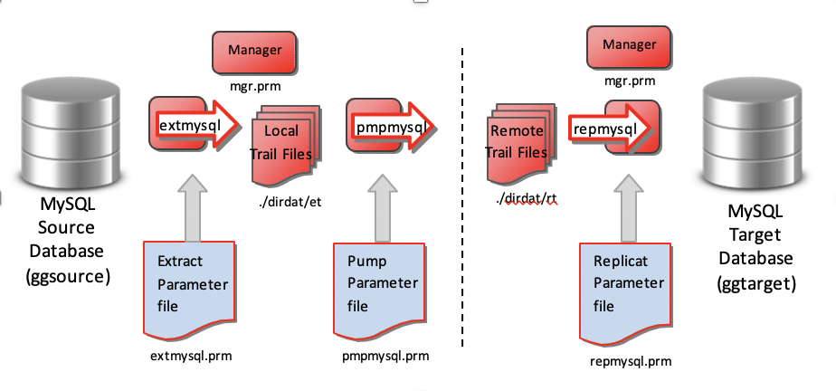

# Lab 1 -  Setup of Golden Gate Classic Workshop 

## Want to learn more:
"https://www.oracle.com/middleware/data-integration/goldengate/"

## Introduction
Contents

Introduction
 Disclaimer
  Oracle GoldenGate for Big Data Workshop Architecture 
  Setup the QuickStart VM for GoldenGate for Big Data Workshop

Lab 1 – Setup GoldenGate Classic

 
Lab 2 – MySQL ->  Oracle  unidirectional replication
  
Lab 3 – Oracle ->  mySQL  unidirectional replication

Lab 4 – Classic Active-Active Replication 

Lab 5 – Classic Column Conversions 

### Objectives

KEY FEATURES

Non-invasive, real-time transactional data streaming

Secured, reliable and fault-tolerant data delivery 
Easy to install, configure and maintain 
Streams real-time changed data 
Easily extensible and flexible to stream changed data to other relational targets

KEY BENEFITS

Improve IT productivity in integrating with data management systems 
Use real-time data in big data analytics for more timely and reliable insight 
Improve operations and customer experience with enhanced business insight • Minimize overhead on source systems to maintain high performance

Oracle GoldenGate Classic provides optimized and high performance delivery.

Oracle GoldenGate Classic real-time data streaming platform also allows customers to keep their data reservoirs up to date with their production systems.

Time to complete - 15 mins

### Summary

Oracle GoldenGate offers high-performance, fault-tolerant, easy-to-use, and flexible real- time data streaming platform for big data environments. It easily extends customers’ real-time data
integration architectures to big data systems without impacting the performance of the source systems and enables timely business insight for better decision making.

### Disclaimer

This workshop is only for learning and testing purposes. None of the files from the labs should be used in a production environment. 

Time to Complete -
Approximately 30 min

## Steps

In this lab we will setup GoldenGate Classic

**Step1:** 

**Prereqs (Completed by Oracle Team prior to Labs)**

mkdir /opt/Test_Software
Downloaded the following software zip files to the "Software" folder:
   		OGG Classic v19.1.0.0.3 for MySQL on Linux x64
   		OGG Classic v19.1.0.0.4 for Oracle on Linux x64
   		Oracle Database v19.3.0.0.0 for Linux x64
   		Oracle Instant Client Basic v19.3.0.0.0 for Linux x64

**Oracle**

Create pdbs

PDBEAST

Source pdb
   cd /u02/oradata/ORCL/
mkdir PDBEAST
alter system set db_create_file_dest='/u02/oradata/ORCL//PDBEAST';
sqlplus / as sysdba
alter pluggable database oggoow19 close immediate;
alter pluggable database oggoow19 open read only;
create pluggable database PDBEAST from oggoow19;
alter pluggable database PDBEAST open;
exit

PDBWEST

Source pdb
   cd /u02/oradata/ORCL/
mkdir PDBWEST
sqlplus / as sysdba
alter system set db_create_file_dest='/u02/oradata/ORCL//PDBWEST';
alter pluggable database oggoow191 close immediate;
alter pluggable database oggoow191 open read only;
create pluggable database PDBWEST from oggoow191;
alter pluggable database PDBWEST open;
exit

Install Mysql Workbench
sudo yum install mysql-workbench-community
Start Mysql Workbench to test
/usr/bin/mysql-workbench –help

Change to the “/opt/TestSoftware/Oracle" directory.

Run the setup_database_for_ogg.sql script.
create user c##ggadmin identified by Oracle1 default tablespace oggtbls_pdbwest quota unlimited on oggtbls_pdbwest profile ogg_profile;

sqlplus / as sysdba @setup_database_for_ogg.sql
The database will now contain two PDBs, PDBEAST and PDBWEST, and is configured for OGG replication.
The common database user C##GGADMIN will be created, and the container user C##GGADMIN in PDBEAST and PDBWEST.

**mySQL**

CREATE USER 'ggadmin'@'localhost' IDENTIFIED BY '@Oracle1@';
GRANT ALL PRIVILEGES ON * . * TO 'ggadmin'@'localhost';

**Step2:** Change to ggadmin

'>su – ggadmin
Password = oracle

PLEASE USE ‘ggadmin’ USER FOR ALL THE LABS 

## Done by Student:

Open a terminal session

## STEPS -

**Step1:**  Test connectivity for the OGG users:
sqlplus c##ggadmin
When prompted enter the password: Oracle1
sqlplus c##ggadmin@pdbeast
When prompted enter the password: Oracle1	
sqlplus ggadmin@pdbwest
When prompted enter the password: Oracle1
		   
2. Change to the "/opt/Test_Software/Scripts/Oracle/orderentry" directory
su – oracle
Password = Data1Integration!

3. Run the following commands:
sqlplus / as sysdba
alter session set container=pdbeast;
sqlplus / as sysdba @create_user.sql
edit and chg to c##tpc
grant all priviledges to c##tpc;

@create_user.sql
sqlplus / as sysdba
alter session set container=pdbwest;
@create_user.sql
sqlplus c##tpc@pdbeast
When prompted enter the password: Oracle1
@database.sql
sqlplus c##tpc@pdbwest
When prompted enter the password: Oracle1
@database.sql
Each PDB in the database (pdbeast and pdbwest) will now contain a TPC schema with seeded tables.

4. Enter "exit" to logout as the "oracle" user.

5. Test connectivity to MySQL by executing the commands:
sudo service mysqld start
sudo mysql -u ggadmin -p@Oracle1@
create database tpc;
create database ggadmin;
use tpc
show tables;
There should be 14 tables in the tpc database.
exit;

sudo mysql -u ggrep -p@Oracle1@
use tpc
show tables;
There should be 14 tables in the tpc database.
 exit;

**Step2:** 

**GoldenGate for Oracle**
	
1. start a second session

2. Switch to the "oracle" user.
sudo su – oracle
export OGG_HOME=/u01/app/oracle/product/19.1.0/gg

3. Go to the $OGG_HOME location
cd $OGG_HOME

4. Start ggsci and execute the following commands:

./ggsci
create subdirs
dblogin userid c##ggadmin@orcl, password Oracle1
This validates remote connectivity to the Oracle Database.
exit

**Step3:**

**GoldenGate for mySQL**

1. Mysql -uroot -pData1Integration!
CREATE USER 'ggrep'@'localhost' IDENTIFIED BY '@Oracle1@';
GRANT ALL PRIVILEGES ON * . * TO 'ggrep'@'localhost';

>mysql\q

2. Go to the "oggmysql" directory.
cd /u01/app/oracle/product/19.1.0/oggmysql

3. Set the environment variable OGG_HOME to this directory.
export OGG_HOME=/u01/app/oracle/product/19.1.0/oggmysql

4. Start GGSCI and execute the following commands:
create subdirs
dblogin sourcedb tpc@localhost:3306, userid ggadmin, password @Oracle1@
This validates remote connectivity to the MySQL Database for capture.
dblogin sourcedb tpc@localhost:3306, userid ggrep, password @Oracle1@
This validates remote connectivity to the MySQL Database for apply.
exit
	
5.  Enter "exit" twice to close the connection to the database machine.

6.  Shutdown the MySQL database.

Sudo su -
    a) sudo service mysqld stop

Shutdown the Oracle database.

7. Switch to the oracle user.
    a) sudo su – oracle / Data1Integration!

8. Shutdown the Oracle database and listener.
    a) sqlplus / as sysdba
	   i) shutdown immediate
	   ii) exit

9. Enter "exit" twice to close the connection to the database machine.

**You have completed Lab 1 - You may proceed to the next Lab**

## Acknowledgements

  * Authors ** - Brian Elliott
  * Contributors ** - Brian Elliott
  * Team ** - Data Integration Team
  * Last Updated By - Brian Elliott, September 2020

## Please submit an issue on our issues page:
[issues](https://github.com/oracle/learning-library/issues) 

 We review it regularly.

