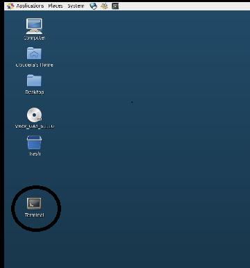

# Lab 5 - ogg-column-conversions

### Introduction

This lab is intended to give you familiarity with how to configure GG for database to database replication. I
In this lab we will load data in MySQL database ‘ggsource’. The GG extract process ‘extmysql’ and will
capture the column changes from MySQL’s binary logs and write them to the local trail file. The pump process ‘pmpmysql’ will route the data from the local trail (on the source) to the remote trail (on the target). The replicat process ‘repmysql’ will read the remote trail files, and apply the changes to the MySQL database ‘ggtarget’

### Objectives
Replication of column conversions from relational source to a relational target using GoldenGate

Time to Complete -
Approximately 60 minutes

## Done by Student:

## STEPS-

1. Open a terminal session

1. Oracle source table.
   a) Connect to the PDBEAST database as the user "tpc".
   b) Execute the following DML to create the source table:
      drop table wshop_funcs;
      create table wshop_funcs (
        row_number    	number(3,0),
        row_text		varchar2(25),
        row_insert_ts         timestamp(6),
        row_insert_by         varchar(6),
        row_update_ts         timestamp(6),
        row_update_by         varchar(6),
        primary key (row_number)
      );

      drop table cust_zip;
      create table cust_zip (
        cust_id              number(10,0),
        cust_zip             number(5,0),
        primary key (cust_id)
      ); 

2. MySQL target table.
   a) Connect to the MySQL database as the user "tpc".
      i. mysql -u tpc -p@Oracle1@
   b) Execute the following DML to create the target tables:
      use tpc;
	drop table wshop_funcs;
      create table wshop_funcs (
        srow_number       	numeric(3,0),
        srow_text		    varchar(55),
        srow_insert_ts     datetime(6),
        srow_insert_by     varchar(6),
        srow_update_ts     datetime(6),
        srow_update_by     varchar(6),
        gg_commit_ts      datetime(6),
        lag_extract_ms    numeric(10,0),
        lag_replicat_ms   numeric(10,0),
        src_db_name       varchar(10),
        src_db_version    varchar(75),
        src_txn_csn       numeric(9,0),
        CONSTRAINT PK_Funcs primary key (srow_number,gg_commit_ts)
      ) engine=innodb;
  
      drop table cust_city_state;
      create table cust_city_state (
        cust_id              numeric(10,0),
        cust_city            varchar(25),
        cust_state           char(2),
        cust_zip             int(5),
        CONSTRAINT PK_CustCtySt primary key (cust_id)
      ) engine=innodb;

      drop table zip_lookup;
      create table zip_lookup (
        zip         int(5),
        zip_city    varchar(25),
        zip_state   char(2),
        CONSTRAINT PK_Zplk primary key (zip)
      ) engine=innodb;

      insert into zip_lookup values (80033, 'Wheat Ridge', 'CO');
      insert into zip_lookup values (80202, 'Denver', 'CO');
      insert into zip_lookup values (94105, 'San Francisco', 'CA');
      insert into zip_lookup values (70001, 'Jefferson', 'LA');
      insert into zip_lookup values (70117, 'New Orleans', 'LA');
      commit;

3. Oracle data capture
   a. Edit the parameter file for the ETPC Integrated Extract.
   b. Add the following table statement:
      i. table pdbeast.tpc.wshop_funcs, TOKENS (
           TKN-EXTLAG-MSEC = @GETENV ("LAG", "MSEC"),
           TKN-SRC-DBNAME = @GETENV ("DBENVIRONMENT", "DBNAME"),
           TKN-SRC-DBVERSION = @GETENV ("DBENVIRONMENT", "DBVERSION"),
           TKN-TXN-CSN = @GETENV ("TRANSACTION", "CSN")
         );
   c. Save and close the file.
   d. When using wildcards, where do table statements like the one above need to be placed?
   e. Do you need to exclude the table from being captured via the wildcards? (If so, did you do this?)

4. MySQL data apply
   a. Edit the parameter file for the RTPC Coordinated Replicat.
   b. Add the following map statements, specifying thread "10" for the data apply:
      i. -- Execute a query against a lookup table to get the city and state for the
         -- incoming zip code
        MAP pdbeast.tpc.cust_zip, TARGET tpc.cust_city_state,
         SQLEXEC (ID ZIPLKUP, 
           QUERY 'select zip_city, zip_state from tpc.zip_lookup where zip = ?',
           PARAMS (p1 = cust_zip)),
         COLMAP (usedefaults,
                 cust_city = ZIPLKUP.zip_city,
                 cust_state = ZIPLKUP.zip_state
        )
     ii. MAP pdbeast.tpc.wshop_funcs, TARGET tpc.wshop_funcs,
           colmap (usedefaults,
		           srow_number = row_number,
                   srow_text = row_text,
                   srow_insert_ts = row_insert_ts,
                   srow_insert_by = row_insert_by,
                   srow_update_ts = row_update_ts,
                   srow_update_by = row_update_by,
                   gg_commit_ts = @GETENV ("GGHEADER", "COMMITTIMESTAMP"),
                   lag_extract_ms = @TOKEN ("TKN-EXTLAG-MSEC"),
                   lag_replicat_ms = @GETENV ("LAG", "MSEC"),
                   src_db_name = @TOKEN ("TKN-SRC-DBNAME"),
                   src_db_version = @TOKEN ("TKN-SRC-DBVERSION"),
                   src_txn_csn = @TOKEN ("TKN-TXN-CSN")
         )	 
	 iii. Set the Replicat to insert all data into the table tpc.wshop_funcs, no matter the 
	      source operation.
   c. Save and close the file.		

 5. Start OGG and generate data
   a) Start the OGG environment:
      i. Oracle: 
start etpc
       start pmysql  
	  ii. MySQL: start rtpc
   b) Verify all OGG Groups are running.
   c) Generate data  
      i. In the window connected to the database server:
		 1) Login to the PDBEAST database as the user "tpc"
		    A) sqlplus tpc@pdbeast
			B) When prompted enter the password: Oracle
		 2) Execute the following:
		    DECLARE
              v_MainLoop     NUMBER(3);
              v_Txt          VARCHAR2(25);
            BEGIN
              FOR v_MainLoop IN 1 .. 20 LOOP
                SELECT DBMS_RANDOM.STRING('A', 25) INTO v_Txt FROM DUAL;
                INSERT INTO WSHOP_FUNCS values (v_MainLoop, v_Txt, CURRENT_TIMESTAMP, 'EAST', NULL, NULL);
                COMMIT;
              END LOOP;
   
              FOR v_MainLoop IN 1 .. 7 LOOP
                SELECT DBMS_RANDOM.STRING('A', 25) INTO v_Txt FROM DUAL;
                UPDATE WSHOP_FUNCS SET ROW_TEXT = v_Txt, ROW_UPDATE_TS = CURRENT_TIMESTAMP, ROW_UPDATE_BY = 'LOREN' WHERE ROW_NUMBER = v_MainLoop;
                COMMIT;
              END LOOP;  

              INSERT INTO CUST_ZIP VALUES (1, 80033);
              COMMIT;

              INSERT INTO CUST_ZIP VALUES (2, 70117);
              COMMIT;

              INSERT INTO CUST_ZIP VALUES (3, 94105);
              COMMIT;

              INSERT INTO CUST_ZIP VALUES (4, 80202);
              COMMIT;

              INSERT INTO CUST_ZIP VALUES (5, 70001);
              COMMIT;
   
              END;
              /
			  
6. Verify data has been replicated.
   a. Use the GGSCI "send report" command to generate stats for the rtpc Coordinated Replicat.
   b. View the report file to validate sqlexec execution are data apply stats.
   c. Connect to the MySQL database as the user "tpc".
      i. mysql -u tpc -p@Oracle1@
   d. View the data in the tpc.cust_city_state table.
   e. View the data in the tpc.wshop_funcs table.
   
 7. Shutdown all Extracts and Replicats.

**End of Lab 5 - You may proceed to the next Lab**

**Optional:** only if VNC is available

You can also see the HBase data created by GG from Hue:

Open a Browser window> http://127.0.0.1:8888/ Login to Hue: cloudera/cloudera

## Acknowledgements

  * Authors ** - Brian Elliott
  * Contributors ** - Brian Elliott
  * Team ** - Data Integration Team
  * Last Updated By/Date ** - Brian Elliott, August 2020
 
 ## See an issue?

Please submit feedback using this link: [issues](https://github.com/oracle/learning-library/issues) 
  