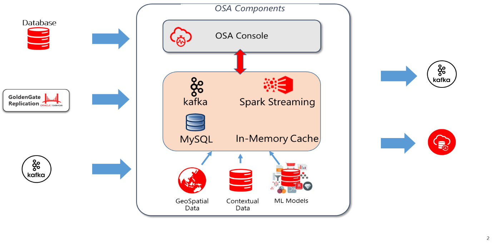

# GoldenGate Stream Analytics Workshop

Welcome to the GoldenGate Stream Analytics (GGSA) Workshop. In this tutorial, you will learn how to:
- Navigate GGSA Catalog
- Explore resources
- Create connections for Kafka and Database
- Define Sources and Targets
- Create Pipelines
- Use Patterns and Dashboards
- Perform Import and Export
  
## Introduction
GoldenGate Stream Analytics is a runtime event processing framework that runs on Apache Spark and Apache Kafka.  The tool is designed to process data from any source such as a database, GoldenGate, kafka, JMS, REST or even a file system file.  Once the data is in GGSA you can run analytics on live data and then send the data downstream to any target of your choice.

## Architecture Overview
In this workshop we are going to use streaming data from a file in the file system, then enrich the stream using GeoSpatial, Contextual (database tables) and ML Models, run analysis on the data and finally send that data to Kafka topics.  All the components in this workshop reside in a single node instance.

## Workshop Details
There are four labs in GoldenGate Stream Analytics workshop.  We recommend following these labs in sequence from Lab 1 to Lab 4.
* Lab 1: Login and Navigation 
* Lab 2: Streaming IoT Data
* Lab 3: Streaming Retail data 
* Lab 4: Publishing – Dashboard – Import/Export

