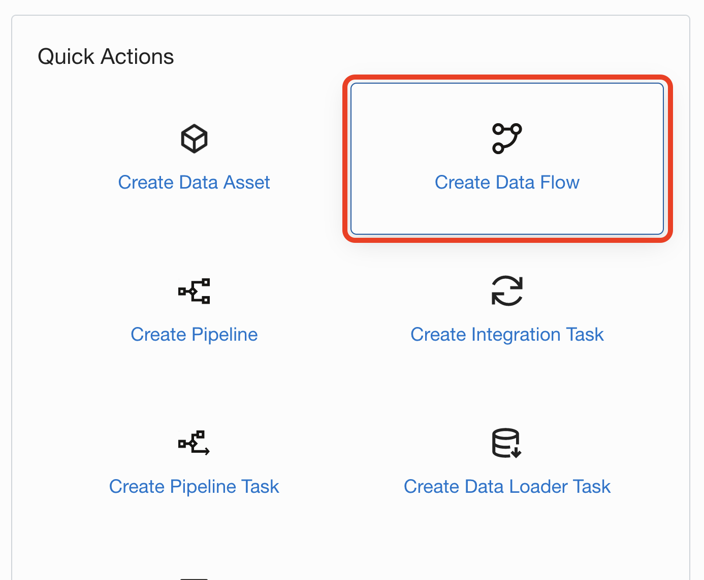
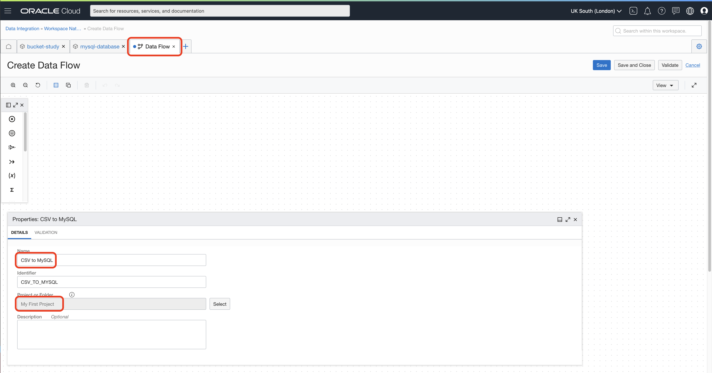
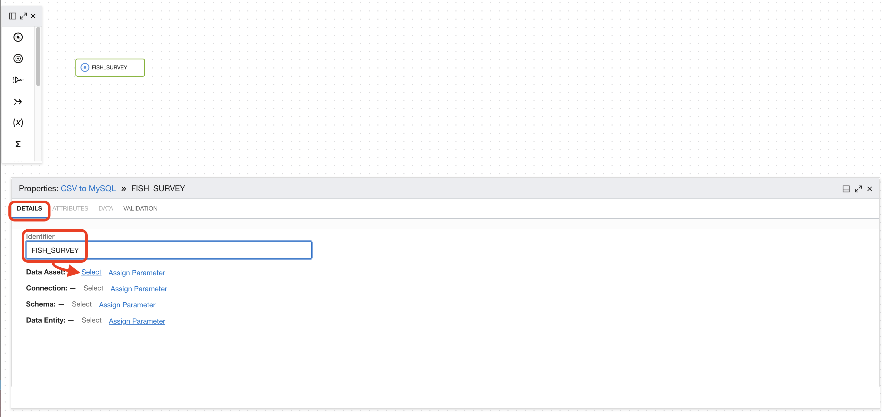
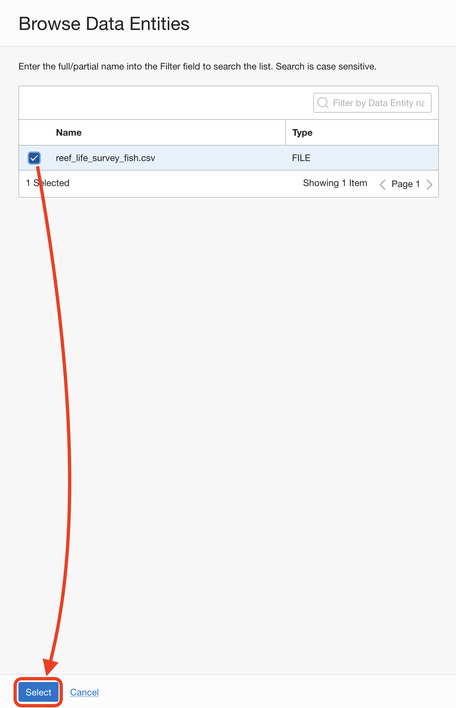
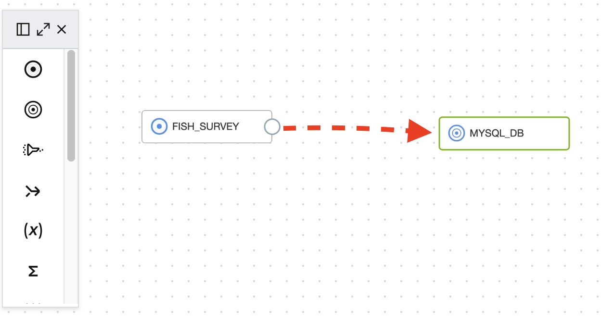
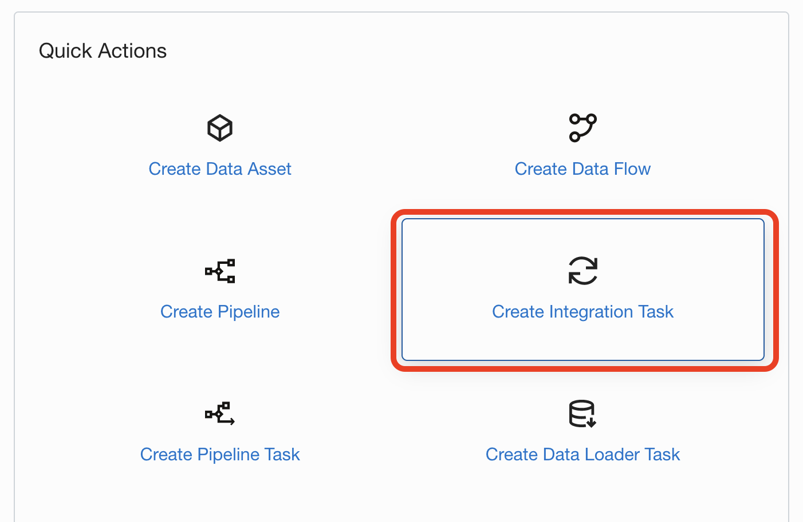
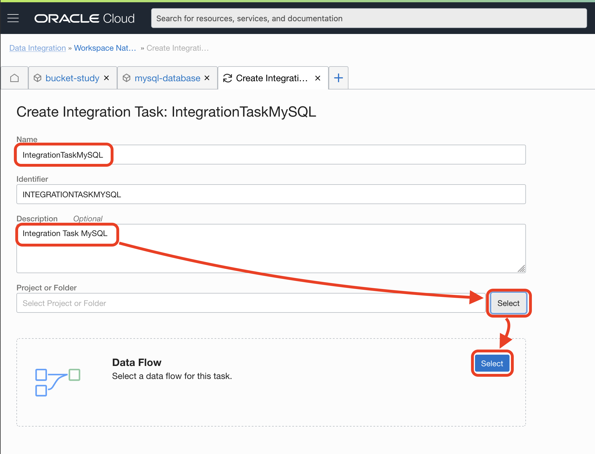
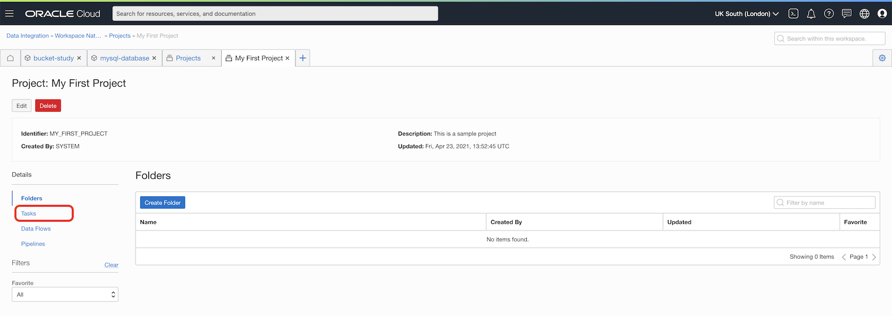
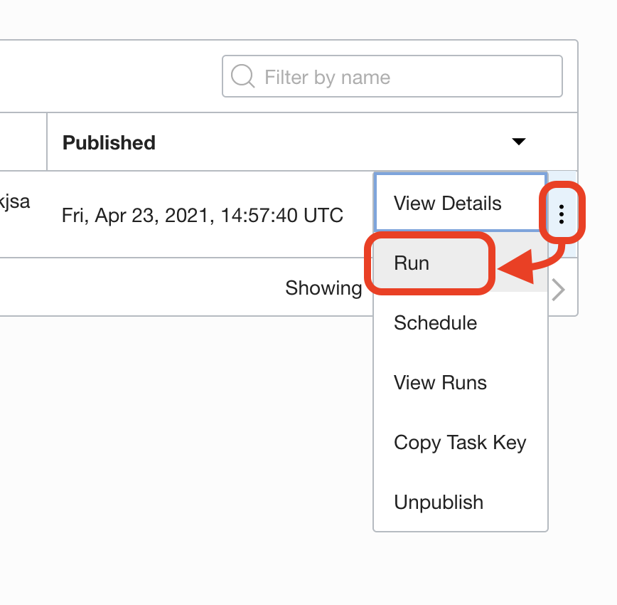

# Design and Run your ETL Pipeline


## Introduction

A data flow is a visual program representing the flow of data from source data assets, such as a database or flat file, to target data assets, such as a data lake or data warehouse.

The flow of data from source to target can undergo a series of transforms to aggregate, cleanse, and shape the data.

Data engineers and ETL developers can then analyze or gather insights and use that data to make business decisions.


Estimated Lab Time: 30 minutes.

### Objectives

In this lab, you will:

- Create the Data Flow.
- Create the Integration Task.
- Publish the Integration Task.
- Run the Task.

### Prerequisites

- Oracle Free Trial Account
- Lab 1: Underlying Infrastructure 
- Lab 2: Create MySQL Database Service
- Lab 3: Create Data Integration Instance

## **STEP 1:** Create the Data Flow

1. Click **Create Data Flow**.

   

2. Set the **Name**, **Project** and **Description** in the New Data Flow Panel:

      - Name: `CSV to MySQL`
      - Project or Folder: `My First Project`
      - Description: `Data Flow from CSV on Object Storage to MySQL Database`

3. To select the **Project**, click on `My First Project` and **Select**.

   

   It should look like this:

   

4. From the **Operators** panel, drag and drop the **Source** icon into the canvas.

   

5. Set the **Identifier** and the rest of the info in the **Details** tab from the Source **Properties** panel:

      - Identifier: `FISH_SURVEY`
      - Data Asset: `bucket-study`
      - Connection: `Default Connection`
      - Schema: `bucket-study`
      - Data entity: Click **Browse By Name** and select `reef_life_survey_fish.csv`
      - All the default values are good

   Click **Select**.

6. Set the **Identifier** and then go to **Data Asset** and click **Select**.

   

7. From the **dropdown**, select `bucket-study`. **Select** `Default Connection` and for **Schema** the name of the bucket `bucket-study`,

   

8. Finally, select the **Data Entity**.

   

9. Browse by **Name**:

   

10. **Select** `reef_life_survey_fish.csv` file.

   

11. And click **Select**.

   

12. On the dropdown for **File Type**, pick `CSV`.

   

13. Then click **Select**.

   

14. At this point, your source has access to the **Attributes**, where you can see the different fields of your dataset.

   

   **Confirm** you can see Attributes and Data.

   Let's move into the target for our **MySQL Database**.

15. Drag and Drop the **Target** icon into the canvas.

   

16. Set the **Identifier** and the rest of the info in the **Target**:

       - Identifier: `MySQL DB`
       - Data Asset: `mysql-database`
       - Connection: `Default Connection`
       - Schema: `nature`
       - Data entity: `fish`

   

17. This time, pick the `mysql-database` **data asset**. And `Default Connection` one more.

   

18. For the **Schema**, select `nature`.

   

19. For **Data Entity**, we select the table `fish`.

   

   

20. At this point, we can **confirm** we see the attributes from the table.

   

21. Time to **wire source and target**. Draw the link between `FISH_SURVEY` and `MYSQL_DB`. Starting from the circle in `FISH_SURVEY` source box and finishing over `MYSQL_DB` target box.

   

22. The **final result** should look like the following.

   

23. **Make sure** `MYSQL_DB` target is selected (green border) and click on the **Map** tab on the **Properties** panel and drag and drop the fields with NO `Auto` in the row. **Do it until they are all mapped**.

   

24. **Make** sure `Not Mapped` in yellow is **0**.

   

25. The **final step** is to **validate** the Data flow. Click **Validate**, check there are no warnings or errors and click **Save and Close**.

   

---

## **STEP 2:** Create the Integration Task

1. Go back to **Home** and Click **Create Integration Task**.

   

2. Set the **Name** and the rest of the info as follows:

      - Name: `IntegrationTaskMySQL`
      - Description: `Integration Task MySQL`
      - Project or Folder: `My First Project`
      - Data Flow: `CSV to MySQL`

   

3. Wait for the **Validation** of the Data Flow and click **Save and Close**.

   

---

## **STEP 3:** Publish the Integration Task

1. Go to **Projects** on the home screen.

   

2. Click on **My First Project**.

   

3. On the Details menu (left), click on **Tasks**.

   

4. Select **IntegrationTaskMySQL**, and click **Publish to Application**.

   

5. **Select** (if not selected by default) your **Default Application**. Click **Publish**.

   

---

## **STEP 4:** Run the Task

1. Go back to the **Home** screen and click **Applications**.

   

2. Select **Default Application**, and you will see your task **IntegrationTaskMySQL**.

   

3. Click on the **context menu** (three dots) and click **Run**.

   

4. Wait few seconds and the **Status** will change from `Not Started` to `Queued`, then to `Running`.

   

   

   

5. Feel free to click **Refresh** from time to time until you see `Success` on the Status.

   

---

## **STEP 5:** It Works

1. On the bastion host in **Cloud Shell** (reconnect if timed out), run the **MySQL docker** image and in the `bash` **Terminal**, run:

   ```
   <copy>mysqlsh --sql root@PRIVATE_IP</copy>
   ```

2. Put the MySQL **password**:

   ```
   <copy>R2d2&C3po!</copy>
   ```

3. Set `nature` as the **Schema** in use.

   ```
   <copy>use nature;</copy>
   ```

4. Count the **number** of rows in the table `fish`.

   ```sql
   <copy>select count(1) from fish;</copy>
   ```

5. **Exit** with:

   ```
   <copy>\exit</copy>
   ```

Congratulations, you are ready for the next Lab!

---

## **Acknowledgements**

- **Author** - Victor Martin, Technology Product Strategy Manager
- **Contributors** - Priscila Iruela
- **Last Updated By/Date** - Brianna Ambler, June 2021