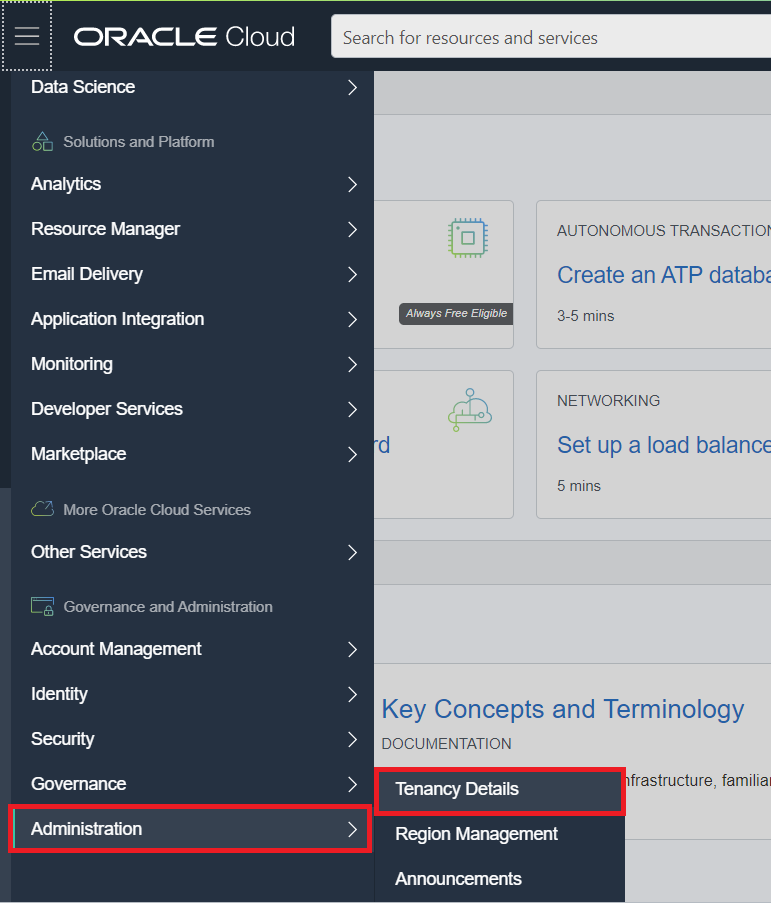
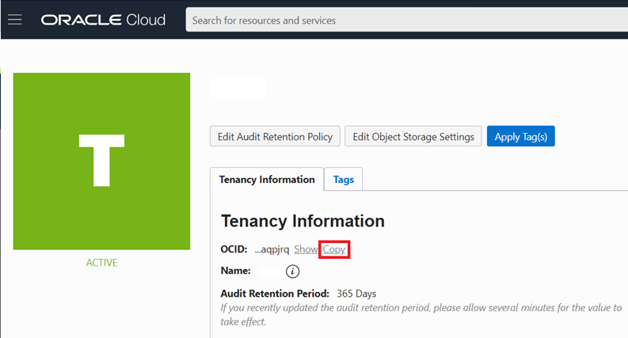
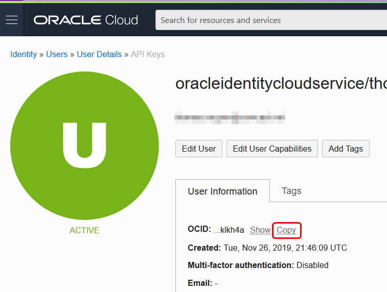
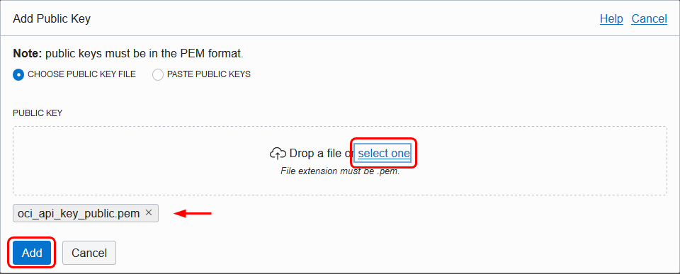

# Create an API Signing Key

## Introduction

This lab walks you through the steps to create a API signing key for an Oracle Cloud user account.

Estimated Lab Time: 10 minutes

### Objectives

Any software client you use to connect to Oracle Cloud Infrastructure must be configured with the following information:
* An API Signing Key
* The fingerprint of the public key
* Your tenancy's Oracle Cloud Identifier (OCID)
* The OCID of your user account

### Prerequisites

*  An Oracle Free Tier, Always Free, Paid or LiveLabs Cloud Account
* [Git Bash Shell](https://gitforwindows.org/) (Windows)
* Connect to the Oracle NoSQL Database Cloud Service


## **STEP 1:** Record your tenancy and user OCID

1. Create a note file on your local system to record the following information:

    - Tenancy OCID
    - User OCID
    - API Key Fingerprint
    - API Key Passphrase

2. On your Oracle Cloud account, open up the hamburger menu in the top-left corner of the Console. Choose **Administration > Tenancy Details**.

  

3. The Tenancy Details page shows information about your cloud account. Copy the Tenancy OCID by clicking on the **Copy** link next to it. Save the value in your note file.

  

4. In the top-right corner of the Console, open the Profile menu (User menu icon) and then click **User Settings** to view the details.

  

5. Click Copy beside the (User) OCID save it to your note file.

  

## **STEP 2:** Generate an API Signing Key

To create a user API key, you will use `openssl` on your local system. If you are using Windows, we recommend the Git Bash Shell.

  *Note: To paste in Git Bash Shell right click in the window and click paste(Ctrl + V does not work in the shell).*

1. Create a `~/.oci` directory:

    *Note: if you already have a .oci directory, you can skip this step.*

    ```
    <copy>mkdir ~/.oci</copy>
    ```

    

2. Generate a private key with the following command. On Windows, you will not see a prompt for a passphrase, but you should use one that you can remember. Be sure to make a note of the passphrase you enter, as you will need it later.

    ```
    <copy>openssl genrsa -out ~/.oci/oci_api_key_private.pem -aes128 -passout stdin 2048</copy>
    ```

    

3. Confirm that the private key file has been created in the directory you specified using the following command.

    ```
    <copy>ls -l ~/.oci</copy>
    ```

    

4. Change permissions on the file to ensure that only you can read it.

    ```
    <copy>chmod go-rwx ~/.oci/oci_api_key_private.pem</copy>
    ```

    

5. Generate a public key in the same location as the private key file using the following command. Enter the same passphrase you previously used to encrypt the private key file. *Note: there is no prompt on Windows.*

    ```
    <copy>openssl rsa -pubout -in ~/.oci/oci_api_key_private.pem -out ~/.oci/oci_api_key_public.pem -passin stdin</copy>
    ```

    

6. Confirm that the public key file has been created in the directory you specified.

    ```
    <copy>ls -l ~/.oci</copy>
    ```

7. Having created the API key pair, upload the public key value to Oracle Cloud Infrastructure. In the top-right corner of the Console, open the Profile menu again and then click **User Settings** to view the details.

  

8. On the API Keys page, click **Add Public Key**.

  

9. Click **select one** and navigate to your `~/.oci` directory, and select the `oci_api_key_public.pem` file. Click **Add**.

  

10. Note the fingerprint value, you will use the fingerprint later.

  

You may proceed to the next lab.

## Learn More

* [Acquiring Credentials](https://docs.oracle.com/en/cloud/paas/nosql-cloud/csnsd/acquiring-credentials.html)

## Acknowledgements
* **Author** - Dave Rubin, Senior Director, NoSQL and Embedded Database Development and Michael Brey, Director, NoSQL Product Development
* **Contributors** - Jaden McElvey, Technical Lead - Oracle LiveLabs Intern
* **Last Updated By/Date** - Anoosha Pilli, Database Product Management, September 2020

## Need Help?
Please submit feedback or ask for help using our [LiveLabs Support Forum](https://community.oracle.com/tech/developers/categories/livelabsdiscussions). Please click the **Log In** button and login using your Oracle Account. Click the **Ask A Question** button to the left to start a *New Discussion* or *Ask a Question*.  Please include your workshop name and lab name.  You can also include screenshots and attach files.  Engage directly with the author of the workshop.

If you do not have an Oracle Account, click [here](https://profile.oracle.com/myprofile/account/create-account.jspx) to create one.
