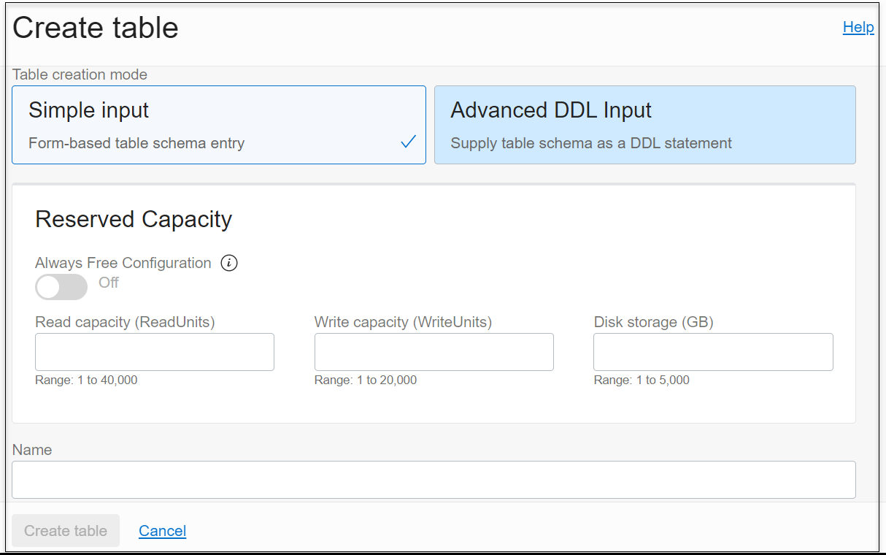
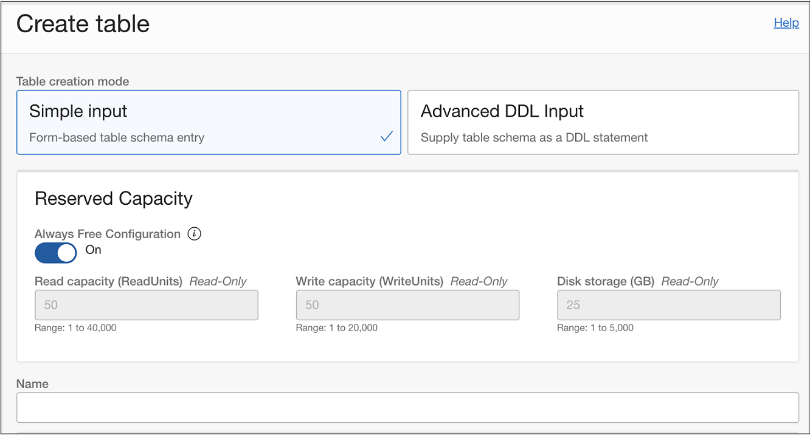
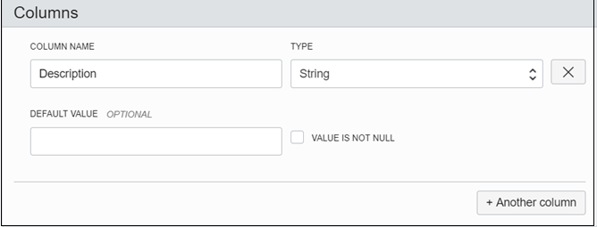
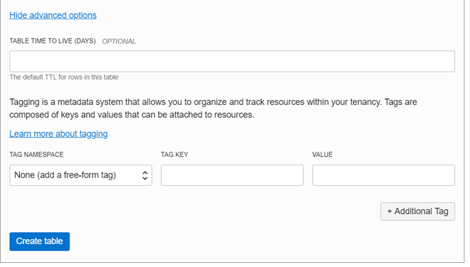
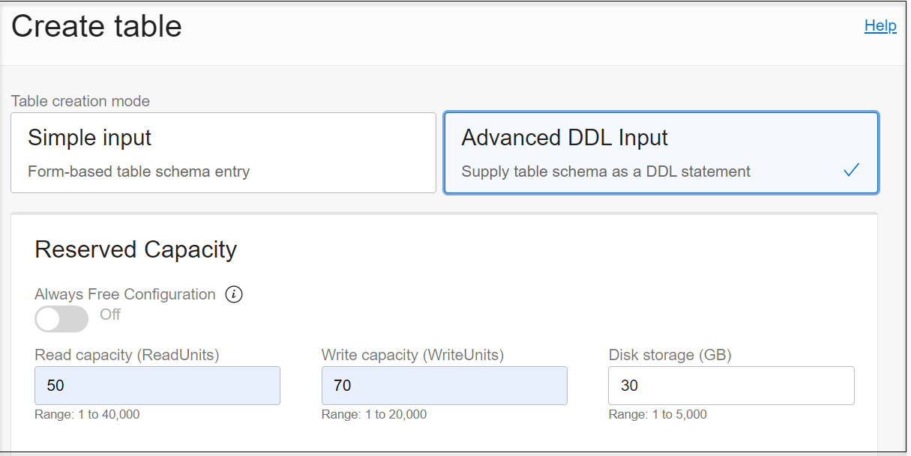
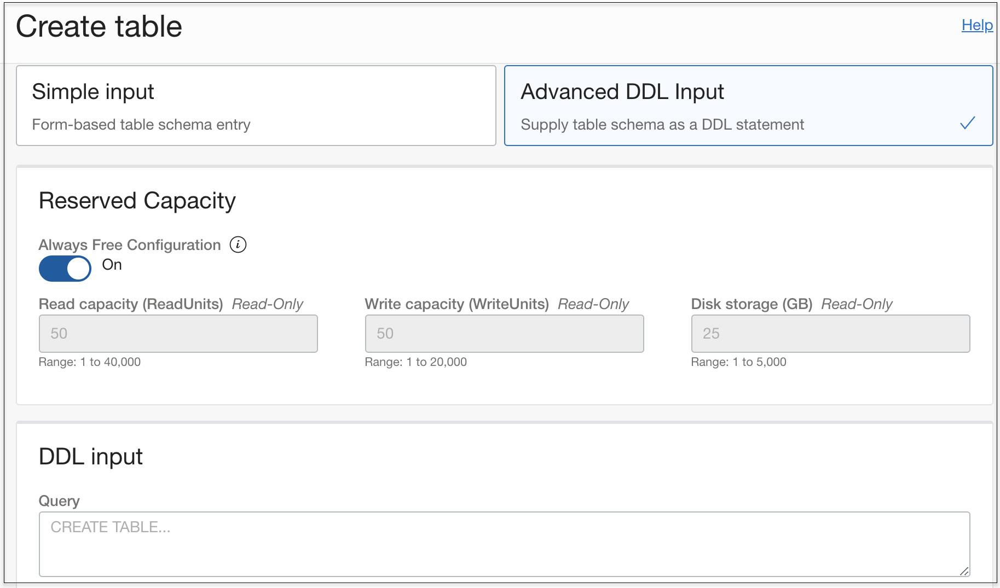

# Create an Always Free NoSQL table

## Introduction

This lab walks you through the steps to create an Always Free NoSQL table.

Estimated Lab Time: 15 Minutes

### **About Always Free Tables in NoSQL Database Cloud Service**

As part of the Oracle Cloud Free Tier, the Oracle NoSQL Database Cloud Service participates as an Always Free service. Developers can start using this service in minutes by following the simple steps outlined in this tutorial. To get started with the service, you create an Always Free table. You may have up to three Always Free NoSQL tables in your tenancy. The Always Free NoSQL tables are displayed in the console with an “Always Free” label next to the table name.

The NoSQL console lets you create the Oracle NoSQL Database Cloud Service tables in two modes:

  1. Simple Input Mode: You can use this mode to create the NoSQL Database Cloud Service table declaratively, that is, without writing a DDL statement.
  2. Advanced DDL Input Mode: You can use this mode to create the NoSQL Database Cloud Service table using a DDL statement.

### **Prerequisites**

*  An Oracle Free Tier, Always Free, Paid or LiveLabs Cloud Account
* [Git Bash Shell](https://gitforwindows.org/) (Windows)
* An API signing Key and the public key value uploaded to Oracle Cloud Infrastructure

## **Option 1:** Create an Always Free Table - Simple Input mode
1. On your Oracle Cloud account, open up the hamburger menu in the top-left corner of the Console. Under Database, select **NoSQL Database**.
2. Click **Create Table**. In the Create Table window, select  **Simple input** for **Table Creation Mode**.
3. Under **Reserved Capacity**, enable the toggle button to create an Always Free NoSQL table. Disabling the toggle button creates a regular NoSQL table. You can create up to three Always Free NoSQL tables in the tenancy. If you have three Always Free NoSQL tables in the tenancy, the toggle button to create an Always Free SQL table is disabled.
  
4. When you enable the toggle button to create an Always Free NoSQL table, the Read capacity, Write capacity and Disk storage fields are assigned default values. These values cannot be changed.
  
5. In the **Name** field, enter a table name that is unique within your tenancy. Table names can have a maximum of 256 characters. All names must begin with a letter (a–z, A–Z). Subsequent characters can be letters (a–z, A–Z), digits (0–9), or underscore.
6. In the Primary Key Columns section, enter primary key details:
    * **Column Name**: Enter a column name for the primary key in your table. Column names can have a maximum of 64 characters. All names must begin with a letter (a–z, A–Z). Subsequent characters can be letters (a–z, A–Z), digits (0–9), or underscore.
    * **Type**: Select the data type for your primary key column.
    * **Precision**: This is applicable for TIMESTAMP typed columns only. Specify precision for timestamp values ranging from zero to nine. 0 is the minimum precision, and 9 is the maximum precision. When declaring a timestamp field, the precision is required.
    * **Set as Shard Key**: Click this option to set this primary key column as shard key.
    * **+ Another Primary Key Column**: Click this button to add more columns while creating a composite (multi-column) primary key.
    * Use the up and down arrows to change the sequence of columns while creating a composite primary key.
7. In the Columns section, enter column details:
    
    * **Column Name**: Enter the column name. Column names can have a maximum of 64 characters. All names must begin with a letter (a–z, A–Z). Subsequent characters can be letters (a–z, A–Z), digits (0–9), or underscore.
    * **Type**: Select the data type for your column.
    * **Precision**: This is applicable for TIMESTAMP typed columns only. Specify precision for timestamp values ranging from zero to nine. 0 is the minimum precision, and 9 is the maximum precision. When declaring a timestamp field, the precision is required.
    * **Size**: This is applicable for BINARY typed columns only. Specify the size in bytes to make the binary a fixed binary.
    * **Default Value**: (optional) Supply a default value for the column.
  **Note**: Default values can not be specified for binary and JSON data type columns.
    * **Value is Not Null**: Click this option to specify that a column must always have a value.
    * **+ Another Column**: Click this button to add more columns.
    * Click the delete icon to delete a column.
8. (Optional) To specify advanced options, click **Show Advanced Options** and enter advanced details:
    * **Table Time to Live (Days)**: (optional) Specify expiration time for the rows in the table. After this time, the rows expire automatically, and are no longer available. The default value is zero, indicating no expiration time.  
  **Note**: Updating Table Time to Live (TTL) will not change the TTL value of any existing data in the table. The new TTL value will only apply to those rows that are added to the table after this value is modified and to the rows for which no overriding row-specific value has been supplied.
  In the Tags section, enter:
    * **Tag Namespace**: Select a tag namespace from the select list. A tag namespace is like a container for your tag keys. It is case insensitive and must be unique across the tenancy.
    * **Tag Key**: Enter the name to use to refer to the tag. A tag key is case insensitive and must be unique within a namespace.
    * **Value**: Enter the value to give your tag.
    * **+ Additional Tag**: Click to add more tags.

9. Click **Create table**.
The table is created and listed in the NoSQL console.

## **Option 2:** Create an Always Free Table - Advanced DDL mode
1. On your Oracle Cloud account, open up the hamburger menu in the top-left corner of the Console. Under Database, select **NoSQL Database**.
2. Click **Create Table**. In the Create Table window, select  **Advanced DDL input** for **Table Creation Mode**.
3. Under **Reserved Capacity**, enable the toggle button to create an Always Free NoSQL table. Disabling the toggle button creates a regular NoSQL table. You can create up to three Always Free NoSQL tables in the tenancy. If you have three Always Free NoSQL tables in the tenancy, the toggle button to create an Always Free SQL table is disabled.
  
4. When you enable the toggle button to create an Always Free NoSQL table, the Read capacity, Write capacity and Disk storage fields are assigned default values. These values cannot be changed.
  
5. In the **DDL input** section, enter the create table DDL statement for Query.
6. (Optional) To specify advanced options, click **Show Advanced Options** and enter advanced details:
    * **Table Time to Live (Days)**: (optional) Specify expiration time for the rows in the table. After this time, the rows expire automatically, and are no longer available. The default value is zero, indicating no expiration time.  
  **Note**: Updating Table Time to Live (TTL) will not change the TTL value of any existing data in the table. The new TTL value will only apply to those rows that are added to the table after this value is modified and to the rows for which no overriding row-specific value has been supplied.
  In the Tags section, enter:
    * **Tag Namespace**: Select a tag namespace from the select list. A tag namespace is like a container for your tag keys. It is case insensitive and must be unique across the tenancy.
    * **Tag Key**: Enter the name to use to refer to the tag. A tag key is case insensitive and must be unique within a namespace.
    * **Value**: Enter the value to give your tag.
    * **+ Additional Tag**: Click to add more tags.

7. Click **Create table**.
The table is created and listed in the NoSQL console.

Congratulations! You have completed the workshop.

Oracle NoSQL Database also supports Python, Node.js and Go. This application accesses Oracle NoSQL Cloud over HTTP, but most likely you would want to deploy by running your application inside your own tenancy co-located in the same Oracle Cloud Infrastructure region as your NoSQL table and use the Oracle Cloud Infrastructure Service Gateway to connect to the NoSQL Cloud Service.

## Learn More

* [About Oracle NoSQL Database Cloud Service](https://docs.oracle.com/pls/topic/lookup?ctx=cloud&id=CSNSD-GUID-88373C12-018E-4628-B241-2DFCB7B16DE8)
* [Oracle NoSQL Database Cloud Service page](https://cloud.oracle.com/en_US/nosql)

## Acknowledgements
* **Author** - Vandanadevi Rajamani, Principal User Assistance Developer, Database User Assistance
* **Last Updated By/Date** - Vandanadevi Rajamani, Principal User Assistance Developer, November 2020

## Need Help?
Please submit feedback or ask for help using our [LiveLabs Support Forum](https://community.oracle.com/tech/developers/categories/livelabsdiscussions). Please click the **Log In** button and login using your Oracle Account. Click the **Ask A Question** button to the left to start a *New Discussion* or *Ask a Question*.  Please include your workshop name and lab name.  You can also include screenshots and attach files.  Engage directly with the author of the workshop.

If you do not have an Oracle Account, click [here](https://profile.oracle.com/myprofile/account/create-account.jspx) to create one.
