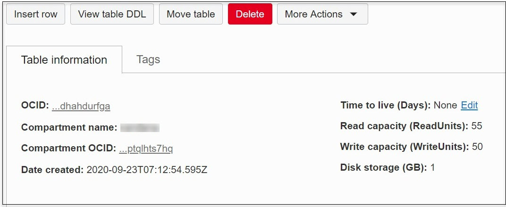
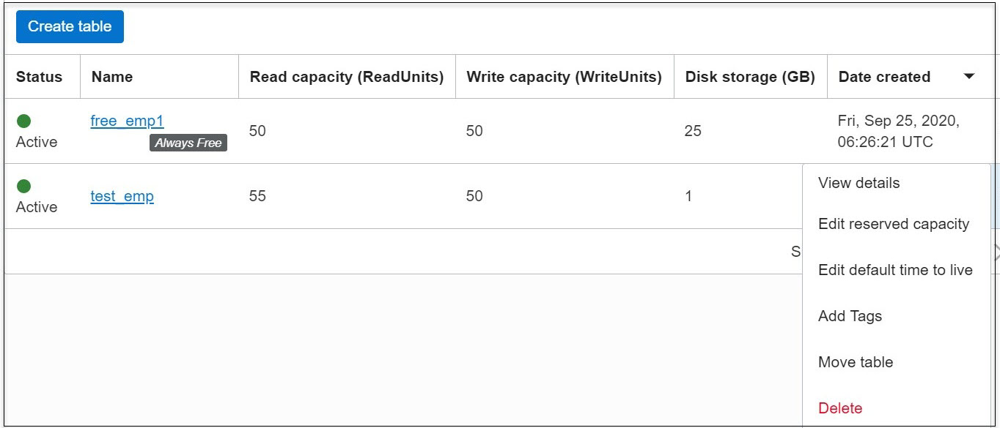

# Manage an Always Free NoSQL table

## Introduction

This lab walks you through the steps to manage an Always Free NoSQL table.

Estimated Lab Time: 15 Minutes

### **Manage Always Free Tables in NoSQL Database Cloud Service**

As part of the Oracle Cloud Free Tier, the Oracle NoSQL Database Cloud Service participates as an Always Free service.  You may have up to three Always Free NoSQL tables in your tenancy. The Always Free NoSQL tables are displayed in the console with an “Always Free” label next to the table name.

The NoSQL console lets you manage the Always Free NoSQL tables in the following ways:

  1. Insert data into an Always Free table
  2. View an Always Free table details and the data in the table
  3. Update data in an Always Free table
  4. Delete data in an Always Free table
  5. Modify the Time to Live (TTL) value of an Always Free table
  6. Alter columns of an Always Free table
  7. Move an Always Free table to another compartment
  8. Delete an Always Free table

### **Prerequisites**

*  An Oracle Free Tier, Always Free, Paid or LiveLabs Cloud Account
* [Git Bash Shell](https://gitforwindows.org/) (Windows)
* An API signing Key and the public key value uploaded to Oracle Cloud Infrastructure
* An Always Free NoSQL table created
## **Option 1:** Insert data into an Always Free table
The NoSQL console lets you insert new rows into the Oracle NoSQL Database Cloud Service tables in two modes:
    * Simple Input Mode: You can use this mode to provide the values for the new rows declaratively.
    * Advanced JSON Input Mode: You can use this mode to provide the values for the new rows in JSON format.

**Insert data into an Always Free Table - Simple Input mode**
1. On your Oracle Cloud account, open up the hamburger menu in the top-left corner of the Console. Under Database, select **NoSQL Database**.
2. The NoSQL console lists all the tables in the tenancy. To view table details, do either of the following:
      * Click the table name, or
      * Click the action menu corresponding to the table name and select View Details.
     The Table Details page opens up. Click **Insert Row**.
3. In the Insert Row window, select **Simple Input** for **Entry Mode**.
4. All the columns in the table are listed. Input the data for the columns of the table. For some column types, such as Binary, you upload the data.
**Note**: Entering a value is mandatory for all non-nullable columns of the table.
Click **Insert Row**. The record is inserted into the table.

**Insert data into an Always Free Table - Advanced JSON Input Mode**
1. On your Oracle Cloud account, open up the hamburger menu in the top-left corner of the Console. Under Database, select **NoSQL Database**.
2. The NoSQL console lists all the tables in the tenancy. To view table details, do either of the following:
      * Click the table name, or
      * Click the action menu corresponding to the table name and select **View Details**.
     The Table Details page opens up. Click **Insert Row**.
3. In the Insert Row window, select **Advanced JSON Input ** for **Entry Mode**.
4. Paste or upload the Record Definition in JSON format.
5. Click **Insert Row**. The record is inserted into the table.

## **Option 2:** View an Always Free table details and the data in the table
You can view Oracle NoSQL Database Cloud Service table details from the NoSQL console.
1. On your Oracle Cloud account, open up the hamburger menu in the top-left corner of the Console. Under Database, select **NoSQL Database**.
2. The NoSQL console lists all the tables in the tenancy. To view table details, do either of the following:
      * Click the table name, or
      * Click the action menu corresponding to the table name and select **View Details**.The Table Details page opens up.
3. From the Table Details page, you can view all table columns, indexes, rows, and metrics.
    * In the Table Details page, click **View Table DDL**. The View Table DDL window displays the table DDL statement.
    * You can select and copy the table DDL statement from the window. Click OK to close the window.
4. To view the data in the table, select the **Table Rows** tab under **Resources**. By default, the query text is populated with a SQL query that will retrieve all the records from the table. You can modify this query with any valid SQL for Oracle NoSQL statement.
5. Click **Run Query**. The table data is displayed in the Records section.

## **Option 3:** Update data in an Always Free table
1. On your Oracle Cloud account, open up the hamburger menu in the top-left corner of the Console. Under Database, select **NoSQL Database**.
2. The NoSQL console lists all the tables in the tenancy. To view table details, do either of the following:
      * Click the table name, or
      * Click the action menu corresponding to the table name and select **View Details**.The Table Details page opens up.
3. In the Table Details page, select the Table Rows tab under Resources. By default, the query text is populated with a SQL query that will retrieve all the records from the table. You can modify this query with any valid SQL for Oracle NoSQL statement.
4. Click the action menu corresponding to the row you wish to update, and select **Update Row**.
5. Modify the values in Simple Input or Advanced JSON Input Updation Mode.
6. Click **Update Row**.

## **Option 4:** Delete data in an Always Free table
1. On your Oracle Cloud account, open up the hamburger menu in the top-left corner of the Console. Under Database, select **NoSQL Database**.
2. The NoSQL console lists all the tables in the tenancy. To view table details, do either of the following:
      * Click the table name, or
      * Click the action menu corresponding to the table name and select **View Details**.The Table Details page opens up.
3. In the Table Details page, select the Table Rows tab under Resources. By default, the query text is populated with a SQL query that will retrieve all the records from the table. You can modify this query with any valid SQL for Oracle NoSQL statement.
4. Click the action menu corresponding to the row you wish to delete, and select **Delete**.
5. The Delete Row confirmation dialog opens. Click **Delete**. The row is deleted.

## **Option 5:** Modify the Time to Live (TTL) value of an Always Free table
You can update Time to Live (TTL) values for your Oracle NoSQL Database Cloud Service tables from the NoSQL console.
1. On your Oracle Cloud account, open up the hamburger menu in the top-left corner of the Console. Under Database, select **NoSQL Database**.
2. The NoSQL console lists all the tables in the tenancy. To view table details, do either of the following:
      * Click the table name, or
      * Click the action menu corresponding to the table name and select **View Details**.The Table Details page opens up.
3. The value of Time to Live (TTL) can be updated.
   * To update the value of Time to Live (TTL), click the Edit link next to the Time to live (Days) field.
   
   * You can also update the value of Time to Live (TTL) by clicking the action menu corresponding to the table name you wish to change and select Edit default time to live.
   
   * Table Time to Live (Days): (optional) Specify the default expiration time for the rows in the table. After this time, the rows expire automatically, and are no longer available. The default value is zero, indicating no expiration time.
   **Note**: Updating Table Time to Live (TTL) will not change the TTL value of any existing data in the table. The new TTL value will only apply to those rows that are added to the table after this value is modified and to the rows for which no overriding row-specific value has been supplied.
4. (Optional) To dismiss the changes, click **Cancel**.

## **Option 6:** Alter columns of an Always Free table
You can alter the Always Free tables columns in two modes:
    * **Simple Input Mode**: You can use this mode to alter the NoSQL Database Cloud Service table declaratively, that is, without writing a DDL statement.
    * **Advanced DDL Input Mode**: You can use this mode to alter the NoSQL Database Cloud Service table using a DDL statement.
**Adding columns to an Always Free table - Simple Input mode**
1. On your Oracle Cloud account, open up the hamburger menu in the top-left corner of the Console. Under Database, select **NoSQL Database**.
2. The NoSQL console lists all the tables in the tenancy. To view table details, do either of the following:
      * Click the table name, or
      * Click the action menu corresponding to the table name and select **View Details**.The Table Details page opens up.
3. In the Table Details page, select the **Columns** tab under **Resources**. You will see a list of all the columns added to the table.
4. Click **Add Columns**. In the Add Columns window, select **Simple Input** for **Table Column Update Mode**.
5. In the Columns section, enter column details:
   
   * **Column Name**: Enter the column name.
   * **Type**: Select the data type for your column.
   * **Precision**: This is applicable for TIMESTAMP typed columns only. Specify precision for timestamp values ranging from zero to nine. 0 is the minimum precision, and 9 is the maximum precision. When declaring a timestamp field, the precision is required.
  * **Size**: This is applicable for BINARY typed columns only. Specify the size in bytes to make the binary a fixed binary.
  * **Default Value**: (optional) Supply a default value for the column.
**Note**: Default values can not be specified for binary and JSON data type columns.
  * **Value is Not Null**: Click this option to specify that a column must always have a value.
  * **+ Another Column**: Click this button to add more columns.

**Adding columns to an Always Free table - Advanced DDL Input Mode**
1. On your Oracle Cloud account, open up the hamburger menu in the top-left corner of the Console. Under Database, select **NoSQL Database**.
2. The NoSQL console lists all the tables in the tenancy. To view table details, do either of the following:
      * Click the table name, or
      * Click the action menu corresponding to the table name and select **View Details**.The Table Details page opens up.
3. In the Table Details page, select the **Columns** tab under **Resources**. You will see a list of all the columns added to the table.
4. Click **Add Columns**. In the Add Columns window, select **Advanced DDL Input ** for **Table Column Update Mode**.
5. Enter the update table DDL statement.
6. Click **Add Columns**.
The new columns are added to the table.

**Deleting a column from an Always Free table**
1. On your Oracle Cloud account, open up the hamburger menu in the top-left corner of the Console. Under Database, select **NoSQL Database**.
2. The NoSQL console lists all the tables in the tenancy. To view table details, do either of the following:
      * Click the table name, or
      * Click the action menu corresponding to the table name and select **View Details**.The Table Details page opens up.
3. In the Table Details page, select the **Columns** tab under **Resources**. You will see a list of all the columns added to the table.
4. Click the action menu corresponding to the column you wish to delete and select **Delete**.
In the Delete Column confirmation dialog, click **Delete** to confirm delete.
The column is deleted from the table.

## **Option 7:** Move an Always Free table to another compartment
1. On your Oracle Cloud account, open up the hamburger menu in the top-left corner of the Console. Under Database, select **NoSQL Database**.
2. The NoSQL console lists all the tables in the tenancy. To view table details, do either of the following:
      * Click the table name, or
      * Click the action menu corresponding to the table name and select **View Details**.The Table Details page opens up.
3. In the Table Details page, click **Move Table**.
4. Alternatively, Click the action menu corresponding to the table name and select **Move table**.
5. In the Move Resource to a Different Compartment window, modify the following values for the table:
     * **Choose New Compartment**: Select the new compartment from the select list.
6. Click **Move table**.
7. (Optional) To dismiss the changes, click the Cancel link on the top right corner.

## **Option 8:** Delete an Always Free table
1. On your Oracle Cloud account, open up the hamburger menu in the top-left corner of the Console. Under Database, select **NoSQL Database**.
2. The NoSQL console lists all the tables in the tenancy. To delete the table, do either of the following:
    * Click the table name. In the Table Details page, click the Delete button, or
    * Click the action menu corresponding to the table name you wish to delete and select **Delete**.
    The Delete Table confirmation dialog opens. Click **Delete**.
    The table is deleted.

Congratulations! You have completed the workshop.

## Learn More

* [About Oracle NoSQL Database Cloud Service](https://docs.oracle.com/pls/topic/lookup?ctx=cloud&id=CSNSD-GUID-88373C12-018E-4628-B241-2DFCB7B16DE8)
* [Oracle NoSQL Database Cloud Service page](https://cloud.oracle.com/en_US/nosql)

## Acknowledgements
* **Author** - Vandanadevi Rajamani, Principal User Assistance Developer, Database User Assistance
* **Last Updated By/Date** - Vandanadevi Rajamani, Principal User Assistance Developer, November 2020

## Need Help?
Please submit feedback or ask for help using our [LiveLabs Support Forum](https://community.oracle.com/tech/developers/categories/livelabsdiscussions). Please click the **Log In** button and login using your Oracle Account. Click the **Ask A Question** button to the left to start a *New Discussion* or *Ask a Question*.  Please include your workshop name and lab name.  You can also include screenshots and attach files.  Engage directly with the author of the workshop.

If you do not have an Oracle Account, click [here](https://profile.oracle.com/myprofile/account/create-account.jspx) to create one.
