# Mapping 1 - Simple Data Load

## Introduction

This chapter describes how to work with mappings in Oracle Data Integrator.

*Estimated Lab Time*: 60 minutes

#### Objective
The demonstration environment includes several example mappings. In this chapter you will learn how to create the following mappings:

  * Load TRG\_PROD\_FAMILY: This mapping loads the data from the SRC\_PRODUCT table in the *Orders Application* model into the TRG\_PROD\_FAMILY target table in the *Sales Administration* model.

### Prerequisites
This lab assumes you have:
- Basic knowledge of Oracle Database
- A Free Tier, Paid or LiveLabs Oracle Cloud account
- SSH Private Key to access the host via SSH
- You have completed:
    - Lab: Generate SSH Keys
    - Lab: Prepare Setup
    - Lab: Environment Setup
    - Lab: Initialize Environment

## **STEP 1:**  Load TRG\_PROD\_FAMILY Mapping Example

1. Purpose and Integration Requirements
The purpose of the Load TRG\_PROD\_FAMILY mapping is to load the data from the SRC\_PRODUCT table in the *Orders Application* model into the TRG\_PROD\_FAMILY target table in the *Sales Administration* model.

  However, the SRC\_PRODUCT table does not contain all of the data that is required for this operation. The following information has to be added to the target table:

    * The Family name (FAMILY\_NAME) that is defined in the SRC\_PRODUCT have duplicate values.
    * The Family id (FAMILY\_ID) column in the TRG\_PROD\_FAMILY doesn't have a map in source table. Its value is first three characters of family name. It has to be derived using family name column.

  The functional details for these rules and the procedure to follow are described later in this lab.

2. Mapping Definition
This section describes the mapping Load TRG\_CUSTOMER that will be created in this example. See *Creating the Mapping* for more information.

  The Load TRG\_PROD\_FAMILY mapping uses the following data and transformations:
    * One target datastore. Details:

  | Model                 | Datastore         | Description |  Type        |
  |-----------------------|-------------------|-------------|--------------|
  | Sales Administration  | TRG\_PROD\_FAMILY |             | Oracle Table |

    * Source datastore:

  | Model                 | Datastore     | Description |  Type        |
  |-----------------------|---------------|-------------|--------------|
  | Orders Application    | SRC\_PRODUCT  | Product in the source system | Oracle Table |


    * One Distinct:

  | Distinct                  | Description                                | SQL RULE                   |
  |---------------------------|--------------------------------------------|----------------------------|
  | Family Name               | To get distinct values of Family Name      | NA      |


    * Several transformation rules:

  | Target Column  | Origin                               | SQL Rule(Expression)                                                       |
  |----------------|--------------------------------------|----------------------------------------------------------------------------|
  | FAMILY\_ID       | NA                 | UPPER(SUBSTR(DISTINCT\_.FAMILY_NAME,1,3))      |


## **STEP 2:** Creating the Mapping

This section describes how to create the Load TRG\_PROD\_FAMILY mapping. To create the Load TRG\_CUSTOMER mapping perform the following procedure:
1. Insert a New Mapping

  To create a new mapping:
    * In Designer Navigator, expand the Demo project node in the Projects accordion.
    * Expand the Sales Administration node.
    * In the Sales Administration folder, right-click the Mapping node and select **New Mapping**:

  

2. Enter the name of your mapping (Load TRG\_PROD\_FAMILY) in the Name field:

  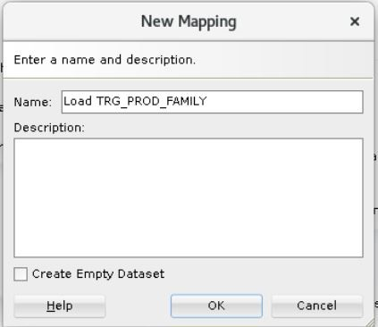

  Ensure the *Create Empty Dataset* option is not selected.

3. An empty mapping window will appear on screen.
  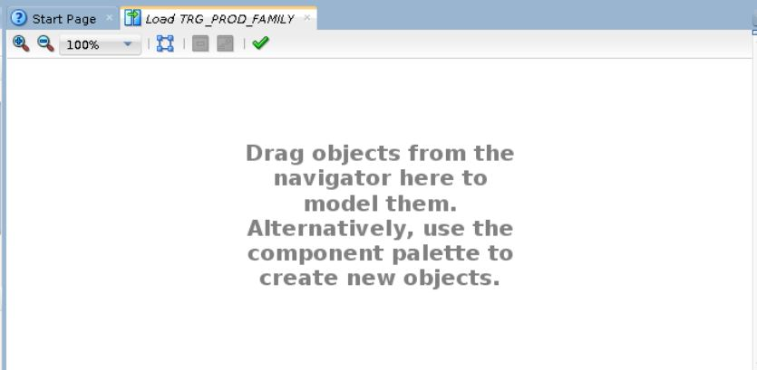

## **STEP 3:** Define the Target

The target is the element that will be loaded by the mapping. To insert the target in the Load TRG\_CUSTOMER mapping:**

1.  Verify you are in the Logical tab of the Mapping Editor.

2.  In the Designer Navigator, expand the Models accordion and the *Sales Administration* model.

3.  Select TRG\_PROD_FAMILY datastore under the *Sales Administration* model and drag it into the mapping editor

  

## **STEP 4:** Define the Source

The source datastores contain data used to load the target datastore. Two types of datastores can be used as a mapping source: datastores from the models and reusable mappings. This example uses datastores from the *Orders Application* and *Parameters* models. To add source datastores to the Load SRC\_PRODUCT mapping:

1.  Under models, drag the following source datastores into the Source Diagram:

    * SRC\_PRODUCT from the *Orders Application* model

  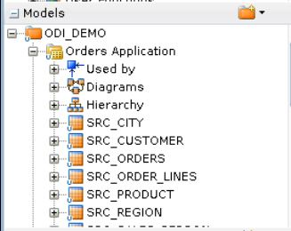

2.  The Mapping should look like:

  

## **STEP 5:** Distinct Component

This section describes how to extract distinct values from the source columns. Distinct component in ODI is used to get the distinct values. To create a distinct in the Load TRG\_PROD\_FAMILY mapping:

1. From the Components panel, drag **Distinct** as shown:

  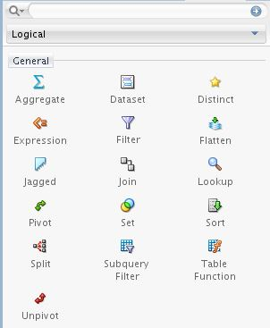

  

2. From the source datastore, drag the FAMILY\_NAME column into the distinct component.

  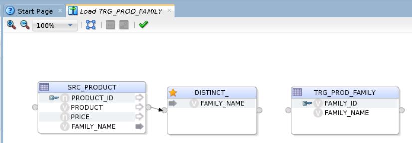

3. Now drag and drop the FAMILY\_NAME column from distinct component to the corresponding column in target datastore.

  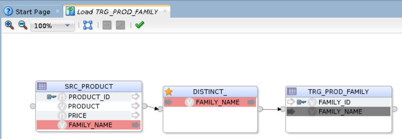

4.  Click **Save**.

## **STEP 6:** FAMILY\_ID Expression

This section describes how to define a custom expression on target columns.

1.  Select the FAMILY\_ID column in the target table and provide the expression as given below.

  ```
  <copy>
    UPPER(SUBSTR(DISTINCT_.FAMILY_NAME,1,3))
  </copy>
  ```

The mapping should be as given below.

  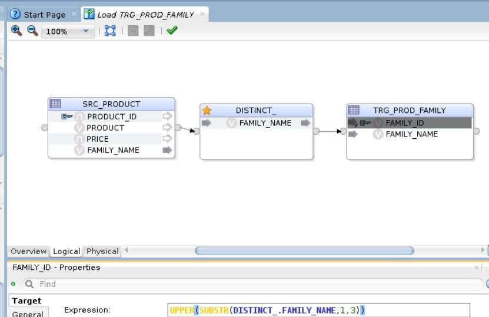

## **STEP 7:** Define the Target Integration Type

The target table integration type is defined in this section. These are mainly of two types.

  - Control Append - To append data to target tables. All the records are considered as inserts.
  - Incremental Update - To update the existing data and insert new data.

We will use incremental update for this mapping.

1.  Select the target table. Go to target tab in the properties section and change the integration type to Incremental Update.

  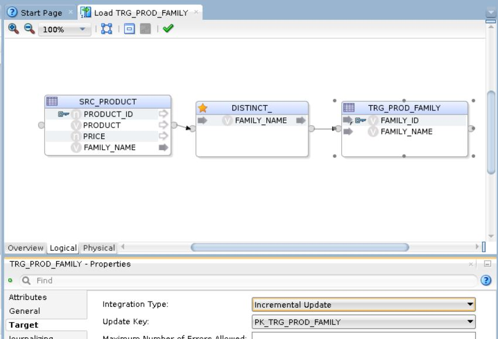

## **STEP 8:** Define the Data Loading Strategies (LKM)

The data loading strategies are defined in the Physical tab of the Mapping Editor. Oracle Data Integrator automatically computes the flow depending on the configuration in the mapping's diagram. It proposes default Knowledge Modules (KMs) for the data flow. The Physical tab enables you to view the data flow and select the KMs used to load and integrate data.

Loading Knowledge Modules (LKM) are used for loading strategies and Integration Knowledge Modules (IKM) are used for integration strategies. You have to define the way to retrieve the data from the SRC\_PRODUCT table in your source environment.

To define the loading strategies:

1.  In the Physical tab of the Mapping Editor, select the access point that corresponds to the loading of the SRC\_PRODUCT. In this example, this is the DISTINCT. The Property Inspector should display the properties of the access points.

2.  In the Property Inspector, verify that the **LKM SQL to SQL (Built-In)** is selected in the Loading Knowledge Module Selector list:

  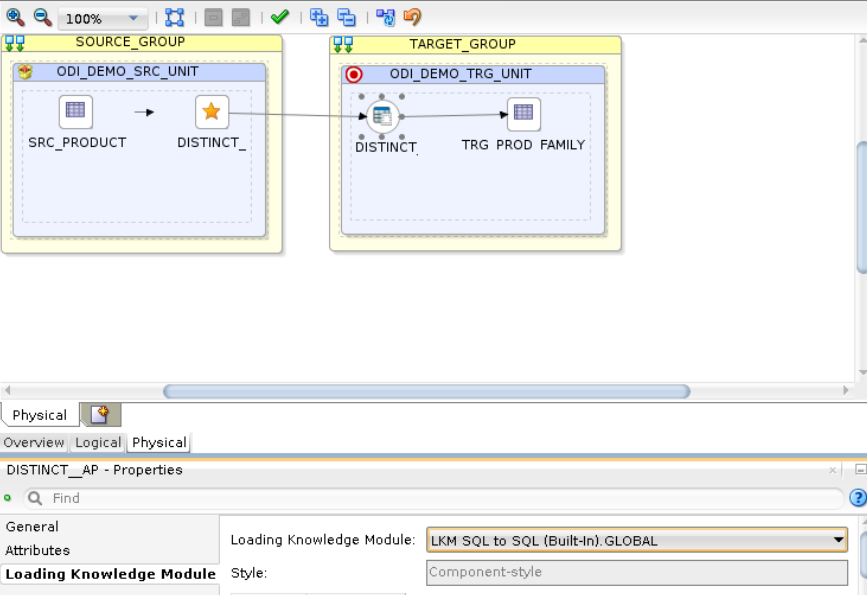


## **STEP 9:** Define the Data Integration Strategies (IKM)

After defining the loading phase, you need to define the strategy to adopt for the integration of the data into the target table.

To define the integration strategies:

1.  In the Physical tab of the Mapping Editor, select TRG\_PROD\_FAMILY in the TARGET\_GROUP object. The Property Inspector will display the properties of the target.

2.  In the Property Inspector, set the IKM to **IKM Oracle Incremental Update** in the *Integration Knowledge Module* Selector list. If this IKM is not in the list, make sure you have correctly set the  Target Integration Type to Incremental Update in the Logical panel.

3.  In the knowledge module options, leave the default values. The Property Inspector appears as shown:

  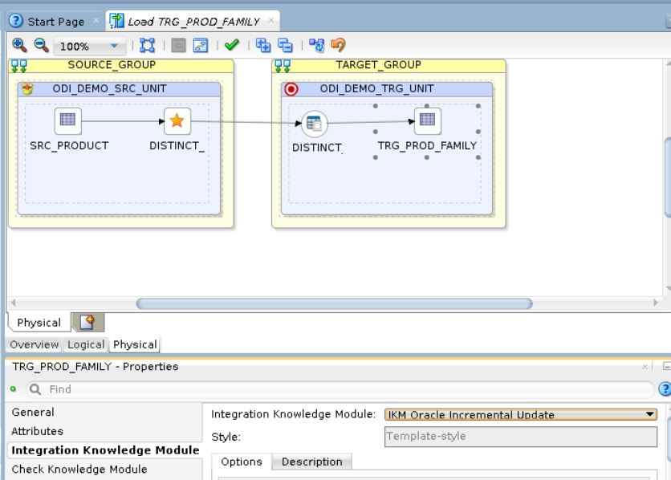

**Note:** Only the built-in Knowledge Modules or the ones you imported to your Project appear in the KM Selector lists. The demonstration environment already includes the Knowledge Modules required for the getting started examples. You do not need to import KMs into the demonstration Project.For more information on importing KMs into your Projects, see *Importing a KM* in the *Oracle Fusion Middleware Developer's Guide for Oracle Data Integrator*.

## **STEP 10:** Define the Data Control Strategy

In the preceeding steps you have specified the data flow from the source to the target. You must now define how to check your data (CKM) and the constraints and rules that must be satisfied before integrating the data.

To define the data control strategy:

1.  In the Mapping Physical tab under the TRG\_PROD_FAMILY Properties, select Check Knowledge Module, verify that the **CKM Oracle** is selected for Check Knowledge Module.

2.  In the Logical view, select the target datastore TRG\_CUSTOMER and verify the Constraints panel. Set the constraints that you wish to verify to true.

      PK\_TRG\_PROD\_FAMILY

      The Constraints tab appears as shown:

  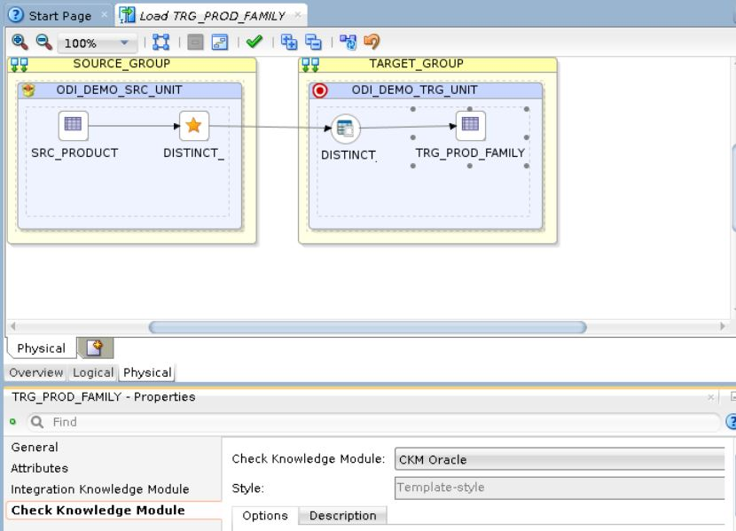

3.  From **File** main menu, select **Save**.

The Load TRG\_PROD\_FAMILY mapping is now ready to be run.

## **STEP 11:** Run the Mapping

1. In the logical section, click on Data to see the data in the table.

  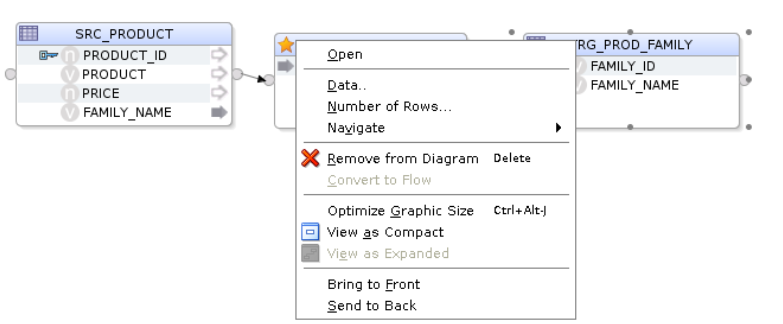

2. You can close the editor and click on Run icon to execute the mapping.

  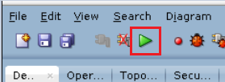

3. Run box will appear on screen. Click "OK".

  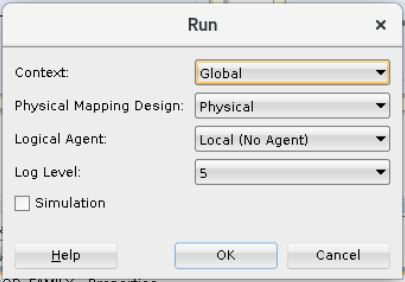

4. Session started message will appear on screen. Click "OK".

  

5. Go to operator tab and check the status of the job.

  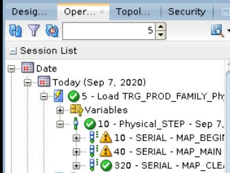

6. Verify the data in target table as we did in step 1.

  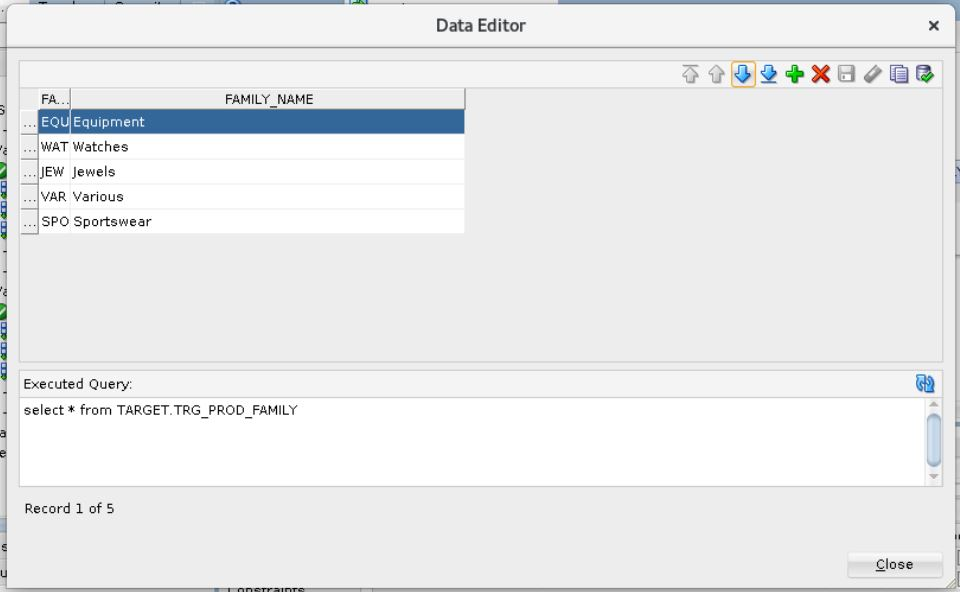

You may proceed to the next lab.

## Learn More
- [Oracle Data Integrator](https://docs.oracle.com/en/middleware/fusion-middleware/data-integrator/index.html)

## Acknowledgements

- **Author** - Narayanan Ramakrishnan, December 2020
- **Contributors** - Srivishnu Gullapalli
- **Last Updated By/Date** - Rene Fontcha, LiveLabs Platform Lead, NA Technology, January 2021

## Need Help?
Please submit feedback or ask for help using our [LiveLabs Support Forum](https://community.oracle.com/tech/developers/categories/livelabsdiscussions). Please click the **Log In** button and login using your Oracle Account. Click the **Ask A Question** button to the left to start a *New Discussion* or *Ask a Question*.  Please include your workshop name and lab name.  You can also include screenshots and attach files.  Engage directly with the author of the workshop.

If you do not have an Oracle Account, click [here](https://profile.oracle.com/myprofile/account/create-account.jspx) to create one.
