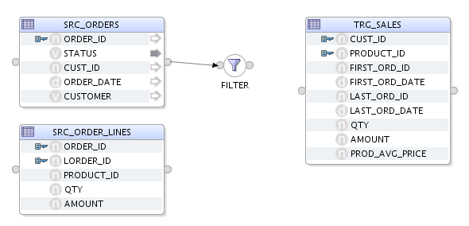
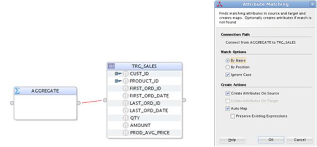
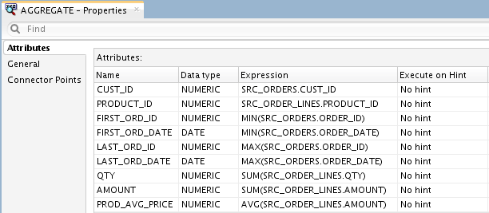
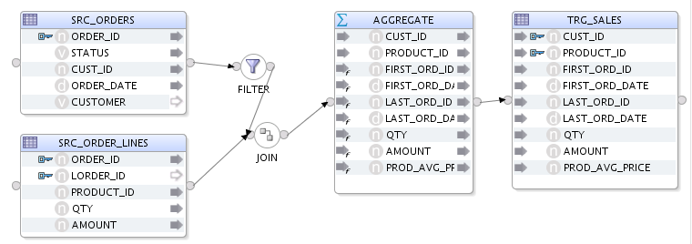

# Mapping 6 - Aggregate

## Introduction

This chapter describes how to work with mappings in Oracle Data Integrator.

*Estimated Lab Time*: 60 minutes

### Objectives

The demonstration environment includes several example mappings. In this chapter you will learn how to create the following mappings:

  * Load TRG\_SALES: This mapping loads the data from the SRC\_ ORDERS table and from the SRC\_ORDER\_LINES table in the *Orders Application* model into the TRG\_SALES target table in the *Sales Administration* model.

### Prerequisites
This lab assumes you have:
- Basic knowledge of Oracle Database
- A Free Tier, Paid or LiveLabs Oracle Cloud account
- SSH Private Key to access the host via SSH
- You have completed:
    - Lab: Generate SSH Keys
    - Lab: Prepare Setup
    - Lab: Environment Setup
    - Lab: Initialize Environment

## **STEP 1:** Load TRG\_SALES Mapping Example

This section contains the following topics:

  - Purpose and Integration Requirements
  - Mapping Definition
  - Creating the Mapping

1. Purpose and Integration Requirements
The purpose of this mapping is to load the SRC\_ORDERS table of orders and the SRC\_ ORDER\_LINES table of order lines from the *Orders Application* model into the TRG\_SALES target table in the *Sales Administration* model. The data must be aggregated before it is integrated into the target table. Only orders whose status is CLO are to be used.

However, the source data is not always consistent with the integrity rules present in the target environment. For this transformation, we want to cleanse the data by verifying that all of the constraints are satisfied. We want to place any invalid rows into an error table rather that into our target database. In our case, two important integrity rules must be satisfied:

  * The sales must be associated with a product (PRODUCT\_ID) that exists in the TRG\_PRODUCT table (reference FK\_SALES\_PROD
  * The sales must be associated with a customer (CUST\_ID) that exists in the TRG\_ CUSTOMER table (reference FK\_SALES\_CUST

The functional details for these rules and the procedure to follow are described in a later Lab *Creating the Mapping*.

2. Mapping Definition

This section describes the mapping Load TRG\_SALES that will be created in this example.

The Load TRG\_SALES mapping uses the following data and transformations:

  * One target datastore.

  | Model                 | Datastore            | Description                                           |  Type        |
  |-----------------------|----------------------|-------------------------------------------------------|--------------|
  | Sales Administration  | TRG\_SALES           | Target table in the Sales Administration System | Oracle Table |

  * Two source datastores.

  | Model                 | Datastore          | Description                                     |  Type        |
  |-----------------------|--------------------|------------------------------------------------------|--------------|
  | Orders Application    | SRC\_ORDERS        | Orders table in the source systems              | Oracle Table |
  | Orders Application    | SRC\_ORDER\_LINES  | Order lines table in the source systems         | Oracle Table |

  * One **Join**.

  | Join                      | Description                                  | SQL Rule                                           |
  |---------------------------|----------------------------------------------|----------------------------------------------------|
  | Commands and Order Lines  | Join SRC\_ORDERS and SRC\_ORDER\_LINES       | SRC\_ORDERS.ORDER\_ID = SRC\_ORDER\_LINES.ORDER_ID |


  * One **Filter**

  | Description                      | SQL Rule                                  |
  |----------------------------------|-------------------------------------------|
  | Only retrieve completed orders   | SRC\_ORDERS.STATUS = 'CLO'                |
  | Orders Application               | Order lines table in the source system    |

  * Several transformation rules.

  | Target Column         | Origin                                             | SQL Rule (expression)            |
  |-----------------------|----------------------------------------------------|----------------------------------|
  |CUST\_ID               |CUST_ID from SRC\_ORDERS                            | SRC\_ORDERS.CUST\_ID             |
  |PRODUCT\_ID            |PRODUCT_ID from SRC\_ORDERS\_LINES                  | SRC\_ORDER\_LINES.PRODUCT\_ID    |
  |FIRST\_ORD\_ID         |Smallest value of ORDER_ID                          | MIN(SRC\_ORDERS.ORDER\_ID)       |
  |FIRST\_ORD\_DATE       |Smallest value of the ORDER\_DATE from SRC\_ORDERS  | MIN(SRC\_ORDERS.ORDER\_DATE)     |
  |LAST\_ORD\_ID          |Largest value of ORDER\_ID                          | MAX(SRC\_ORDERS.ORDER\_ID)       |
  |LAST\_ORD\_DATE        |Largest value of the ORDER\_DATE from SRC\_ORDERS   | MAX(SRC\_ORDERS.ORDER\_DATE)     |
  |QTY                    |Sum of the QTY quantities from the order lines      | SUM(SRC\_ORDER\_LINES.QTY)       |
  |AMOUNT                 |Sum of the amounts from the order lines             | SUM(SRC\_ORDER\_LINES.AMOUNT)    |
  |PROD\_AVG\_PRICE       |Average amount from the order lines                 | AVG(SRC\_ORDER\_LINES.AMOUNT)    |

## **STEP 2:** Creating the Mapping

This section describes how to create the Load TRG\_SALES mapping. To create the Load TRG\_SALES mapping perform the following procedure:

  * Insert a Mapping
  * Define the Target Datastores
  * Define the Source Datastores
  * Define Joins between the Source Datastores
  * Define the Order Filter
  * Define the Transformation Rules
  * Define the Data Loading Strategies (LKM)
  * Define the Data Integration Strategies (IKM)
  * Define the Data Control Strategy

1. Insert a New Mapping
  To create a new mapping:
    - In Designer Navigator, expand the Demo project node in the Projects accordion.
    - Expand the Sales Administration node.
    - In the Sales Administration folder, right-click the Mappings node and select **New Mapping**.
    - Enter the name of your mapping (Load TRG\_SALES) in the Name field.
    - Create Empty Dataset should be unchecked.

2. Define the Target Datastore
  To insert the target datastore in the Load TRG\_SALES mapping:
    - Go to the Logical tab of the Mapping Editor.
    - In the Designer Navigator, expand the Models accordion and the *Sales Administration* model.
    - Select the TRG\_SALES datastore under the *Sales Administration model* and drag it into the mapping.

3. Define the Source Datastores
  The Load TRG\_SALES mapping example uses datastores from the *Orders Application* model.
  To add source datastores to the Load TRG\_SALES mapping:

    - In the Mapping tab, drag the following source datastores into the Source Diagram:
      * SRC\_ORDERS from the *Orders Application* model
      * SRC\_ORDER\_LINES from the *Orders Application* model

  

## **STEP 3:** Define the Order Filter

In this example, only completed orders should be retrieved. A filter needs to be defined on the SRC\_ORDERS datastore.

To define the filter:

1.  In the mapping, select the STATUS column of the SRC\_ORDERS datastore and drag it onto the Mapping Diagram.

2.  The filter appears as shown:

  

3.  Select the filter in the Source Diagram to display the filter properties in the Property Inspector.

4.  In the Condition tab of the Property Inspector, modify the filter rule by typing:

  ```
  <copy>
  SRC_ORDERS.STATUS = 'CLO'
  </copy>
  ```

## **STEP 4:** Define Joins between the Source Datastores

This section describes how to define joins between the source datastores. To create the join defined earlier:

1. Drag the JOIN component into the mapping from the Components palette

2. Drag the ORDER\_ID column of the SRC\_ORDERS datastore into the JOIN.

3. Drag the ORDER\_ID column of the SRC\_ORDER\_LINES datastore into the JOIN.

  A join linking the two datastores appears. This is the join on the order number. The join has the following expression:

  ```
  <copy>
  SRC\_ORDERS.ORDER\_ID=SRC\_ORDER\_LINES.ORDER\_ID
  </copy>
  ```

## **STEP 5:** Define the Transformation Rules

Many of the transformations used for this mapping will use an aggregate function. These functions are implemented using the AGGREGATE Component.

1. From the Components palette, drag the AGGREGATE component into the mapping.

2. Drag the AGGREGATE output connector point to the TRG\_SALES input connector point. This action will start an Automap, selecting OK will backfill the AGGREGATE from the Target attributes.

  

  Define the following transformation rules in the Aggregate component:

  * **CUST\_ID:** Drag the SRC\_ORDERS.CUST\_ID column into the CUST\_ID column in the Aggregate Component. This transformation rule maps the CUST\_ID column in your SRC\_ORDERS table to the CUST\_ID column in your target table.

  * **PRODUCT\_ID:** Drag the SRC\_ORDER\_LINES.PRODUCT\_ID column into the PRODUCT\_ID column in the Aggregate Component. This transformation rule maps the PRODUCT\_ID column in your SRC\_ORDER\_LINES table to the PRODUCT\_ID column in your target table.

  * **FIRST\_ORD\_ID**: Drag the SRC\_ORDERS.ORDER\_ID column into the Expression field. Enter the following text in the Expression field:

  ```
  MIN(SRC_ORDERS.ORDER_ID)
  ```

  This transformation rule maps the minimum value of the ORDER\_ID column in your SRC\_ORDERS table to the FIRST\_ORD\_ID column in your target table.

  * **FIRST\_ORD\_DATE**: Drag the SRC\_ORDERS.ORDER\_DATE column into the Implementation field. Enter the following text in the Expression field:

  ```
  MIN(SRC_ORDERS.ORDER_DATE)
  ```

 This transformation rule maps the minimum value of the ORDER\_DATE column in your SRC\_ORDERS table to the FIRST\_ORD\_DATE column in your target table.

  * **LAST\_ORD\_ID**: Drag-and-drop the SRC\_ORDERS.ORDER\_ID column into the Expression field. Enter the following text in the Expression field:

  ```
  MAX(SRC_ORDERS.ORDER_ID)
  ```

 This transformation rule maps the maximum value of the ORDER\_ID column in your SRC\_ORDERS table to the LAST\_ORD\_ID column in your target table.

  * **LAST\_ORD\_DATE**: Drag the SRC\_ORDERS.ORDER\_DATE column into the Expression field. Enter the following text in the Expression field:

  ```
  MAX(SRC_ORDERS.ORDER_DATE)
  ```

 This transformation rule maps the maximum value of the ORDER\_DATE column in your SRC\_ORDERS table to the LAST\_ORD\_DATE column in your target table.

  * **QTY**: Enter the following text in the Expression field:

  ```
  SUM(SRC_ORDER_LINES.QTY)
  ```

 This transformation rule maps the sum of the product quantities to the QTY column in your target table.

  * **AMOUNT**: Enter the following text in the Expression field:

  ```
  SUM(SRC_ORDER_LINES.AMOUNT)
  ```

 This transformation rule maps the sum of the product prices to the AMOUNT column in your target table.

  * **PROD\_AVG\_PRICE**: Drag the SRC\_ORDERLINES.AMOUNT column into the Expression field. Enter the following text in the Expression field:

  ```
  AVG(SRC_ORDER_LINES.AMOUNT)
  ```

 This transformation rule maps the average of the product prices to the PROD\_ AVG\_PRICE column in your target table.

 Review carefully your Aggregate rules and make sure that you have defined the rules as shown:

  

  **Note** that even though this example uses aggregation functions, you do not have to specify the group by rules: Oracle Data Integrator will infer that from the mappings, applying SQL standard coding practices.

  

## **STEP 6:** Setting the Integration Type
Click on the TRG\_SALES datastore in the mapping, in the *Properties* panel under Target set the Integration Type to Incremental Update.

## **STEP 7:** Define the Data Loading Strategies (LKM)

In the Physical tab, Oracle Data Integrator indicates the various steps that are performed when the map is executed. In the Physical tab you define how to load the result of the orders and order line aggregates into your target environment with a Loading Knowledge Module (LKM).

To define the loading strategies:

1.  In the Physical tab of the Mapping Editor, select the source set that corresponds to the loading of the order line's filtered aggregate results. In this example, this is the AGGREGATE\_AP access point in the ODI\_DEMO\_TRG\_UNIT.

2.  In the Property Inspector, set the LKM to **LKM SQL to SQL (Built-In).GLOBAL** using the LKM Selector list as shown:

  

  

## **STEP 8:** Define the Data Integration Strategies (IKM)

After defining the loading phase, you need to define the strategy to adopt for the integration of the data into the target table.

To define the integration strategies:

1.  In the Physical tab of the Mapping Editor, select the Target object (**TRG\_SALES**). The Property Inspector should display the properties of the target.

2.  In the Property Inspector, set the IKM to **IKM Oracle Incremental Update** using the IKM Selector list. If this IKM is not in the list, make sure you have correctly set the Target Integration Type to Incremental Update in the Logical panel.

3.  In the knowledge module options, leave the default values.

## **STEP 9:** Define the Data Control Strategy

In "Define the Data Loading Strategies (LKM)"and "Define the Data Integration Strategies (IKM)" you have specified the data flow from the source to the target. You must now define how to check your data (CKM) and the constraints and rules that must be satisfied before integrating the data.

To define the data control strategy:

1.  In the Physical tab of the Mapping Editor for the Target, verify that the **CKM Oracle** is selected.

  

2.  In the Logical tab of TRG\_SALES, select Constraints. Set the constraints that you wish to verify to true:

    * PK\_TRG\_SALES
    * FK\_SALES\_CUST
    * FK\_SALES\_PROD

    *Figure 4-28 Constraint Definition for TRG\_SALES*

  

3.  From **File** main menu, select **Save**.

The Load **TRG\_SALES** mapping is now ready to be executed.

You many now proceed to the next lab.

## Learn More
- [Oracle Data Integrator](https://docs.oracle.com/en/middleware/fusion-middleware/data-integrator/index.html)

## Acknowledgements

- **Author** - Narayanan Ramakrishnan, December 2020
- **Contributors** - Srivishnu Gullapalli
- **Last Updated By/Date** - Rene Fontcha, LiveLabs Platform Lead, NA Technology, January 2021

