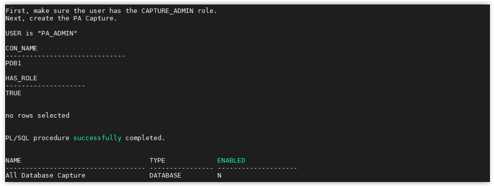
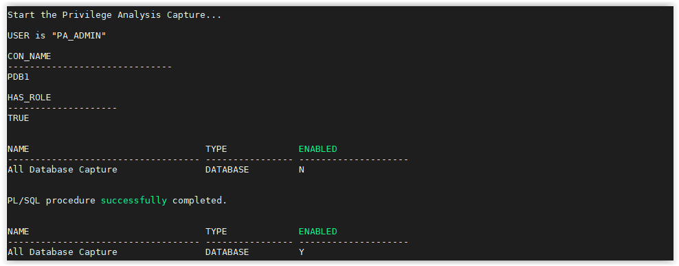
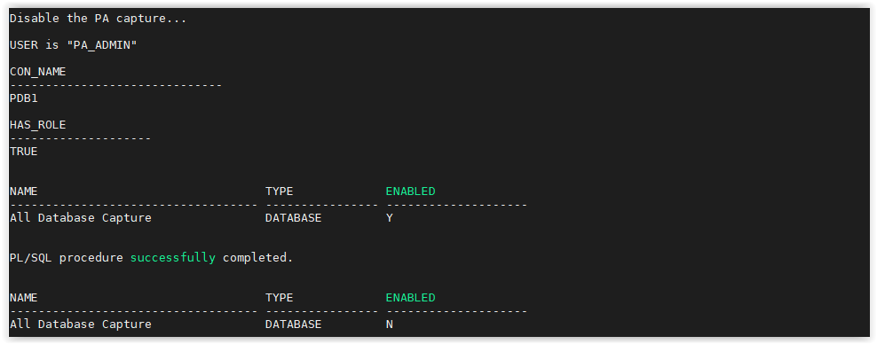
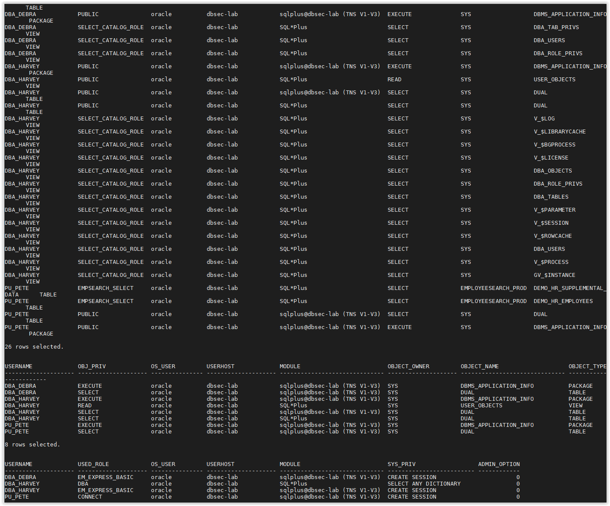
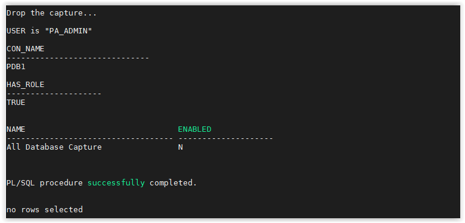

# Oracle Privelege Analysis

## Introduction
This workshop introduces the functionality of Privilege Analysis.

It gives the user an opportunity to learn how to use this feature to always know privileges usage accessed by all users during all the database life.

- *Version tested in this lab:* Oracle DB 19.8
- *Estimated Lab Time:* 15 minutes

### Objectives
- Capture the workload of a database
- Generate a Privilege Analysis report to know all the user/system privileges used during this capture

### Prerequisites
This lab assumes you have completed:
   - Lab: Generate SSH Keys
   - Lab: Prepare Setup
   - Lab: Environment Setup
   - Lab: Initialize and Start the DBSecLab Environment

### Video Preview
- Watch a preview of "*Understanding Privilege Analysis (January 2019)*" [](youtube:3oRODVtWwbg)

### Lab Timing (estimated)
| Step No. | Feature | Approx. Time |
|--|------------------------------------------------------------|-------------|
| 1 | Capture the workloard to analyze | 5 minutes |
| 2 | Analyze the workload caputred | 5 minutes |
| 3 | (Optionnal) Drop the capture | <5 minutes |


## **STEP 1**: Capture the workloard to analyze

1. Open a SSH session on your DBSec-Lab VM as Oracle User

      ````
      <copy>sudo su - oracle</copy>
      ````

2. Go to the scripts directory

      ````
      <copy>cd $DBSEC_HOME/workshops/Database_Security_Labs/Privilege_Analysis/Simple_PA_Lab</copy>
      ````

3. Start by ensuring the user has the `CAPTURE_ADMIN` role and creating the PA Capture

      ````
      <copy>./01_start_pa_capture.sh</copy>
      ````

   

4. Next, start the capture

      ````
      <copy>./02_start_capture.sh</copy>
      ````

   

    **Note**: This will start collecting all of the privileges and/or roles that are being used

5. Generate some workload so we have used and unused roles and privileges

      ````
      <copy>./03_generate_workload.sh</copy>
      ````

6. We can disable the capture when we feel we have enough data

      ````
      <copy>./04_disable_capture.sh</copy>
      ````

   

## **STEP 2**: Analyze the workload captured

1.  Generating the report 

      ````
      <copy>./05_generate_report.sh</copy>
      ````

   

    **Note**:
    - It takes all of the privileges and roles that were identified as used during the capture and compares it to the roles and privileges granted to each user
    - It may take a few minutes to generate depending on the volume to be processed

2. Next, view the report results by querying the views associated with the capture output

      ````
      <copy>./06_review_report.sh</copy>
      ````

   

## **STEP 3**: (Optionnal) Drop the capture

1. Once we have reviewed our report and we are comfortable with Privilege Analysis, we can drop the capture we created

      ````
      <copy>./07_drop_capture.sh</copy>
      ````

   

You may proceed to the next lab.

## **Appendix**: About the Product
- **Overview**

    Privilege analysis increases the security of your applications and database operations by helping you to implement least privilege best practices for database roles and privileges.

    Running inside the Oracle Database kernel, privilege analysis helps reduce the attack surface of user, tooling, and application accounts by identifying used and unused privileges to implement the least-privilege model.

   

    Privilege analysis dynamically captures privileges used by database users and applications. The use of privilege analysis can help to quickly and efficiently enforce least privilege guidelines. In the least-privilege model, users are only given the privileges and access they need to do their jobs. Frequently, even though users perform different tasks, users are all granted the same set of powerful privileges. Without privilege analysis, figuring out the privileges that each user must have can be hard work and in many cases, users could end up with some common set of privileges even though they have different tasks. Even in organizations that manage privileges, users tend to accumulate privileges over time and rarely lose any privileges. Separation of duty breaks a single process into separate tasks for different users. Least privileges enforces the separation so users can only do their required tasks. The enforcement of separation of duty is beneficial for internal control, but it also reduces the risk from malicious users who steal privileged credentials.

    Privilege analysis captures privileges used by database users and applications at runtime and writes its findings to data dictionary views that you can query. If your applications include definer’s rights and invoker’s rights procedures, then privilege analysis captures the privileges that are required to compile a procedure and execute it, even if the procedure was compiled before the privilege capture was created and enabled.

    You can create different types of privilege analysis policies to achieve specific goals:

    - **Role-based privilege use capture**

          You must provide a list of roles. If the roles in the list are enabled in the database session, then the used privileges for the session will be captured. You can capture privilege use for the following types of roles: Oracle default roles, user-created roles, Code Based Access Control (CBAC) roles, and secure application roles.

    - **Context-based privilege use capture**

          You must specify a Boolean expression only with the `SYS_CONTEXT` function. The used privileges will be captured if the condition evaluates to `TRUE`. This method can be used to capture privileges and roles used by a database user by specifying the user in `SYS_CONTEXT`.

    - **Role- and context-based privilege use capture**

          You must provide both a list of roles that are enabled and a `SYS_CONTEXT` Boolean expression for the condition. When any of these roles is enabled in a session and the given context condition is satisfied, then privilege analysis starts capturing the privilege use.

    - **Database-wide privilege capture**

          If you do not specify any type in your privilege analysis policy, then the used privileges in the database will be captured, except those for the user `SYS`. (This is also referred to as unconditional analysis, because it is turned on without any conditions.)

- **Benefits of using Privilege Analysis**
    - Finding unnecessarily granted privileges
    - Implementing least privilege best practices: the privileges of the account that accesses a database should be limited to the privileges that are strictly required by the application or the user
    - Development of Secure Applications: during the application development phase, some administrators may grant many powerful system privileges and roles to application developers
    - You can create and use privilege analysis policies in a multitenant environment
    - Can be used to capture the privileges that have been exercised on pre-compiled database objects (PL/SQL packages, procedures, functions, views, triggers, and Java classes and data) 

## Want to Learn More?
Technical Documentation:
- [Oracle Privilege Analysis 19c](https://docs.oracle.com/en/database/oracle/oracle-database/19/dbseg/performing-privilege-analysis-find-privilege-use.html#GUID-44CB644B-7B59-4B3B-B375-9F9B96F60186)

## Acknowledgements
- **Author** - Hakim Loumi, Database Security PM
- **Contributors** - Gian Sartor, Rene Fontcha
- **Last Updated By/Date** - Hakim Loumi, 20th October 2020

## Need Help?
Please submit feedback or ask for help using our [LiveLabs Support Forum](https://community.oracle.com/tech/developers/categories/livelabsdiscussions). Please click the **Log In** button and login using your Oracle Account. Click the **Ask A Question** button to the left to start a *New Discussion* or *Ask a Question*.  Please include your workshop name and lab name.  You can also include screenshots and attach files.  Engage directly with the author of the workshop.

If you do not have an Oracle Account, click [here](https://profile.oracle.com/myprofile/account/create-account.jspx) to create one.