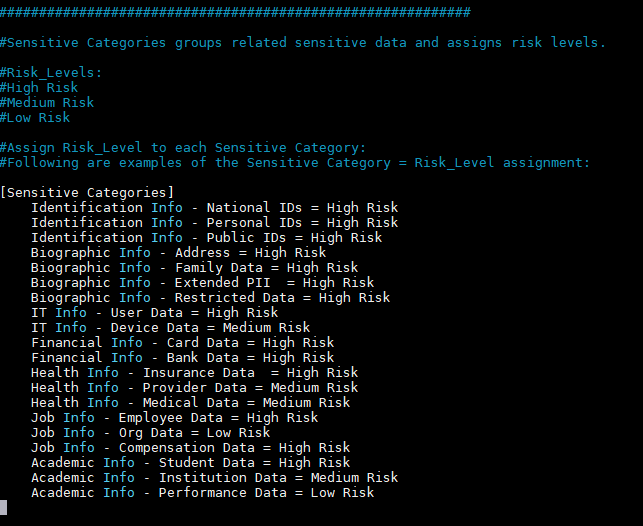
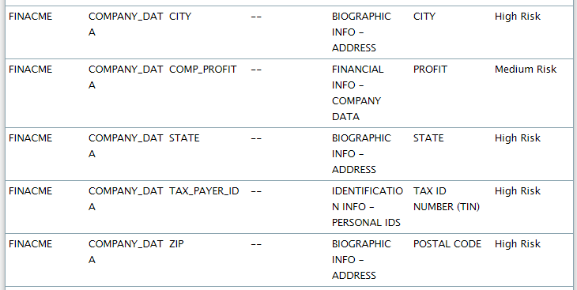

# [Lab] Advanced Discoverer Labs

## **1. Getting into dbsat.config Discovery parameters**

In this exercise, you will learn how `dbsat.config` parameters determine the behavior of DBSAT Discoverer. 
You will learn how to:

– Use the EXCLUDE_LIST_FILE parameter to exclude a column from the report.

– Use the SCHEMA_SCOPE parameter to focus the analysis on a specific schema.

– Use the MINROWS parameter to exclude tables that have less than 5 rows. This can be useful to exclude tables based on the number of rows.

- After reviewing the report (and in practice should review the actual table data), it is clear that DBSAT reported the column `LAST_INS_CLAIM` from table `HCM1.SUPPLEMENTAL_DATA` as containing *Healthcare Provider* data when it does not.

    

    Let’s exclude the false positive by leveraging the **Fully Qualified Column Name (FQCN)** that is in the csv generated report and the EXCLUSION_LIST_FILE dbsat.config parameter.

- The provided environment does not contain any UI tool to view CSV files. For complete understanding and review of the generated CSV, it’s advisable that you open the file with a proper tool (LibreOffice, MS Excel, etc.).You can also by copy the csv back to your laptop and open it with a spreadsheet reader.

- For simplicity, you can view the content of the csv by typing on the command line:

        column -s, -t < pdb1_dbsat_discover.csv |grep LAST_INS_CLAIM

- The **FQCN** for this particular column, as displayed above, is `HCM1.SUPPLEMENTAL_DATA.LAST_INS_CLAIM`. 

- Select the **FQCN** value - `HCM1.SUPPLEMENTAL_DATA.LAST_INS_CLAIM` - and copy it to the clipboard.

- Open a SSH session on your DBSec-Lab VM as Oracle User

        sudo su - oracle

- Go to the scripts directory

        cd $DBSEC_HOME/workshops/Database_Security_Labs/DBSAT/dbsat22/Discover/conf

- Create a file called `exclude.ini`

        vi exclude.ini

- Paste the copied value and you should see this:

   

- Save the file by typing `:wq!`

- Open the dbsat.config file and set the parameter `EXCLUSION_LIST_FILE = exclude.ini`

        vi Discover/conf/dbsat.config

   

- Save the file

- Rerun DBSAT Discoverer. Append `_v2` to the filename. .

        ./dbsat discover -c Discover/conf/dbsat.config pdb1_dbsat_v2

- Unzip the file

        unzip orcl_dbsat_v2_report.zip

- For the purpose of this lab, and as we are not using a desktop environment, copy the html file to the glassfish server directory by executing the script. This will make the html report accessible in the glassfish application server and make it reacheable by your laptop browser.

        . ../Use_Glassfish_Webserver.sh
    
    This script will copy the html report to the glassfish webserver to make it easier for you to see the report.

    
- This is the output:

        Start Glassfish...

        Starting the Glassfish application...

        Waiting for domain1 to start ..........
        Successfully started the domain : domain1
        domain  Location: /u01/app/glassfish/glassfish4/glassfish/domains/domain1
        Log File: /u01/app/glassfish/glassfish4/glassfish/domains/domain1/logs/server.log
        Admin Port: 4848
        Command start-domain executed successfully.

        Make a directory in the Glassfish HR app for the DBSAT HTML file...

        Copy the .html files to our new Glassfish DBSAT directory...

        Use your local browser to view it at:

        http://dbsec_lab_public_ip:8080/hr_prod_pdb1/dbsat/pdb1_dbsat_discover.html
        http://dbsec_lab_public_ip:8080/hr_prod_pdb1/dbsat/pdb1_dbsat_v2_discover.html
        http://dbsec_lab_public_ip:8080/hr_prod_pdb1/dbsat/pdbhol_report.html

    
- Open your browser of choice, and copy-paste the URL provided as the output. Replace *dbsec_lab_public_ip* by your Public IP Address in the link `http://dbsec_lab_public_ip:8080/hr_prod_pdb1/dbsat/pdb1_dbsat_v2_discover.html`.  

- Search for `LAST_INS_CLAIM` or the `SUPPLEMENTAL_DATA` table, and it is now gone. This is an easy way to remove false positives from the end report.

- Let have a look at the `SCHEMA_SCOPE` and `MINROWS` parameters. `SCHEMA_SCOPE` is particularly useful if you know beforehand which schemas to scan for sensitive data as it will allow for a more targeted run. The `MINROWS` is useful to exclude empty tables (by default it is excluding as minrows=1) or reference tables.

- Let’s make a DBSAT Discoverer run just for the HR schema and exclude tables with less than 11 rows. This will exclude the `JOB_HISTORY` table. Search the report for the `JOB_HISTORY` table (hint: Schema view > Table Summary) to validate that it has 10 rows.

- Edit the configuration file and add change the following variables:

        vi Discover/conf/dbsat.config

- Set `SCHEMAS_SCOPE = HR` and `MINROWS = 11`

- You should see this:

      

- Save the file and run again. Append **v3** to the filename.

        ./dbsat discover -c Discover/conf/dbsat.config pdb1_dbsat_v3

- Unzip the file

        unzip pdb1_dbsat_v3_report.zip
        
- Make the file available using Glassfish:

        . ../Use_Glassfish_Webserver.sh

- Open the following link in your browser:

        http://<public_ip>:8080/hr_prod_pdb1/dbsat/pdb1_dbsat_v3_discover.html

- You should see a smaller report focused just on the `HR` schema and that excludes the `JOB_HISTORY` table.

    

  

## **2. Getting into Pattern files, Sensitive Types, and Categories**

- Let's start by adding some sample data to work with in the next exercise. For that you will create the schema `FINACME` and insert some sample _Company Financial Information_.

- Carefully copy/paste the code below. Make sure that all statements execute successfully.

        conn system/Oracle123@pdb1 
        drop user finacme cascade;
        create user finacme identified by oracle temporary tablespace temp default tablespace users; 
        grant connect, create session to finacme; 
        grant create table to finacme;
        alter user finacme quota 100M on USERS;
        
        create table finacme.company_data (
                 company_id number not null constraint company_data_company_id_pk primary key, 
                 name varchar2(20), 
                 stadr varchar2(20), 
                 city varchar2(20), 
                 state varchar2(20), 
                 zip varchar2(20),
                 tax_payer_id number(12),
                 comp_profit number(20),
                 fy_end_date date );

- Insert some records 
    
        begin 
            for i in 1..100 loop 
                insert into finacme.company_data values (i, 'Company '||initcap(dbms_random.string('A', 10)) , 'California', 'San Francisco','CA','90000'+i,'19442350012'+i, i+23440003, sysdate-i); 
            end loop; 
        end; 
        / 
        commit;
    
- Let’s gather table statistics 
        
        exec dbms_stats.gather_table_stats('FINACME','COMPANY_DATA');

- Check the data to validate everything is ok.

    set pages 120 
    set lines 150 
    select * from finacme.company_data;

- Type `exit`

- You are all set now!
  

## **3. Pattern Files**

DBSAT uses pattern files and the regexes that are there defined to find sensitive data.

- To get you familiarized with what a pattern file is, open the `sensitive_en.ini` 
file that is inside the Discover/conf directory.

        chmod +w Discover/conf/sensitive_en.ini 
        vi Discover/conf/sensitive_en.ini

- You'll see this:

    

    A **Pattern file** contains a collection of Sensitive Types, their regular expressions, and Categories.
    
    A **Sensitive Type** is defined as 
    follows:

        [SENSITIVE_TYPE_NAME] 
        COL_NAME_PATTERN = the java regex to search column names 
        COL_COMMENT_PATTERN = the java regex to search column comments 
        SENSITIVE_CATEGORY = the Sensitive Category to which the sensitive type belongs to.

- Take your time and explore the file.

- The first Sensitive Type in the file is the US SSN. The US SOCIAL SECURITY NUMBER (SSN) Sensitive Type is defined as the following:

        [US SOCIAL SECURITY NUMBER (SSN)]
        COL_NAME_PATTERN = (^|[_-])SSN#?($|[_-])|^SS#?$|(^|[_-])(SSN|SOC.*SEC.*).?(ID|NO|NUMBERS?|NUM|NBR|#)($|[_-])|^SOCIAL.?SEC(URITY)?#?$
        COL_COMMENT_PATTERN = \bSS#\b|\bSSN#?\b|SOCIAL SECURITY (ID|NUM|\bNO\b|NBR|#)
        SENSITIVE_CATEGORY = Identification Info - National IDs

- DBSAT will parse this pattern file and search for matches of the defined regexp patterns. In this example, it will search **column names** that match the regex `(^|[_-])SSN#?($|[_-])|^SS#?$|(^|[_-])(SSN|SOC.*SEC.*).?(ID|NO|NUMBERS?|NUM|NBR|#)($|[_-])|^SOCIAL.?SEC(URITY)?#?$`, **column comments** that match `\bSS#\b|\bSSN#?\b|SOCIAL SECURITY (ID|NUM|\bNO\b|NBR|#)`, **and if a match is found** it will **report** a finding **in the** `Sensitive Category PII – NIDs (National Identifiers)`.

- The `SENSITIVE_CATEGORY` parameter specifies the type/class of sensitive data. 

    ---
    **NOTE:** 
    The **Sensitive Category** needs to be defined in the `dbsat.config` file along with the risk level for that category.

    ---

- Let’s have a second look at the dbsat.config file. Scroll to the bottom of the file and see:

        vi Discover/conf/dbsat.config

    

- As you can see, DBSAT includes out-of-the-box, 19 Sensitive Categories:

    | Sensitive Category                      	| Description                                                 	|
    |-----------------------------------------	|-------------------------------------------------------------	|
    | Identification Info - National IDs       	| PII – National Identifiers                                  	|
    | Identification Info - Personal IDs        | PII - Personal Identifiers (Names, Phone, Email)              |
    | Biographic Info - Address               	| Address related information                                   |
    | Biographic Info - Family Data             | Names (Father, Mother, Child, Spouse, etc.)                   |
    | Biographic Info - Extended PII            | Age, DOB, Place of Birth , Citizenship, etc.                  |
    | Biographic Info - Restricted Data         | Photo, Fingerprint, Gender, Race, Religion                    |
    | IT Info - User Data                     	| User, Password, Cookie, etc.                                  |
    | IT Info - Device Data                   	| Hostname, IP, MAC, IMEI                                       |
    | Financial Info - Card Data               	| PCI DSS related data. Credit/Debit Card information           |
    | Financial Info - Bank Data               	| Bank account related data                                    	|
    | Health Info - Insurance Data              | Health Insurance Number and Provider                          |
    | Health Info - Provider Data               | Heatlh Care Provider, DEA Number, NPI                         |
    | Health Info - Medical Data     	        | Height, Weight, Blood type, Disability, Smoker, ICD Code, etc.|
    | Job Info - Employee Data    	            | Employment-related data                                      	|
    | Job Info - Org Data                   	| Employee Organization Data                                   	|
    | Job Info - Compensation Data   	        | Income, Compensation, Stocks                              	|
    | Academic Info - Student Data         	    | Student ID, Academic Degree, Field of Study                  	|
    | Academic Info - Institution Data       	| College/School Address and Name, Admission Date, Grad Date    |
    | Academic Info - Performance Data          | Grades, Attendance and Disciplinary Records, etc.              |

    ---
    **NOTE:** You can customize or add your own categories and risk levels. After being defined in the `dbsat.config` file, they can be used in the pattern files Sensitive Type Categories.

    ---

- Let’s create a **new Sensitive Category** – `Financial Info – Company Data` – and revert other parameters.

- Edit dbsat.config and add a new Sensitive Category to the bottom of the file - `Financial Info – Company Data = Medium Risk`

        vi Discover/conf/dbsat.config

- Add the new Sensitive Category. You should see this:

    

- Let’s revert some parameters back to the original values to get more data in the report: 

        SCHEMAS_SCOPE = ALL 
        MINROWS = 1 
        EXCLUSION_LIST_FILE =

- Save `dbsat.config` file.

- Now let’s add a `PROFIT` sensitive type to the new `Financial Info – Company Data` category. Edit the `sensitive_en.ini` file:

        vi  Discover/conf/sensitive_en.ini

- And add a the new **Sensitive Type** to the file as shown below.

        # Financial Info - Company Data
        [PROFIT] 
        COL_NAME_PATTERN = ^(?!.*(NON)).*PROFIT 
        COL_COMMENT_PATTERN = ^(?!.*(NON)).*PROFIT 
        SENSITIVE_CATEGORY = Financial Info - Company Data

- Save the file and run again. Append **v4** to the filename. 

        ./dbsat discover -c Discover/conf/dbsat.config pdb1_dbsat_v4

- Unzip the report file make it available using Glassfish.

        unzip pdb1_dbsat_v4_report.zip

        . ../Use_Glassfish_Webserver.sh

- Go to your web browser and open:

        http://<public_ip>:8080/hr_prod_pdb1/dbsat/pdb1_dbsat_v4_discover.html

- You should see this:

    

- A bit down in the report, this:

    

- And in the **Sensitive Column Details** section of the report: 

    

- This concludes the **DBSAT Discoverer Advanced Hands-on lab**
---
Move up one [directory](../README.md)

Click to return [home](/README.md)
