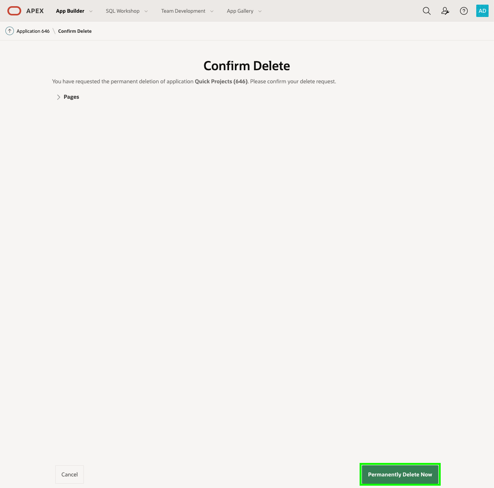
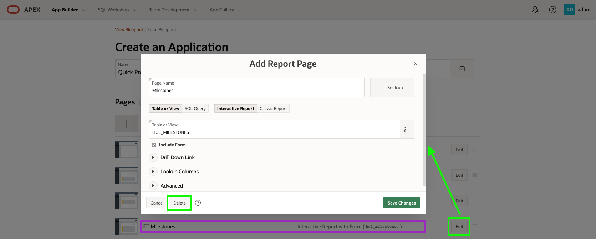
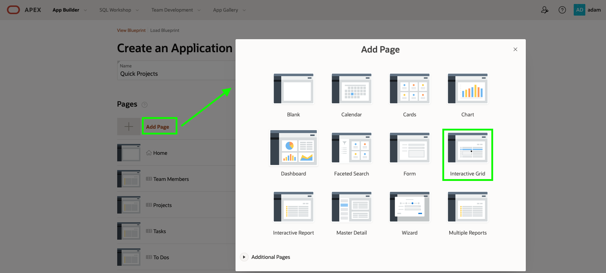
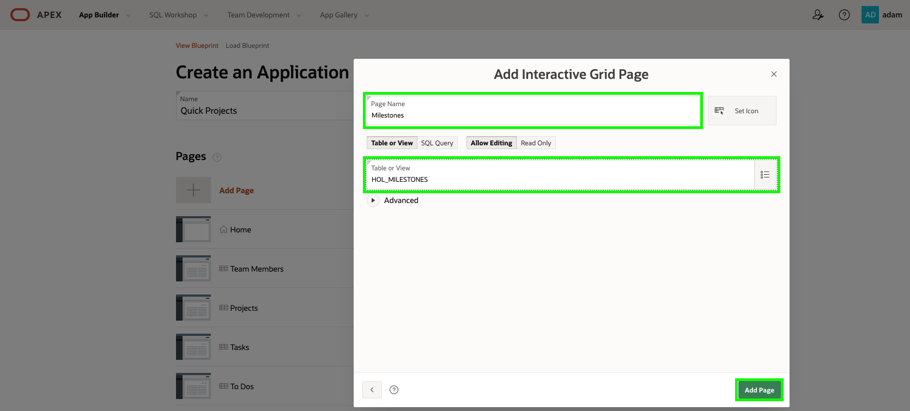
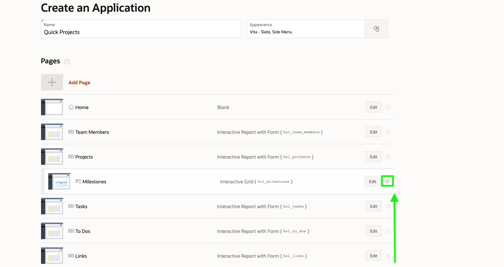
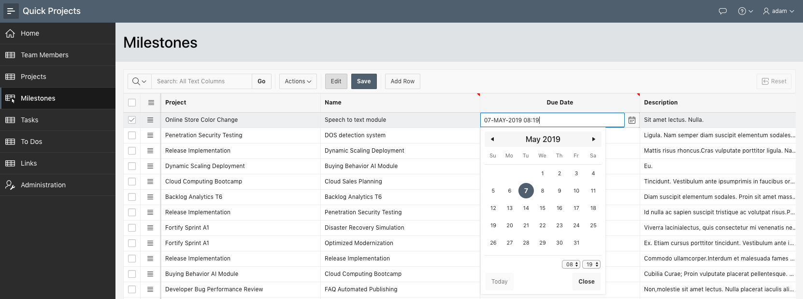

# Regenerate the Application

## Introduction

In this lab you will regenerate the application to create a better starting point for development.

If you review the Milestones report and form you will see there are only four items. Secondly, after speaking to your end users you learn that they often want to enter in many milestones at once for a given project

Therefore, it would be preferable to replace the current report and form with an Interactive Grid. An Interactive Grid is similar to a spreadsheet, as it allows multiple records to be maintained in a single page.

Given that no additional development has been performed in the application, you just generated, it is quickest and easiest to delete the current application, and then regenerate a new application.

*{Note: If development had been performed in the application then you would lose any changes when you regenerate. To avoid this, you could use the Create Page Wizard to create a new Interactive Grid page, delete the existing report and form, and then modify the navigation lists to point to the new page.}*

Estimated Time: 5 minutes

### Objectives
- Regenerate the application for a developer friendly environment
- Update a Step of your application

### What Do You Need?

- An Oracle Cloud paid account or free trial. To sign up for a trial account with $300 in credits for 30 days, click [here](http://oracle.com/cloud/free).
- An APEX application

## **Step 1** - Delete the Existing Application
It is important to remove the application you just generated to avoid the confusion of having two applications with the same name.

1. Navigate back to the application home page.

    Given you ran this app from the APEX App Builder, a Developer Toolbar is displayed at the bottom of the screen.     
    *{Note: End users who log directly into the app will not see this toolbar.*

    In the Developer Toolbar click **Application xxxxx**.

    

    Alternatively, you can also navigate back to the APEX App Builder tab in your browser manually by selecting the appropriate browser tab or window.

2. From the development environment, on the application home page, under Tasks in the right-hand panel, click **Delete Application**.

    

3. On the Confirm Delete page, click **Permanently Delete Now**

    

## **Step 2** - Load Blueprint
The Create Application Wizard allows developers to load previously generated application definitions, called _Blueprints_. Utilizing this capability, you can load the previous Projects application blueprint, modify the page for milestones and then regenerate the app.

1. From the App Builder home page, open the **App Builder** menu and then click **Create**.

    

2. On the Create an Application page, click **New Application**.

3. In the Create App Wizard, click **Load Blueprint**

    For Quick Projects, click **Load**

    

## **Step 3** – Update Milestones Page
Now that you have the original pages reloaded, it is simply a matter of removing the old Milestones page, adding the new page type, and then reordering the new page.

1. In the Create an Application page, under Pages, for Milestones click **Edit**

    On the Add Report Page, click **Delete**.

    

2. Click **Add Page**

    On the Add Page dialog, click **Interactive Grid**

    

3. In the Add Interactive Grid Page dialog, enter the following:
    - Page Name - enter **Milestones**
    - Table or View - select **HOL_MILESTONES**

    Click **Add Page**

    

4. Click and hold the mouse when hovering over the hamburger for the **Milestones – Interactive Grid** page.
    Drag it up until the page is under Projects. Release the mouse.

    

5. To generate the new application click **Create Application**

## **Step 4** – Run the New Application

1. In Page Designer, click **Run Application**

2. In the new application navigate to Milestones and review the page.

    Double-click on an existing record, or click Add Row to insert a new record.

    

    *{Note: Records can be inserted, updated, and deleted directly within the Interactive Grid. The wizard generated a list of values for Projects, the Due Date utilizes a pop-up calendar, and the other two fields use text areas to maintain the data directly on the page.}*

## **Summary**
This completes Lab 3. You now know how to utilize the blueprint to load a previous application definition into the Create Application wizard. [Click here to navigate to Lab 4](?lab=lab-4-improving-tasks)

## **Acknowledgments**

- **Author** - David Peake, Sr. Principal Product Manager, Oracle Database
- **Contributors** - Oracle LiveLabs Team (Robbie Ruppel, Functional Lead; Marilyn Isabella Kessinger, QA Intern; Arabella Yao, Product Manager Intern)
- **Last Updated By/Date** - Anoosha Pilli, Product Manager, DB Product Management, June 2020

## See an issue?
Please submit feedback using this [form](https://apexapps.oracle.com/pls/apex/f?p=133:1:::::P1_FEEDBACK:1). Please include the *workshop name*, *lab* and *step* in your request.  If you don't see the workshop name listed, please enter it manually. If you would like for us to follow up with you, enter your email in the *Feedback Comments* section.
