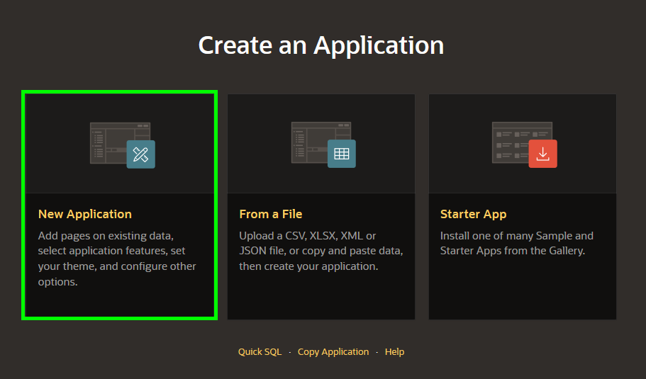
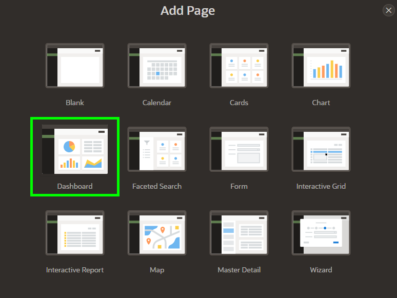
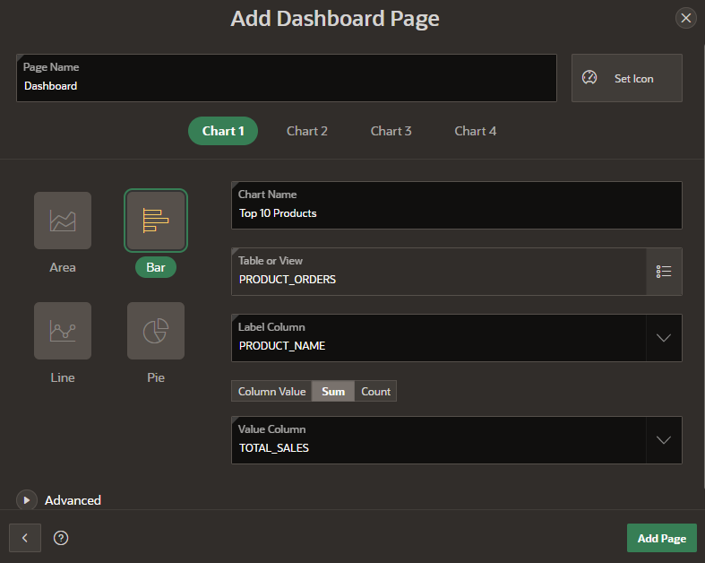
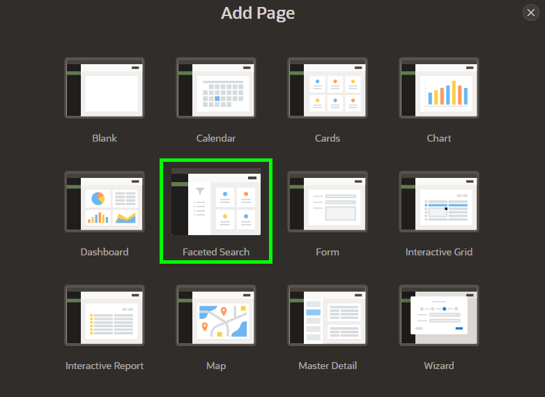
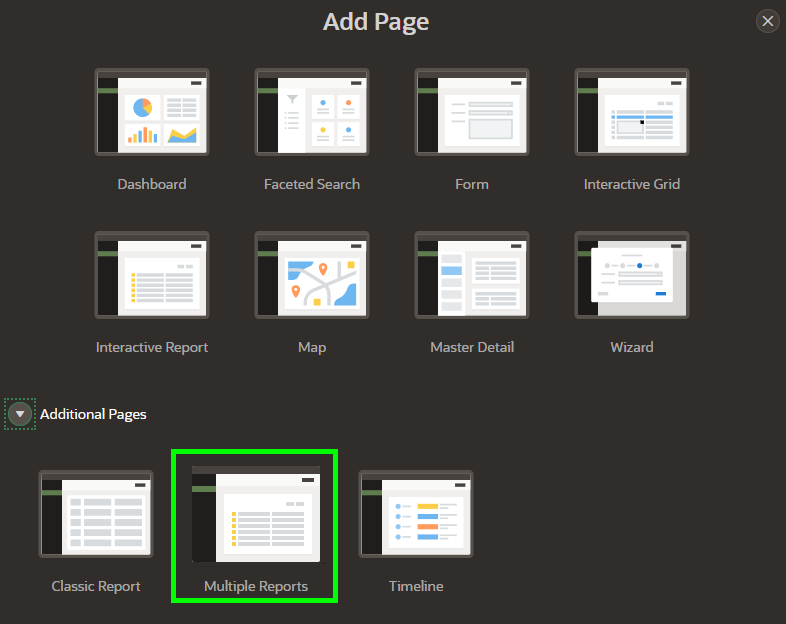
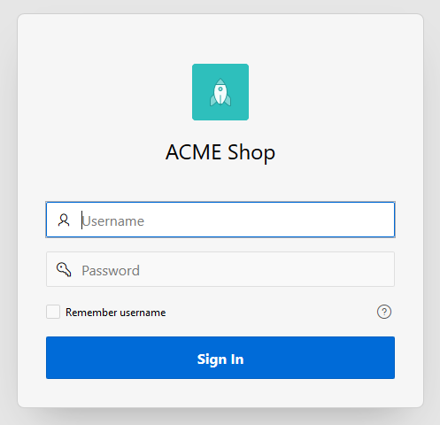

# Use the Create Application Wizard

## Introduction

In this lab you will build an application based on the data structures you built in previous labs.

Estimated Time: 15 minutes

### Objectives
- Create an application using the tables and data from previous labs.

## **Step 1** – Creating an App

1. In the App Builder menu, click **App Builder**.

2. Click **Create**.

    

3.  Click **New Application**.

    

## **Step 2** – Naming the App

1. In the Create Application wizard, for Name enter **ACME Shop**.
 
## **Step 3** – Add the Dashboard Page

A dashboard page is a great way to show important information using various charts. When you installed the Sample Dataset, it also created a number of views, which joins data from various tables. These views are ideal as the basis for the dashboard charts.

1. In the Create Application wizard, click **Add Page**.

2. Click **Dashboard**.

    

3. For Chart 1, enter the following:

    * Chart Type – select **Bar**
    * Chart Name – enter **Top 10 Products**
    * Table or View – select **PRODUCT_ORDERS**
    * Label Column – select **PRODUCT_NAME**
    * Type – select **Sum**
    * Value Column – select **TOTAL_SALES**.

    

4. Click Chart 2, and enter the following:

    * Chart Type – select **Pie**
    * Chart Name – enter **Top 5 Stores**
    * Table or View – select **STORE_ORDERS**
    * Label Column – select **STORE_NAME**
    * Type – select **Sum**
    * Value Column – select **TOTAL_SALES**.

    

5. Click Chart 3, and enter the following:

    * Chart Type – select **Pie**
    * Chart Name – enter **Order Status**
    * Table or View – select **CUSTOMER\_ORDER\_PRODUCTS**
    * Label Column – select **ORDER_STATUS**
    * Type – select **Count**
    * Value Column – select **ORDER_ID**.

        

6. Click Chart 4, and enter the following:

    * Chart Type – select **Bar**
    * Chart Name – enter **Product Reviews**
    * Table or View – select **PRODUCT_REVIEWS**
    * Label Column – select **PRODUCT_NAME**
    * Type – select **Column Value**
    * Value Column – select **AVG_RATING**.

      

7. Click on Advanced and check **Set as Administration Page**.

7. Click **Add Page**.

## **Step 4** – Add the Products Page

1. In the Create Application wizard, click **Add Page**.
2. Click **Faceted Search**.

     

3. On the Faceted Search Page, enter the following:
    - Page Name - enter **Products**
    - Select **Cards**
    - Table - select **PRODUCTS**
    - Select **Grid**
    - Title Column - select **PRODUCT_NAME**
    - Body Column - select **- Select Column -**

    Expand Advanced Section and check **Set as Home Page** 

4. Click **Add Page**.

      

## **Step 5** – Delete Home Page

1. Navigate to Home Page and click on **Edit**.
2. Click **Delete**.    

      

## **Step 6** – Add Multiple Reports

1. In the Create Application wizard, click **Add Page**.
2. Click **Additional Pages**.
3. Click **Multiple Reports**.

     

3. On the Create Multiple Reports Page, select the following tables:
    - CLOTHING_LOOKUP
    - COLOR_LOOKUP
    - CUSTOMERS
    - DEPARTMENT_LOOKUP
    - PRODUCT_REVIEWS
    - STORES

4. Click **Add Pages**.

     

## **Step 7** – Set Multiple Reports as Administration Pages

1. Edit the following pages to set those as an Administration Page:
    - CLOTHING_LOOKUP
    - COLOR_LOOKUP
    - CUSTOMERS
    - DEPARTMENT_LOOKUP
    - PRODUCT_REVIEWS
    - STORES    

2. Click on Advanced and check **Set as Administration Page**.
3. Click **Save Changes**.

     

## **Step 8** – Add Manage Products Page

1. In the Create Application wizard, click **Add Page**.
2. Click **Interactive Report**.

     

3. On the Report Page, enter the following:
    - Page Name - enter **Manage Products**
    - Table - select **PRODUCTS**
    - Check Include Form

4. For Lookup Columns, enter the following:
    - Lookup Key 1 - select **CLOTHING_ID**
    - Display Column 1 - select **CLOTHING_LOOKUP.CLOTHING**
    - Lookup Key 2 - select **DEPARTMENT_ID**
    - Display Column 2 - select **DEPARTMENT\_LOOKUP.DEPARTMENT\_ID**
    - Lookup Key 3 - select **COLOR_ID**
    - Display Column 3 - select **COLOR_LOOKUP.COLOR**

5. Click on Advanced and check **Set as Administration Page**.

6. Click **Add Page**

     

## **Step 9** – Set Features

1. Under **Features** section, check **Access Control**.

## **Step 10** – Generate the App

Now that you have added all the pages, it is time to generate the app and review it.

1. Scroll to the bottom of the page, and click **Create Application**.

    

2. Once the application has been generated, your new app will be displayed in the application home page.
Click **Run Application**.
    
    

## **Step 11** – Run the Application

1. Enter your user credentials. Click **Sign In**.

    

    The new application will be displayed.

## **Summary**
You now know how to create an application, with numerous different page types, based on existing database objects. 

## **Acknowledgments**

- **Author** - Mónica Godoy, Principal Product Manager
- **Contributors** - 
- **Last Updated By/Date** - Mónica Godoy, Principal Product Manager, July 2021

## Need Help?
Please submit feedback or ask for help using our [LiveLabs Support Forum](https://community.oracle.com/tech/developers/categories/oracle-apex-development-workshops). Please click the **Log In** button and login using your Oracle Account. Click the **Ask A Question** button to the left to start a *New Discussion* or *Ask a Question*.  Please include your workshop name and lab name.  You can also include screenshots and attach files.  Engage directly with the author of the workshop.

If you do not have an Oracle Account, click [here](https://profile.oracle.com/myprofile/account/create-account.jspx) to create one.
