# Creating the Shopping Cart Page

## Introduction

In this lab, you will create a new page to review the items added to the Shopping Cart.

Estimated Time: 10 minutes

### Objectives
- Create a page to list the products in the Shopping Cart.
- Create Application Items and Application Processes.

## **Step 1** - Creating Application Items
These items are needed to count the number of items in the shopping cart and the icon to display in the Navigation Bar.

1. Click on **Shared Components**
    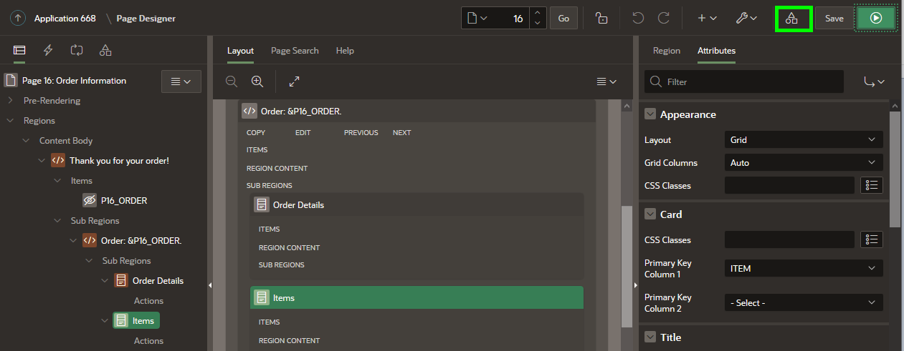
2. Under Application logic, click **Application Items**.
    
3. Click **Create**.
4. Create two items as follow:

    | Name |  Scope  |
    | --- |  --- | 
    | SHOPPING\_CART\_ICON  | Application| 
    | SHOPPING\_CART\_ITEMS | Application |

5. Click **Create Application Item** and create the second item.
    

## **Step 2** - Creating Application Process
This process is needed to refresh the number of items in the Shopping Cart, which will be shown in the navigation bar.

1. Click on **Shared Components**
    
2. Under Application logic, click **Application Processes**.
    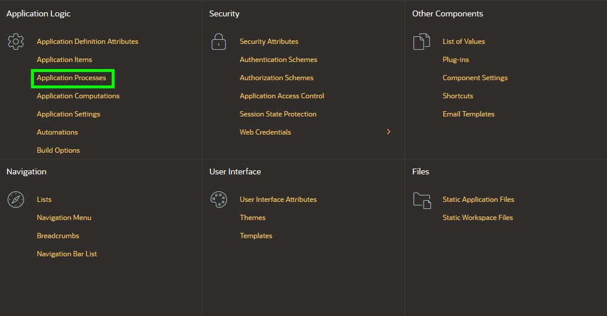
3. Click **Create** and enter the following:
    - For Name - enter **Initialize Shopping Cart Header**
    - For Process Point - select **On Load: Before Header (page template header)**
        
4. Click **Next**.
5. For Code, enter:

    ```
    <copy>
    -- Initialize shopping cart navigation bar to show appropriate icon and count
    DECLARE
        l_cnt NUMBER := manage_orders.get_quantity;
    BEGIN
        IF l_cnt > 0 THEN
            :SHOPPING_CART_ITEMS := l_cnt;
            :SHOPPING_CART_ICON := 'fa-cart-full';
        ELSE
            :SHOPPING_CART_ITEMS := '';
            :SHOPPING_CART_ICON := 'fa-cart-empty';
        END IF;
    END; 
    </copy>
    ```

    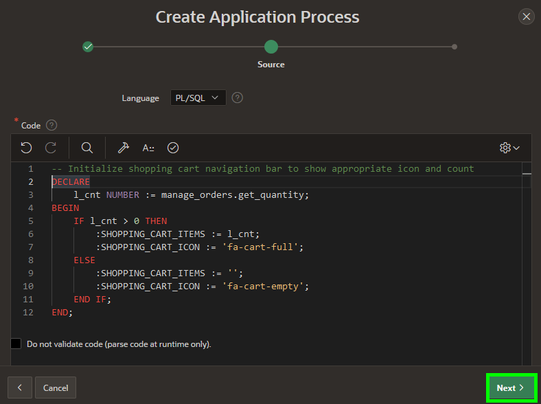 
6. Click **Next**.        
7. Click **Create Process**.   

## **Step 3** - Creating a Normal Page - Shopping Cart

1. Click on Application Home.  ***The ID of your application may vary***
     
2. Click **Create Page**.    
    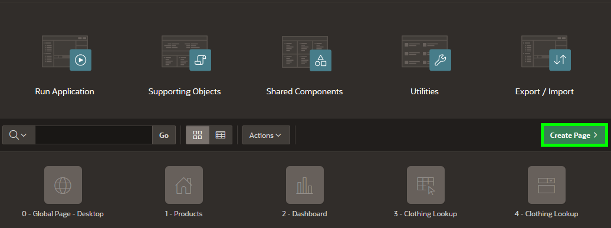 
3. Select **Blank Page** and click **Next**.
4. Enter the following and click **Next**.
    - For Name - enter **Shopping Cart**
    - For Page Mode - select **Normal**
5. For Navigation Preference, select **Do not associate this page with a navigation menu entry** and click **Next**.
6. Click **Finish**.

## **Step 4** - Adding a Cards Region
1. In the new page created, navigate to the **Gallery Menu**.
2. Drag a **Cards** region and drop it to the Content Body section.
    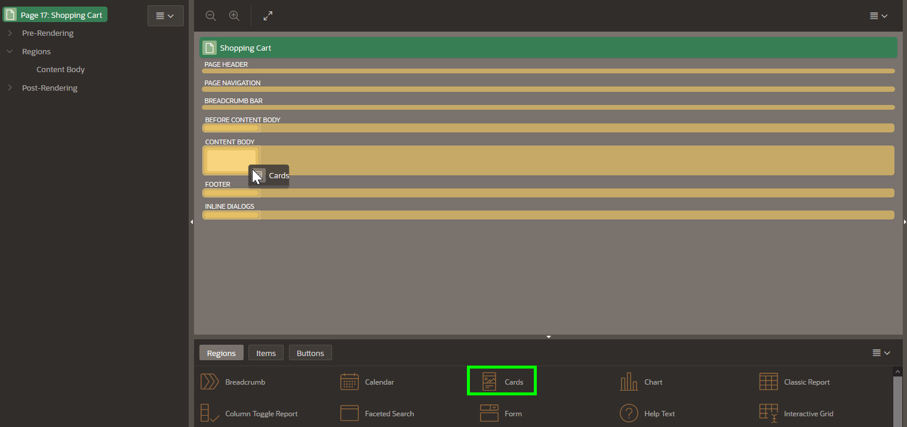
3. In the Property Editor, enter the following: 
    - For Title - enter **Shopping Cart**
    - Under Source section:
        - For Type - select **SQL Query**
        - For SQL Query - enter the following SQL Query:

            ``` 
            <copy>
            SELECT seq_id item,
                p.product_image,
                p.product_id,
                p.product_name name,
                p.unit_price,
                n002               quantity,
                p.unit_price* n002 subtotal,
                b.brand
            FROM   apex_collections a,
                products p,
                json_table (p.product_details, '$' columns ( brand varchar2(4000) path '$.brand') ) b
            WHERE  collection_name = 'PRODUCTS'
            AND    p.product_id = a.n001
            </copy>
        ```

4. Click on Attributes and enter the following:
    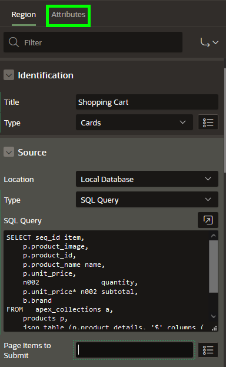
    - Under Appearance section:
        - For Layout - select **Horizontal (Row)**
    - Under Title section:
        - For Column - select **NAME**

    - Under Subtitle section:
        - For Column - select **BRAND**    

    - Under Body section:
        - Set Advanced Formatting to **On**
        - For HTML Expression - enter the following:
        
            ```
            <copy>
            Quantity: &QUANTITY.
            </copy>
            ```

    - Under Secondary Body section:
        - Set Advanced Formatting to **On**
        - For HTML Expression - enter the following:

            ```
            <copy>
            <b>Unit Price: &UNIT_PRICE. </b> <BR>
            <b>Subtotal: &SUBTOTAL. </b>
            </copy>
            ```

    - Under Media section:
        - For Source - select **BLOB Column**
        - For BLOB Column - select **PRODUCT_IMAGE**   

    - Under Messages section:
        - For When No Data Found - enter: **Your shopping cart is empty!**
        - For No Data Found Icon - select **fa-cart-empty**

    - Under Card section:
        - For Primary Key Column 1 - select **ITEM** 

## **Step 5** - Adding an action to the Shopping Cart

1. In the Rendering tree (left pane), navigate to **Actions** under **Shopping Cart**.
2. Right-click on Actions and click **Create Action**.
    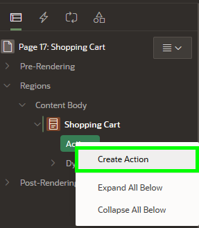
3. In the Property Editor, enter the following:
    - For Label - enter **Edit**
    - For Target - click **No Link Defined**:
        - For Page - select **18**
        - Set items as follows:
            | Name             |  Value       |
            | ---              |  ---         | 
            | P18\_PRODUCT\_ID | &PRODUCT_ID. |

        - Click **Ok**.
    - For Display Type - select **Text with Icon**
    - For Icon - enter **fa-cart-edit**

## **Step 6** - Adding items and buttons to the Page

1. Navigate to the **Gallery Menu**.
2. Drag a **Static Content** region and drop it next to the Shopping Cart region.
    
3. In the Property Editor, enter the following:
    - For Name - enter **Order Information**
4. Navigate to the **Order Information** (left pane) region.
5. Right click on the **Order Information** region and click **Create Page Item**. 
    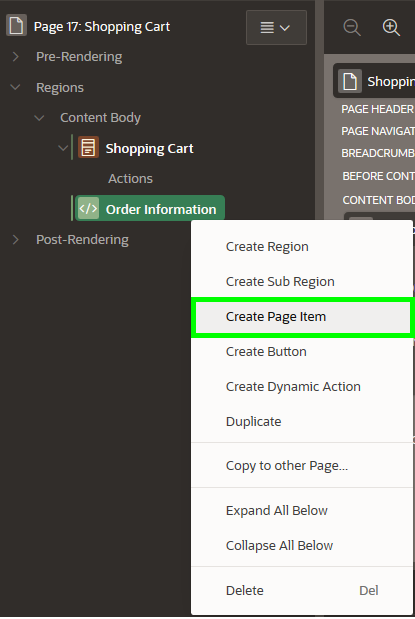
6. Create five items as follows:

    | Name |  Type  | Label  | Template | Value Required | 
    | --- |  --- | --- | --- | --- | 
    | P17\_CUSTOMER\_EMAIL | Text Field | Email Address | Optional - Floating | Off | 
    | P17\_CUSTOMER\_FULLNAME | Text Field | Full Name | Optional - Floating | Off |  
    | P17\_ORDER\_ID | Hidden |  | | | 
    | P17\_CUSTOMER\_ID | Hidden |  | | |
    | P17_STORE | Select List | Store | Optional - Floating | Off |

    For **P17_STORE** item, configure the list of values as follows: 

    - For Type - select **SQL Query**
    - For SQL Query - enter the following SQL Query:

        ``` 
        <copy>
        select STORES.STORE_NAME as STORE_NAME,
            STORES.STORE_ID as STORE_ID 
        from STORES STORES
        </copy>
        ```
    - Set Display Extra Values - to **Off**
    - For Null Display Value - enter **- Select a Store -** 

7. Navigate to the **Order Information** (left pane) region
8. Right click on the **Order Information** region  and click **Create Button**. 
       
9. Create two buttons as follows:

    | Button Name | Label  | Button Position | Button Template | Hot | Icon |
    | --- |  --- | --- | 
    | Proceed | Proceed to Checkout | Create | Text | On | |
    | Clear | Clear Shopping Cart | Change | Text with Icon | Off | fa-cart-empty | 

     Under Server-side Condition:
    | Button Name | Type  | Item |
    | --- |  --- | --- | 
    | Proceed | Item is NOT NULL | SHOPPING\_CART\_ITEMS |
    | Clear | Item is NOT NULL | SHOPPING\_CART\_ITEMS |

     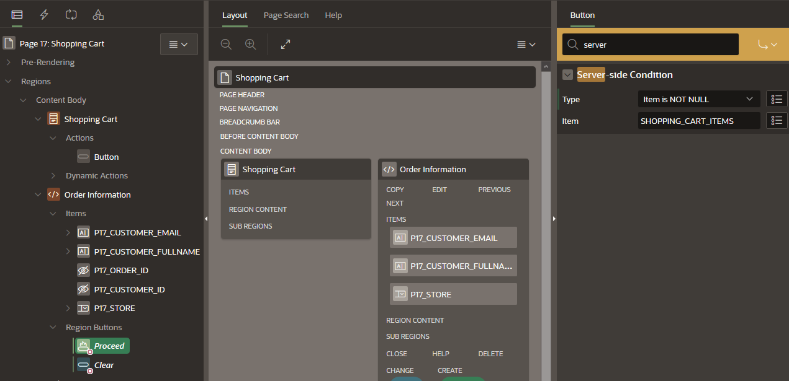      

## **Step 7** - Adding Validations to the Page
1. In the Rendering tree (left pane), click on **Processing** tab.
2. Over Validating, right-click **Create Validation**.
     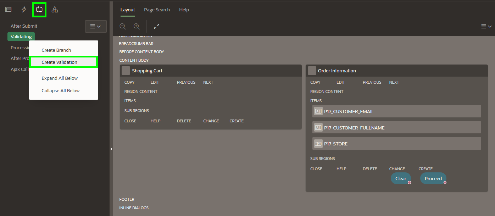  
3. Create three validations for the following items: Name, Email and Store

    | Name |  Type | Item | Error Message | Display Location | Associated Item | 
    | --- |  --- | --- | --- | --- | 
    | Validate Name | Item is NOT NULL | P17\_CUSTOMER\_FULLNAME | Please enter your name | Inline with Field and in Notification | P17\_CUSTOMER\_FULLNAME |
    | Validate Email | Item is NOT NULL | P17\_CUSTOMER\_EMAIL | Please enter your email address | Inline with Field and in Notification | P17\_CUSTOMER\_EMAIL |
    | Validate Store | Item is NOT NULL | P17_STORE | Please select a store | Inline with Field and in Notification | P17_STORE |

     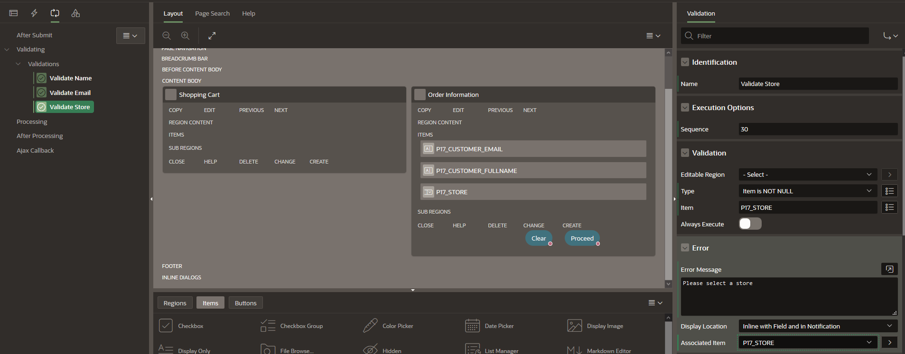 

     As these validations only applies when user proceeds to checkout, let's create that condition.
     Under Server-side Condition, set the following:

    | Name  | When Button Pressed |
    | ---   |  --- | 
    | Validate Name  | Proceed |
    | Validate Email | Proceed |
    | Validate Store | Proceed |   

     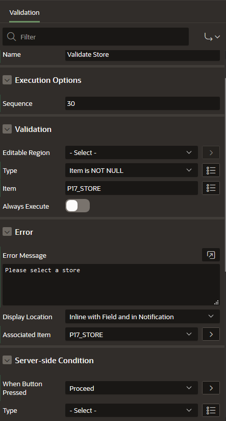       
    
## **Step 8** - Adding Process to create the order

1. On the **Processing** tab (left pane).
2. Right click on Processing and click **Create Process**.
3. In the Property Editor, enter the following:
     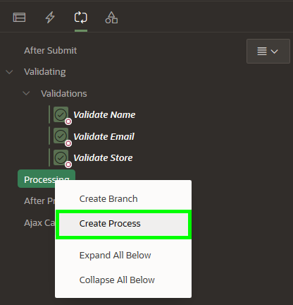   
    - For Name - enter **Checkout**
    - For Type -select **Execute Code**
    - For PL/SQL Code - enter the following PL/SQL code:

    ``` 
    <copy>
    BEGIN
        MANAGE_ORDERS.create_order (
                                    p_customer       => :P17_CUSTOMER_FULLNAME,
                                    p_customer_email => :P17_CUSTOMER_EMAIL,
                                    p_store          => :P17_STORE,
                                    p_order_id       => :P17_ORDER_ID,
                                    p_customer_id    => :P17_CUSTOMER_ID);   
    END;                                    
    </copy>
    ```

    - For Success Message, enter **Order successfully created: &P17\_ORDER\_ID.**
    - For When Button Pressed, select **Proceed**.

## **Step 9** - Adding Process to clear the shopping cart

1. On the **Processing** tab (left pane).
2. Right click on Processing and click **Create Process**.
3. Create a second process to clear the shopping cart. In the Property Editor, enter the following:
    - For Name - enter **Clear Shopping Cart**
    - For Type - select **Execute Code**
    - For PL/SQL Code - enter the following PL/SQL code:

    ``` 
    <copy>
    BEGIN
        manage_orders.clear_cart;
    END; 
    </copy>
    ```

    - For When Button Pressed, select **Clear**.

## **Step 10** - Adding Branches to the Page

1. On the **Processing** tab (left pane).
2. Right click on After Processing and click **Create Branch**.
       
3. In the Property Editor, enter the following:     
    - For Name - enter **Go to Orders**
    - Navigate to Target attribute and click on **No Link Defined**.
        - For Type - select **Page in this application**
        - For Page - enter **16**
        - For Set Items - enter:

            | Name | Value  | 
            | --- |  --- | 
            | P16_ORDER | &P17\_ORDER\_ID. | 

        - For Clear Cache - enter **16**.
        - Click **OK**.
    - For When Button Pressed, select **Proceed**.

4. Create a second branch when user clears the shopping cart. Right click on After Processing and click **Create Branch**.
5. In the Property Editor, enter the following:
    - For Name - enter **Go to Products**
    - Navigate to Target attribute and click on **No Link Defined**
        - For Type - select **Page in this application**
        - For Page - enter **1**
        - For Clear Cache - enter **1**
        - Click **OK**
    - For When Button Pressed, select **Clear**

## **Step 11** - Adding Dynamic Actions
In this step, you will create a dynamic actions to:
- Update the badge and icon shown in the navigation bar after the customer has added / edited / removed a product from the shopping cart.
- Refresh the shopping cart region.

1. Navigate to **Dynamic Actions** tab (left pane).
       

2. Right-click on Dialog Closed and click **Create Dynamic Action**.
     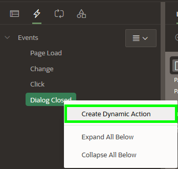  
3. In the Property Editor, enter the following:    
    - Under Identification section: 
        - For Name - enter **Update Shopping Cart Header**
    - Under When section:        
        - For Event - select **Dialog Closed**
        - For Selection Type - select **Region**
        - For Region - select **Shopping Cart**     
    - Under Client-side Condition:
        - For Type - select **JavaScript expression**
        - For JavaScript Expression, enter the following:

            ```
            <copy>
            parseInt(this.data.P18_SHOPPING_CART_ITEMS) > 0
            </copy>
            ```

4. Navigate to **Refresh** Action.
    - Under Identification section:
        - For Action - select **Execute JavaScript Code**
    - Under Settings section:        
        - For Code - enter the following JavaScript Code:

            ```
            <copy>
            // Update Badge Text
            apex.jQuery(".js-shopping-cart-item .t-Button-badge").text(this.data.P18_SHOPPING_CART_ITEMS);

            // Update Icon
            apex.jQuery(".js-shopping-cart-item .t-Icon").removeClass('fa-cart-empty').addClass('fa-cart-full');
            </copy>
            ```

5. Create a second action. In the Dynamic Actions tab (left pane), navigate to **True** under **Update Shopping Cart Header** Dynamic Action. 
     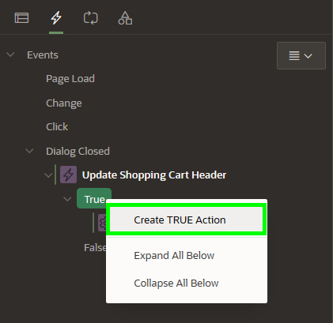
6. In the Property Editor, enter the following:  
    - Under Identification section:
        - For Action - select **Refresh** 
    - Under Affected Elements section:          
        - For Selection Type - select **Region**
        - For Region - select **Shopping Cart**          
11. Create an opposite action. In the Dynamic Actions tab (left pane), navigate to **Execute JavaScript Code** action.
12. Right-click on **Execute JavaScript Code** action and click **Create Opposite Action**.
      

13. Navigate to **Execute JavaScript Code** Action.
    - Under Identification section:
        - For Action - select **Execute JavaScript Code**
    - Under Settings section:        
        - For Code - enter the following JavaScript Code:

            ```
            <copy>
            // Update Badge Text
            apex.jQuery(".js-shopping-cart-item .t-Button-badge").text('');

            // Update Icon
            apex.jQuery(".js-shopping-cart-item .t-Icon").removeClass('fa-cart-full').addClass('fa-cart-empty');
            </copy>
            ```

## **Step 12** - Format products image size
1. In the Rendering tree (left pane), navigate to **Page 17: Shopping Cart**.
2. In the Property Editor (right pane), do the following:
    - Under CSS section.
        -   For Inline - enter the following:

            ```
            <copy>    
            img {
                width: 150px;
                height: 150px;
            }
            </copy>
            ```
                  

3. Click **Save**.

## **Summary**

You now know how to add validations, processes, branches and dynamic actions to your APEX page.

## **Acknowledgments**

- **Author** - Mónica Godoy, Principal Product Manager
- **Contributors** 
- **Last Updated By/Date** - Mónica Godoy, Principal Product Manager, July 2021

## Need Help?
Please submit feedback or ask for help using our [LiveLabs Support Forum](https://community.oracle.com/tech/developers/categories/oracle-apex-development-workshops). Please click the **Log In** button and login using your Oracle Account. Click the **Ask A Question** button to the left to start a *New Discussion* or *Ask a Question*.  Please include your workshop name and lab name.  You can also include screenshots and attach files.  Engage directly with the author of the workshop.

If you do not have an Oracle Account, click [here](https://profile.oracle.com/myprofile/account/create-account.jspx) to create one.