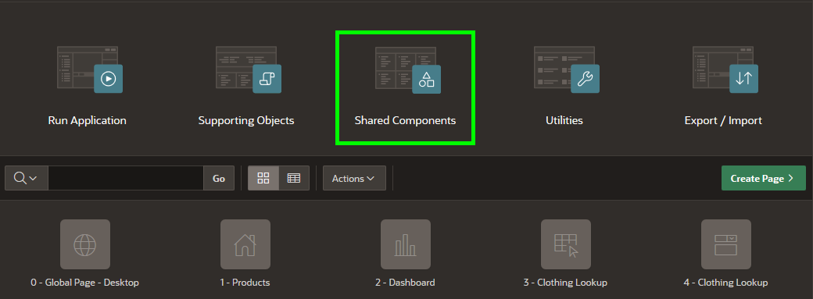
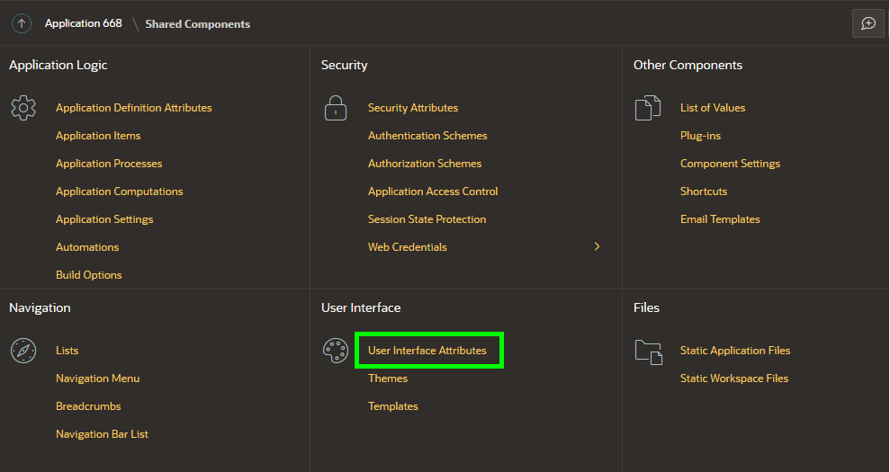
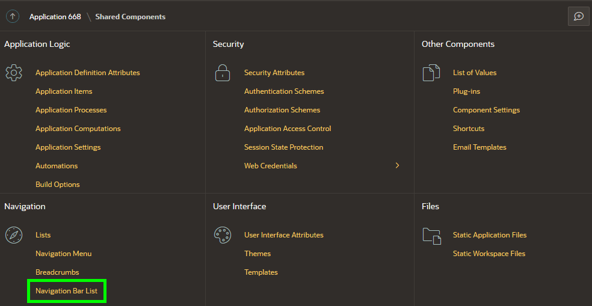
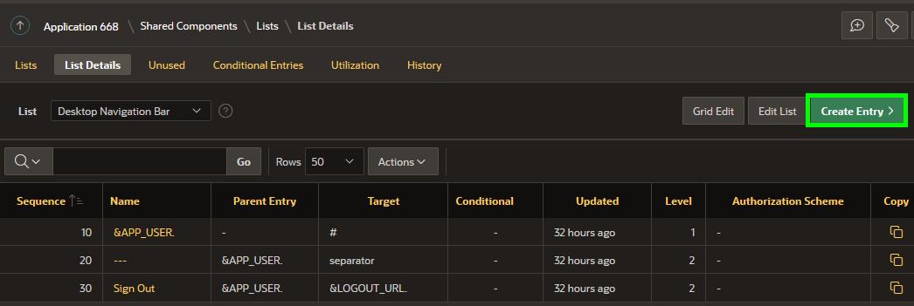
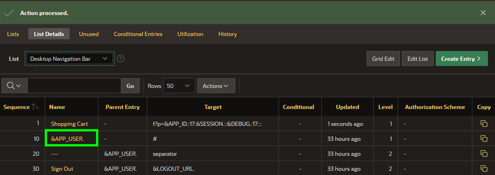
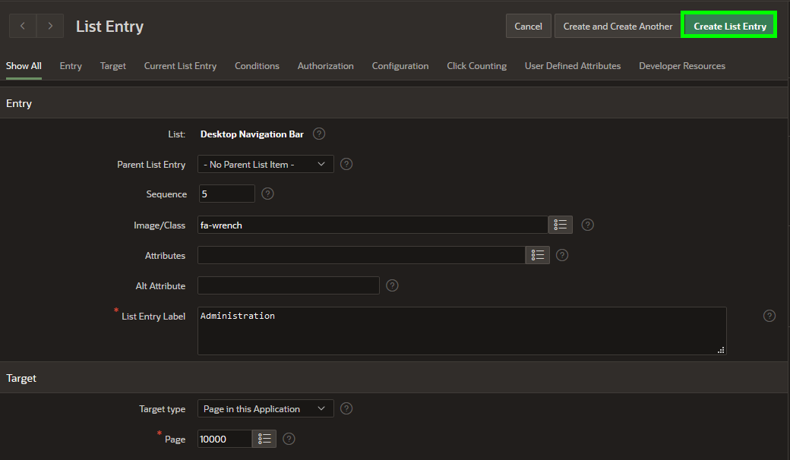

# Improve The Application

## Introduction

In this lab, you will learn how to enable some pages to be viewed by any user who accesses the app. 

Estimated Time: 10 minutes

### Objectives
- Set the following pages as public pages:
    - Products
    - Shopping Cart
    - Order Information
- Disable the Navigation Menu
- Enhance the Navigation Bar

## **Step 1** - Set Pages to be public
Your customers don't need to login the app in order to shop the products, so let's set the following pages as public:
- Page  1: Products
- Page 16: Order Information
- Page 17: Shopping Cart
- Page 18: Add to Cart

Follow these steps for the four listed pages:

1. From the runtime application, navigate to the page.

    In the Developer Toolbar click **Edit Page x**.

2. Within Page Designer, in the Rendering tree (left pane), navigate to  **Page x: Name of the Page**.

    In the Property Editor (right pane), apply the following change:
    - Under Security section:
        - For Authentication - select **Page Is Public**

    

3. Click **Save**.

4. Navigate to Page Finder and go to the next page. 
    

## **Step 2** - Cleaning the Navigation Menu
Since the home page is the Products page and this is a public access page as some others too, it's not needed to have a navigation menu. 
In this step, you will turn off displaying the navigation menu.

1. Within Page Designer, click on the Shared Components icon at the top right.

    
   Alternatively, if you're in the App Builder, click on Shared Components.
   

2. Under User Interface, click **User Interface Attributes**.
    
3. Click **Navigation Menu**.

4. Set Display Navigation to **Off**.
    

5. Click **Apply Changes**.

## **Step 3** - Enhancing the Navigation Bar List
Add a new navigation menu entry to allow:
- Customers to go directly to the Shopping Cart.
- Administrators to login and access to administration page.

1. Click on the Shared Components icon at the top right.
    
2. Under Navigation, click **Navigation Bar List**.
    

3. Click **Desktop Navigation Bar**.

4. Click **Create Entry** and enter the following:

    - For Sequence - enter **1**
    - For Image/Class - **&SHOPPING\_CART\_ICON.**
    - For List Entry Label - **Shopping Cart**
    - For Page - select **17**
    - For Clear cache - enter **17**
    
5. Scroll under **User Defined Attributes** and enter the following:
    - For 1. Badge Value - enter  **&SHOPPING\_CART\_ITEMS.**
    - For 2. List Item CSS Classes - enter **js-shopping-cart-item**

5. Click **Create List Entry**.
    
    
6. Click **&APP_USER.** 
    

7. Under Authorization, for Authorization Scheme, select **Administration Rights**.

8. Click **Apply Changes**.
    

4. Click **Create Entry**  and enter the following:
    - For Sequence - enter **5**
    - For Image/Class - enter **fa-wrench**
    - For List Entry Label - enter **Administration**
    - For Page - select **10000**
    
5. Click **Create List Entry**.
    

## **Summary**

You now know how to enhance and mantain both navigation menu and navigation bar.

## **Acknowledgments**

- **Author** - Monica Godoy, Principal Product Manager
- **Contributors** - 
- **Last Updated By/Date** - Monica Godoy, Principal Product Manager, July 2021

## Need Help?
Please submit feedback or ask for help using our [LiveLabs Support Forum](https://community.oracle.com/tech/developers/categories/oracle-apex-development-workshops). Please click the **Log In** button and login using your Oracle Account. Click the **Ask A Question** button to the left to start a *New Discussion* or *Ask a Question*.  Please include your workshop name and lab name.  You can also include screenshots and attach files.  Engage directly with the author of the workshop.

If you do not have an Oracle Account, click [here](https://profile.oracle.com/myprofile/account/create-account.jspx) to create one.
