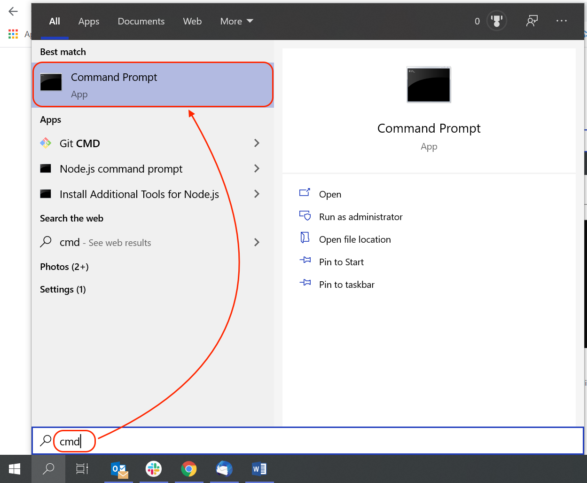
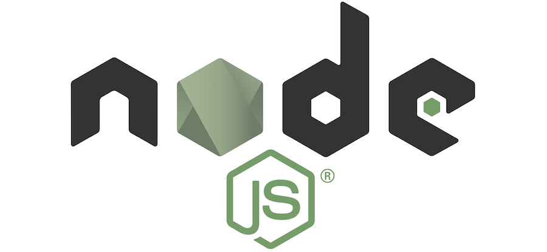
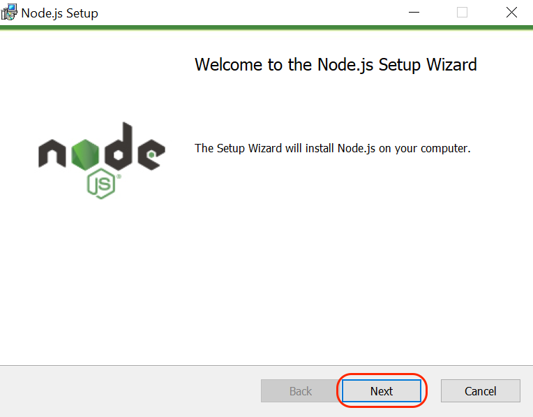

# Introduction


## Introduction to Conversational Approach to Your Applications

This workshop walks you through the steps to use **Autonomous Database** and **Application Express (APEX)** to store information, offer a **REST API** with **Oracle REST Data Services (ORDS)** and enable you to interact with your customers by keeping a conversation with **Digital Assistant**.

Estimated Workshop Time: 120 minutes

### Objectives

- Store information in a powerful database 
- Provide a 24/7 conversational experience with people using your services
- Explore Oracle Digital Assistant
- Explore modern and quick APEX development 
- Build secure and powerful REST APIs

## **STEP 1**: Requirements

1. In order to walk through this workshop you need to develop the integration with **REST API**. You need [Node.js](https://nodejs.org/en/) for that.

2. Node.js is an asynchronous event-driven JavaScript runtime. **Node.js** is designed to build scalable network applications.

3. Additionally you need to be familiar with the use of **Command Prompt/Terminal** so we will show you briefly the way to use it for Windows users.

    As a **Windows user** you need to type on the **Windows Search** Icon:

    ```
    cmd
    ```

    and select **Command Prompt**.

    

    That will open the Command Prompt/Terminal so you are ready to go.

    

    [Here you can find a basic guidance of commands that you can use on the terminal.](https://docs.microsoft.com/en-us/windows-server/administration/windows-commands/windows-commands)


## **STEP 2**: Node.js Installation

We are going to **install** Node.js, if you have done this you can skip this step.



[Download Node.js LTS](https://nodejs.org/en/download/) from the official website. It is fine if the version is higher than the one in the screenshot.


1. We are going to install on **Windows** but it works in a similar way in **Linux** and **MacOS**.

    

    You can go with the default setup for the installation.

2. Final step, click **Install**:

    

3. Installation **completed**.

    

4. The last step sometimes take a while on Windows because the lack of libraries, plus sometimes perform a Windows Update. Another reminder to swap to Linux ;) Be patient and carry on.

    

    Check if the installation went **well**. Open a Command Prompt, or Terminal in Linux and MacOS and run the following commands:

    ```bash
    node -v
    ```

    ```bash
    npm -v
    ```

    ```bash
    npx @oracle/bots-node-sdk -v
    ```

    Like this:

    

At this point, you are ready to start learning!

## **Acknowledgements**

- **Author** - Victor Martin - Principal Cloud Engineer | Priscila Iruela - Database Business Development
- **Contributors** - Melanie Ashworth-March
- **Last Updated By/Date** - Kamryn Vinson, October 2020

## Need Help?
Please submit feedback or ask for help using our [LiveLabs Support Forum](https://community.oracle.com/tech/developers/categories/livelabsdiscussions). Please click the **Log In** button and login using your Oracle Account. Click the **Ask A Question** button to the left to start a *New Discussion* or *Ask a Question*.  Please include your workshop name and lab name.  You can also include screenshots and attach files.  Engage directly with the author of the workshop.

If you do not have an Oracle Account, click [here](https://profile.oracle.com/myprofile/account/create-account.jspx) to create one.