# Create Digital Assistant Skill

## Introduction

**Digital assistants** consist of one or more **skills**, which are individual **chat bots** that are focused on specific types of tasks.

You will create a **skill** that can be used for interactions with a backend service, using the **Custom Component** you built on previous workshop.

As part of this process, you will:

- **Create** a new skill
- **Import** your Custom Component (the `tgz` file you generated with `npm pack`)
- **Create** two intents: `Greeting` and `ListTasks`

We have to access to **Digital Assistant** section in the **Oracle Cloud Dashboard**.


Go to **Digital Assistant Dashboard** as we did on **Lab 3**. As a reminder check the following screenshot:

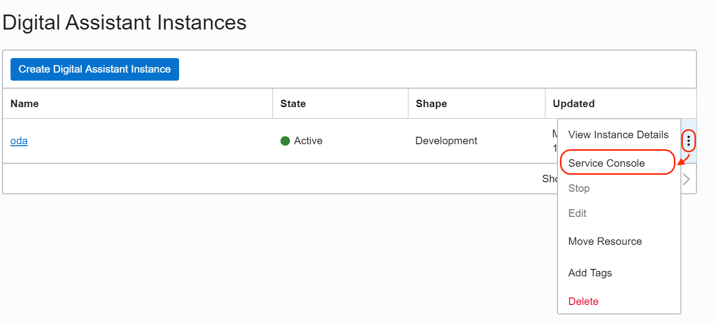

Estimated Lab Time: 45 minutes

## **STEP 1**: Build your first Skill

In this workshop, we're starting from scratch. So the first thing you'll do is **create** a new skill.

1. **Click** on `+ New Skill` button to start:

    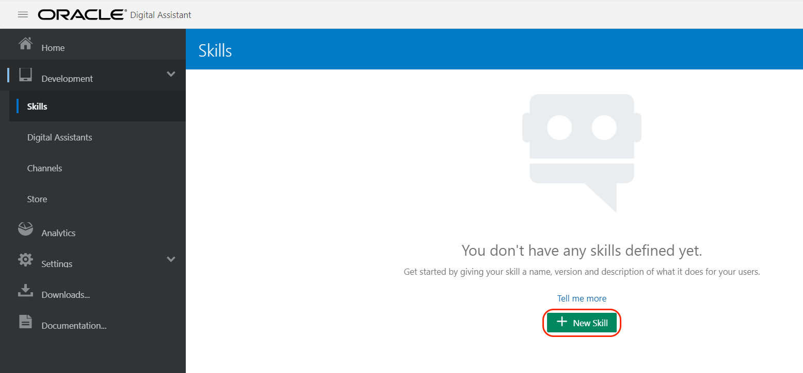

1. **Fill** the information like in the image and click **Create** button:

    

## **STEP 2**: Import the Custom Component

Import Custom Component is very simple.

1. **Go** to the **Components** view  on the left menu. Select `+ Service`.

    

    The web form to **upload** the file will **show up**.
    We will fill out all the information of this web form.

2. Select **Upload a component package file (a .tgz file created by running bots-node-sdk pack or npm pack) or drag it here**.

    

3. **Upload** `tasks-cc-1.0.0.tgz` file that we created before. Remember that the tgz file is on the tasks-cc folder.

    

4. **Fill** the rest of the information and remember to `Enable Component Logging` with the toggle button

    - **Name**: tasks
    - **Description**: Tasks Custom Component
    - **Embedded Container**: is selected by default. Leave it like that

5. Finally **Create** the Service.

    

6. **Wait** for the deployment to be ready.

    

7. **Make sure** the `Status` is `Ready`. You see all the **information** on this page like in this screenshot.

    


## **STEP 3**: Create intents

Oracle Digital Assistant's underlying **Natural Language Processing (NLP)** engine doesn't inherently know about the business or task that a skill is supposed to assist with. For the skill to understand what it should react to, you need to define intents and examples (utterances) for how a user would request a specific intent.

Let's create a **Greeting Intent**.

1. **Go** to the **Intent** view  on the left menu. Select `+ Intent`.

    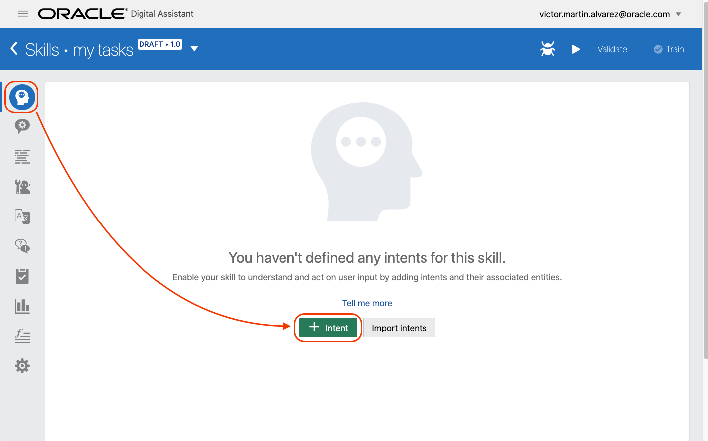

1. We will start working on the **Intent** page. The page by default looks like this screenshot:

    

3. **Modify** default values for:

    - **Conversation Name**: Greeting
    - **Name**: Greeting
    - **Utterances to Add**: In this field is where you have ti type the different Greetings that you want to include as part of the Intent. Type on this field `hi` and click enter. Wait to be added as part of the intents. Type on the same field `hello` and wait to be added as before

    The two **Intents** that you added a few seconds ago will be visible in the page. Check the following screenshot to confirm.

    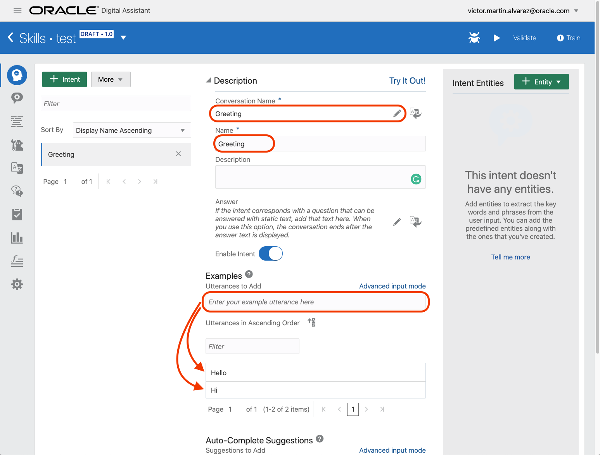

4. **Click** on `+ Intent` on the same screen to add more Intents to the conversation.

  

5. **Modify** default values for:

    - **Conversation Name**: ListTasks
    - **Name**: ListTasks
    - **Utterances to Add**: In this field is where you have ti type the different Greetings that you want to include as part of the Intent. Type on this field `list my tasks` and click enter. Wait to be added as part of the intents. Type on the same filed `show me my tasks` and wait to be added as before. And finally type on the same filed `tasks` and wait to be added as before

    The three **Intents** that you added a few seconds ago will be visible in the page. Check the following screenshot to confirm.

    

## **STEP 4**: Put everything together

Time to **integrate** your **Custom Component with the Intent** `ListTasks` created before.

1. **Go** to the **Flows** view  on the left menu.

    You will **see** the `YAML` file that define the behavior of your **Skill**.

    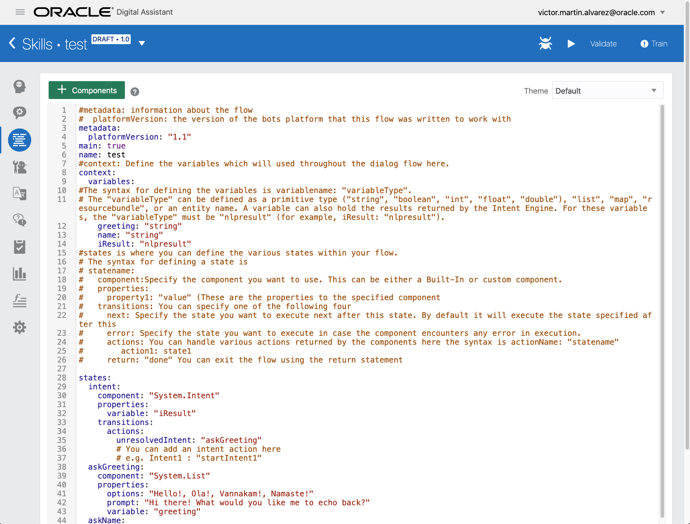

1. **Delete** the full content of the **Flows** section and leave the canvas **empty**.

    

3. **Copy** this `YAML` content:

    ```yaml
    metadata:
    platformVersion: '1.1'
    main: true
    name: mytasks

    context:
    variables:
        iResult: 'nlpresult'

    states:
    intent:
        component: 'System.Intent'
        properties:
        variable: iResult
        transitions:
        actions:
            Greeting: greeting
            ListTasks: listTasks
            unresolvedIntent: unresolved

    greeting:
        component: System.Output
        properties:
        translate: false
        text: 'Greetings, hooman!'
        keepTurn: false
        transitions:
        return: greeting

    listTasks:
        component: com.example.tasks
        transitions:
        actions:
            success: successState
            failure: failureState

    successState:
        component: 'System.Output'
        properties:
        text: |-
            Success!
        keepTurn: false
        transitions:
        return: 'done'

    failureState:
        component: 'System.Output'
        properties:
        text: |-
            Failed! Check the logs.
        keepTurn: false
        transitions:
        return: 'done'

    unresolved:
        component: System.Output
        properties:
        translate: false
        text: "I don't understand. What do you want to do?"
        keepTurn: false
        transitions:
        return: unresolved
    ```

    The **Flows** section should look like this one:

    

4. **Make sure** the syntax is correct. **Click** on the `Validate` button. **Be sure** that you get the **correct validation message** on the top of the page as you can see on the image below:

    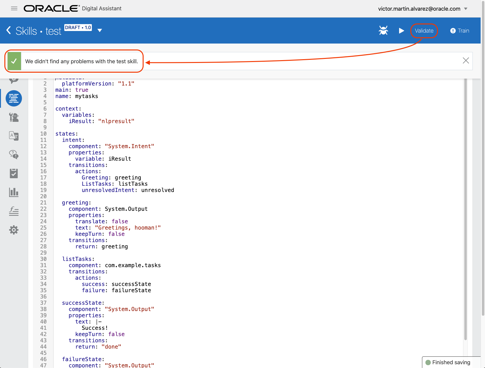

1. Click **Train** button to run the **Machine Learning Algorithm**.

    

6. **Be sure** that you get the **correct train message** confirmation on the top of the page as you can see on the image below:

    

7. **Run** the test of the skill clicking the `Play` button next to `Validate`.

    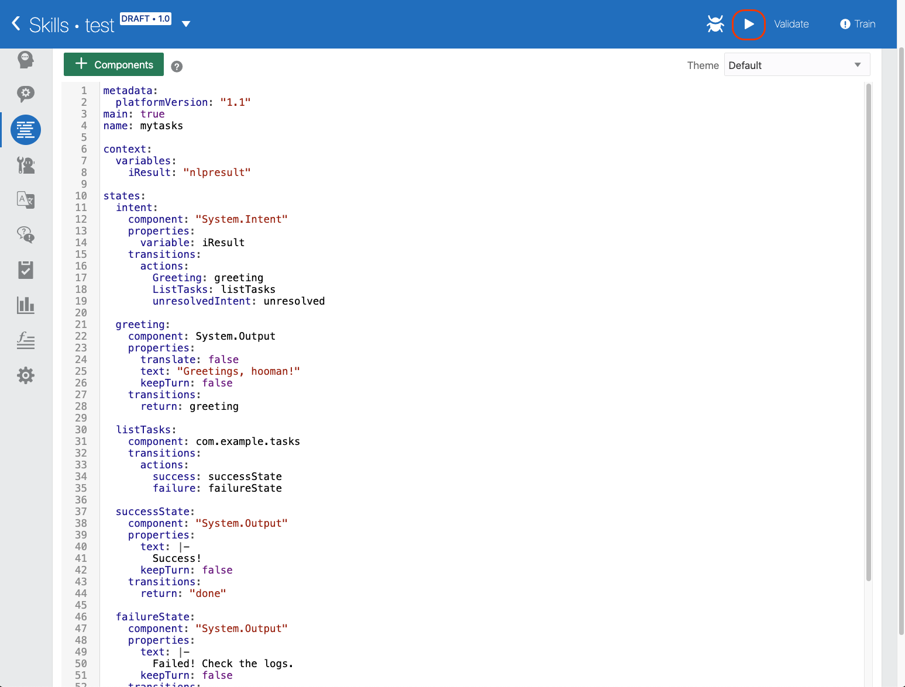

    The way to test the conversation is typing any of the **Intents** that we have created on this Lab5.

    For example: say `hi` and wait for the bot answer. In this case the answer is `Greetings, hooman!`. Type the next Intent `show me my tasks` and wait for the bot answer. Now the answer is `Get concert tickets` and `Buy bread`.

    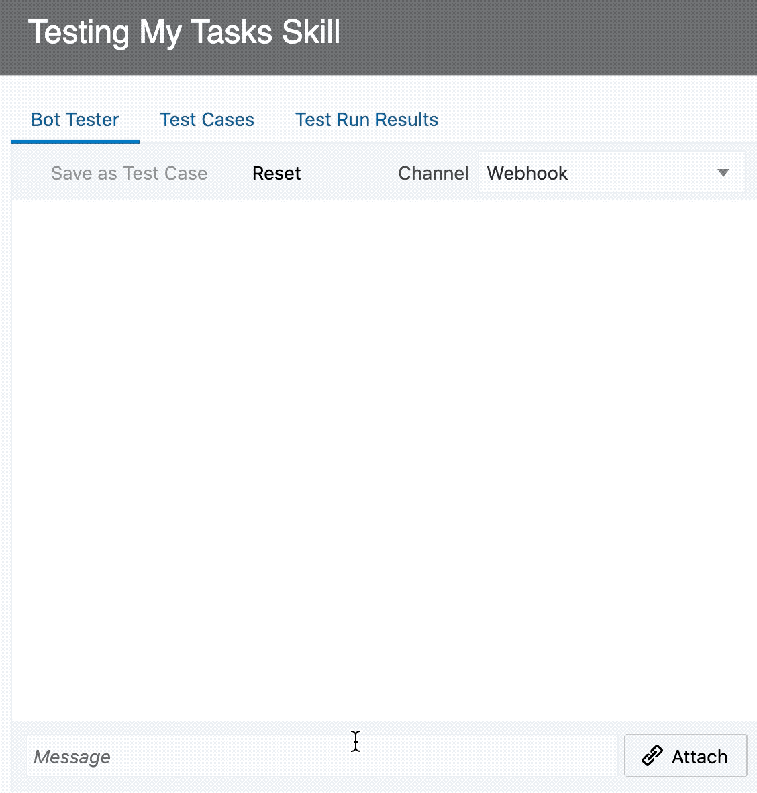

    > NOTE:
    >
    > If you see an **error message** at this point, it means there is a **problem** with the **Custom Component Code**.
    >
    > To get more information about the issue, check the logs.
    >
    > Go to **Components** view  on the left menu and **click** on **Diagnostics** for your **Custom Component**, then on **View Logs**.
    >
    > 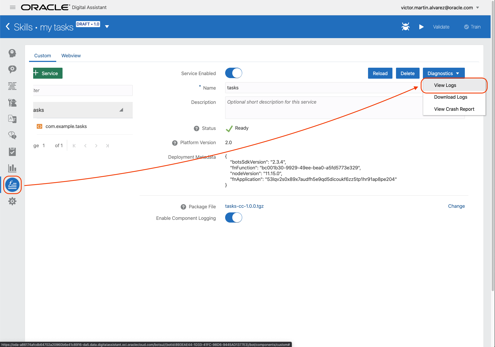
    >
    > The **result** should be something like this:
    > 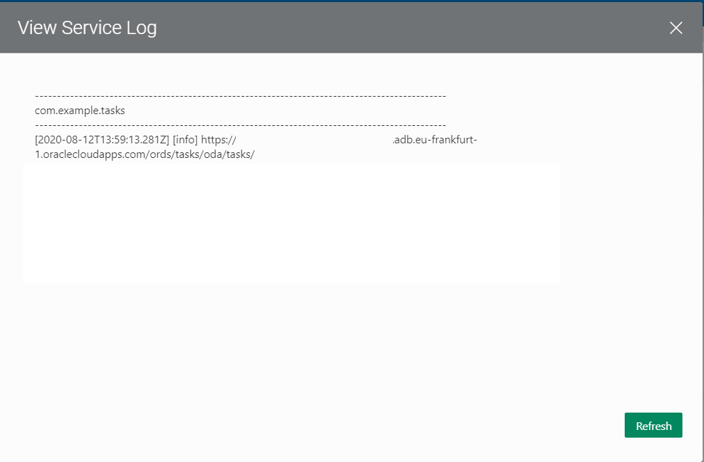

## It works

To see how we **request** against the **database**, we can **add** a new item.

1. **Insert** your third element in the collection of data by going to **APEX** and on the Top Menu on **SQL Workshop**, click **Object Browser** as we did on **Lab 2**:

    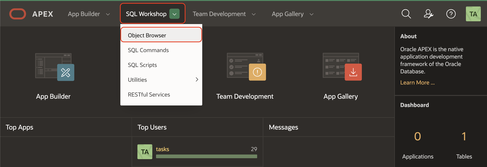

2. Select **TASKS** table on the left of the APEX page and **click** the tab **Data**, then click **Insert Row**:

    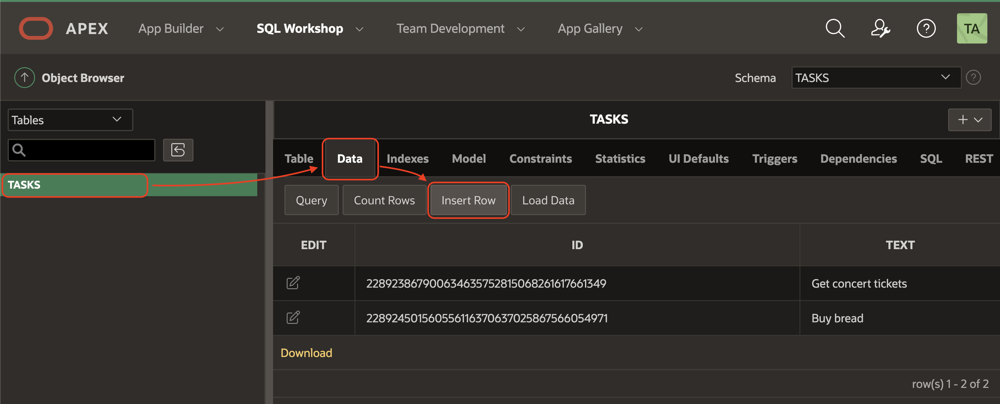

3. **Add** a new **Text** like `New item!` and **click** **Create**:

    

4. **Confirm** the row has been created:

    

5. **Run** the chat again but before **reset** the previous **conversation**.

    For example: reset the conversation by clicking on **Reset** then say `hi` and wait for the bot answer. Type the next Intent `show me my tasks` and wait for the bot answer. Now the answer is `Get concert tickets`, `Buy bread`, and `New Item!`.

    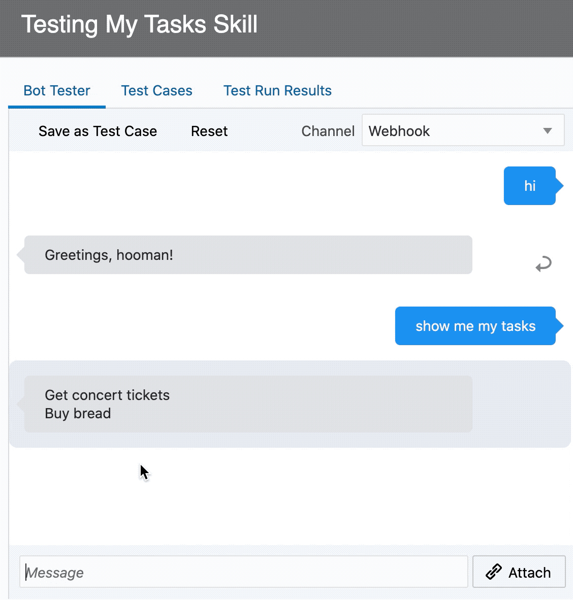

Congratulations! Well done!

Continue to Next Steps for more information!

## **Acknowledgements**

- **Author** - Victor Martin - Principal Cloud Engineer | Priscila Iruela - Database Business Development
- **Contributors** - Melanie Ashworth-March
- **Last Updated By/Date** - Kamryn Vinson, October 2020

## Need Help?
Please submit feedback or ask for help using our [LiveLabs Support Forum](https://community.oracle.com/tech/developers/categories/livelabsdiscussions). Please click the **Log In** button and login using your Oracle Account. Click the **Ask A Question** button to the left to start a *New Discussion* or *Ask a Question*.  Please include your workshop name and lab name.  You can also include screenshots and attach files.  Engage directly with the author of the workshop.

If you do not have an Oracle Account, click [here](https://profile.oracle.com/myprofile/account/create-account.jspx) to create one.